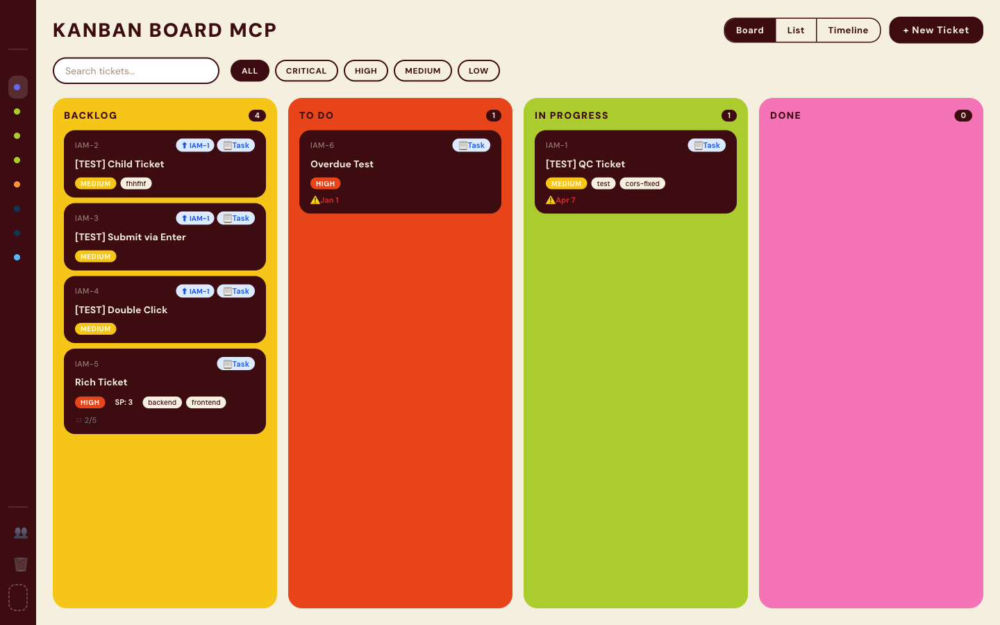
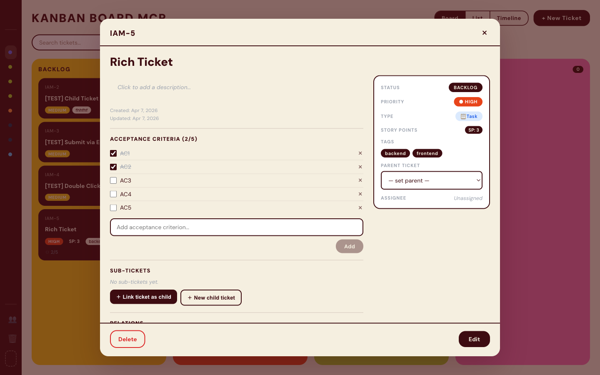
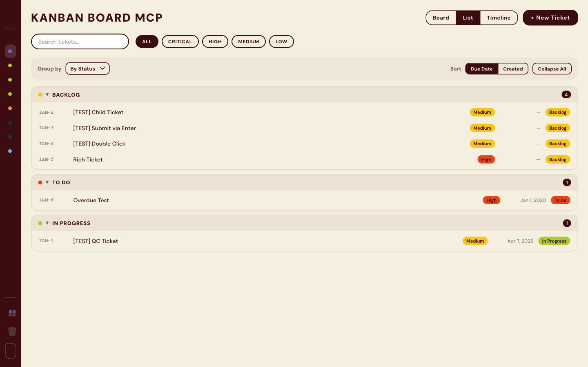
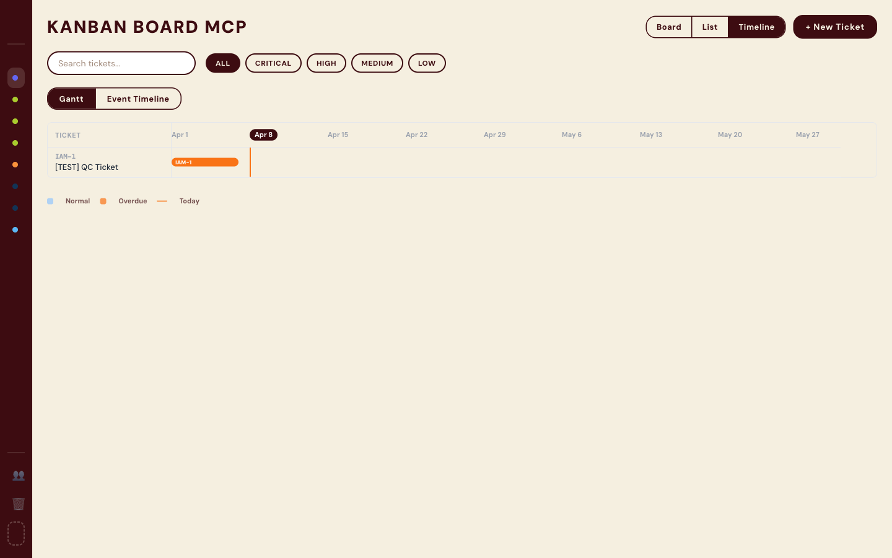

<p align="center">
  
</p>

<h1 align="center">Kanban Board MCP</h1>

<p align="center">
  A personal Kanban board with a polished React UI and a Python MCP server — built for AI agent integration.
</p>

<p align="center">
  
  
  
  
  
  
  
  
</p>

---

## What's Inside

| | |
|---|---|
| **UI** | React 18 + Vite + TypeScript, Tailwind CSS, drag-and-drop (`@dnd-kit`) |
| **Server** | Python, FastAPI, MCP (Model Context Protocol), SQLite via SQLModel |
| **Storage** | Local-first — SQLite, no external services |

## Screenshots

### Board View


### Ticket Detail


### List View


### Timeline / Gantt


## Quick Start

### UI (Frontend)
```bash
cd ui
npm install
npm run dev        # http://localhost:5173
```

### MCP Server (Backend)

Requires [uv](https://docs.astral.sh/uv/).

```bash
cd server
uv sync
uv run uvicorn main:app --reload --port 8000
```

## MCP Tools

The server exposes 15 tools for AI agents over MCP:

**Projects & Members**
- `list_projects` — list all projects
- `create_project` — create a new project
- `list_members` — list project members
- `add_member` — add a member to a project
- `remove_member` — remove a member

**Tickets**
- `create_ticket` — create a ticket (auto-generates ID like `PREFIX-N`)
- `list_tickets` — list & filter tickets by status, priority, or search query
- `get_ticket` — get full ticket details
- `update_ticket` — update title, description, type, priority, etc.
- `update_ticket_status` — change ticket status
- `create_child_ticket` — create a subtask under a parent ticket

**Annotations**
- `add_comment` — add a comment to a ticket
- `add_work_log` — log work with role and note
- `add_test_case` — attach a test case to a ticket
- `update_test_case` — update test case status and proof

## Connecting AI Agents

### Option 1 — Stdio (recommended for VS Code / Claude Desktop)

The server launches as a subprocess — no manual startup needed. The database schema is created automatically on first run.

Add to VS Code `mcp.json` or Claude Desktop config:
```json
{
  "servers": {
    "kanban": {
      "type": "stdio",
      "command": "uv",
      "args": ["--directory", "/path/to/kanban-board-mcp/server", "run", "mcp_stdio.py"]
    }
  }
}
```

### Option 2 — HTTP (when running the full server)

Start the server first:
```bash
cd server && uv run uvicorn main:app --port 8000
```

Then connect any MCP-compatible client to `http://localhost:8000/mcp`.

## Desktop App Release Status

The desktop app packages the full stack (React UI + FastAPI server + MCP stdio) into a single installable application via Electron.

| Platform | Status | Artifact |
|---|---|---|
| **macOS** (x64 + arm64) | Available | DMG — see [v1.3.0 release](https://github.com/iamcaominhtien/kanban-board-mcp/releases/tag/v1.3.0) |
| **Windows** (NSIS) | Not yet uploaded | Build from source: `./build-desktop.sh` |
| **Linux** | Not yet supported | — |

> **macOS note:** the app is not notarized — right-click → Open on first launch.

## More Docs
- [Server README](server/README.md)
- [UI README](ui/README.md)
- [Architecture](docs/backend-architecture.md)
- [Changelog](CHANGELOG.md)

