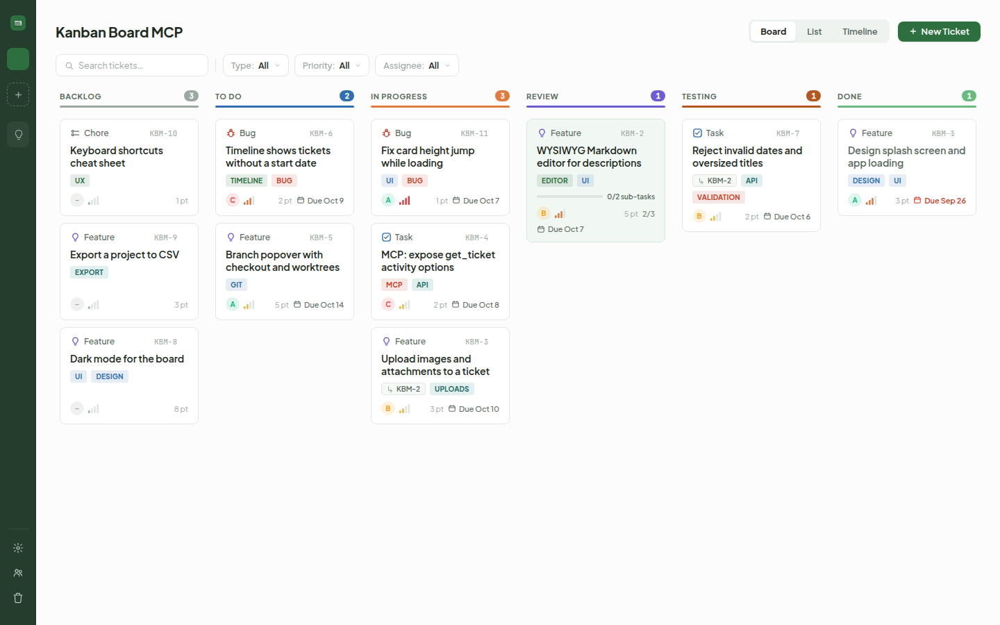
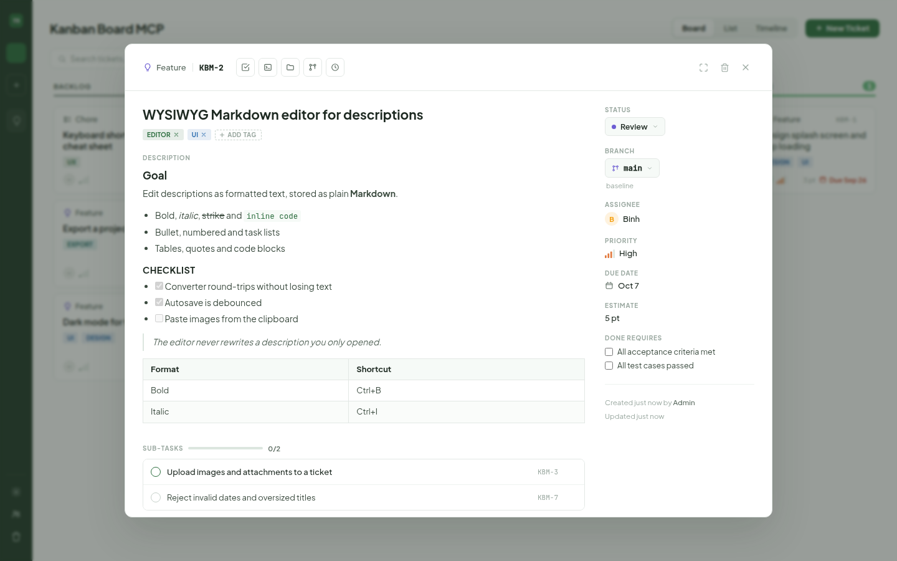
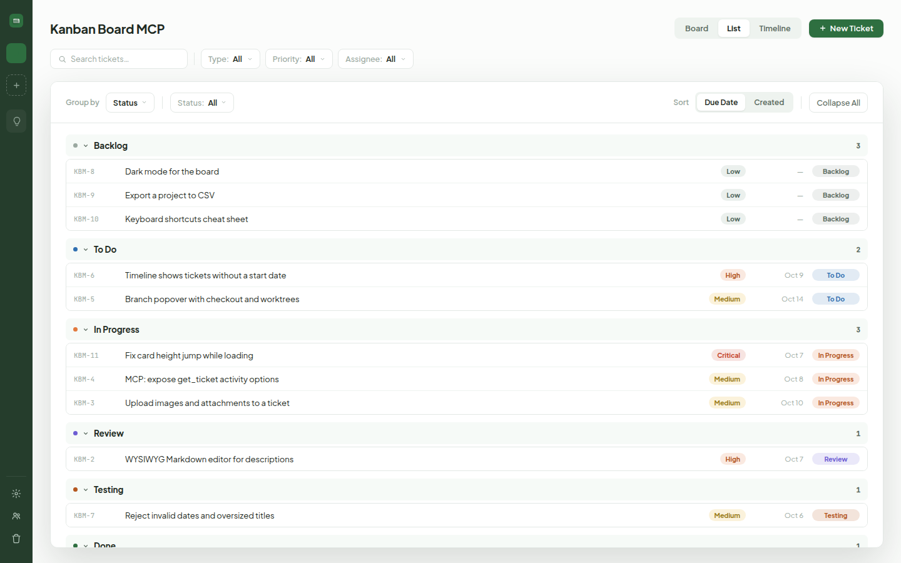
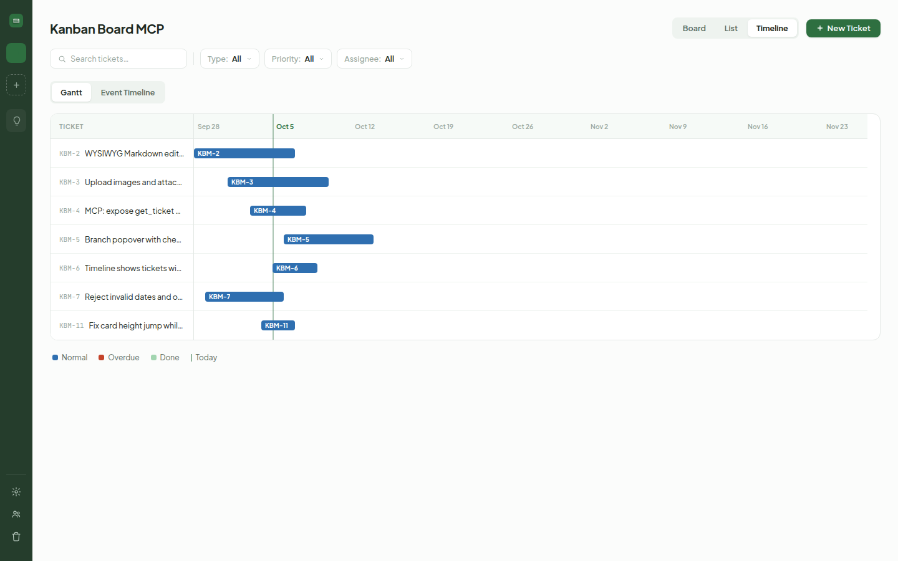

<p align="center">
  
</p>

<h1 align="center">Kanban Board MCP</h1>

<p align="center">
  A personal Kanban board with a polished React UI and a Python MCP server — built for AI agent integration.
</p>

<p align="center">
  
  
  
  
  
  
  
  
</p>

---

## What's Inside

| | |
|---|---|
| **UI** | React 18 + Vite + TypeScript, Tailwind CSS, drag-and-drop (`@dnd-kit`) |
| **Server** | Python, FastAPI, MCP (Model Context Protocol), SQLite via SQLModel |
| **Storage** | Local-first — SQLite, no external services |

## Screenshots

### Board View


### Ticket Detail


### List View


### Timeline / Gantt


## Quick Start

### UI (Frontend)
```bash
cd ui
npm install
npm run dev        # http://localhost:5173
```

### MCP Server (Backend)

Requires [uv](https://docs.astral.sh/uv/).

```bash
cd server
uv sync
uv run uvicorn main:app --reload --port 8000
```

## MCP Tools

The server exposes 33 tools for AI agents over MCP (selected highlights below — see `server/mcp_tools.py` for the full list, which also covers acceptance criteria, idea tickets, assumptions, and microthoughts):

**Projects & Members**
- `list_projects`, `create_project`, `update_project` (name, color, linked git repo, worktree defaults)
- `list_members`, `add_member`, `remove_member`

**Tickets**
- `list_tickets` — compact, paginated summaries (`status`, `priority`, `q`, `limit`/`offset`; `detail=true` for full objects)
- `get_ticket` — everything about one ticket (`include_activity=true` adds the change history)
- `create_ticket`, `create_child_ticket`, `update_ticket` (incl. assignee, dates, repo path, "Done requires" guards, `clear_fields`), `update_ticket_status`, `delete_ticket`
- `block_ticket`, `unblock_ticket`, `link_tickets`, `unlink_tickets`
- `get_ticket_workspace_path` — the ticket's scratch folder (read/write it with your own file tools)

**Working on a ticket**
- `add_comment`, `update_comment`, `delete_comment`
- `add_work_log`, `update_work_log`, `delete_work_log` — the Debug Space journal
- `add_test_case`, `update_test_case`, `delete_test_case`
- `add_acceptance_criterion`, `toggle_acceptance_criterion`, `delete_acceptance_criterion`
- `add_branch`, `update_branch`, `delete_branch`, `checkout_branch` — real git branches when the project has a linked repo

**Idea Space** (hidden from MCP for now: set `KANBAN_MCP_IDEA_TOOLS=1` to expose these 13 tools; the web UI and REST API are unaffected)
- `list_idea_tickets`, `get_idea_ticket`, `get_idea_activity_trail`, `create_idea_ticket`, `update_idea_ticket`, `update_idea_status`, `promote_idea_to_ticket`, `delete_idea_ticket`
- `add_assumption`, `update_assumption_status`, `delete_assumption`, `add_microthought`, `delete_microthought`

**Conventions agents can rely on**
- The server sends usage instructions on connect (IDs, statuses, flow), and every tool carries read-only / destructive / idempotent annotations.
- Failures are real tool errors (`isError`) whose message says how to fix the call (and lists the valid ids); nothing fails silently.
- Tools that change a ticket return it without its activity log (large); sub-items can be addressed by id, test-case code (`TC-2`) or branch name.
- Omitted optional arguments mean "unchanged"; use `clear_fields` to empty a field. Changes are attributed to the AI agent in the Activity tab.

## Connecting AI Agents

### Option 1 — Stdio (recommended for VS Code / Claude Desktop)

The server launches as a subprocess — no manual startup needed. The database schema is created automatically on first run.

Add to VS Code `mcp.json` or Claude Desktop config:
```json
{
  "servers": {
    "kanban": {
      "type": "stdio",
      "command": "uv",
      "args": ["--directory", "/path/to/kanban-board-mcp/server", "run", "mcp_stdio.py"]
    }
  }
}
```

### Option 2 — HTTP (when running the full server)

Start the server first:
```bash
cd server && uv run uvicorn main:app --port 8000
```

Then connect any MCP-compatible client to `http://localhost:8000/mcp/` (note the trailing slash — the mount only matches with it).

## Desktop App Release Status

The desktop app packages the full stack (React UI + FastAPI server + MCP stdio) into a single installable application via Electron.

| Platform | Status | Artifact |
|---|---|---|
| **macOS** (x64 + arm64) | Available | DMG — see [v1.4.5 release](https://github.com/iamcaominhtien/kanban-board-mcp/releases/tag/v1.4.5) |
| **Windows** (NSIS) | Not yet uploaded | Build from source: `./build-desktop.sh` |
| **Linux** | Not yet supported | — |

> **macOS note:** the app is not notarized — right-click → Open on first launch.

## More Docs
- [Server README](server/README.md)
- [UI README](ui/README.md)
- [Architecture](docs/backend-architecture.md)
- [Changelog](CHANGELOG.md)

