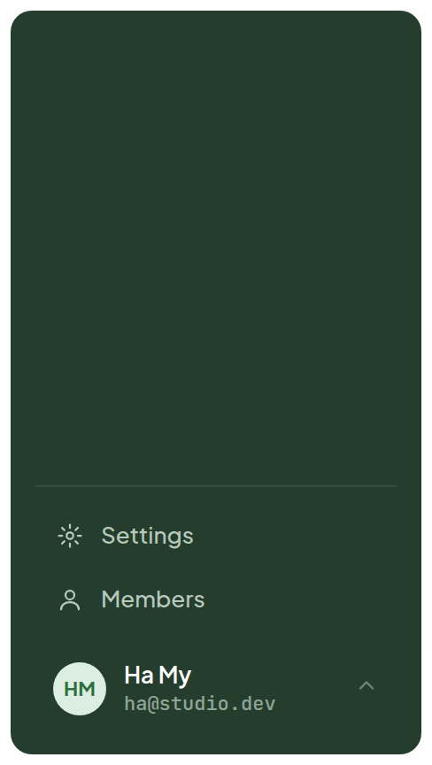
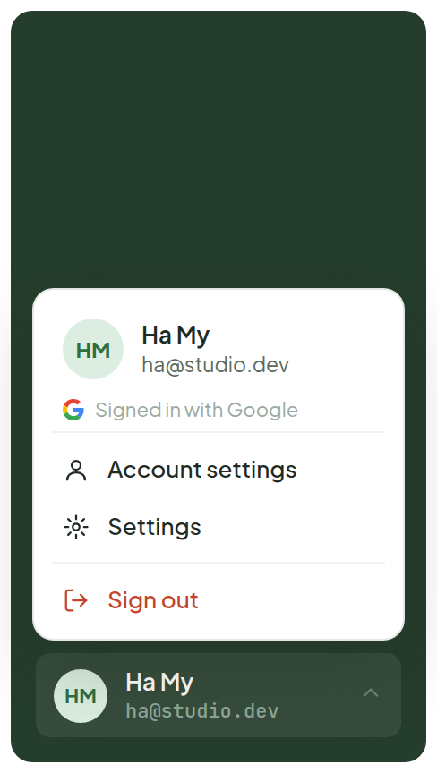
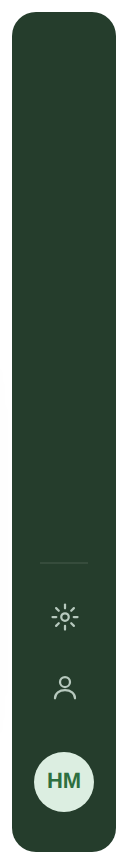
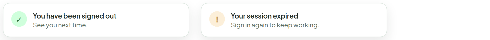

# Account Menu

> Component — v1 · source: [`AccountMenu.dc.html`](../source/AccountMenu.dc.html) · canvas `1791083427-1a86` · sha256 `ca35b207d59b38efc53a82f457b0c48a39edd0fe5e2558e5eed3ab12ea6d6168`

Who is signed in, and how to sign out. Lives at the bottom of the sidebar above Settings and Members; the whole row opens a menu. In the collapsed rail it is just the avatar.

---

## 1. Sidebar — resting

Source: [AccountMenu.dc.html](../source/AccountMenu.dc.html) › `
` sidebar render 232×420 inside the single-line artboard (L58)

- Rows from top: "Settings", "Members", then the account row: avatar "HM", name "Ha My", email `ha@studio.dev` (mono). A small chevron sits at the right of the row.
- The account row is the last item of the sidebar, below Settings and Members; the menu is closed.

## 2. Sidebar — menu open

Source: [AccountMenu.dc.html](../source/AccountMenu.dc.html) › `
` sidebar render 232×420 with the popover open above the account row (L58)

- Popover header: avatar "HM", "Ha My", `ha@studio.dev`, and the sign-in method line "Signed in with Google" (with the Google mark).
- Menu items: "Account settings", "Settings", a divider, then "Sign out" in red.
- The account row below stays visible ("Ha My", `ha@studio.dev`) with its chevron flipped, marking it as the open trigger. The popover opens above the row.

## 3. Collapsed rail

Source: [AccountMenu.dc.html](../source/AccountMenu.dc.html) › `
` collapsed sidebar render 52×420 (L58)

- In the collapsed rail the account row is just the avatar "HM", under the Settings and Members icons.

## 4. After signing out, or when the session ends — reuses the Toast style

Source: [AccountMenu.dc.html](../source/AccountMenu.dc.html) › `
` row of two toast cards, each 380×70 (L58)

- Left toast (success check mark): "You have been signed out" / "See you next time."
- Right toast (amber "!" mark): "Your session expired" / "Sign in again to keep working."

## Note

- The row shows an avatar (initials on a tint, same as ticket assignees), the display name and the email in mono. Clicking it, or pressing Enter, opens the menu above the row; Esc or a click outside closes it.
- Menu: identity header with the sign-in method, Account settings (profile, password, connected providers), Settings (the existing modal), and Sign out in red below a divider. No confirmation step: signing out is easy to undo.
- Sign out clears the session, closes any open ticket and returns to Login with the "signed out" toast. A 401 anywhere in the app does the same with the "session expired" toast and the Login banner.
- TODO(backend): current-user endpoint (name, email, provider, avatar), sign-out that revokes the session. The Account settings screen is not designed yet.
