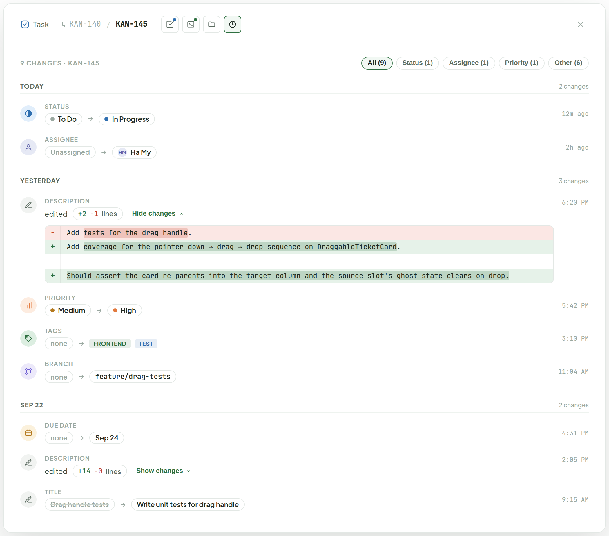
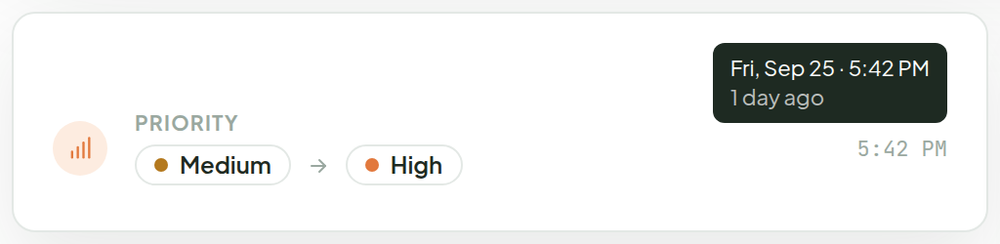
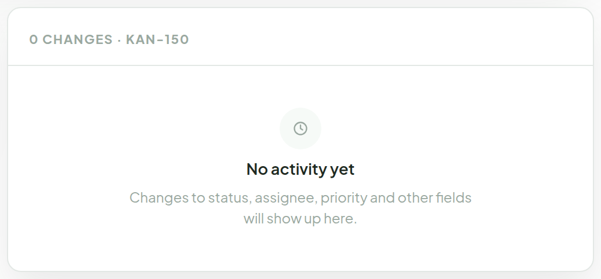
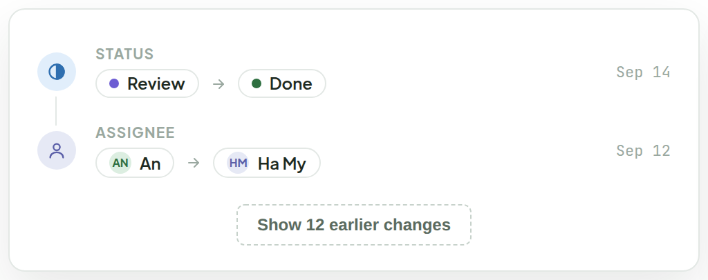
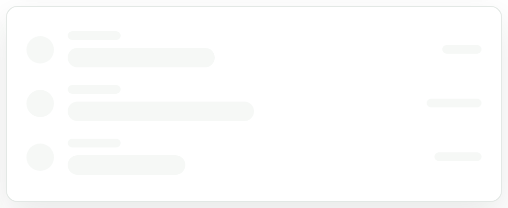

# Activity

> Component — v1 · source: [`Activity.dc.html`](../source/Activity.dc.html) · canvas `1791005836-9c57` · sha256 `af140c0ef8e32e19556b935b44d410c13932db3f28c1a98b29ec1686e4af47d9`

Grounded in the app's existing `ActivityLog.tsx` — a read-only history of field changes on a ticket — moved out of the Details column into its own icon button in the Ticket Detail header, like Test Cases, Debug Space and Workspace. Clicking it swaps the whole panel body for a timeline grouped by day.

---

## 1. Activity view — grouped by day, newest first (KAN-145)

Source: [Activity.dc.html](../source/Activity.dc.html) › `<!-- Populated timeline -->` (L58–84)

- Header: the Activity clock icon is the fourth view button (after Test Cases, Debug Space, Workspace) and is shown active. Clicking the ticket id returns to Details.
- Toolbar: `9 changes · KAN-145` with filter chips `All (9)`, `Status (1)`, `Assignee (1)`, `Priority (1)`, `Other (6)`.
- Day headers (`Today`, `Yesterday`, `Sep 22`) carry the number of changes that day.
- Each row is one field change: a tinted icon bubble per field (status, assignee, priority, description/title, tags, branch, due date), the field name, then *from → to* as chips. A missing value reads "none" or "Unassigned" in muted text; an old title is struck through.
- Status, priority and assignee reuse the chip colours used elsewhere in the app.
- Times read relative today (`12m ago`, `2h ago`) and as a clock time on older days (`5:42 PM`).
- Description edits show "edited" and a `+/−` line count; **Show changes / Hide changes** toggles an inline diff under the row — removed lines in red, added lines in green, changed words highlighted. Collapsed by default (Sep 22 row shows the collapsed state, `+14 −0 lines`; the Yesterday row is expanded: `+2 −1 lines`).

## 2. Hover a time — full date and relative age

Source: [Activity.dc.html](../source/Activity.dc.html) › `<!-- Hover + states -->` (L85–95)

- Hovering the time shows a tooltip with the full date and the relative age.

## 3. Empty — nothing has changed yet

Source: [Activity.dc.html](../source/Activity.dc.html) › `<!-- Hover + states -->` (L96–110)

- Header reads `0 changes · KAN-150`; body: "No activity yet" and "Changes to status, assignee, priority and other fields will show up here."

## 4. Long history — latest 20, older changes load on demand

Source: [Activity.dc.html](../source/Activity.dc.html) › `<!-- Hover + states -->` (L111–118)

- A dashed **Show 12 earlier changes** button sits under the list; the latest 20 are shown and older ones load on demand.

## 5. Loading — skeleton rows while the log is fetched

Source: [Activity.dc.html](../source/Activity.dc.html) › `<!-- Hover + states -->` (L119–125)

- Three skeleton rows (bubble, field label, chip, time) with a gentle pulse.

## Note

- Icon button is the same 30px square as the others, with no status dot — the log has nothing that is failing. Hover shows "Activity — N changes". Clicking the ticket id returns to Details.
- Each row is one field change: a tinted icon bubble per field (status, assignee, priority, title, tags, branch, due date), the field name, then *from → to* as chips. A missing value reads "none" or "Unassigned" in muted text; an old title is struck through.
- Status, priority and assignee reuse the chip colours from the rest of the app. Times read relative today ("12m ago") and as a clock time on older days; hovering shows the full date.
- Filter chips narrow the list by field group; counts are per group. Day headers show the number of changes that day.
- Description edits can be long, so the row shows only "edited" and a +/− line count; "Show changes" expands an inline diff right under it — removed lines in red, added lines in green, with the changed words highlighted. Collapsed by default.
- Read-only: nothing here is editable and there is no add button.
- TODO(backend): `ActivityEntry` has only `field`, `from`, `to`, `at` — no author, so rows show no avatar. Once the API records who made the change, an avatar goes before the time. Paging ("Show N earlier") also needs the API to page the log; until then the full list is loaded and trimmed on the client.
