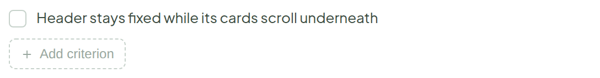
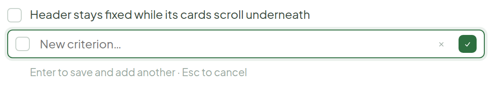
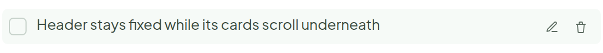
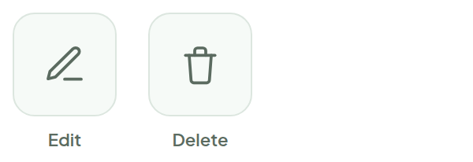
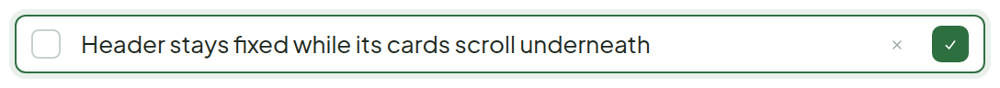

# Add / Edit / Delete Acceptance Criterion

> Component · source: [`AddAC.dc.html`](../source/AddAC.dc.html) · canvas `1789831198-eb58` · sha256 `9ff98d111ab0be4b70d8c916e0b18ec20f7161b74b42211c24137c6a59db7f50`

No "existing" tab, since a criterion only ever belongs to its own ticket. Edit and delete are hover-revealed on the row itself — no separate menu.

---

## 1. Idle

Source: [AddAC.dc.html](../source/AddAC.dc.html) › `<!-- Idle -->` (L30–44)

## 2. Adding a new one

Source: [AddAC.dc.html](../source/AddAC.dc.html) › `<!-- New -->` (L45–66)

- Hint under the input: "Enter to save and add another · Esc to cancel".

## 3. Row hover — edit / delete

Source: [AddAC.dc.html](../source/AddAC.dc.html) › `<!-- Hover: edit/delete -->` (L67–86)

- Icons appear only on hover — the row stays clean at rest. Delete removes the row right away, no confirm step.
- Icon buttons get a light tint background on hover.

## 4. Icons at full size

Source: [AddAC.dc.html](../source/AddAC.dc.html) › `<!-- Icon close-up -->` (L87–105)

- Labelled "Edit" and "Delete".

## 5. Editing an existing one

Source: [AddAC.dc.html](../source/AddAC.dc.html) › `<!-- Editing -->` (L106–134)

- Same input row as Add — the checkbox stays put so editing never looks like a fresh, unchecked item.
