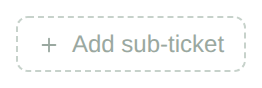
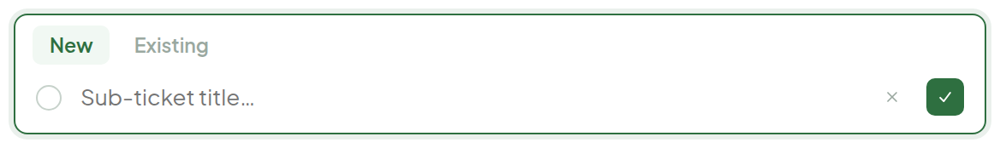
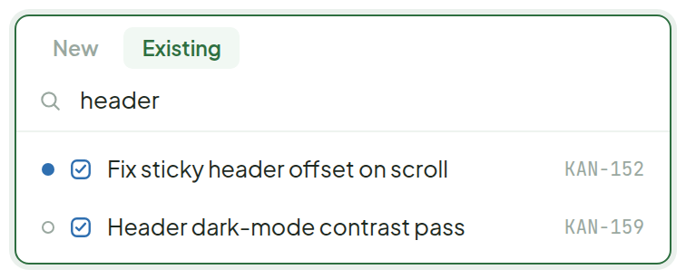

# Add Sub-ticket

> Component · source: [`AddSubticket.dc.html`](../source/AddSubticket.dc.html) · canvas `1789831198-eb58` · sha256 `80a473ddb53c7891b62f00c83e624291c1de4aa3bf4ce88fb9f2cd562a53af26`

The dashed button in Ticket Detail expands into a row inside the sub-ticket list itself, matching its height — so the new row previews right where it'll land. Two ways in: type a new title, or search and link an existing ticket.

---

## 1. Idle

Source: [AddSubticket.dc.html](../source/AddSubticket.dc.html) › `<!-- Idle -->` (L30–38)

## 2. Expanded — new ticket

Source: [AddSubticket.dc.html](../source/AddSubticket.dc.html) › `<!-- Expanded: new -->` (L39–60)

- Hint under the row: "Enter to create and add another · Esc to cancel".

## 3. Expanded — link existing

Source: [AddSubticket.dc.html](../source/AddSubticket.dc.html) › `<!-- Expanded: existing -->` (L61–103)

- Result rows highlight on hover.
- Already-linked tickets and the ticket's own parent are filtered out of results.
