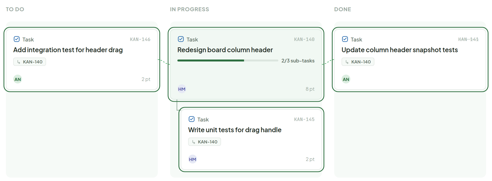

# Sub-task Grouping

> Component — — · source: [`BoardGrouping.dc.html`](../source/BoardGrouping.dc.html) · canvas `1789831198-eb58` · sha256 `0fc83c69fa515d2fe2440aa57ee7068a1cb499f7f1f56c3d935a0660e268b371`

A ticket with sub-tasks carries a faint tinted background at all times — an ambient hint you don't have to select anything to notice. The green ring, and the connector lines (dashed across columns, an elbow within one), are the selected state only: click the parent and they appear on it and every child.

---

## 1. Parent selected — To Do / In Progress / Done

Source: [BoardGrouping.dc.html](../source/BoardGrouping.dc.html) › `<!-- Column headers -->` … `<!-- Sub C: Done -->` (L28–134)

- Parent (KAN-140, In Progress) has the tinted background always on and shows an "N/M sub-tasks" progress bar.
- Sub-tasks in other columns (KAN-146 in To Do, KAN-141 in Done) link to the parent with dashed connectors; the sub-task in the same column (KAN-145) is indented under the parent with an elbow connector.
- Green ring + connectors appear only while the parent is selected.
