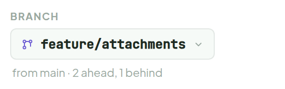
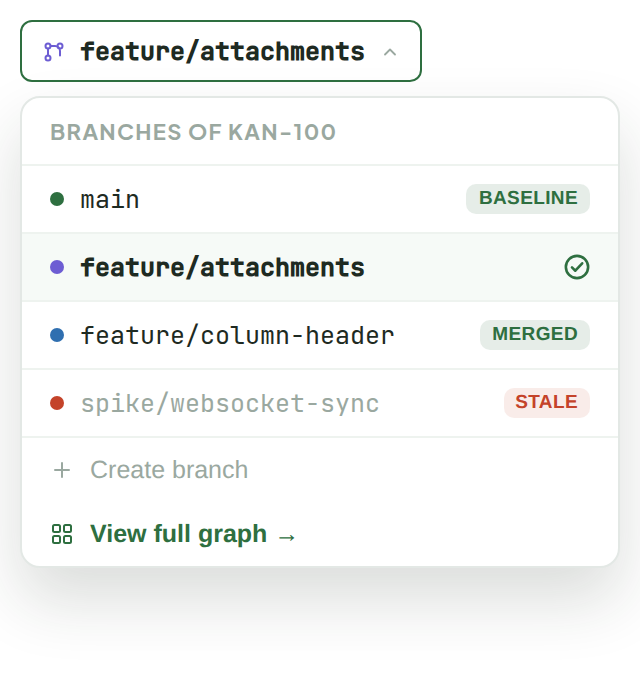
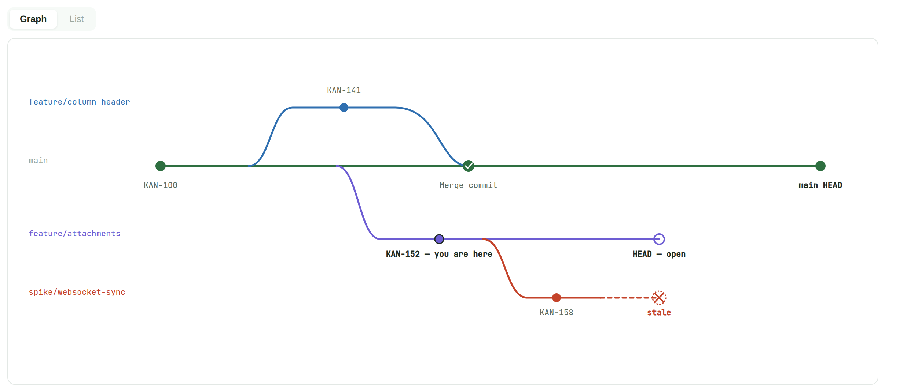
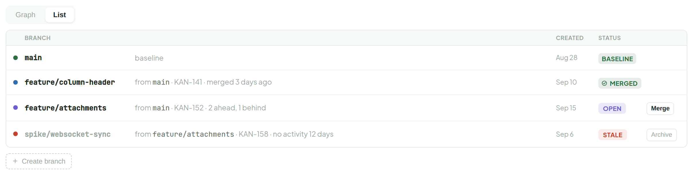
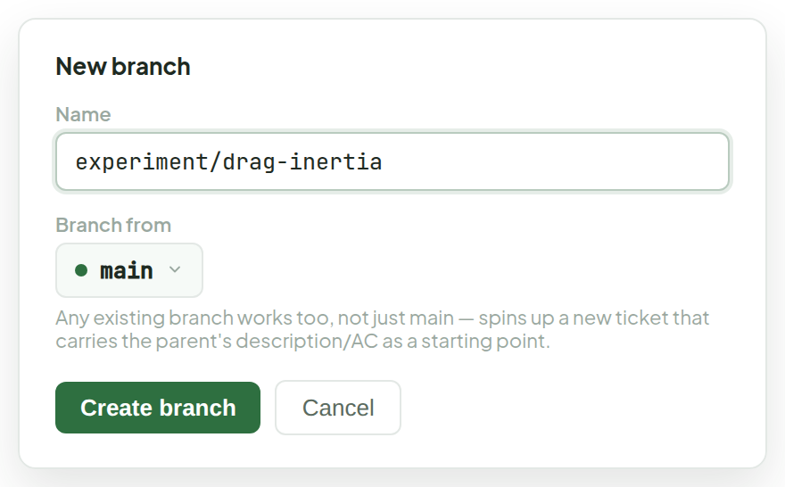

# Branches

> Component — new feature · source: [`Branches.dc.html`](../source/Branches.dc.html) · canvas `1789831198-eb58` · sha256 `fc1af35c4d81d505e66505ee0276ec0c65b8e31f8f6434b1674775be8e405a2a`

A ticket can be branched into one or more variant tickets to explore a different approach without disturbing the original. Baseline is the ticket's main line (what ships by default); a branch forks from it (or from another branch) at a point in time, carries its own status, and eventually gets merged back (its conclusion/changes folded into the baseline), left open (still diverged, exploration ongoing), or goes stale (abandoned, needs a decision). This is a new concept — not in the current data model — assuming one baseline ticket can own many branches, and a branch can itself be branched.

---

## 1. In Ticket Detail — sidebar row (open branch, showing 1 ahead / 1 behind of its base)

Source: [Branches.dc.html](../source/Branches.dc.html) › `<!-- Ticket Detail integration -->` (L30–43)

## 2. Clicking the sidebar "Branch" button — switcher popover

Source: [Branches.dc.html](../source/Branches.dc.html) › `<!-- Clicking the sidebar Branch button -->` (L44–97)

- Clicking a row switches Ticket Detail to that branch's ticket in place (same panel, new content — like switching git branches keeps you in the same working directory).
- "View full graph" opens the graph below in a panel over Ticket Detail, with a "← Back to KAN-152" button in its header to return.
- The popover alone only lists this ticket family flatly, it doesn't show ancestry or where a stale branch forked from.

## 3. Branch graph — the panel's default tab, one merged, one open, one stale (forked off the open branch)

Source: [Branches.dc.html](../source/Branches.dc.html) › `<!-- Graph -->` (L98–163)

- Diverge points sit exactly on the parent lane; a merge commit renders larger with a small check.
- An open tip is a hollow ring in the branch's own color; a stale tip is a dashed ring with an ×, distinct from a normal commit dot so an old, abandoned branch reads at a glance.
- The dark-ringed node is whichever ticket you opened the graph from (here, KAN-152) — this is the same graph "View full graph" opens, whether reached standalone or from Ticket Detail.

## 4. Branch list — clicking the "List" tab above swaps the graph for this table in the same panel; same data, sortable/scannable

Source: [Branches.dc.html](../source/Branches.dc.html) › `<!-- Branch list -->` (L164–233)

## 5. Clicking "Create branch"

Source: [Branches.dc.html](../source/Branches.dc.html) › `<!-- Create branch popover -->` (L234–269)

- Helper text: "Any existing branch works too, not just main — spins up a new ticket that carries the parent's description/AC as a starting point."
