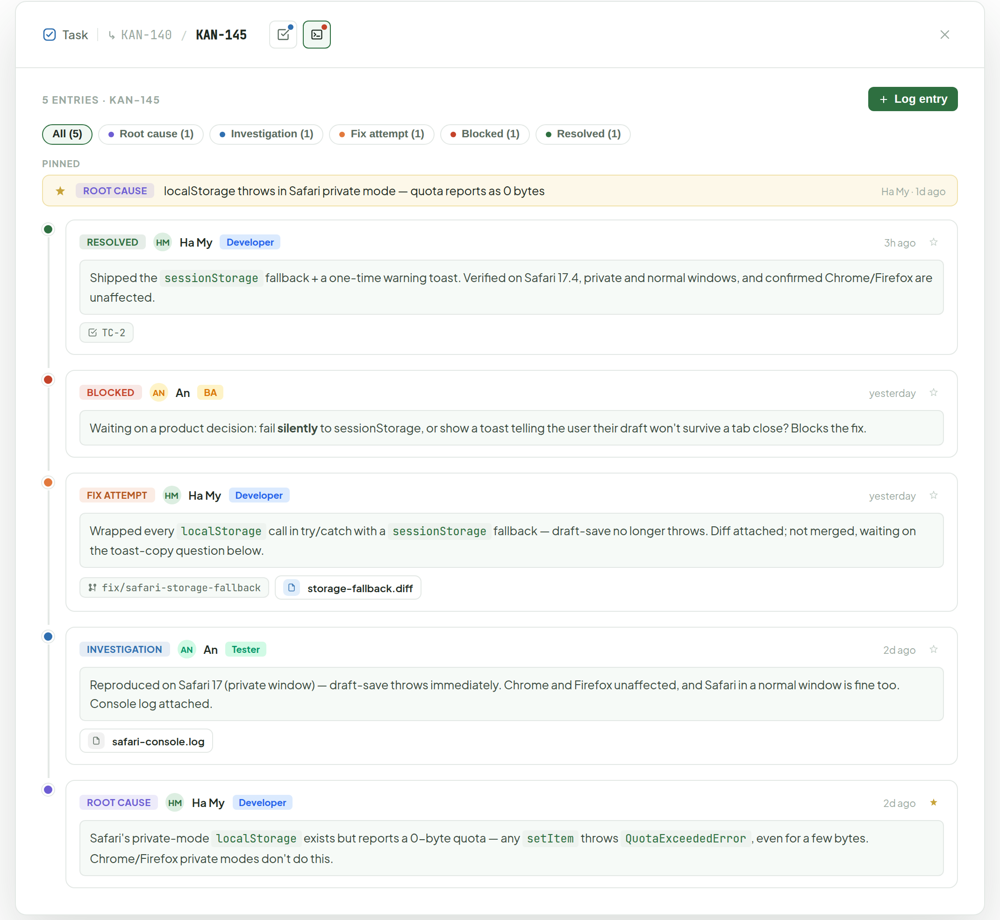
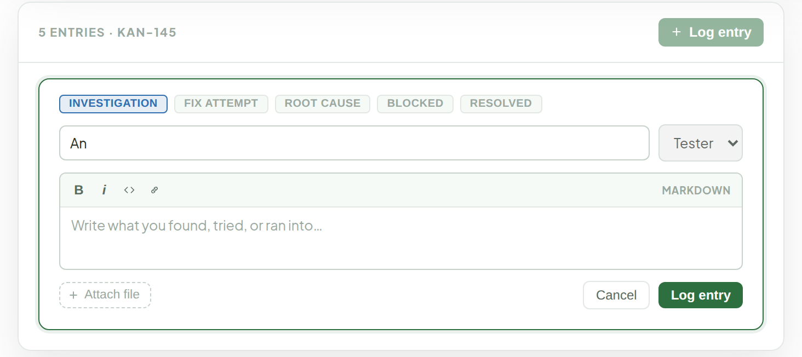

# Debug Space

> Component — v1 · source: [`DebugSpace.dc.html`](../source/DebugSpace.dc.html) · canvas `1789831198-eb58` · sha256 `a330f8c6b647c3d1f2a0be2545094f0cfddb1433996cd2cf8b0bbdc50c49e32f`

Replaces the current flat "Work Log" section with a dedicated timeline for debugging a ticket — same underlying idea (who did what, when), extended with a **kind** per entry (Investigation, Fix attempt, Root cause, Blocked, Resolved), file attachments, links to a branch or a test case, and pinning so the finding that matters doesn't get buried under routine notes. Opened from its own icon-only button in Ticket Detail's header, next to Test Cases.

---

## 1. Ticket with active debugging (KAN-145)

Source: [DebugSpace.dc.html](../source/DebugSpace.dc.html) › `<!-- Leaf ticket -->` (L60–239)

- Header icon buttons show hover tooltips with live summaries: Test Cases button "Test — 1 pass · 1 running · 2 pending"; Debug button "Debug — 5 entries · 1 blocked". The ticket id button has the title "Back to Details".
- Filter chips (All, Root cause, Investigation, Fix attempt, Blocked, Resolved) carry counts and filter the timeline by kind; the timeline dot color follows the entry kind.
- The "Pinned" strip sits above the timeline (`<!-- Pinned -->`, `<!-- Timeline -->` in source); the star on each card toggles pinning.

## 2. Clicking "Log entry" — inline form, pushed onto the top of the timeline

Source: [DebugSpace.dc.html](../source/DebugSpace.dc.html) › `<!-- Logging a new entry -->` (L241–296)

Kind defaults to whichever was picked last (usually "Investigation" for the first entry on a fresh bug). Linking a branch or test case happens after saving, from the card itself — same "add later" pattern as Test Cases' extra fields.

---

## Note

Note: model changes vs. today's `WorkLogEntry` (`id, author, role, note, at`) — the same shape, repurposed as a debugging timeline rather than a generic log.

1. New `kind: investigation | fix-attempt | root-cause | blocked | resolved` — drives the timeline dot color and the filter chips; no default ordering is implied between them, a ticket can jump straight to "resolved" from one entry.
2. New `pinned` boolean — surfaces the entry in the "Pinned" strip above the timeline (root cause and key blockers, typically); toggled from the card, no cap on how many.
3. New `attachments` — same upload flow as Test Cases (logs, screenshots, screen recordings), one entry can carry several.
4. New optional `linkedBranch` — a branch name from this ticket's Branches list, rendered as a chip.
5. New optional `linkedTestCase` — a `TC-N` code from this ticket's Test Cases, so a "Resolved" entry can point at the case that now passes.
6. New `updatedAt` for edits. `note` stays markdown, same as today's `WorkLogSection.tsx` editor (bold/italic/code/link, rendered via `MarkdownRenderer`) — every entry in the timeline above, and the "Log entry" form's note field, are markdown, not plain text.

Open question: whether "Blocked" should be able to @-mention a person or just read as a note — worth checking before locking the data model.
