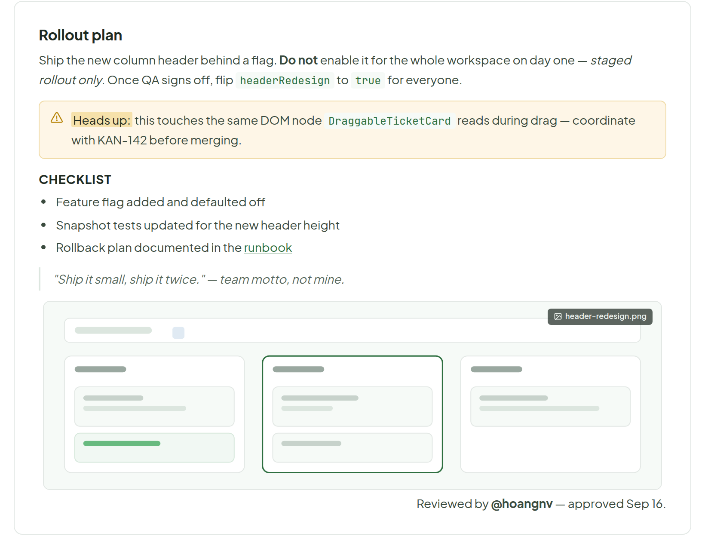
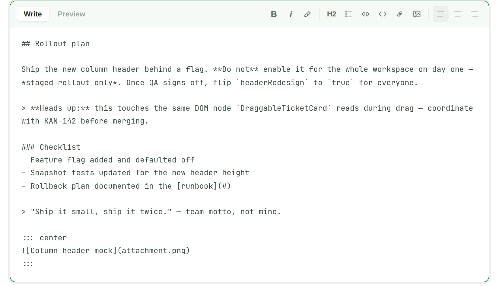
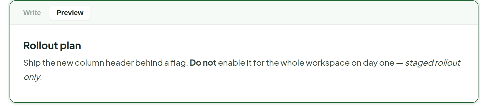
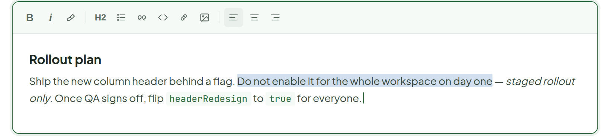
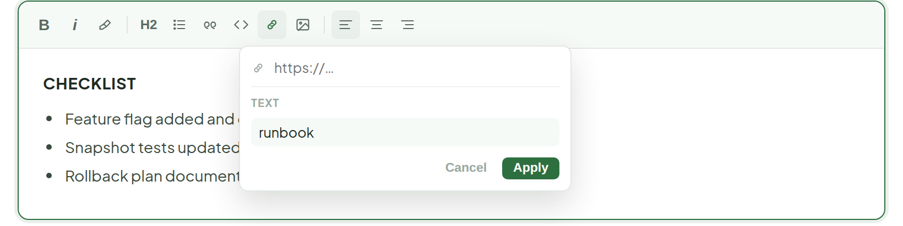

# Description — Markdown

> Component · source: [`DescriptionMarkdown.dc.html`](../source/DescriptionMarkdown.dc.html) · canvas `1789831198-eb58` · sha256 `8501a7e64178985e6db549983ef94578e5c96c3dc9f6421018868c3a54058e76`

Two directions for the same field, both still open: A) edit the raw Markdown source directly, or B) edit the rendered content itself and never see Markdown syntax. Same rendered look either way — only the editing mechanic differs.

---

# Approach A — Raw Markdown — technical, exact, copy-pasteable

## 1. View — click anywhere to edit

Source: [DescriptionMarkdown.dc.html](../source/DescriptionMarkdown.dc.html) › `<!-- View (rendered, read-only) -->` (L53–107)

- Rendered, read-only; clicking anywhere on it switches to the Write tab.

## 2. Editing — Write (raw Markdown)

Source: [DescriptionMarkdown.dc.html](../source/DescriptionMarkdown.dc.html) › `<!-- Editing — Write -->` (L109–175)

Toolbar buttons insert Markdown syntax at the cursor — they don't format live text like a rich editor.

## 3. Editing — Preview tab

Source: [DescriptionMarkdown.dc.html](../source/DescriptionMarkdown.dc.html) › `<!-- Editing — Preview -->` (L177–193)

Same render as View — the toolbar hides here since there's nothing to type into. Switching back to Write keeps the cursor where it was.

---

# Approach B — WYSIWYG — no Markdown syntax ever visible

## 4. Editing — content stays rendered, same toolbar as Approach A

Source: [DescriptionMarkdown.dc.html](../source/DescriptionMarkdown.dc.html) › `<!-- ═══ APPROACH B ═══ -->` (L195–247)

Same toolbar as Approach A, same buttons — the only difference is what's underneath it: rendered content you type straight into, instead of raw Markdown text. Select a word, hit Bold, it turns bold right there.

## 5. Clicking Link — popover under the toolbar button

Source: [DescriptionMarkdown.dc.html](../source/DescriptionMarkdown.dc.html) › `Clicking Link — popover under the toolbar button` (L249–311)

Select text first ("runbook"), then Link — the popover shows that text read-only as the label and just asks for the URL. Clicking Link with nothing selected instead asks for both label and URL.

---

Both approaches render to the exact same look — B just never shows the person raw syntax. Which one ships is an engineering call (see the earlier thread on TipTap/Lexical), not a visual one.
