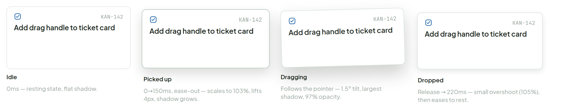
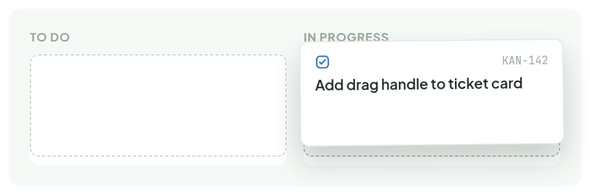

# Drag & Drop

> Interaction — — · source: [`DragDrop.dc.html`](../source/DragDrop.dc.html) · canvas `1789831198-eb58` · sha256 `73bd0e40ed345173bf2fffcfe800294bd46e975ade63571057cb4c6460c98392`

The motion signature for picking up and moving a card to another column — scale up, lift, arc across, then a small overshoot as it settles. The live loop below runs the real timing, ghost slots included: one left behind at the source, one previewed at the target just before landing.

---

## 1. Sequence

Source: [DragDrop.dc.html](../source/DragDrop.dc.html) › `<!-- Filmstrip -->` (L57–122)

1. **Idle** — 0ms — resting state, flat shadow.
2. **Picked up** — 0→150ms, ease-out — scales to 103%, lifts 4px, shadow grows.
3. **Dragging** — Follows the pointer — 1.5° tilt, largest shadow, 97% opacity.
4. **Dropped** — Release → 220ms — small overshoot (105%), then eases to rest.

## 2. Live preview — loops automatically

**4-second loop, one timeline.** The card lifts from To Do, arcs across into In Progress, previews a landing spot there just before it settles, then fades out and back in to restart the loop. The source outline stays behind the whole time it's gone; the target outline only shows up for the last stretch, as a heads-up before it lands.

Source: [DragDrop.dc.html](../source/DragDrop.dc.html) › `<!-- Live loop -->` (L123–159)

The image is a single frame captured at 2.64s (66%). The loop itself is CSS-only (`@keyframes` in the source `<style>`); timings:

**`cardMotion`** — `.drag-card`, `4s cubic-bezier(.4,0,.2,1) infinite`

| Keyframe | opacity | transform | box-shadow |
|---|---|---|---|
| 0% | 0 | `translate(0,0) scale(1) rotate(0deg)` | – |
| 4% | 1 | `translate(0,0) scale(1) rotate(0deg)` | `0 1px 2px rgba(30,42,34,0.06)` |
| 16% | – | `translate(0,-14px) scale(1.03) rotate(-1.2deg)` | `0 14px 26px rgba(30,42,34,0.20)` |
| 42% | – | `translate(128px,-22px) scale(1.03) rotate(1.2deg)` | `0 16px 30px rgba(30,42,34,0.22)` |
| 66% | – | `translate(256px,-12px) scale(1.03) rotate(-0.6deg)` | `0 14px 26px rgba(30,42,34,0.20)` |
| 78% | – | `translate(256px,0) scale(1.05) rotate(0deg)` | `0 8px 16px rgba(30,42,34,0.14)` |
| 88% | – | `translate(256px,0) scale(0.98) rotate(0deg)` | `0 2px 6px rgba(30,42,34,0.08)` |
| 94% | 1 | `translate(256px,0) scale(1) rotate(0deg)` | `0 1px 2px rgba(30,42,34,0.06)` |
| 100% | 0 | `translate(256px,0) scale(1) rotate(0deg)` | `0 1px 2px rgba(30,42,34,0.06)` |

**`sourceGhost`** — `.source-ghost` (dashed outline `1.5px #C7D2CB` left in To Do), `4s ease infinite`

| Keyframe | opacity |
|---|---|
| 0%, 12% | 0 |
| 18%, 92% | 1 |
| 97%, 100% | 0 |

**`targetGhost`** — `.target-ghost` (dashed outline `1.5px #9BB3A4`, fill `rgba(104,186,127,0.08)` in In Progress), `4s ease infinite`

| Keyframe | opacity |
|---|---|
| 0%, 36% | 0 |
| 44%, 70% | 1 |
| 80%, 100% | 0 |

Absolute times at 4s: card lifts by 0.64s, mid-arc 1.68s, over target 2.64s, overshoot (scale 1.05) 3.12s, rest 3.76s, fades out by 4s.
