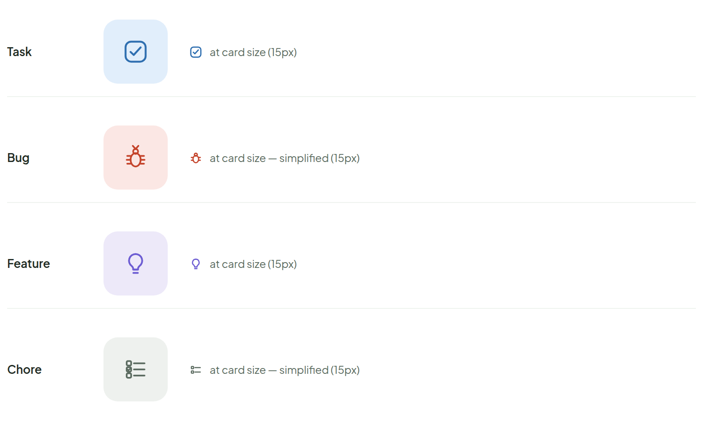
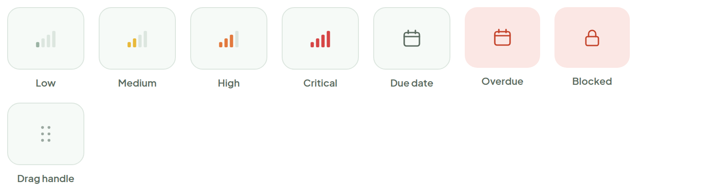
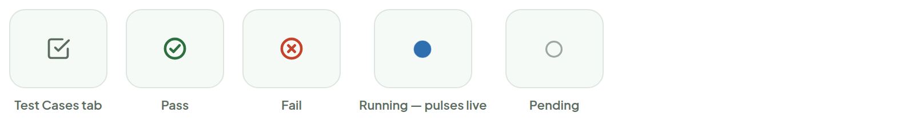
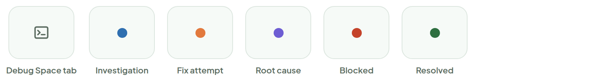

# Ticket Type Icons

> Component — final · source: [`Icons.dc.html`](../source/Icons.dc.html) · canvas `1789831198-eb58` · sha256 `da9137d02d0db7390c3794796ccdd345bf3a0b5efe13e812f55a746370d436c8`

Literal marks, applied on the Ticket Card. Each shown at its full size and at the card's 15px — the bug and chore marks drop detail at that size to stay legible.

---

## 1. Ticket type icons

Source: [Icons.dc.html](../source/Icons.dc.html) › `<!-- Type icon rows -->` (L27–97)

- **Task** — at card size (15px)
- **Bug** — at card size — simplified (15px)
- **Feature** — at card size (15px)
- **Chore** — at card size — simplified (15px)

## 2. Priority & status marks

Source: [Icons.dc.html](../source/Icons.dc.html) › `<!-- Priority + blocked -->` (L98–181)

- Marks shown: Low, Medium, High, Critical, Due date, Overdue, Blocked, Drag handle.

## 3. Test case marks

Source: [Icons.dc.html](../source/Icons.dc.html) › `<!-- Test case marks -->` (L182–225)

- Marks shown: Test Cases tab, Pass, Fail, Running, Pending.
- **Running — pulses live**: an expanding ring around the mark loops `ic-ring 1.4s ease-out infinite` (ring 15px, 1.5px border `rgba(47,111,176,0.55)`; `0%` scale 0.7 / opacity 1 to `100%` scale 1.7 / opacity 0).

## 4. Debug Space marks

Source: [Icons.dc.html](../source/Icons.dc.html) › `<!-- Debug Space marks -->` (L226–275)

- Marks shown: Debug Space tab, Investigation, Fix attempt, Root cause, Blocked, Resolved.

## 5. Workspace marks

Source: [Icons.dc.html](../source/Icons.dc.html) › `<!-- Workspace marks -->` (L276–304)

- Marks shown: Workspace tab, Auto-delete pending, Kept forever.
