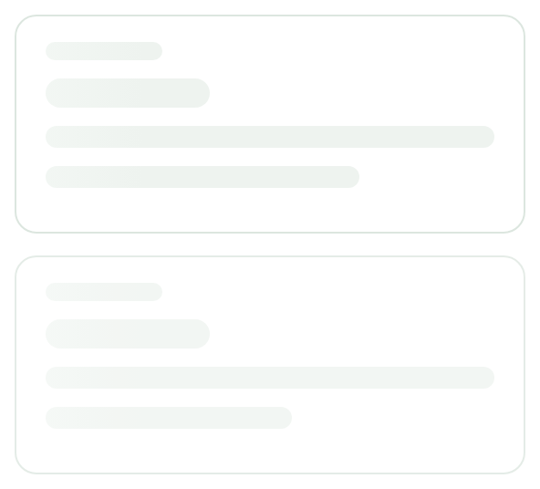
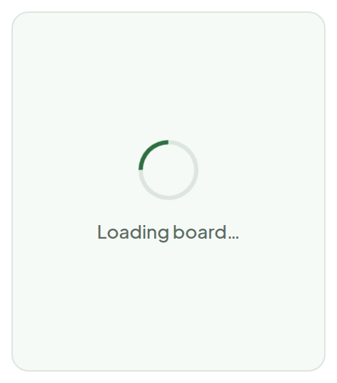
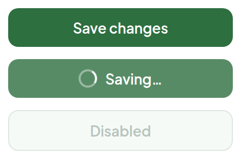

# Loading States

> Component — — · source: [`Loading.dc.html`](../source/Loading.dc.html) · canvas `1789831198-eb58` · sha256 `6ac06b47f346c0831f05800b294f942e8fa188834ca0f7a579c6af07f948e5cd`

Skeleton cards while a column loads, spinner for full-page and button states.

---

## 1. Column skeleton

Source: [Loading.dc.html](../source/Loading.dc.html) › `<!-- Skeleton column -->` (L40–58)

- Each skeleton card is 280x120, radius 12, 1px `#DCE6DF` border, padding 14px 16px, 10px gap; placeholder bars: 64x10, 90x16 pill, 100% x 12, then 70% (first card) / 55% (second card) x 12. The second card is dimmed.
- Shimmer animation (`.skel`): `linear-gradient(90deg, #EEF3EF 25%, #F6FAF7 37%, #EEF3EF 63%)`, `background-size: 400px 100%`, `shimmer 1.4s ease-in-out infinite`, `background-position` moves from `-200px 0` to `200px 0`; bar radius 6px.

## 2. Full-page spinner

Source: [Loading.dc.html](../source/Loading.dc.html) › `<!-- Full page spinner -->` (L59–67)

- Spinner: 36px circle, 3px `#DCE6DF` ring with `#2E6F40` top segment, `spin 0.8s linear infinite` (rotates 360deg).
- Label: "Loading board…" below, 13px / 500, `#5B6B60`, on a `#F6FAF7` panel with `#DCE6DF` border.

## 3. Button states

Source: [Loading.dc.html](../source/Loading.dc.html) › `<!-- Button loading state -->` (L68–81)

- **Save changes** — default primary button (`#2E6F40`).
- **Saving…** — same button at 0.8 opacity with a 14px inline spinner (2px ring, white top segment, `spin 0.7s linear infinite`), 8px gap to label.
- **Disabled** — `#F6FAF7` fill, `#DCE6DF` border, `#B7C4BC` text.
