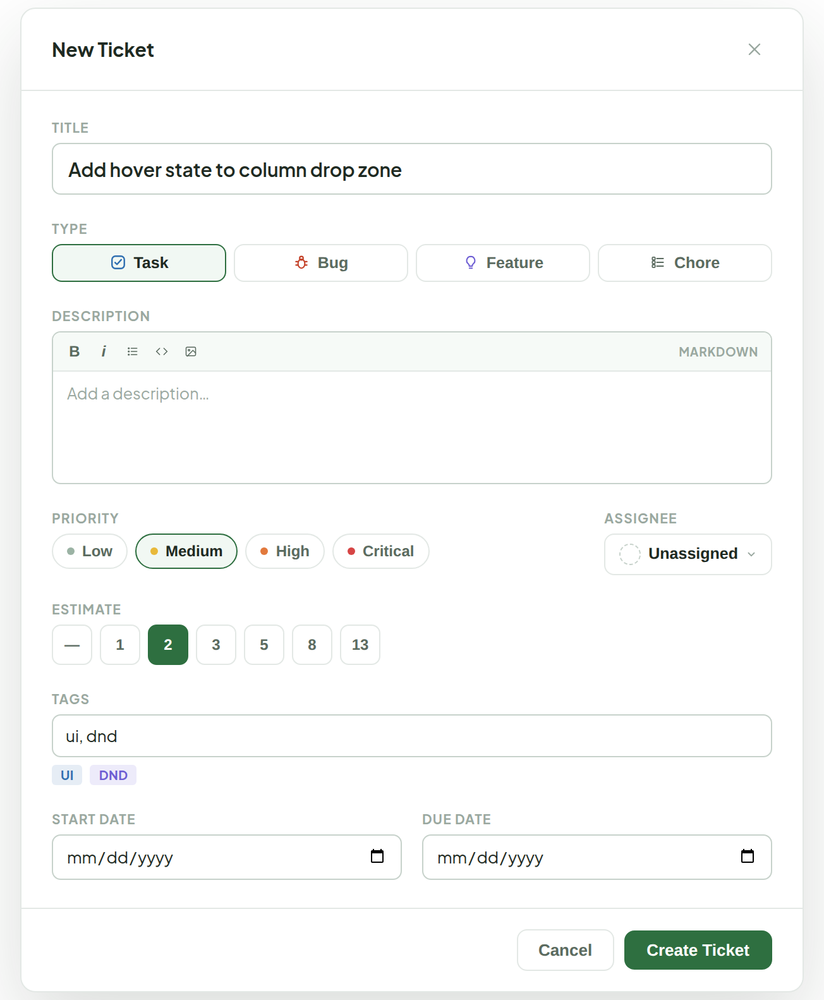

# New Ticket

> Component — v1 · source: [`NewTicket.dc.html`](../source/NewTicket.dc.html) · canvas `1789831198-eb58` · sha256 `41b0c090e738584674c688680360b7c159ad36874ac38546b617ada232a1ef74`

Opens from the "+ New Ticket" button in the Main Board's top bar — a centered modal over a dimmed board, same overlay behavior as today's `TicketModal.tsx` in create mode. All the current fields (Title, Description, Type, Status, Priority, Estimate, Tags, Assignee, Start/Due date) stay — this just restyles the plain selects/emoji into the rest of the system's language. New ticket always starts in Backlog, so Status isn't a field here — it's set on the board via drag or the Status Menu afterward.

---

## 1. New Ticket modal

Source: [NewTicket.dc.html](../source/NewTicket.dc.html) › `New Ticket` modal (L36–158)

---

## Note

Note: no data model changes — every field maps to what `TicketModal.tsx` already collects in create mode (title, description, type, priority, estimate, tags, assignee, startDate, dueDate). Visual changes only:

1. Type moves from an emoji `<select>` (🐛✨📋🔧) to icon segmented buttons, reusing the Ticket Type Icons set.
2. Priority moves from a plain `<select>` to colored-dot chips, matching the priority dot colors used everywhere else.
3. Assignee becomes a dropdown trigger in the Status-Menu style instead of a native `<select>`, consistent with the Filter bar's Assignee dropdown.
4. Estimate keeps its current button-group behavior, just restyled.
5. Description gets the same compact markdown toolbar as Debug Space's "Log entry" form.
6. Status is dropped as a create-time field — new tickets always start in Backlog today (`useCreateTicket` doesn't take a status), so showing the selector here was never actually meaningful.
