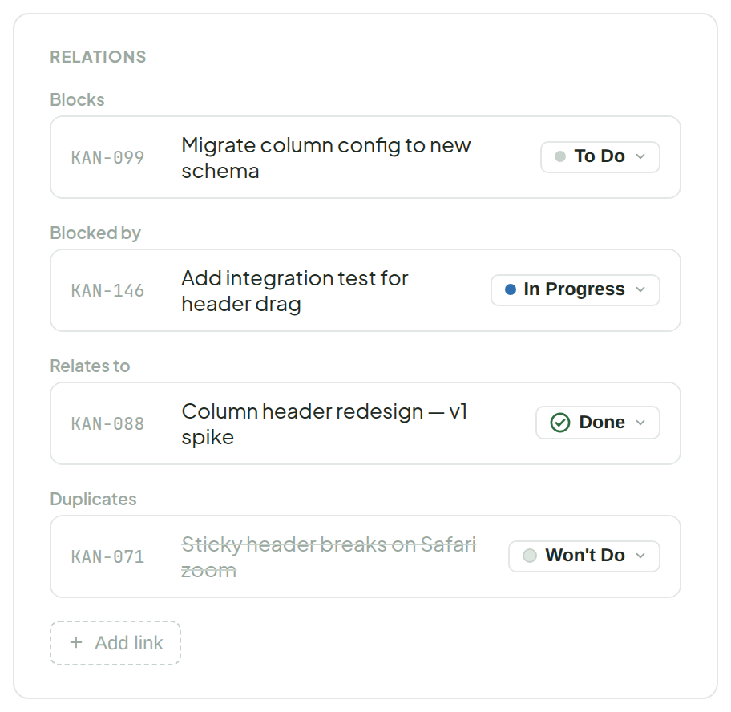
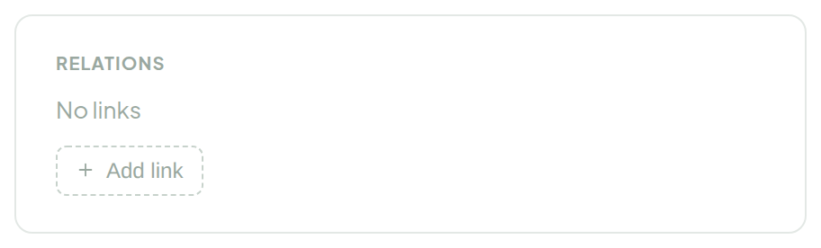
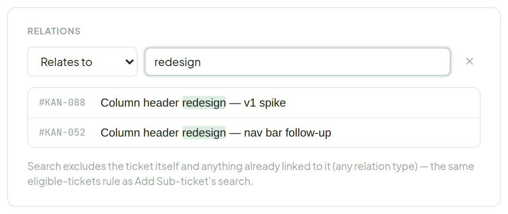

# Relations

> Component · source: [`Relations.dc.html`](../source/Relations.dc.html) · canvas `1789831198-eb58` · sha256 `17f7fa101ac225f1ea4fc0d6bcd12493c19fb6b2bffe24aa6556acb295f361c0`

Grouped by relation type — Blocks, Blocked by, Relates to, Causes / Caused by, Duplicates / Duplicated by (from `ticket.blocks`, `blockedBy` and `links[]`). Each row shows the target's live status; hover reveals remove, no confirm step, same pattern as Acceptance Criteria.

---

## 1. Grouped by type — populated

Source: [Relations.dc.html](../source/Relations.dc.html) › `<!-- Grouped, populated -->` (L37–121)

- The remove "×" on a row is hidden at rest, appears on row hover and turns red on hover; removing is immediate (no confirm).

## 2. Empty

Source: [Relations.dc.html](../source/Relations.dc.html) › `<!-- Empty state -->` (L122–137)

- "+ Add link" replaces the type-grouped list when there are no relations yet — same dashed-button pattern used everywhere else (sub-tasks, criteria, sub-tickets).

## 3. Clicking "+ Add link" — type + search, same row as Add Sub-ticket's "Existing" tab

Source: [Relations.dc.html](../source/Relations.dc.html) › `<!-- Add link form -->` (L138–184)

- The type dropdown offers: Blocks, Blocked by, Relates to, Causes, Caused by, Duplicates, Duplicated by.
- Result rows highlight on hover.
- Search excludes the ticket itself and anything already linked to it (any relation type) — the same eligible-tickets rule as Add Sub-ticket's search.
