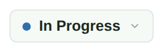
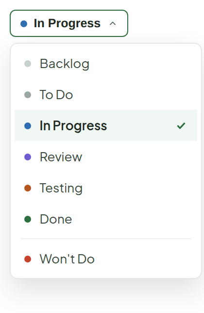

# Status Menu

> Component — — · source: [`StatusMenu.dc.html`](../source/StatusMenu.dc.html) · canvas `1789831198-eb58` · sha256 `3a317d8703c3c512e8b42551b76f17d6da674bda86a9b11b842c15d8b58b51c1`

Opens from the Status control in Ticket Detail's sidebar. Each status keeps the dot color it already has on the board (column accents); the current one is checked, not just highlighted.

---

## 1. Closed

Source: [StatusMenu.dc.html](../source/StatusMenu.dc.html) › `<!-- Closed state -->` (L29–38)

## 2. Open

Source: [StatusMenu.dc.html](../source/StatusMenu.dc.html) › `<!-- Open state -->` (L39–92)

- Order: Backlog, To Do, In Progress, Review, Testing, Done, then a divider and Won't Do.
- Current status shows a checkmark plus a tinted row; each row has its column-accent dot.
- Hover: row background `#F6FAF7` (`.sm-item:hover`).

**Note:**

- "Testing" and "Review" are two new statuses, added between In Progress and Done — Status today is only backlog | todo | in-progress | done | wont_do.
- Intent: a ticket moves to Review once the code is up and ready for a look, then to Testing once review passes and its test cases are ready to run (pairs with the Test Cases tab), before Done.
- Board column set, column-count rollups and any other place that reads Status will need updating for dev to wire these in.
