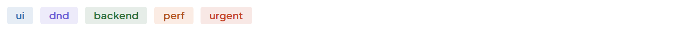
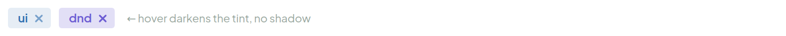
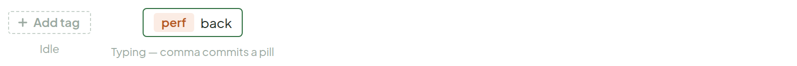
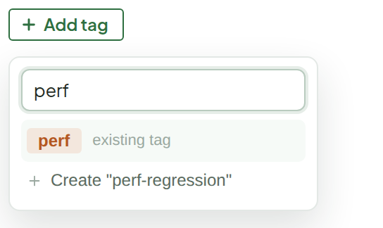

# Tags

> Component — rev. 2 · source: [`Tags.dc.html`](../source/Tags.dc.html) · canvas `1789831198-eb58` · sha256 `5ae415f2b360c1ed2352bc234c7f9c8f85e718d0ef07766becc0fbd4522a1789`

A tinted pill — the tag's own color at low opacity, text in that same color. No gray dot-and-label list, no glowing focus rings.

---

## 1. On card / anywhere read-only

Source: [Tags.dc.html](../source/Tags.dc.html) › `<!-- Tag pill cluster -->` (L25–36)

## 2. Removable (ticket sidebar, editing)

Source: [Tags.dc.html](../source/Tags.dc.html) › `<!-- Removable -->` (L37–52)

- Hover darkens the tint, no shadow (note shown beside the pills: "← hover darkens the tint, no shadow").

## 3. Add tag

Source: [Tags.dc.html](../source/Tags.dc.html) › `<!-- Add tag -->` (L53–76)

- Idle: "Add tag" button.
- Typing: "perf", "back" — comma commits a pill.

## 4. Clicking "+ Add tag" — popover under the button

Source: [Tags.dc.html](../source/Tags.dc.html) › `<!-- Clicking Add tag: picker popover -->` (L77–101)

Typing filters the project's existing tags first (click to attach instantly); no match shows a "Create …" row at the bottom — same shape as Relations' "Add link" search, just tag-scoped.
