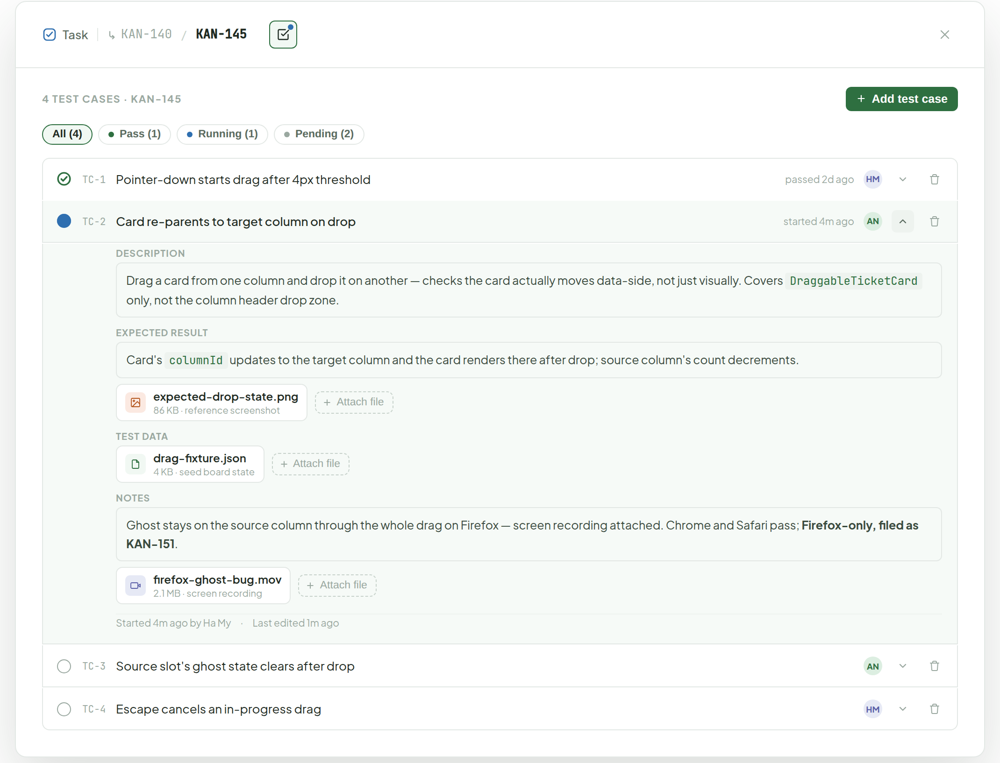
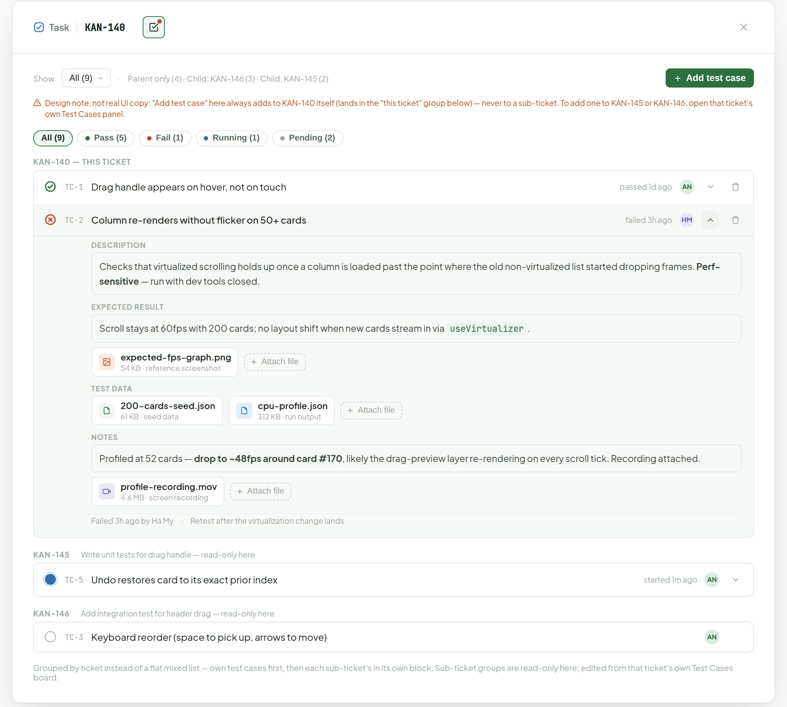
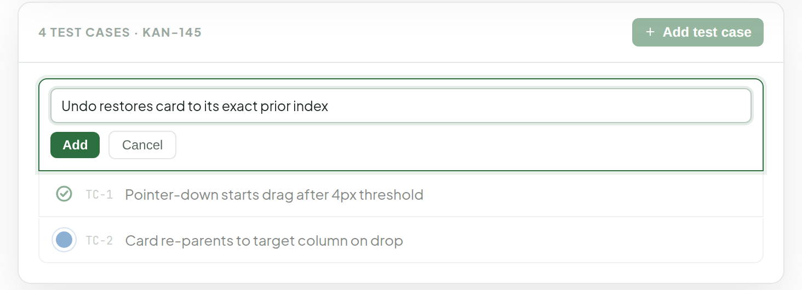

# Test Cases

> Component — Rev. 2 · source: [`TestCases.dc.html`](../source/TestCases.dc.html) · canvas `1789831198-eb58` · sha256 `0450dd12e9fcf8bf5bdefaf04acf6181c2a4ec28019f8e63d9cdf1d7cda86d7e`

Grounded in the app's existing `TestCasesSection.tsx`, extended with richer fields (see the note at the bottom). Opened from the icon-only "Test Cases" button in Ticket Detail's header; clicking it swaps the whole panel body for this list; clicking the ticket id goes back to Details. Status cycles pending → running → pass/fail, title is click-to-edit, each row expands to show what it checks, the pass bar, and notes. On a parent ticket it rolls up the sub-tickets' test cases too, filterable.

---

## 1. Leaf ticket — own test cases only (KAN-145)

Source: [TestCases.dc.html](../source/TestCases.dc.html) › `<!-- Leaf ticket, own test cases only -->` (L55–230)

- Header button tooltip on hover: "Test — 1 pass · 1 running · 2 pending".
- The Running status dot has a pulsing ring (CSS `tc-ring`, 1.4s ease-out infinite: scale 0.7 → 1.7 with opacity 1 → 0). The image shows one static frame.
- Status icons are buttons (titles Pass / Running / Pending); each row has expand/collapse and delete controls and a per-row assignee avatar.

## 2. Parent ticket — rolled up across sub-tickets (KAN-140)

Source: [TestCases.dc.html](../source/TestCases.dc.html) › `<!-- Parent ticket, rollup -->` (L232–446; groups at L291, L403, L424)

- Header button tooltip on hover: "Test — 5 pass · 1 fail · 1 running · 2 pending".
- "Show" dropdown (All (9)) with counts: Parent only (4) · Child: KAN-146 (3) · Child: KAN-145 (2).
- The "Add test case" button has the title "Adds to KAN-140 itself — open a sub-ticket's own Test Cases panel to add one there".
- Design note, not real UI copy (shown in orange in the mock): "Add test case" here always adds to KAN-140 itself (lands in the "this ticket" group below) — never to a sub-ticket. To add one to KAN-145 or KAN-146, open that ticket's own Test Cases panel.
- Grouped by ticket instead of a flat mixed list — own test cases first, then each sub-ticket's in its own block. Sub-ticket groups are read-only here; edited from that ticket's own Test Cases board.

## 3. Clicking "Add test case" — not a popup, an inline row pushed onto the top of the same list

Source: [TestCases.dc.html](../source/TestCases.dc.html) › `<!-- Clicking Add test case -->` (L448–482)

No modal — the form drops into the same panel, above the existing rows (dimmed here just to show it's the same list, not literally dimmed live). Title only at creation; everything else (Description, Expected result, Test data, Notes) gets filled in later by expanding the row. New test cases always start Pending. Same "type title, hit Add" pattern as the current app, just extended for the new fields.

---

## Note

Note: model changes vs. today's `TestCase` (`id, title, status, proof, note`).

1. `status` gains a 4th value, `running` (pending → running → pass/fail), with a `startedAt` timestamp.
2. New `description` — what the test covers.
3. New `expectedResult` — the pass bar, set once when the case is written.
4. `proof` + `note` merge into one `notes` field. All three of these — description, expectedResult, notes — are markdown (same editor as Description on the ticket itself, images included), not plain text.
5. `updatedAt` for "last edited".
6. File attachments on `expectedResult` and `notes` too (screenshots, recordings), on top of the dedicated `testDataFiles` for raw fixtures/seed data/run output — same upload flow as Attachments, attached per-field so it's clear whether a file is "what we expected" vs "what happened" vs raw input data, not one shared bucket.
7. The per-row assignee avatar is also new — no assignee field exists today.
8. New short human-readable `code` (`TC-1`, `TC-2`…), numbered per ticket — the internal `id` is a uuid, not something anyone can reference by hand; this gives a bug ticket something stable to point back to ("failed TC-2 on KAN-145") instead of quoting the title, which can change.

List-row width stays compact (status · title · meta); the richer fields only show once a row is expanded.

Open questions I can't settle from a design pass alone:

- Whether Expected result should be structured (Given/When/Then) or free text.
- Whether a case needs run history beyond the latest run.
- Who's allowed to set "Running".

Worth a quick check with whoever owns QA workflow before locking the data model.
