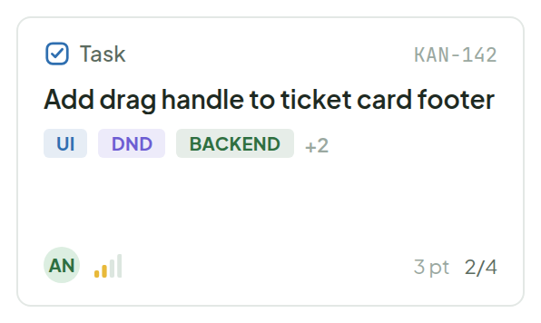
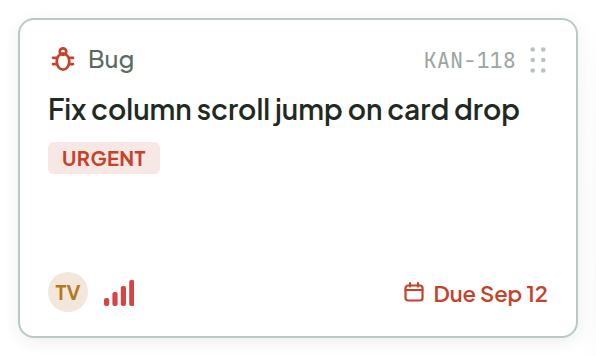
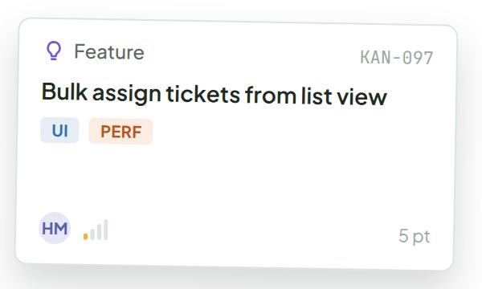
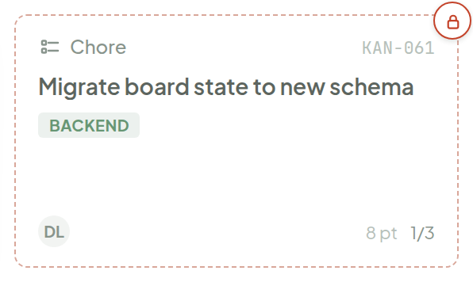
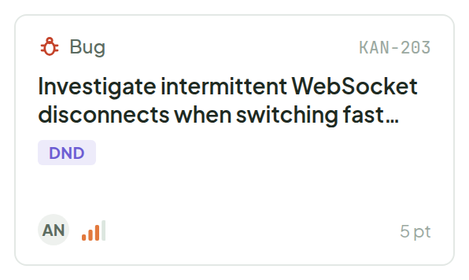
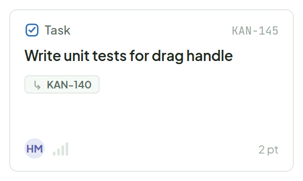
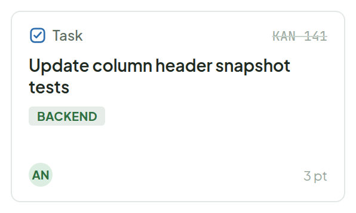

# Ticket Card

> Component — rev. 6 · source: [`TicketCard.dc.html`](../source/TicketCard.dc.html) · canvas `1789831198-eb58` · sha256 `cd2cdbe283887fdc050bba7c9123bab19b48e1df2b1f3d6dc3c6e4968b9d126f`

Tags get their own row between title and footer — uppercase pills, with an overflow count once they run out of room. Title clamps to 2 lines with an ellipsis. Blocked no longer fights the ID for space — a floating badge carries it instead.

---

## 1. Default — many tags

Source: [TicketCard.dc.html](../source/TicketCard.dc.html) › `<!-- Default -->` (L32–64)

- Overflow count (`+2`) appears once the tag pills run out of room.

## 2. Hover — one tag

Source: [TicketCard.dc.html](../source/TicketCard.dc.html) › `<!-- Hover -->` (L65–99)

- On hover the card gets a darker border / raised treatment and a drag-handle grip appears next to the ID; due date shown in red ("Due Sep 12").

## 3. Dragging — two tags

Source: [TicketCard.dc.html](../source/TicketCard.dc.html) › `<!-- Dragging -->` (L100–131)

- Tilted, largest shadow (see Drag & Drop for motion).

## 4. Blocked — floating badge

Source: [TicketCard.dc.html](../source/TicketCard.dc.html) › `<!-- Blocked -->` (L132–160)

- Content is dimmed (opacity 0.72); the floating badge carries the Blocked state so it no longer competes with the ID.

## 5. Long title — 2-line clamp

Source: [TicketCard.dc.html](../source/TicketCard.dc.html) › `<!-- Long title -->` (L161–189)

- Title clamps to 2 lines with an ellipsis.

## 6. Sub-ticket — has a parent

Source: [TicketCard.dc.html](../source/TicketCard.dc.html) › `<!-- Sub-ticket -->` (L190–221)

- A parent chip (`↳ KAN-140`) marks the card as a sub-ticket.

## 7. Done — struck ID

Source: [TicketCard.dc.html](../source/TicketCard.dc.html) › `<!-- Done -->` (L222–245)

- The ID is struck through when the ticket is Done.
