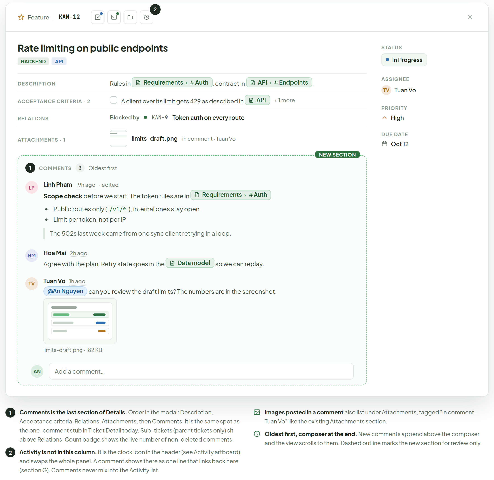
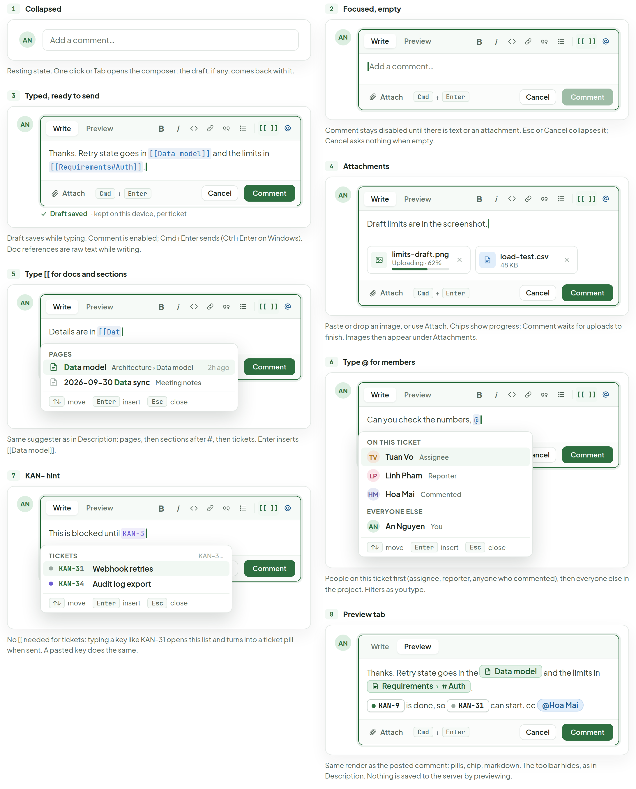
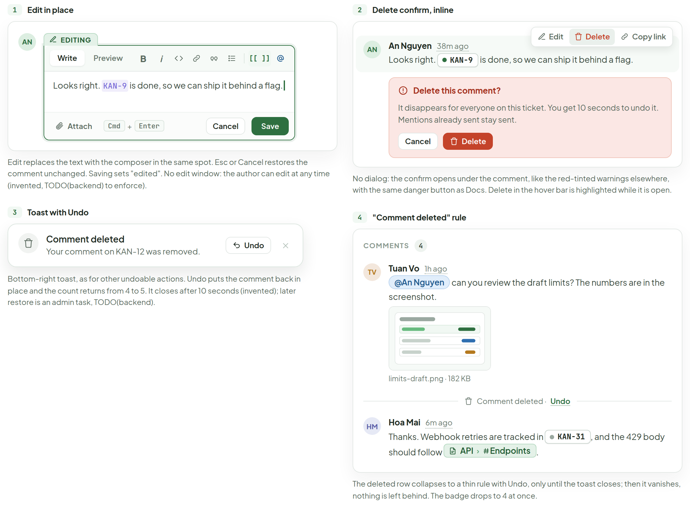
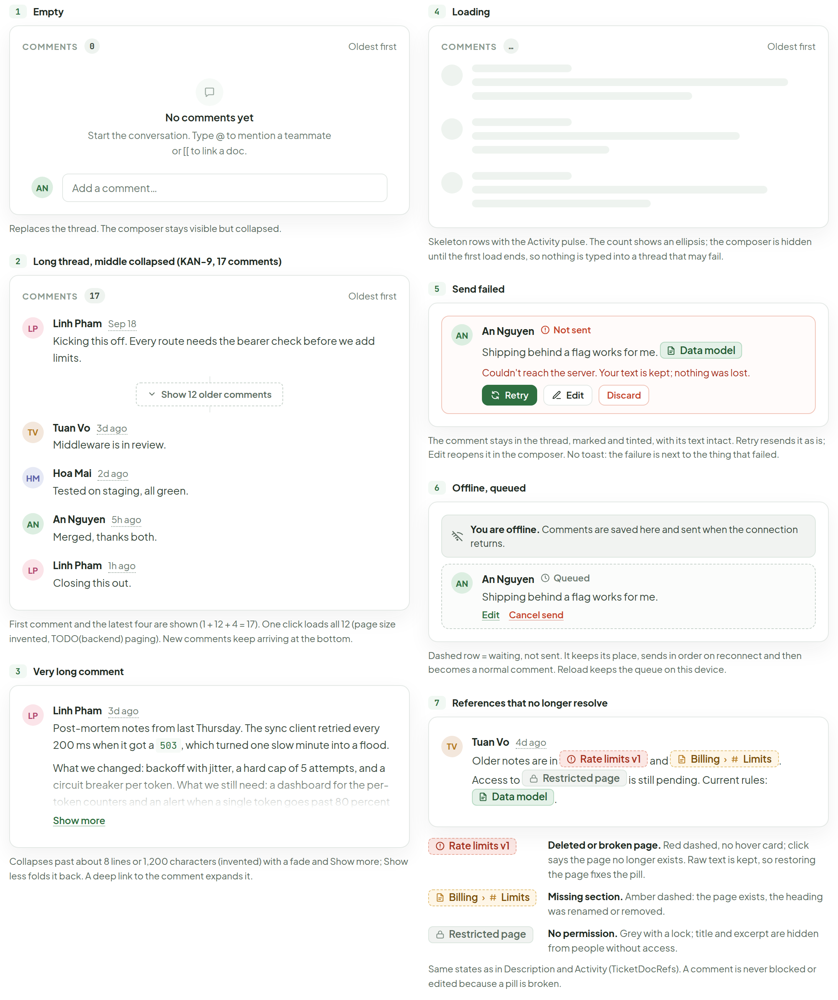
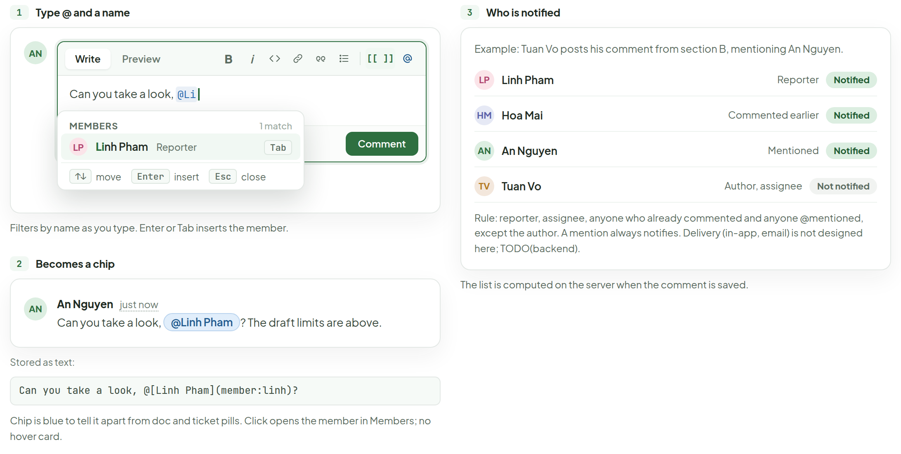
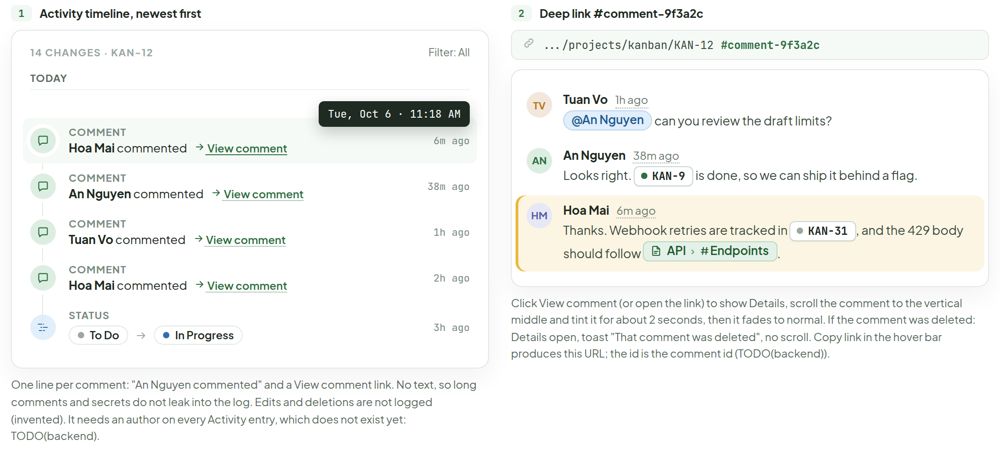

# Ticket comments

> Component — v1 · source: [`TicketComments.dc.html`](../source/TicketComments.dc.html) · canvas `1791260008-2981` · sha256 `e05ef4814877095b9db08d3a86981587aa627fd362f228fefc3efcec668e8e3b`

A Comments section for the Ticket Detail modal: a plain thread with markdown, inline doc, section and ticket pills (same as Description), @mentions, images, edit and delete, and a one-line trail in Activity. Desktop and web. Sample: KAN-12 “Rate limiting on public endpoints” in Kanban Board; it is Tuesday, Oct 6, 11:24 AM.

---

## A. Placement in Ticket Detail

Where the section lives and how it relates to Activity. Shown with 3 comments; section B is the same thread after two more replies.

Source: [TicketComments.dc.html](../source/TicketComments.dc.html) › block "A Placement in Ticket Detail" (Ticket Detail modal for KAN-12 with the dashed "NEW SECTION" outline, and numbered notes 1 and 2 plus two icon notes below)



- Header: "Feature", "KAN-12"; header action buttons (the clock icon carries a badge "2"); close button.
- Title "Rate limiting on public endpoints"; tags "BACKEND", "API".
- "Description": "Rules in" page pill "Requirements" › "Auth" ", contract in" page pill "API" › "Endpoints" ".".
- "Acceptance criteria · 2": "A client over its limit gets 429 as described in" page pill "API" "+ 1 more".
- "Relations": "Blocked by" "KAN-9" "Token auth on every route".
- "Attachments · 1": "limits-draft.png" "in comment · Tuan Vo".
- Sidebar: "Status" "In Progress"; "Assignee" "TV" "Tuan Vo"; "Priority" "High"; "Due date" "Oct 12".
- Dashed section outline label "NEW SECTION". Section header: "1" "Comments" count "3" "Oldest first".
- Comment, "LP" "Linh Pham" "19h ago" "· edited": bold "Scope check" "before we start. The token rules are in" page pill "Requirements" › "Auth" ".". Bullets "Public routes only (" code "/v1/*" "), internal ones stay open" and "Limit per token, not per IP". Quote "The 502s last week came from one sync client retrying in a loop."
- Comment, "HM" "Hoa Mai" "2h ago": "Agree with the plan. Retry state goes in the" page pill "Data model" "so we can replay."
- Comment, "TV" "Tuan Vo" "1h ago": chip "@An Nguyen" "can you review the draft limits? The numbers are in the screenshot." Image thumbnail caption "limits-draft.png · 182 KB".
- Collapsed composer: "AN" "Add a comment…".

Notes under the screen:

1. **Comments is the last section of Details.** Order in the modal: Description, Acceptance criteria, Relations, Attachments, then Comments. It is the same spot as the one-comment stub in Ticket Detail today. Sub-tickets (parent tickets only) sit above Relations. Count badge shows the live number of non-deleted comments.
2. **Activity is not in this column.** It is the clock icon in the header (see Activity artboard) and swaps the whole panel. A comment shows there as one line that links back here (section G). Comments never mix into the Activity list.
- **Images posted in a comment** also list under Attachments, tagged "in comment · Tuan Vo" like the existing Attachments section.
- **Oldest first, composer at the end.** New comments append above the composer and the view scrolls to them. Dashed outline marks the new section for review only.

---

## B. The thread

Five comments on KAN-12: the three from A, then An Nguyen (38m) and Hoa Mai (6m). Hover states shown: time tooltip, others' and own action bars, and a pill with its hover card.

Source: [TicketComments.dc.html](../source/TicketComments.dc.html) › block "B The thread" (thread card on the left, "ANATOMY" column on the right)


- Header: "COMMENTS" count "5" "Oldest first".
- Time tooltip: "Mon, Oct 5 · 4:10 PM".
- "LP" "Linh Pham" "19h ago" "· edited": bold "Scope check" "before we start. The token rules are in" pill "Requirements" › "Auth" ".". Bullets "Public routes only (" code "/v1/*" "), internal ones stay open", "Limit per token, not per IP". Quote "The 502s last week came from one sync client retrying in a loop."
- "HM" "Hoa Mai" "2h ago": "Agree with the plan. Retry state goes in the" pill "Data model" "so we can replay."
- "TV" "Tuan Vo" "1h ago" (hover bar, someone else's comment: "Copy link"): chip "@An Nguyen" "can you review the draft limits? The numbers are in the screenshot." Thumbnail "limits-draft.png · 182 KB".
- "AN" "An Nguyen" "38m ago" (own comment, hover bar: "Edit", "Delete", "Copy link"): "Looks right." ticket pill "KAN-9" "is done, so we can ship it behind a flag."
- "HM" "Hoa Mai" "6m ago": "Thanks. Webhook retries are tracked in" ticket pill "KAN-31" ", and the 429 body should follow" pill "API" › "Endpoints" ".".
- Hover card for the Endpoints pill: "Endpoints", "Architecture" › "API", status "Published · v14"; excerpt "from API" › "Endpoints": "All endpoints are served under" `/v1` "and need a bearer token. List endpoints are paginated with" `cursor` "and" `limit` "(max 100). Errors use problem+json with a stable" `code` "field, so clients can branch without parsing messages."; footer "AN" "An Nguyen" | "section edited 1d ago" | "+3 more blocks"; buttons "Open in side panel", "Open in Docs".

Anatomy column:

- "ANATOMY"
- **Avatar, name, time.** Relative time (19h ago, 2h ago). Hover the time for the exact stamp, as in Activity.
- **edited** marker after the time when edited_at is set. No history is kept.
- **Hover actions.** Your own comment: Edit, Delete, Copy link. Anyone else's: Copy link only. There are no reactions.
- **Text** is markdown: bold, code, lists, quotes, links. Images show as a thumbnail that opens full size.
- **Pills.** Doc, section and ticket references are the same pills as in Description; hovering one opens the hover card.
- **@mention chip.** Blue chip with the member's name; it notifies them (section F).

---

## C. Composer

Same markdown toolbar and Write / Preview tabs as Description, plus [[ ]] and @ buttons. Each state is one box.

Source: [TicketComments.dc.html](../source/TicketComments.dc.html) › block "C Composer" (eight numbered boxes in two columns: 1, 3, 5, 7 on the left; 2, 4, 6, 8 on the right)



### 1. Collapsed

- "AN" "Add a comment…"
- Resting state. One click or Tab opens the composer; the draft, if any, comes back with it.

### 2. Focused, empty

- "AN"; tabs "Write", "Preview"; toolbar "B", "i", code, link, quote, list, "[[ ]]", "@"; placeholder "Add a comment…".
- "Attach" "Cmd" "+" "Enter"; buttons "Cancel", "Comment" (disabled).
- Comment stays disabled until there is text or an attachment. Esc or Cancel collapses it; Cancel asks nothing when empty.

### 3. Typed, ready to send

- Toolbar as in 2. Text: "Thanks. Retry state goes in" `[[Data model]]` "and the limits in" `[[Requirements#Auth]]` ".".
- "Attach" "Cmd" "+" "Enter", "Cancel", "Comment".
- "Draft saved" "· kept on this device, per ticket"
- Draft saves while typing. Comment is enabled; Cmd+Enter sends (Ctrl+Enter on Windows). Doc references are raw text while writing.

### 4. Attachments

- Toolbar as in 2. Text "Draft limits are in the screenshot."
- Chips: "limits-draft.png" "Uploading · 62%"; "load-test.csv" "48 KB".
- "Attach" "Cmd" "+" "Enter", "Cancel", "Comment".
- Paste or drop an image, or use Attach. Chips show progress; Comment waits for uploads to finish. Images then appear under Attachments.

### 5. Type [[ for docs and sections

- Toolbar as in 2. Text "Details are in" `[[Dat`.
- Suggester: "Pages"; "Data model" "Architecture › Data model" "2h ago"; "2026-09-30 Data sync" "Meeting notes"; footer "↑↓" "move" "Enter" "insert" "Esc" "close". Behind it: "Cancel"/"Comment" (partly hidden), "Attach" "Cmd" "+" "Enter".
- Same suggester as in Description: pages, then sections after #, then tickets. Enter inserts [[Data model]].

### 6. Type @ for members

- Toolbar as in 2. Text "Can you check the numbers," `@`.
- Suggester: "On this ticket": "TV" "Tuan Vo" "Assignee"; "LP" "Linh Pham" "Reporter"; "HM" "Hoa Mai" "Commented". "Everyone else": "AN" "An Nguyen" "You". Footer "↑↓" "move" "Enter" "insert" "Esc" "close". Behind it: "Cancel", "Comment", "Attach" "Cmd" "+" "Enter".
- People on this ticket first (assignee, reporter, anyone who commented), then everyone else in the project. Filters as you type.

### 7. KAN- hint

- Toolbar as in 2. Text "This is blocked until" `KAN-3`.
- Suggester: "Tickets" "KAN-3…"; "KAN-31" "Webhook retries"; "KAN-34" "Audit log export"; footer "↑↓" "move" "Enter" "insert" "Esc" "close". Behind it: "Attach" "Cmd" "+" "Enter", "Cancel", "Comment".
- No [[ needed for tickets: typing a key like KAN-31 opens this list and turns into a ticket pill when sent. A pasted key does the same.

### 8. Preview tab

- "AN"; tabs "Write", "Preview" (active; toolbar hidden).
- Rendered: "Thanks. Retry state goes in the" pill "Data model" "and the limits in" pill "Requirements" › "Auth" "."; ticket pill "KAN-9" "is done, so" ticket pill "KAN-31" "can start. cc" chip "@Hoa Mai".
- "Attach" "Cmd" "+" "Enter", "Cancel", "Comment".
- Same render as the posted comment: pills, chip, markdown. The toolbar hides, as in Description. Nothing is saved to the server by previewing.

---

## D. Editing and deleting

Only your own comments show Edit and Delete. Admins see Delete on others' comments.

Source: [TicketComments.dc.html](../source/TicketComments.dc.html) › block "D Editing and deleting" (four numbered boxes: 1 and 3 on the left, 2 and 4 on the right)



### 1. Edit in place

- "AN"; label "EDITING"; tabs "Write", "Preview"; toolbar "B", "i", code, link, quote, list, "[[ ]]", "@".
- Text "Looks right." `KAN-9` "is done, so we can ship it behind a flag."
- "Attach" "Cmd" "+" "Enter", "Cancel", "Save".
- Edit replaces the text with the composer in the same spot. Esc or Cancel restores the comment unchanged. Saving sets "edited". No edit window: the author can edit at any time (invented, TODO(backend) to enforce).

### 2. Delete confirm, inline

- "AN" "An Nguyen" "38m ago" "Looks right." ticket pill "KAN-9" "is done, so we can ship it behind a flag."; hover bar "Edit", "Delete" (highlighted), "Copy link".
- Red confirm: "Delete this comment?" "It disappears for everyone on this ticket. You get 10 seconds to undo it. Mentions already sent stay sent." Buttons "Cancel", "Delete".
- No dialog: the confirm opens under the comment, like the red-tinted warnings elsewhere, with the same danger button as Docs. Delete in the hover bar is highlighted while it is open.

### 3. Toast with Undo

- "Comment deleted" "Your comment on KAN-12 was removed." Button "Undo"; close button.
- Bottom-right toast, as for other undoable actions. Undo puts the comment back in place and the count returns from 4 to 5. It closes after 10 seconds (invented); later restore is an admin task, TODO(backend).

### 4. "Comment deleted" rule

- "COMMENTS" count "4".
- "TV" "Tuan Vo" "1h ago": chip "@An Nguyen" "can you review the draft limits? The numbers are in the screenshot." Thumbnail "limits-draft.png · 182 KB".
- Thin rule: "Comment deleted ·" "Undo".
- "HM" "Hoa Mai" "6m ago": "Thanks. Webhook retries are tracked in" "KAN-31" ", and the 429 body should follow" pill "API" › "Endpoints" ".".
- The deleted row collapses to a thin rule with Undo, only until the toast closes; then it vanishes, nothing is left behind. The badge drops to 4 at once.

---

## E. States

Empty, loading, failures, long content and broken references.

Source: [TicketComments.dc.html](../source/TicketComments.dc.html) › block "E States" (seven numbered boxes: 1, 2, 3 on the left; 4, 5, 6, 7 on the right)



### 1. Empty

- "COMMENTS" count "0" "Oldest first".
- "No comments yet" "Start the conversation. Type @ to mention a teammate or [[ to link a doc."
- Collapsed composer: "AN" "Add a comment…".
- Replaces the thread. The composer stays visible but collapsed.

### 2. Long thread, middle collapsed (KAN-9, 17 comments)

- "COMMENTS" count "17" "Oldest first".
- "LP" "Linh Pham" "Sep 18": "Kicking this off. Every route needs the bearer check before we add limits."
- Dashed button "Show 12 older comments".
- "TV" "Tuan Vo" "3d ago": "Middleware is in review."
- "HM" "Hoa Mai" "2d ago": "Tested on staging, all green."
- "AN" "An Nguyen" "5h ago": "Merged, thanks both."
- "LP" "Linh Pham" "1h ago": "Closing this out."
- First comment and the latest four are shown (1 + 12 + 4 = 17). One click loads all 12 (page size invented, TODO(backend) paging). New comments keep arriving at the bottom.

### 3. Very long comment

- "LP" "Linh Pham" "3d ago".
- "Post-mortem notes from last Thursday. The sync client retried every 200 ms when it got a" `503` ", which turned one slow minute into a flood."
- "What we changed: backoff with jitter, a hard cap of 5 attempts, and a circuit breaker per token. What we still need: a dashboard for the per-token counters and an alert when a single token goes past 80 percent of its limit for 5 minutes." (faded)
- Link "Show more".
- Collapses past about 8 lines or 1,200 characters (invented) with a fade and Show more; Show less folds it back. A deep link to the comment expands it.

### 4. Loading

- "COMMENTS" count "…" "Oldest first". Skeleton rows.
- Skeleton rows with the Activity pulse. The count shows an ellipsis; the composer is hidden until the first load ends, so nothing is typed into a thread that may fail.

### 5. Send failed

- "AN" "An Nguyen" "Not sent": "Shipping behind a flag works for me." pill "Data model".
- "Couldn't reach the server. Your text is kept; nothing was lost."
- Buttons "Retry", "Edit", "Discard".
- The comment stays in the thread, marked and tinted, with its text intact. Retry resends it as is; Edit reopens it in the composer. No toast: the failure is next to the thing that failed.

### 6. Offline, queued

- Banner: "You are offline." "Comments are saved here and sent when the connection returns."
- Dashed row: "AN" "An Nguyen" "Queued": "Shipping behind a flag works for me." Links "Edit", "Cancel send".
- Dashed row = waiting, not sent. It keeps its place, sends in order on reconnect and then becomes a normal comment. Reload keeps the queue on this device.

### 7. References that no longer resolve

- "TV" "Tuan Vo" "4d ago": "Older notes are in" pill "Rate limits v1" "and" pill "Billing" › "Limits" ". Access to" pill "Restricted page" "is still pending. Current rules:" pill "Data model" ".".
- Legend:
  - "Rate limits v1": **Deleted or broken page.** Red dashed, no hover card; click says the page no longer exists. Raw text is kept, so restoring the page fixes the pill.
  - "Billing" › "Limits": **Missing section.** Amber dashed: the page exists, the heading was renamed or removed.
  - "Restricted page": **No permission.** Grey with a lock; title and excerpt are hidden from people without access.
- Same states as in Description and Activity (TicketDocRefs). A comment is never blocked or edited because a pill is broken.

---

## F. Mentions

Typing @ suggests members; a mention is a chip in the thread and a notification for the person.

Source: [TicketComments.dc.html](../source/TicketComments.dc.html) › block "F Mentions" (boxes 1 and 2 on the left, 3 on the right)



### 1. Type @ and a name

- "AN"; tabs "Write", "Preview"; toolbar "B", "i", code, link, quote, list, "[[ ]]", "@".
- Text "Can you take a look," `@Li`.
- Suggester: "Members" "1 match"; "LP" "Linh Pham" "Reporter" key "Tab"; footer "↑↓" "move" "Enter" "insert" "Esc" "close". Behind it: "Attach", "Comment".
- Filters by name as you type. Enter or Tab inserts the member.

### 2. Becomes a chip

- "AN" "An Nguyen" "just now": "Can you take a look," chip "@Linh Pham" "? The draft limits are above."
- Stored as text:

```
Can you take a look, @[Linh Pham](member:linh)?
```

- Chip is blue to tell it apart from doc and ticket pills. Click opens the member in Members; no hover card.

### 3. Who is notified

Example: Tuan Vo posts his comment from section B, mentioning An Nguyen.

| Member | Role | Result |
| --- | --- | --- |
| LP Linh Pham | Reporter | Notified |
| HM Hoa Mai | Commented earlier | Notified |
| AN An Nguyen | Mentioned | Notified |
| TV Tuan Vo | Author, assignee | Not notified |

- Rule: reporter, assignee, anyone who already commented and anyone @mentioned, except the author. A mention always notifies. Delivery (in-app, email) is not designed here; TODO(backend).
- The list is computed on the server when the comment is saved.

---

## G. Activity interplay

A new comment adds one line to Activity. Following it deep-links to the comment.

Source: [TicketComments.dc.html](../source/TicketComments.dc.html) › block "G Activity interplay" (box 1 on the left, box 2 on the right)



### 1. Activity timeline, newest first

- "14 CHANGES · KAN-12" "Filter: All"; group "TODAY".
- Time tooltip "Tue, Oct 6 · 11:18 AM" over the first row.
- "COMMENT" "Hoa Mai" "commented" "View comment" "6m ago"
- "COMMENT" "An Nguyen" "commented" "View comment" "38m ago"
- "COMMENT" "Tuan Vo" "commented" "View comment" "1h ago"
- "COMMENT" "Hoa Mai" "commented" "View comment" "2h ago"
- "STATUS" "To Do" → "In Progress" "3h ago"
- One line per comment: "An Nguyen commented" and a View comment link. No text, so long comments and secrets do not leak into the log. Edits and deletions are not logged (invented). It needs an author on every Activity entry, which does not exist yet: TODO(backend).

### 2. Deep link #comment-9f3a2c

- URL bar: ".../projects/kanban/KAN-12" "#comment-9f3a2c"
- "TV" "Tuan Vo" "1h ago": chip "@An Nguyen" "can you review the draft limits?"
- "AN" "An Nguyen" "38m ago": "Looks right." "KAN-9" "is done, so we can ship it behind a flag."
- "HM" "Hoa Mai" "6m ago" (tinted target): "Thanks. Webhook retries are tracked in" "KAN-31" ", and the 429 body should follow" pill "API" › "Endpoints" ".".
- Click View comment (or open the link) to show Details, scroll the comment to the vertical middle and tint it for about 2 seconds, then it fades to normal. If the comment was deleted: Details open, toast "That comment was deleted", no scroll. Copy link in the hover bar produces this URL; the id is the comment id (TODO(backend)).

---

## Note

- Comments are stored as markdown text (body_md). Pills, chips and image thumbnails are rendered on the client; Edit shows the raw text.
- Doc references are detected when the comment is saved, from `[[Page]]`, `[[Page#Section]]` and ticket keys. They feed the ticket's "Linked docs" with origin "comment" (see TicketDocRefs); deleting the comment removes them.
- Limits (invented): 10,000 characters per comment, 10 attachments per comment, images up to 10 MB. Past the limit Comment stays disabled; a counter shows from 9,000 characters.
- Order is oldest first (created_at, then id). New comments from others append live without moving what you read; a "1 new comment" pill shows if you are scrolled up (invented).
- No edit window: authors edit or delete their own comments at any time (invented). Admins can delete any comment but not edit it (invented). Read-only members see the thread without a composer. No reactions, no replies, no resolve state.
- Deleting is soft (deleted_at); the ten-second Undo clears it and the list endpoint never returns deleted rows.
- TODO(backend): table comments (id, ticket_id, author_id, body_md, created_at, edited_at, deleted_at). Not in the current data model; invented here.
- TODO(backend): endpoints GET /tickets/:id/comments (paged, oldest first), POST, PATCH /comments/:id, DELETE /comments/:id (soft), POST /comments/:id/restore for Undo.
- TODO(backend): mention parsing for @[Name](member:id), recipients (reporter, assignee, earlier commenters, mentions, minus the author) and notification delivery.
- TODO(backend): Activity event "comment_added" with author_id and comment_id so the timeline line can link to #comment-id (ActivityEntry has no author today).
- TODO(backend): MCP tools to read and add comments, e.g. list_comments(ticket_id) and add_comment(ticket_id, body_md); names invented.
