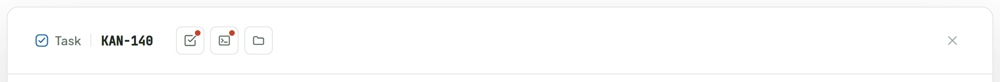
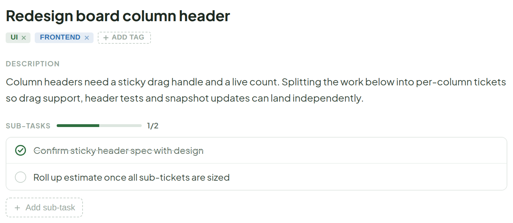
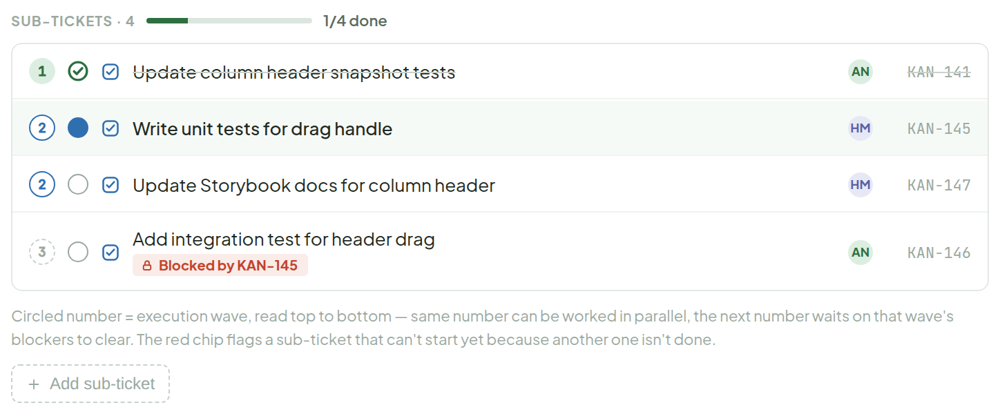
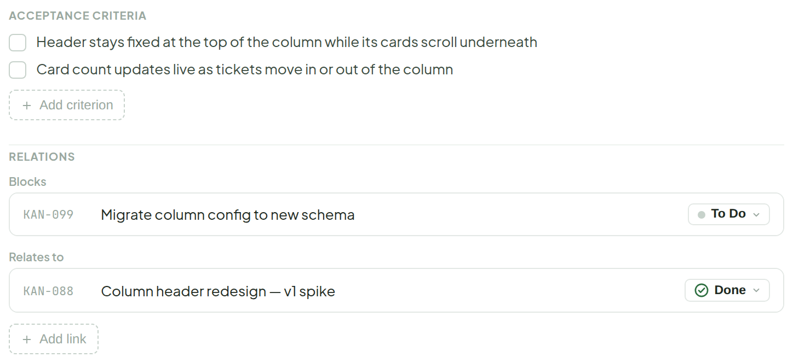
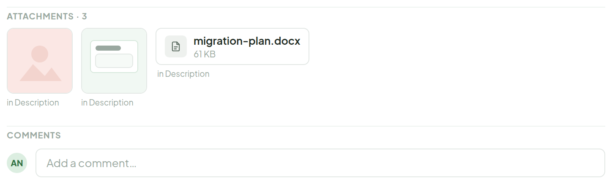
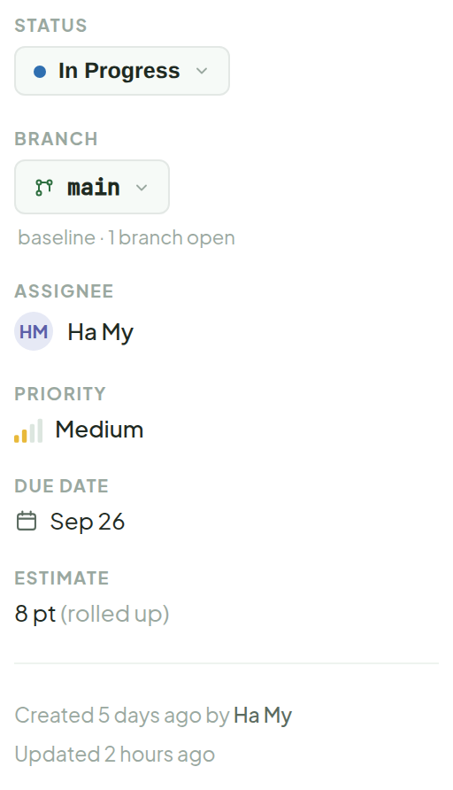
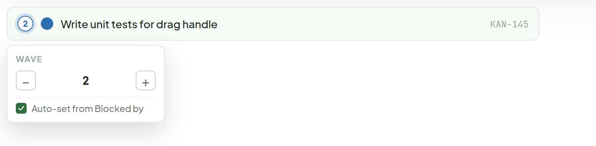
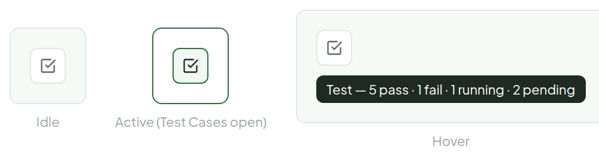

# Ticket Detail — with Sub-tickets

> Component — same panel, parent ticket · source: [`TicketDetailParent.dc.html`](../source/TicketDetailParent.dc.html) · canvas `1789831198-eb58` · sha256 `8adf1e756bd5c8e341b1df96c557cd52c5da78a8e18ed51b4cf1d316081d9ec5`

Each sub-ticket keeps its own live status mark, and the header rolls those up into a "done" count — only tickets actually in Done count toward it, In Progress doesn't move the bar.

Same panel as [ticket-detail.md](ticket-detail.md), here for a parent ticket (KAN-140) that has a Sub-tickets section.

---

## 1. Header bar

Source: [TicketDetailParent.dc.html](../source/TicketDetailParent.dc.html) › `<!-- Header -->` (L63–95)

- Hover tooltips: `Test — 5 pass · 1 fail · 1 running · 2 pending`, `Debug — 5 entries · 1 blocked`, `Workspace — 9 files · 31 MB`.

## 2. Main column — title, description, sub-tasks

Source: [TicketDetailParent.dc.html](../source/TicketDetailParent.dc.html) › `<!-- Main column -->` (L99–149)

## 3. Sub-tickets

Source: [TicketDetailParent.dc.html](../source/TicketDetailParent.dc.html) › `SUB-TICKETS · 4` section (L150–208)

- Header: `SUB-TICKETS · 4`, progress bar, "1/4 done" (only tickets in Done count).
- Each row: circled wave number, live status mark, type icon, title, assignee avatar, id. Rows are ordered by wave, top to bottom.
- Caption under the list: "Circled number = execution wave, read top to bottom — same number can be worked in parallel, the next number waits on that wave's blockers to clear. The red chip flags a sub-ticket that can't start yet because another one isn't done."
- Followed by the dashed "+ Add sub-ticket" button (see [add-subticket.md](add-subticket.md)).

## 4. Main column — acceptance criteria, relations

Source: [TicketDetailParent.dc.html](../source/TicketDetailParent.dc.html) › `ACCEPTANCE CRITERIA` / `RELATIONS` (L209–275)

## 5. Main column — attachments, comments

Source: [TicketDetailParent.dc.html](../source/TicketDetailParent.dc.html) › `ATTACHMENTS · 3` / `COMMENTS` (L276–315)

## 6. Sidebar

Source: [TicketDetailParent.dc.html](../source/TicketDetailParent.dc.html) › `<!-- Sidebar -->` (L316–383)

- Estimate reads "8 pt (rolled up)" — rolled up from the sub-tickets.

## 7. Clicking a wave badge — reassign the wave

Source: [TicketDetailParent.dc.html](../source/TicketDetailParent.dc.html) › `<!-- Clicking a wave badge -->` (L384–415)

- The badge shows a soft green ring on hover; the − / + stepper buttons highlight on hover.
- Popover contents: label WAVE, stepper `−  2  +`, checkbox "Auto-set from Blocked by".

By default the wave is computed from the Blocked by / Blocks links (same data as the Relations section). "Auto-set" stays checked normally; unchecking it lets someone pin a sub-ticket to an earlier or later wave than its links imply — e.g. to flag it as safe to start early despite a soft dependency.

**Note:**

- Changing a sub-ticket's wave also re-sorts its position in the list (rows are always ordered by wave, top to bottom).
- The algorithm that auto-computes wave + position from the Blocked by / Blocks graph — including how it breaks ties within the same wave — is left to dev to design and implement; this screen only specifies the resulting UI and the manual-override affordance.

## 8. Header button — final: icon only, hover for the breakdown (real hover works live in this canvas)

Source: [TicketDetailParent.dc.html](../source/TicketDetailParent.dc.html) › `<!-- Header button: chosen design -->` (L416–449)

- States: **Idle**, **Active (Test Cases open)**, **Hover** (dark tooltip: `Test — 5 pass · 1 fail · 1 running · 2 pending`).

Clicking it swaps the whole panel body for the test list (rolled up across sub-tickets, filterable) — see the dedicated Test Cases board for that full state.
