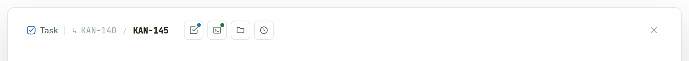
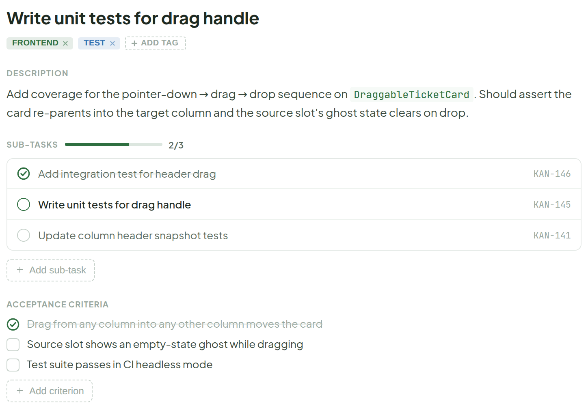
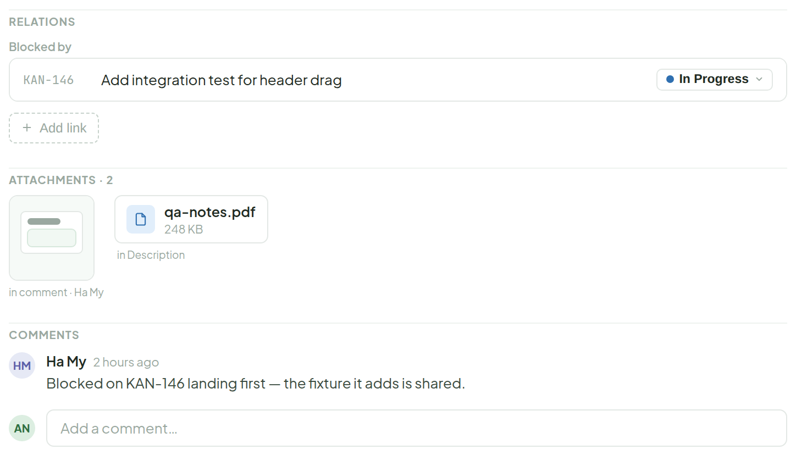
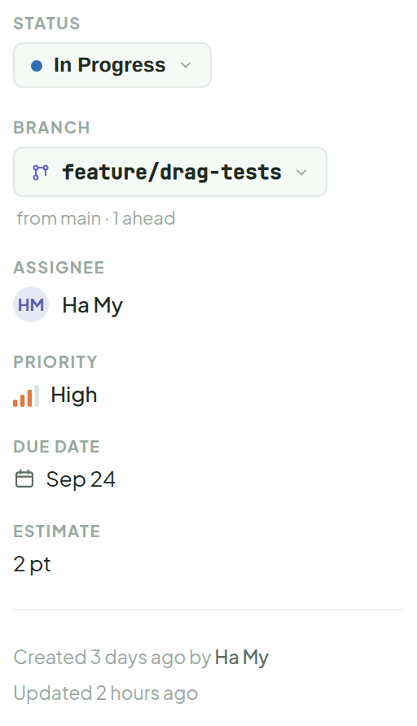

# Ticket Detail

> Component · source: [`TicketDetail.dc.html`](../source/TicketDetail.dc.html) · canvas `1791005836-9c57` · sha256 `b5c85d28007021ded54b71b651812b54fd6c1ae9a48e8821790c79aad1dce328`

Opens over the board on click. Same visual language as the card — same icon, priority marks, tag pills and sub-task chip — just given room to breathe.

The panel is a header bar over a two-column body (main column + sidebar). It is shown below in four pieces.

---

## 1. Header bar

Source: [TicketDetail.dc.html](../source/TicketDetail.dc.html) › `<!-- Header -->` (L58–95)

- Left to right: ticket type (Task), parent link (KAN-140), current ticket id (**KAN-145**), then four icon-only view buttons (Test, Debug, Workspace, Activity), and a close button on the right.
- Each icon button shows a tooltip on hover (real hover works live in the canvas):
  - Test — `Test — 1 pass · 1 running · 2 pending`
  - Debug — `Debug — 2 entries`
  - Workspace — `Workspace — 6 files · 12.4 MB`
  - Activity — `Activity — 9 changes` (see [activity.md](activity.md); no status dot)
- The Test button carries a status dot (blue here; red when anything is failing, gray/green otherwise).

## 2. Main column — title, description, sub-tasks, acceptance criteria

Source: [TicketDetail.dc.html](../source/TicketDetail.dc.html) › `<!-- Main column -->` (L99–246)

- Tag pills are removable: the "×" on a pill is dimmed at rest and goes to full opacity on hover; "+ ADD TAG" is a dashed button.
- Sub-tasks show a progress bar and an `x/y` count; rows have a completion circle, title and ticket id. "+ Add sub-task" is a dashed button.
- Acceptance criteria have a checkbox per row and a dashed "+ Add criterion" button (see [add-ac.md](add-ac.md)).

## 3. Main column — relations, attachments, comments

Source: [TicketDetail.dc.html](../source/TicketDetail.dc.html) › `<!-- Main column -->` (L179–246)

- Relations: grouped by type; each row shows the target's live status; the remove "×" is hidden until the row is hovered (turns red on hover). See [relations.md](relations.md).
- Attachments: consolidated section after Comments, see [attachments.md](attachments.md).

## 4. Sidebar

Source: [TicketDetail.dc.html](../source/TicketDetail.dc.html) › `<!-- Sidebar -->` (L247–312)

- Fields in order: STATUS (dropdown), BRANCH (dropdown, with "from main · 1 ahead" subline), ASSIGNEE, PRIORITY, DUE DATE, ESTIMATE, then a divider and "Created 3 days ago by Ha My" / "Updated 2 hours ago".

---

## Note

Replaces the old "Test Cases" section that used to live inside Details — more views (e.g. Activity, Work Log) can land as more icon buttons here later. Icon only, with a red dot when anything's failing (gray/green otherwise) — hover for the pass/fail/pending breakdown. No "Details" button needed to switch back — clicking the ticket id itself returns to Details, same as it already does everywhere else in the app. Clicking it swaps the whole panel body for the test list — see the dedicated Test Cases board for that full state.
