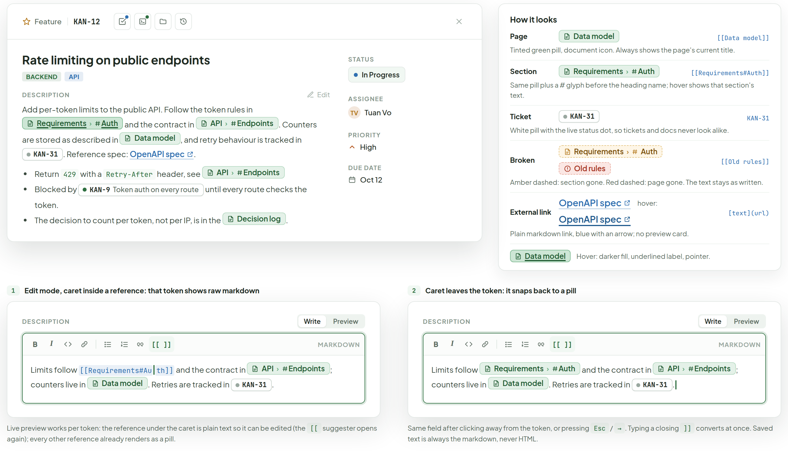
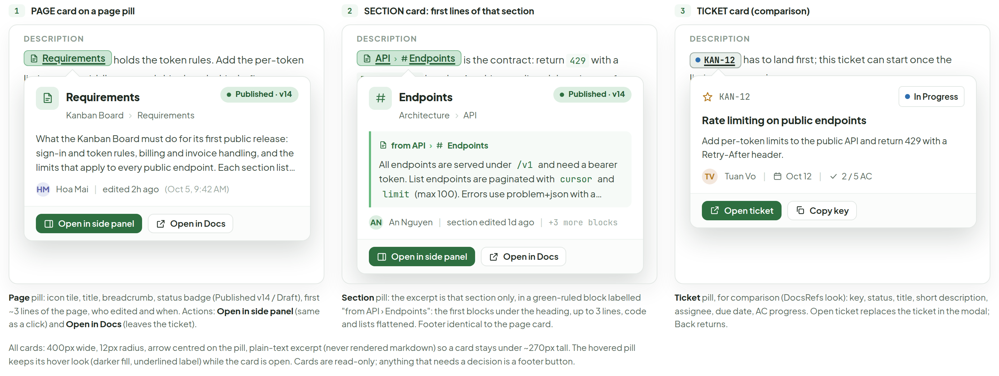
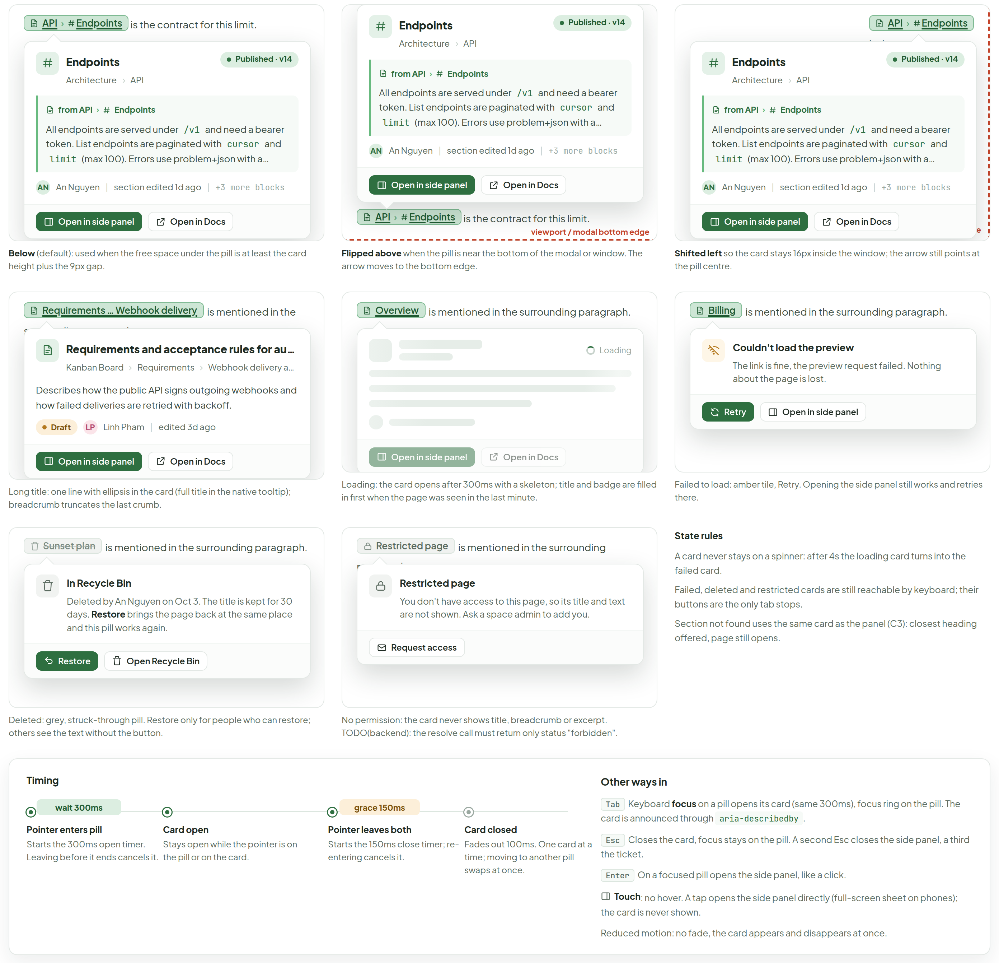
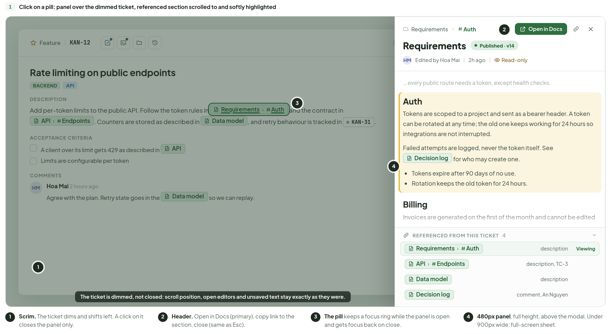
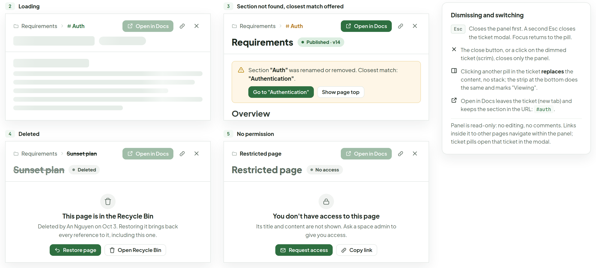
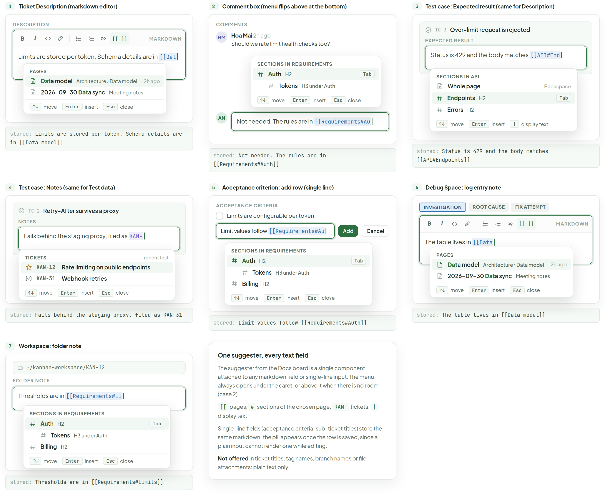
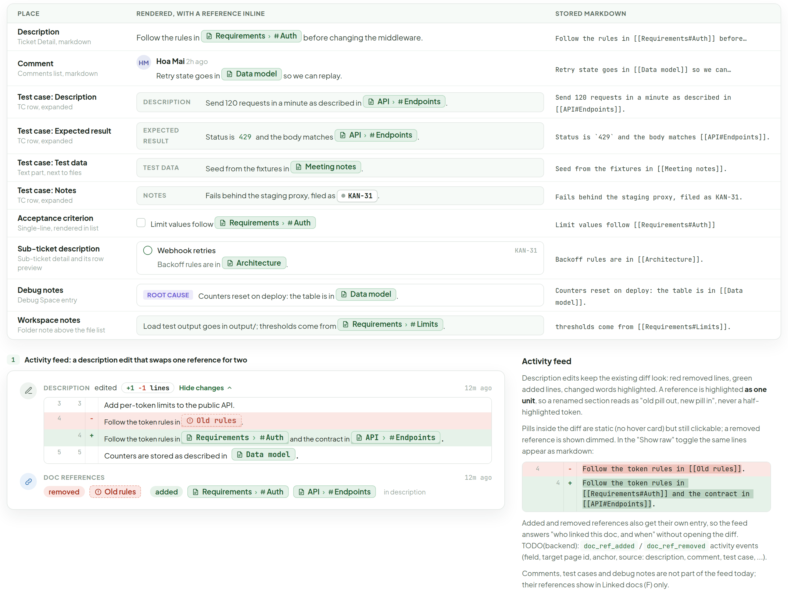
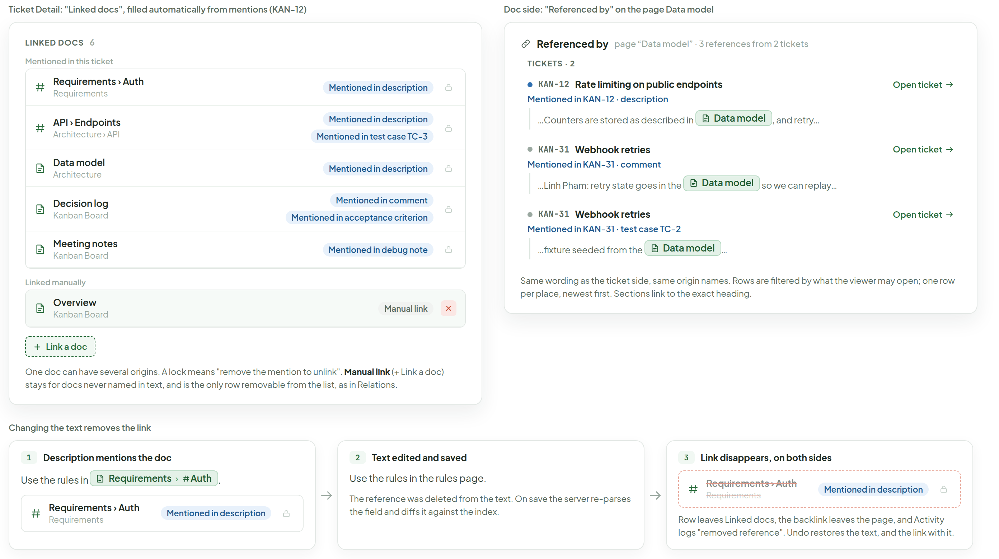

# Doc references in tickets

> Component — v1 · source: [`TicketDocRefs.dc.html`](../source/TicketDocRefs.dc.html) · canvas `1791260008-2981` · sha256 `8d071abfc35e326e3cf478cdb26080beb013fbe42a63b8ce14e85210c0f4026e`

Docs and sections referenced from inside ticket text, like Jira smart links: an inline pill, a hover card with an excerpt, a right-hand side panel over the ticket modal, the `[[` suggester in every field, and the automatic ticket-doc linkage. Desktop and web only.

---

## A. Ticket Detail › Description: view mode, hover state and the edit-mode round trip

Source: [TicketDocRefs.dc.html](../source/TicketDocRefs.dc.html) › first block "A. Ticket Detail › Description…" (Ticket Detail card with a "How it looks" legend on the right; two edit-mode cards below)



- Ticket Detail header: "Feature", "KAN-12". Title "Rate limiting on public endpoints"; tags "BACKEND", "API".
- "Description" with "Edit". Text: "Add per-token limits to the public API. Follow the token rules in" page pill "Requirements" › "Auth" "and the contract in" page pill "API" › "Endpoints" ". Counters are stored as described in" page pill "Data model" ", and retry behaviour is tracked in" ticket pill "KAN-31" ". Reference spec:" link "OpenAPI spec" ".".
- Bullets: "Return" "429" "with a" "Retry-After" "header, see" page pill "API" › "Endpoints"; "Blocked by" ticket pill "KAN-9" "Token auth on every route" "until every route checks the token."; "The decision to count per token, not per IP, is in the" page pill "Decision log" ".".
- Right column: "Status" "In Progress"; "Assignee" "TV" "Tuan Vo"; "Priority" "High"; "Due date" "Oct 12".

### How it looks

| Kind | Rendered | Stored | Note |
|---|---|---|---|
| Page | page pill "Data model" | `[[Data model]]` | Tinted green pill, document icon. Always shows the page's current title. |
| Section | page pill "Requirements" › "Auth" | `[[Requirements#Auth]]` | Same pill plus a # glyph before the heading name; hover shows that section's text. |
| Ticket | ticket pill "KAN-31" | `KAN-31` | White pill with the live status dot, so tickets and docs never look alike. |
| Broken | amber dashed pill "Requirements" › "Auth"; red dashed pill "Old rules" | `[[Old rules]]` | Amber dashed: section gone. Red dashed: page gone. The text stays as written. |
| External link | link "OpenAPI spec"; "hover:" link "OpenAPI spec" | `[text](url)` | Plain markdown link, blue with an arrow; no preview card. |

- Below the table: page pill "Data model" "Hover: darker fill, underlined label, pointer."

### 1. Edit mode, caret inside a reference: that token shows raw markdown

- "Description" with tabs "Write", "Preview"; toolbar "B", "I", "[[ ]]", "MARKDOWN".
- Text: "Limits follow" `[[Requirements#Au|th]]` (caret in the token) "and the contract in" page pill "API" › "Endpoints" "; counters live in" page pill "Data model" ". Retries are tracked in" ticket pill "KAN-31" ".".
- Caption: "Live preview works per token: the reference under the caret is plain text so it can be edited (the" `[[` "suggester opens again); every other reference already renders as a pill."

### 2. Caret leaves the token: it snaps back to a pill

- Same field and toolbar ("Description", "Write", "Preview", "B", "I", "[[ ]]", "MARKDOWN"). Text: "Limits follow" page pill "Requirements" › "Auth" "and the contract in" page pill "API" › "Endpoints" "; counters live in" page pill "Data model" ". Retries are tracked in" ticket pill "KAN-31" ".".
- Caption: "Same field after clicking away from the token, or pressing" `Esc` "/" `→` ". Typing a closing" `]]` "converts at once. Saved text is always the markdown, never HTML."

## B. Hover card: page, section and ticket, positioning, states and timing

Source: [TicketDocRefs.dc.html](../source/TicketDocRefs.dc.html) › second block "B. Hover card…" (row of three cards with a shared caption; positioning, state and timing cards below). Split into two images.

### 1. PAGE card on a page pill / 2. SECTION card / 3. TICKET card (comparison)



- "1" "PAGE card on a page pill": "DESCRIPTION"; page pill "Requirements" "holds the token rules. Add the per-token limits to the middleware and ship them behind a flag; counters follow later." Card: title "Requirements"; breadcrumb "Kanban Board" › "Requirements"; badge "Published · v14"; excerpt "What the Kanban Board must do for its first public release: sign-in and token rules, billing and invoice handling, and the limits that apply to every public endpoint. Each section lists the rules we test against and the tickets that deliver them."; meta "HM" "Hoa Mai" "|" "edited 2h ago" "(Oct 5, 9:42 AM)"; buttons "Open in side panel", "Open in Docs".
  - Caption: "Page" "pill: icon tile, title, breadcrumb, status badge (Published v14 / Draft), first ~3 lines of the page, who edited and when. Actions:" "Open in side panel" "(same as a click) and" "Open in Docs" "(leaves the ticket)."
- "2" "SECTION card: first lines of that section": "DESCRIPTION"; page pill "API" › "Endpoints" "is the contract: return" `429` "with a" `Retry-After` "header. Anything not listed there is out of scope." Card: title "Endpoints"; breadcrumb "Architecture" › "API"; badge "Published · v14"; green-ruled block "from API" › "Endpoints": "All endpoints are served under" `/v1` "and need a bearer token. List endpoints are paginated with" `cursor` "and" `limit` "(max 100). Errors use problem+json with a stable" `code` "field, so clients can branch without parsing messages."; meta "AN" "An Nguyen" "|" "section edited 1d ago" "|" "+3 more blocks"; buttons "Open in side panel", "Open in Docs".
  - Caption: "Section" "pill: the excerpt is that section only, in a green-ruled block labelled "from API › Endpoints": the first blocks under the heading, up to 3 lines, code and lists flattened. Footer identical to the page card."
- "3" "TICKET card (comparison)": "DESCRIPTION"; ticket pill "KAN-12" "has to land first; this ticket can start once the limiter is merged." Card: "KAN-12", status "In Progress"; title "Rate limiting on public endpoints"; "Add per-token limits to the public API and return 429 with a Retry-After header."; meta "TV" "Tuan Vo" "|" "Oct 12" "|" "2 / 5 AC"; buttons "Open ticket", "Copy key".
  - Caption: "Ticket" "pill, for comparison (DocsRefs look): key, status, title, short description, assignee, due date, AC progress. Open ticket replaces the ticket in the modal; Back returns."
- Shared caption: "All cards: 400px wide, 12px radius, arrow centred on the pill, plain-text excerpt (never rendered markdown) so a card stays under ~270px tall. The hovered pill keeps its hover look (darker fill, underlined label) while the card is open. Cards are read-only; anything that needs a decision is a footer button."

### Positioning, states and timing



- Below (default): page pill "API" › "Endpoints" "is the contract for this limit."; card with "Endpoints", "Architecture" › "API", "Published · v14", "from API" › "Endpoints", the same excerpt, "An Nguyen", "section edited 1d ago", "+3 more blocks", "Open in side panel", "Open in Docs". Caption: "Below" "(default): used when the free space under the pill is at least the card height plus the 9px gap."
- Flipped above: the same card sits above the pill "API" › "Endpoints" "is the contract for this limit."; dashed line label "viewport / modal bottom edge". Caption: "Flipped above" "when the pill is near the bottom of the modal or window. The arrow moves to the bottom edge."
- Shifted left: pill "API" › "Endpoints" "is the contract." at the right; label "window right edge". Caption: "Shifted left" "so the card stays 16px inside the window; the arrow still points at the pill centre."
- Long title: pill "Requirements … Webhook delivery" "is mentioned in the surrounding paragraph."; card title "Requirements and acceptance rules for authentication, billing and the public rate limit programme"; breadcrumb "Kanban Board" › "Requirements" › "Webhook delivery and retry guarantees"; "Describes how the public API signs outgoing webhooks and how failed deliveries are retried with backoff."; "Draft" "LP" "Linh Pham" "|" "edited 3d ago"; "Open in side panel", "Open in Docs". Caption: "Long title: one line with ellipsis in the card (full title in the native tooltip); breadcrumb truncates the last crumb."
- Loading: pill "Overview" "is mentioned in the surrounding paragraph."; skeleton card with "Loading"; buttons "Open in side panel", "Open in Docs". Caption: "Loading: the card opens after 300ms with a skeleton; title and badge are filled in first when the page was seen in the last minute."
- Failed to load: pill "Billing" "is mentioned in the surrounding paragraph."; card "Couldn't load the preview" "The link is fine, the preview request failed. Nothing about the page is lost."; buttons "Retry", "Open in side panel". Caption: "Failed to load: amber tile, Retry. Opening the side panel still works and retries there."
- Deleted: struck-through pill "Sunset plan" "is mentioned in the surrounding paragraph."; card "In Recycle Bin" "Deleted by An Nguyen on Oct 3. The title is kept for 30 days." "Restore" "brings the page back at the same place and this pill works again."; buttons "Restore", "Open Recycle Bin". Caption: "Deleted: grey, struck-through pill. Restore only for people who can restore; others see the text without the button."
- No permission: pill "Restricted page" "is mentioned in the surrounding paragraph."; card "Restricted page" "You don't have access to this page, so its title and text are not shown. Ask a space admin to add you."; button "Request access". Caption: "No permission: the card never shows title, breadcrumb or excerpt. TODO(backend): the resolve call must return only status "forbidden"."
- "State rules": "A card never stays on a spinner: after 4s the loading card turns into the failed card."; "Failed, deleted and restricted cards are still reachable by keyboard; their buttons are the only tab stops."; "Section not found uses the same card as the panel (C3): closest heading offered, page still opens."
- "Timing": "wait 300ms", "grace 150ms"; steps "Pointer enters pill" "Starts the 300ms open timer. Leaving before it ends cancels it."; "Card open" "Stays open while the pointer is on the pill or on the card."; "Pointer leaves both" "Starts the 150ms close timer; re-entering cancels it."; "Card closed" "Fades out 100ms. One card at a time; moving to another pill swaps at once."
- "Other ways in": "Tab" "Keyboard" "focus" "on a pill opens its card (same 300ms), focus ring on the pill. The card is announced through" `aria-describedby` "."; "Esc" "Closes the card, focus stays on the pill. A second Esc closes the side panel, a third the ticket."; "Enter" "On a focused pill opens the side panel, like a click."; "Touch" ": no hover. A tap opens the side panel directly (full-screen sheet on phones); the card is never shown."; "Reduced motion: no fade, the card appears and disappears at once."

## C. Click opens a 480px side panel over the ticket modal

Source: [TicketDocRefs.dc.html](../source/TicketDocRefs.dc.html) › third block "C. Click opens a 480px side panel…" (main panel with four numbered call-outs; then states 2–5 and a "Dismissing and switching" card). Split into two images.

### 1. Click on a pill: panel over the dimmed ticket, referenced section scrolled to and softly highlighted



- Dimmed ticket: "Feature", "KAN-12", "Rate limiting on public endpoints", "BACKEND", "API"; "Description": "Add per-token limits to the public API. Follow the token rules in" page pill "Requirements" › "Auth" (focus ring) "and the contract in" page pill "API" › "Endpoints" ". Counters are stored as described in" page pill "Data model" ", and retry behaviour is tracked in" ticket pill "KAN-31" "."; "Acceptance criteria": "A client over its limit gets 429 as described in" page pill "API"; "Limits are configurable per token"; "Comments": "HM" "Hoa Mai" "2 hours ago" "Agree with the plan. Retry state goes in the" page pill "Data model" "so we can replay."
- Pill on the panel scrim: "The ticket is dimmed, not closed: scroll position, open editors and unsaved text stay exactly as they were."
- Panel header: breadcrumb "Requirements" › "Auth"; "Open in Docs"; copy link; close. Title "Requirements" "Published · v14"; "HM" "Edited by Hoa Mai" "|" "2h ago" "|" "Read-only".
- Panel body: "… every public route needs a token, except health checks."; highlighted section "Auth": "Tokens are scoped to a project and sent as a bearer header. A token can be rotated at any time; the old one keeps working for 24 hours so integrations are not interrupted."; "Failed attempts are logged, never the token itself. See" page pill "Decision log" "for who may create one."; bullets "Tokens expire after 90 days of no use.", "Rotation keeps the old token for 24 hours."; "Billing": "Invoices are generated on the first of the month and cannot be edited once sent."
- Strip "Referenced from this ticket" "4": "Requirements" › "Auth" "description" "Viewing"; "API" › "Endpoints" "description, TC-3"; "Data model" "description"; "Decision log" "comment, An Nguyen".
- Call-outs: "1" "Scrim." "The ticket dims and shifts left. A click on it closes the panel only."; "2" "Header." "Open in Docs (primary), copy link to the section, close (same as Esc)."; "3" "The pill" "keeps a focus ring while the panel is open and gets focus back on close."; "4" "480px panel" ", full height, above the modal. Under 900px wide: full-screen sheet."

### 2. Loading / 3. Section not found, closest match offered / 4. Deleted / 5. No permission



- "2" "Loading": header "Requirements" › "Auth", "Open in Docs" (disabled); skeleton title and body.
- "3" "Section not found, closest match offered": header "Requirements" › "Auth", "Open in Docs"; title "Requirements" "Published · v14"; amber note "Section" "Auth" "was renamed or removed. Closest match:" "Authentication" "."; buttons "Go to "Authentication"", "Show page top"; start of page: "Overview" "What the Kanban Board must do for its first public release: sign-in and token rules, billing and invoice handling, and the limits that apply to every public endpoint."
- "4" "Deleted": header "Requirements" › "Sunset plan", "Open in Docs" (disabled); title "Sunset plan" (struck) "Deleted"; "This page is in the Recycle Bin" "Deleted by An Nguyen on Oct 3. Restoring it brings back every reference to it, including this one."; buttons "Restore page", "Open Recycle Bin".
- "5" "No permission": header "Restricted page", "Open in Docs" (disabled); title "Restricted page" "No access"; "You don't have access to this page" "Its title and content are not shown. Ask a space admin to give you access."; buttons "Request access", "Copy link".
- "Dismissing and switching": "Esc" "Closes the panel first. A second Esc closes the ticket modal. Focus returns to the pill."; "The close button, or a click on the dimmed ticket (scrim), closes only the panel."; "Clicking another pill in the ticket" "replaces" "the content, no stack; the strip at the bottom does the same and marks "Viewing"."; "Open in Docs leaves the ticket (new tab) and keeps the section in the URL:" `#auth` "."; "Panel is read-only: no editing, no comments. Links inside it to other pages navigate within the panel; ticket pills open that ticket in the modal."

## D. "[[" suggester in every text field, with the stored markdown

Source: [TicketDocRefs.dc.html](../source/TicketDocRefs.dc.html) › fourth block "D. "[[" suggester in every text field…" (seven cases in a grid; the explanation card sits next to case 7)



- "1" "Ticket Description (markdown editor)": "Description"; toolbar "B", "I", "[[ ]]", "MARKDOWN"; "Limits are stored per token. Schema details are in" `[[Dat` with caret. Menu "Pages": "Data model" "Architecture › Data model" "2h ago" (highlighted); "2026-09-30 Data sync" "Meeting notes"; footer "↑↓" "move", "Enter" "insert", "Esc" "close". "stored:" `Limits are stored per token. Schema details are in [[Data model]]`.
- "2" "Comment box (menu flips above at the bottom)": "Comments"; "HM" "Hoa Mai" "2h ago" "Should we rate limit health checks too?"; "AN" "Not needed. The rules are in" `[[Requirements#Au` with caret. Menu "Sections in Requirements": "Auth" "H2" "Tab" (highlighted); "Tokens" "H3 under Auth"; footer "↑↓" "move", "Enter" "insert", "Esc" "close". "stored:" `Not needed. The rules are in [[Requirements#Auth]]`.
- "3" "Test case: Expected result (same for Description)": "TC-3" "Over-limit request is rejected"; "Expected result"; "Status is 429 and the body matches" `[[API#End` with caret. Menu "Sections in API": "Whole page" "Backspace"; "Endpoints" "H2" "Tab" (highlighted); "Errors" "H2"; footer "↑↓" "move", "Enter" "insert", "\|" "display text". "stored:" `Status is 429 and the body matches [[API#Endpoints]]`.
- "4" "Test case: Notes (same for Test data)": "TC-2" "Retry-After survives a proxy"; "Notes"; "Fails behind the staging proxy, filed as" `KAN-` with caret. Menu "Tickets" "recent first": "KAN-12" "Rate limiting on public endpoints" (highlighted); "KAN-31" "Webhook retries"; footer "↑↓" "move", "Enter" "insert", "Esc" "close". "stored:" `Fails behind the staging proxy, filed as KAN-31`.
- "5" "Acceptance criterion: add row (single line)": "Acceptance criteria"; "Limits are configurable per token"; row "Limit values follow" `[[Requirements#Au` with caret, buttons "Add", "Cancel". Menu "Sections in Requirements": "Auth" "H2" "Tab" (highlighted); "Tokens" "H3 under Auth"; "Billing" "H2"; footer "↑↓" "move", "Enter" "insert", "Esc" "close". "stored:" `Limit values follow [[Requirements#Auth]]`.
- "6" "Debug Space: log entry note": tabs "INVESTIGATION", "ROOT CAUSE", "FIX ATTEMPT"; toolbar "B", "I", "[[ ]]", "MARKDOWN"; "The table lives in" `[[Data` with caret. Menu "Pages": "Data model" "Architecture › Data model" "2h ago"; "2026-09-30 Data sync" "Meeting notes"; footer "↑↓" "move", "Enter" "insert", "Esc" "close". "stored:" `The table lives in [[Data model]]`.
- "7" "Workspace: folder note": path `~/kanban-workspace/KAN-12`; "Folder note"; "Thresholds are in" `[[Requirements#Li` with caret. Menu "Sections in Requirements": "Auth" "H2" "Tab" (highlighted); "Tokens" "H3 under Auth"; "Billing" "H2"; footer "↑↓" "move", "Enter" "insert", "Esc" "close". "stored:" `Thresholds are in [[Requirements#Limits]]`.
- "One suggester, every text field": "The suggester from the Docs board is a single component attached to any markdown field or single-line input. The menu always opens under the caret, or above it when there is no room (case 2)." `[[` "pages," `#` "sections of the chosen page," `KAN-` "tickets," `|` "display text." "Single-line fields (acceptance criteria, sub-ticket titles) store the same markdown; the pill appears once the row is saved, since a plain input cannot render one while editing." "Not offered" "in ticket titles, tag names, branch names or file attachments: plain text only."

## E. Where references appear, and how the Activity feed shows them

Source: [TicketDocRefs.dc.html](../source/TicketDocRefs.dc.html) › fifth block "E. Where references appear…" (places table; Activity feed card with a notes column)



| PLACE | RENDERED, WITH A REFERENCE INLINE | STORED MARKDOWN |
|---|---|---|
| Description — "Ticket Detail, markdown" | "Follow the rules in" page pill "Requirements" › "Auth" "before changing the middleware." | `Follow the rules in [[Requirements#Auth]] before…` |
| Comment — "Comments list, markdown" | "HM" "Hoa Mai" "2h ago" "Retry state goes in" page pill "Data model" "so we can replay." | `Retry state goes in [[Data model]] so we can…` |
| Test case: Description — "TC row, expanded" | "DESCRIPTION" "Send 120 requests in a minute as described in" page pill "API" › "Endpoints" "." | `Send 120 requests in a minute as described in [[API#Endpoints]].` |
| Test case: Expected result — "TC row, expanded" | "EXPECTED RESULT" "Status is" `429` "and the body matches" page pill "API" › "Endpoints" "." | ``Status is `429` and the body matches [[API#Endpoints]].`` |
| Test case: Test data — "Text part, next to files" | "TEST DATA" "Seed from the fixtures in" page pill "Meeting notes" "." | `Seed from the fixtures in [[Meeting notes]].` |
| Test case: Notes — "TC row, expanded" | "NOTES" "Fails behind the staging proxy, filed as" ticket pill "KAN-31" "." | `Fails behind the staging proxy, filed as KAN-31.` |
| Acceptance criterion — "Single-line, rendered in list" | "Limit values follow" page pill "Requirements" › "Auth" | `Limit values follow [[Requirements#Auth]]` |
| Sub-ticket description — "Sub-ticket detail and its row preview" | "Webhook retries" "KAN-31" "Backoff rules are in" page pill "Architecture" "." | `Backoff rules are in [[Architecture]].` |
| Debug notes — "Debug Space entry" | "ROOT CAUSE" "Counters reset on deploy: the table is in" page pill "Data model" "." | `Counters reset on deploy: the table is in [[Data model]].` |
| Workspace notes — "Folder note above the file list" | "Load test output goes in output/; thresholds come from" page pill "Requirements" › "Limits" "." | `thresholds come from [[Requirements#Limits]].` |

### 1. Activity feed: a description edit that swaps one reference for two

- Entry "DESCRIPTION" "edited" "+1" "−1" "lines" "Hide changes" "12m ago". Diff: line "3" "3" "Add per-token limits to the public API."; line "4" "−" "Follow the token rules in" red dashed pill "Old rules" "."; line "4" "+" "Follow the token rules in" page pill "Requirements" › "Auth" "and the contract in" page pill "API" › "Endpoints" "."; line "5" "5" "Counters are stored as described in" page pill "Data model" ".".
- Entry "DOC REFERENCES" "12m ago": "removed" red dashed pill "Old rules"; "added" page pills "Requirements" › "Auth", "API" › "Endpoints"; "in description".
- "Activity feed": "Description edits keep the existing diff look: red removed lines, green added lines, changed words highlighted. A reference is highlighted" "as one unit" ", so a renamed section reads as "old pill out, new pill in", never a half-highlighted token."
- "Pills inside the diff are static (no hover card) but still clickable; a removed reference is shown dimmed. In the "Show raw" toggle the same lines appear as markdown:"

```diff
4 - Follow the token rules in [[Old rules]].
4 + Follow the token rules in [[Requirements#Auth]] and the contract in [[API#Endpoints]].
```

- "Added and removed references also get their own entry, so the feed answers "who linked this doc, and when" without opening the diff. TODO(backend):" `doc_ref_added` "/" `doc_ref_removed` "activity events (field, target page id, anchor, source: description, comment, test case, ...)."
- "Comments, test cases and debug notes are not part of the feed today; their references show in Linked docs (F) only."

## F. Ticket and doc linkage

Source: [TicketDocRefs.dc.html](../source/TicketDocRefs.dc.html) › sixth block "F. Ticket and doc linkage" (ticket-side card and doc-side card; a three-step strip "Changing the text removes the link")



### Ticket Detail: "Linked docs", filled automatically from mentions (KAN-12)

- "Linked docs" "6". "Mentioned in this ticket":
  - "Requirements › Auth" "Requirements" "Mentioned in description" (lock)
  - "API › Endpoints" "Architecture › API" "Mentioned in description" "Mentioned in test case TC-3" (lock)
  - "Data model" "Architecture" "Mentioned in description" (lock)
  - "Decision log" "Kanban Board" "Mentioned in comment" "Mentioned in acceptance criterion" (lock)
  - "Meeting notes" "Kanban Board" "Mentioned in debug note" (lock)
- "Linked manually": "Overview" "Kanban Board" "Manual link" with red remove button.
- Dashed button "Link a doc" (with +).
- "One doc can have several origins. A lock means "remove the mention to unlink"." "Manual link" "(+ Link a doc) stays for docs never named in text, and is the only row removable from the list, as in Relations."

### Doc side: "Referenced by" on the page Data model

- "Referenced by" "page “Data model” · 3 references from 2 tickets". "Tickets · 2":
  - "KAN-12" "Rate limiting on public endpoints" "Open ticket"; "Mentioned in KAN-12 · description"; "…Counters are stored as described in" page pill "Data model" ", and retry…"
  - "KAN-31" "Webhook retries" "Open ticket"; "Mentioned in KAN-31 · comment"; "…Linh Pham: retry state goes in the" page pill "Data model" "so we can replay…"
  - "KAN-31" "Webhook retries" "Open ticket"; "Mentioned in KAN-31 · test case TC-2"; "…fixture seeded from the" page pill "Data model" "…"
- "Same wording as the ticket side, same origin names. Rows are filtered by what the viewer may open; one row per place, newest first. Sections link to the exact heading."

### Changing the text removes the link

- "1" "Description mentions the doc": "Use the rules in" page pill "Requirements" › "Auth" "."; row "Requirements › Auth" "Requirements" "Mentioned in description".
- "2" "Text edited and saved": "Use the rules in the rules page." "The reference was deleted from the text. On save the server re-parses the field and diffs it against the index."
- "3" "Link disappears, on both sides": dashed struck-through row "Requirements › Auth" "Requirements" "Mentioned in description"; "Row leaves Linked docs, the backlink leaves the page, and Activity logs "removed reference". Undo restores the text, and the link with it."

## Note

- "Detection:" "on save of any text field the server parses" `[[Page]]`, `[[Page#Section]]` "and" `KAN-12` "(code spans and fenced blocks ignored) and diffs the result against the previous set for that field. The browser only renders pills; it never writes the link index."
- "Resolution by stable id:" "the markdown stores the readable title, but each reference is resolved to a page id (and heading anchor) on save and on render, so a renamed page keeps working and the pill shows the current title."
- "Excerpts:" "plain text, first ~220 characters of the page; for a section, the first block(s) under that heading up to 220 characters. Markdown, code and tables are flattened, the heading is not repeated. The card clamps to 3 lines; the side panel shows the real rendered content."
- "Permissions:" "the preview endpoint checks the viewer. Without access it returns only a status, never title, breadcrumb or excerpt; the pill reads "Restricted page". Link index rows are filtered per viewer."
- "Caching:" "previews cached per page id and revision for 60 seconds, one batch call per rendered field (not one per pill); prefetch starts at the 300ms mark so the card usually opens filled."
- "Accessibility:" "a pill is a link (" `role="link"` "; Enter opens the panel); the card is" `role="dialog"` "and tied to the pill by" `aria-describedby` ". Focus opens it, Esc closes it and leaves focus on the pill. The panel is a complementary region; Esc closes it and returns focus to the pill. Broken pills change icon and border, not only colour. Touch has no hover: a tap opens the panel."
- "TODO(backend):" `resolve and preview endpoint` "(batch): per reference status (ok, section_missing, in_bin, forbidden, not_found), page id, title, breadcrumb, page status and version, updated by and at, excerpt (page or section), closest section suggestion."
- "TODO(backend):" `link index` "(source type and id: description, comment, test case field, acceptance criterion, sub-ticket description, debug note, workspace note; target page id and anchor), maintained on save; powers Linked docs, "Referenced by" and the "Mentioned in KAN-12 · description" wording."
- "TODO(backend):" `activity events` `doc_ref_added` "and" `doc_ref_removed` "; rewrite of stored titles in tickets on page rename (same job as DocsRefs F1). Also assumed and not in today's data model: a workspace folder note and a text part of test data."
- "Invented for this design: ticket pill colours, the 300ms / 150ms timings, the 480px panel and its "Referenced from this ticket" strip, "Restricted page" and "Request access", the origin wording, the Doc references activity entry, the "Show raw" diff toggle. Not covered: the Comments list (own board follows) and the mobile sheet layout."
