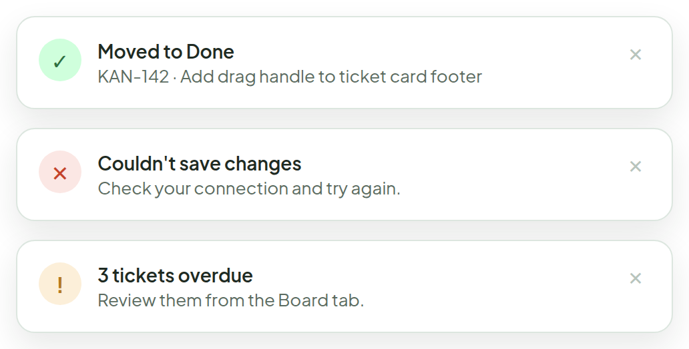
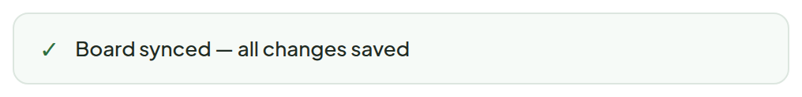

# Notification Toast

> Component — — · source: [`Toast.dc.html`](../source/Toast.dc.html) · canvas `1789831198-eb58` · sha256 `6cf76f03f800ad0c7fd644bf0fbde447b52a04b067ce50893cc61a20c47090cb`

Success, error and warning variants — bottom-right stack.

---

## 1. Toast variants — success, error, warning

Source: [Toast.dc.html](../source/Toast.dc.html) › `<!-- Success -->` / `<!-- Error -->` / `<!-- Warning -->` (L27–58)

- Success: "Moved to Done" — KAN-142 · Add drag handle to ticket card footer
- Error: "Couldn't save changes" — Check your connection and try again.
- Warning: "3 tickets overdue" — Review them from the Board tab.
- Each toast has a colored icon badge (check / cross / exclamation), a title, a one-line detail and a dismiss (x) button.
- Placement: bottom-right stack of the viewport.

## 2. Inline banner (in-page, not floating)

Source: [Toast.dc.html](../source/Toast.dc.html) › `<!-- Inline banner variant -->` (L59–67)

