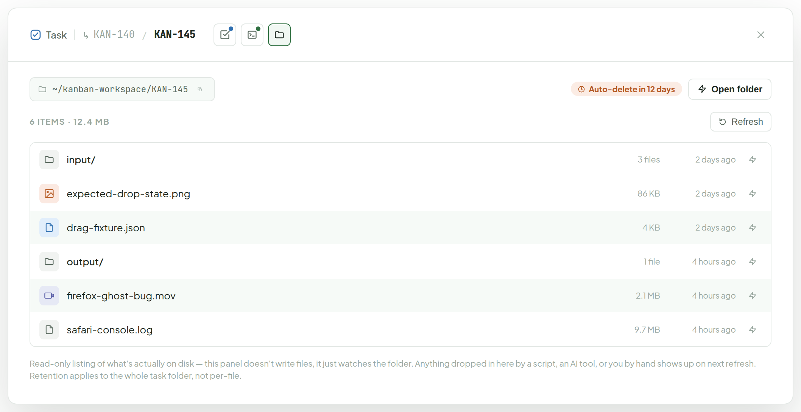
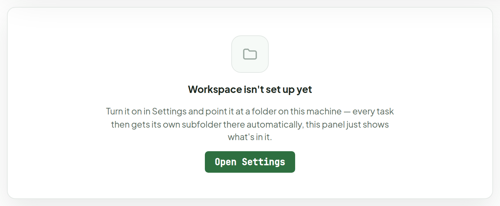
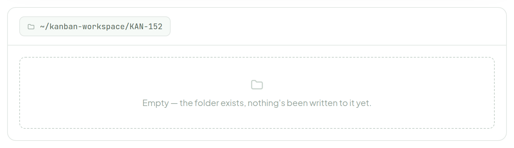
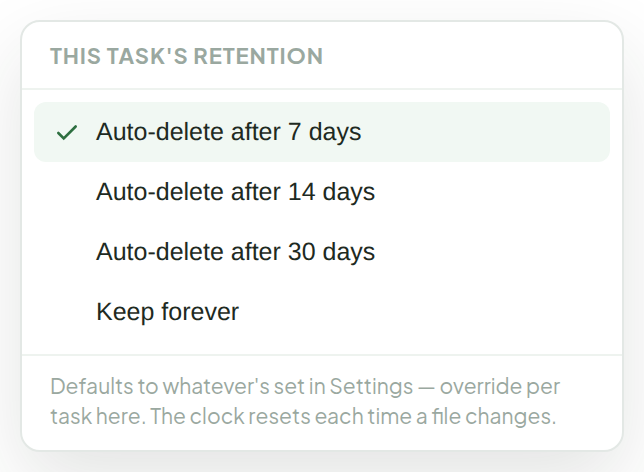
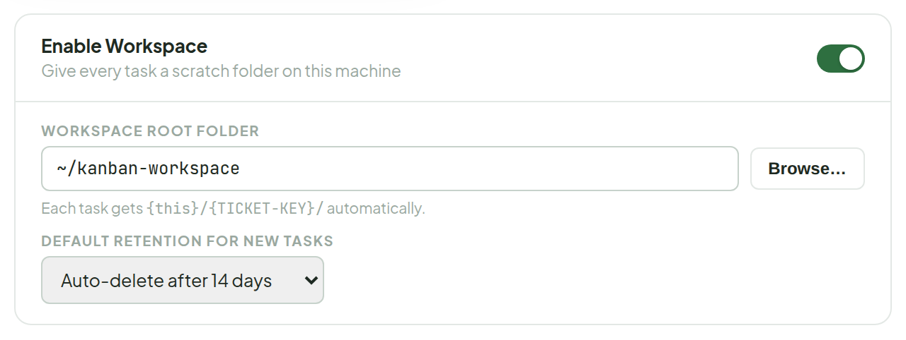

# Workspace

> Component — v1 · source: [`Workspace.dc.html`](../source/Workspace.dc.html) · canvas `1789831198-eb58` · sha256 `8b50b8f1e38e331a234bc127d52945eef6a5204f2b6b447999623cba1b59c351`

A per-task scratch folder on disk — where AI tools and manual work can dump input files, intermediate output, logs, whatever, without littering the repo. No upload, no API: it's a plain filesystem path, `{workspaceRoot}/{TICKET-KEY}/`, auto-created the first time a task needs one. This panel just lists what's in it and lets you set how long it sticks around. Opened from its own icon-only button in Ticket Detail's header, next to Debug Space.

---

## 1. Workspace enabled, task has files (KAN-145)

Source: [Workspace.dc.html](../source/Workspace.dc.html) › `<!-- Enabled, with files -->` (L43–195)

- Header icon buttons show a hover tooltip: Test — "1 pass · 1 running · 2 pending", Debug — "2 entries", Workspace — "6 files · 12.4 MB".
- Footer text: "Read-only listing of what's actually on disk — this panel doesn't write files, it just watches the folder. Anything dropped in here by a script, an AI tool, or you by hand shows up on next refresh. Retention applies to the whole task folder, not per-file."

## 2. Workspace not enabled — global setting off, or no root path configured

Source: [Workspace.dc.html](../source/Workspace.dc.html) › `<!-- Not enabled -->` (L196–208)

- Text under the heading: "Turn it on in Settings and point it at a folder on this machine — every task then gets its own subfolder there automatically, this panel just shows what's in it."

## 3. Workspace enabled, nothing written yet (fresh task)

Source: [Workspace.dc.html](../source/Workspace.dc.html) › `<!-- Enabled, empty task folder -->` (L209–225)

## 4. Clicking the retention chip

Source: [Workspace.dc.html](../source/Workspace.dc.html) › `<!-- Retention control -->` (L226–252)

- Popover text: "Defaults to whatever's set in Settings — override per task here. The clock resets each time a file changes."

## 5. Settings — Workspace section (preview only, full Settings screen designed separately)

Source: [Workspace.dc.html](../source/Workspace.dc.html) › `<!-- Settings preview -->` (L253–286)

---

## Note

1. Brand-new feature, no existing type to diff against. Proposed model — two pieces, both local, no API:
   1. Global `WorkspaceSettings` (app-wide, set once in Settings): `enabled`, `rootPath`, `defaultRetentionDays` (null = forever).
   2. Per-task, nothing stored beyond a convention: the folder at `{rootPath}/{ticketKey}/`, created on first use; an optional per-task `retentionOverrideDays` if it needs to differ from the default.
2. This panel reads the folder directly (list files, sizes, mtimes) — no DB row per file, the filesystem is the source of truth.
3. A background sweep on the desktop app deletes task folders past their retention window (skips anything with an override of "forever").
4. If a ticket is deleted, its folder is left as-is until its own retention expires, rather than deleted immediately — in case work is still needed from it.
5. Open question: what should count as "the file changed" for resetting the auto-delete clock — any write inside the folder, or only new files, not edits to existing ones?
