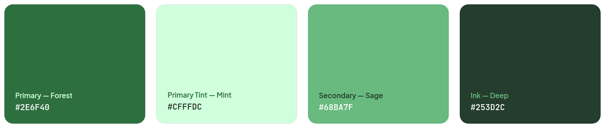
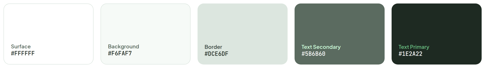
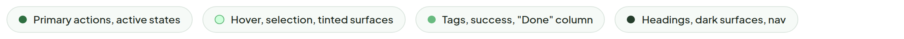
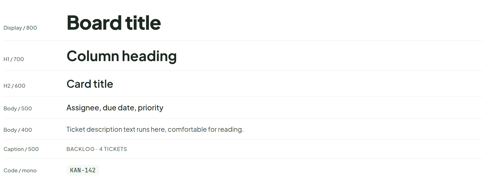
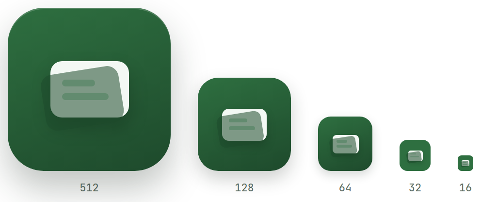
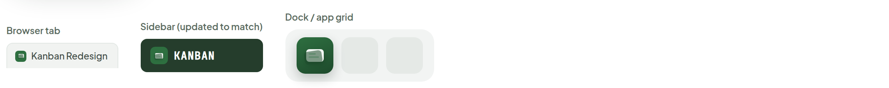

# Theme & Typography

> Foundations — design system · source: [`Main.dc.html`](../source/Main.dc.html) · canvas `1789831198-eb58` · sha256 `7884fbe8b88b596a8e04c29d13c515c8f1e31b6813d592f7b4524c18264dc927`

Unified color palette and type scale for the app. Greens carry brand and status meaning; neutrals stay quiet so content leads.

---

## 1. Brand colors

Source: [Main.dc.html](../source/Main.dc.html) › `<!-- Brand colors -->` (L26–53)

| Token | Name | Hex | Usage |
|---|---|---|---|
| Primary | Forest | `#2E6F40` | Primary actions, active states |
| Primary Tint | Mint | `#CFFFDC` | Hover, selection, tinted surfaces |
| Secondary | Sage | `#68BA7F` | Tags, success, "Done" column |
| Ink | Deep | `#253D2C` | Headings, dark surfaces, nav |

## 2. Neutrals

Source: [Main.dc.html](../source/Main.dc.html) › `<!-- Neutrals -->` (L54–86)

| Name | Hex |
|---|---|
| Surface | `#FFFFFF` |
| Background | `#F6FAF7` |
| Border | `#DCE6DF` |
| Text Secondary | `#5B6B60` |
| Text Primary | `#1E2A22` |

## 3. Usage mapping (caption row under the brand swatches)

Source: [Main.dc.html](../source/Main.dc.html) › `<!-- Usage mapping -->` (L87–106)

- Forest — Primary actions, active states
- Mint — Hover, selection, tinted surfaces
- Sage — Tags, success, "Done" column
- Deep — Headings, dark surfaces, nav

## 4. Typography

UI — Plus Jakarta Sans  ·  Code / data — JetBrains Mono

Source: [Main.dc.html](../source/Main.dc.html) › `<!-- Typography -->` (L107–153)

| Style | Sample | Size | Weight | Notes |
|---|---|---|---|---|
| Display / 800 | Board title | 44px | 800 | letter-spacing -0.02em, `#1E2A22` |
| H1 / 700 | Column heading | 32px | 700 | `#1E2A22` |
| H2 / 600 | Card title | 24px | 600 | `#1E2A22` |
| Body / 500 | Assignee, due date, priority | 17px | 500 | `#1E2A22` |
| Body / 400 | Ticket description text runs here, comfortable for reading. | 15px | 400 | `#3F4B45` |
| Caption / 500 | BACKLOG · 4 TICKETS | 12px | 500 | uppercase, letter-spacing 0.06em, `#5B6B60` |
| Code / mono | KAN-142 | 14px | 400 | JetBrains Mono, `#253D2C` on `#F6FAF7`, 3px 8px padding, radius 6px |

## 5. App icon — Card stack, final

Source: [Main.dc.html](../source/Main.dc.html) › `<!-- App Icon -->` (L154–219)

## 6. App icon in context

Source: [Main.dc.html](../source/Main.dc.html) › `<!-- Browser tab context -->` / `<!-- Sidebar chip context -->` / `<!-- Dock/app-grid context -->` (L220–266)

- Contexts shown: Browser tab (Kanban Redesign), Sidebar (updated to match) (KANBAN), Dock / app grid.

**Note:**

- Final mark — two-card stack (back card at 55% opacity, rotated -9° behind the front card), forest-to-deep-green gradient, replaces `ui/public/logo.svg` (the old 3-column neon glyph that Main Board's redesign already retired) as the favicon.
- Bug fixed here: at 22–32px, an axis-aligned back card barely offset from the front one reads as a thin border/frame around a single box, not a stack — the rotation is what actually separates the two shapes at a glance, so the -9° tilt is kept all the way down to 22px instead of being dropped in favor of a flat single rect.
- Content lines now hold at every size down to 16px too (they were dropped below 64px before — sub-pixel line heights, ~1.3px at 32px and ~0.8px at 16px, still render fine since browsers subpixel-antialias, so "not enough room" wasn't actually a hard limit).
- Only the 14px browser-tab favicon keeps a plain card front — a 7x5px card genuinely has no room left once the tilted back layer and card padding are accounted for.
- The tilted back layer itself holds at every size shown, including 14px — dropping it anywhere smaller was the same mistake repeated at a smaller scale each time, so every instance gets the same -9° two-layer treatment rather than picking a cutoff to flatten below.
- The sidebar logo chip is updated to the same mark so the app's icon and its in-app logo stay identical.
