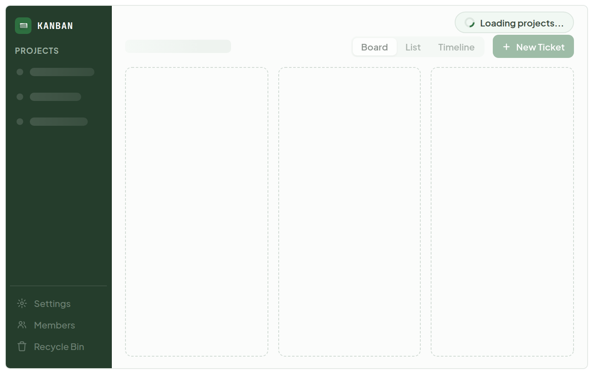
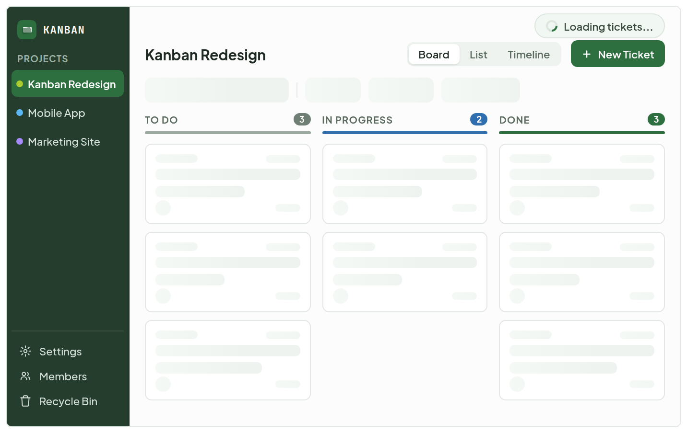
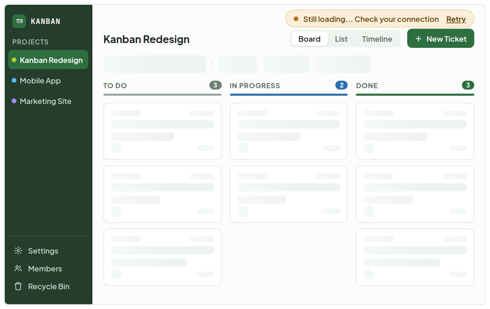
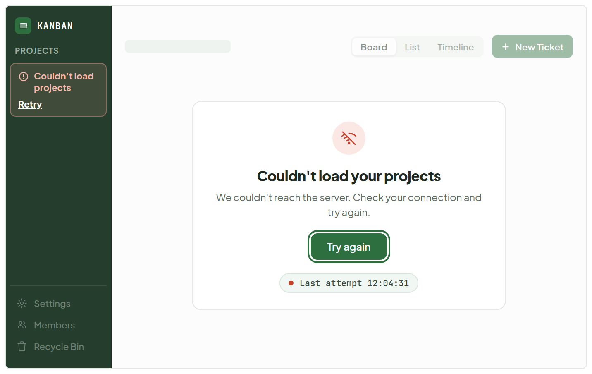
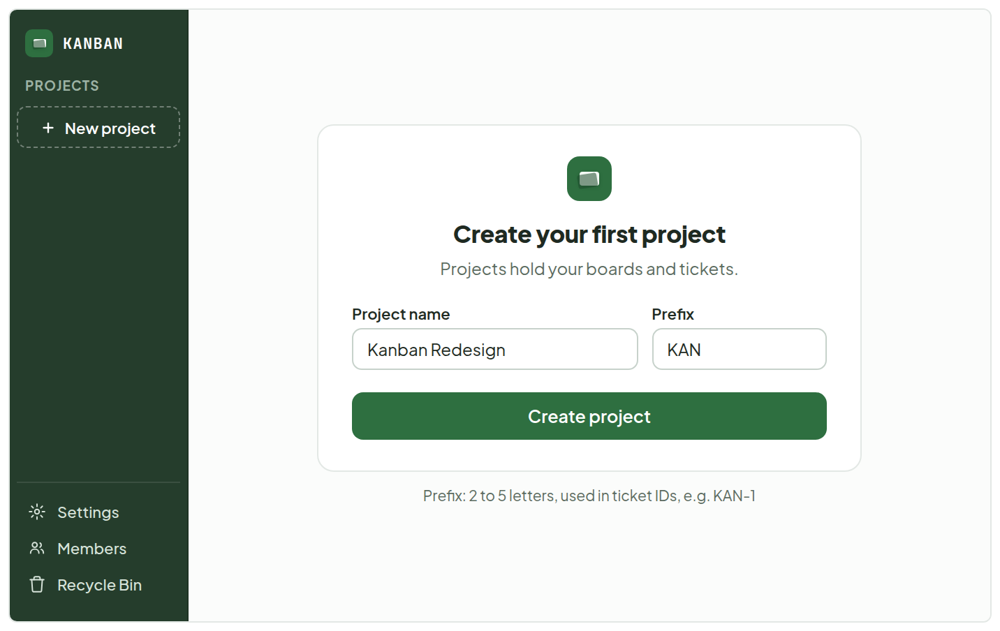
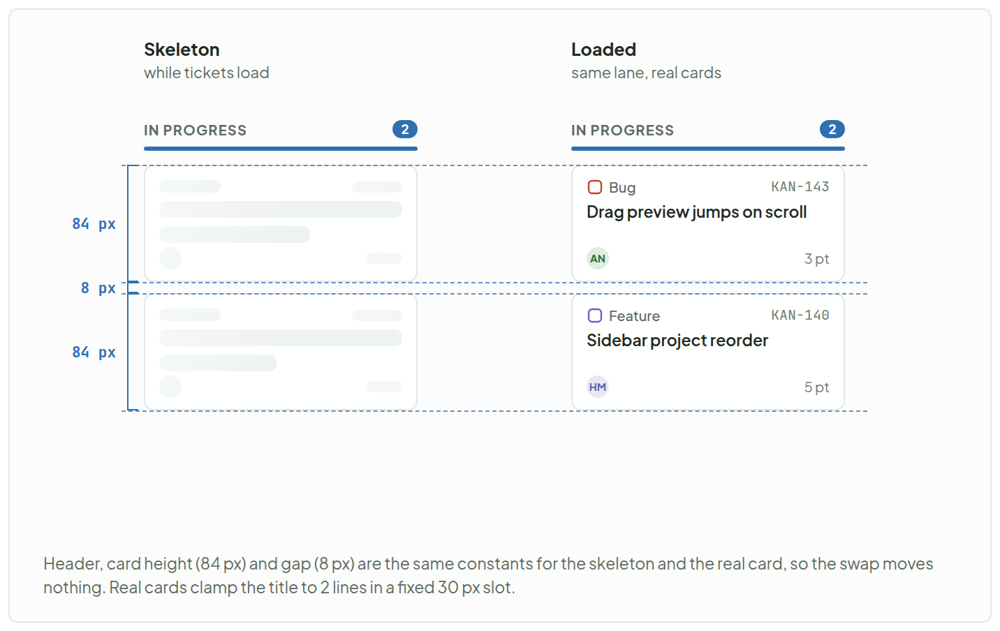
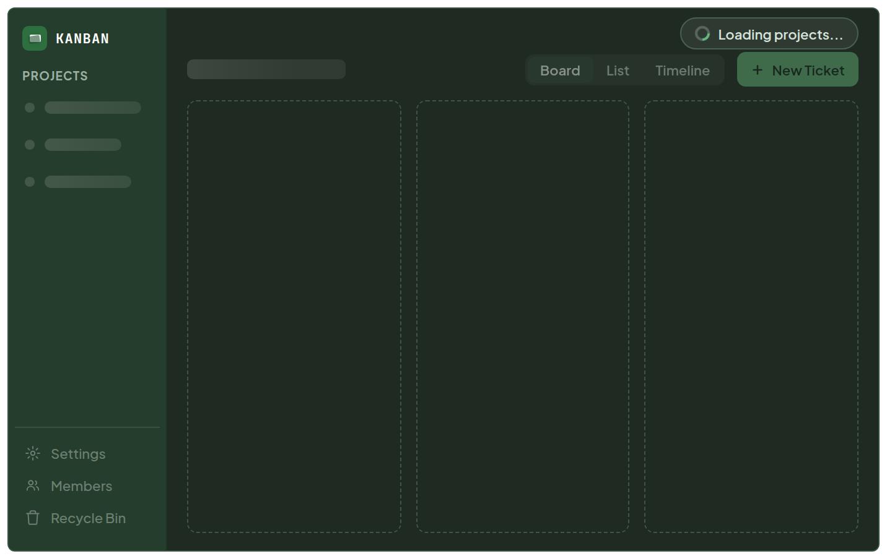
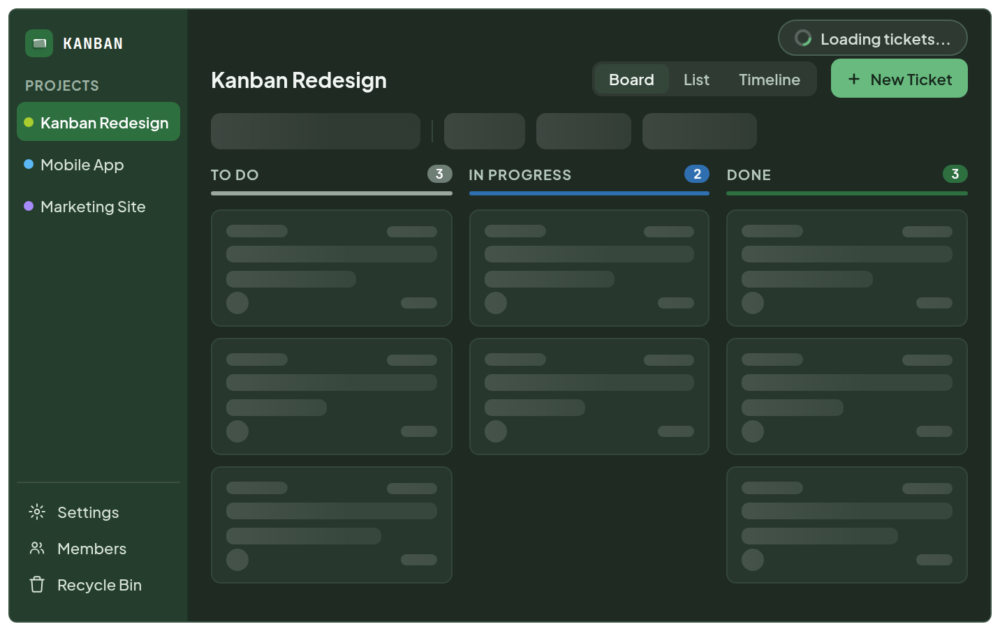

# App loading

> Screen — v1 · source: [`AppLoading.dc.html`](../source/AppLoading.dc.html) · canvas `1791083427-1a86` · sha256 `b233f3fd6e06e513aa04e14015d7af2169a5a0c347a87e0a9d0bb0e687539132`

What the owner sees after the splash while projects and then tickets load: a real shell with skeletons instead of bare centred text, a small status pill at the top right, and the slow, failed and first-run branches. Frames are plain 704 x 440 rectangles (a 1280 x 800 viewport at 0.55), no browser chrome.

---

Section — **Light**: Phase 1 and 2, the slow state, the two failure and empty branches.

## 1. 1. Phase 1: projects loading - skeleton rows, static items dimmed, pill after 300 ms

Source: [AppLoading.dc.html](../source/AppLoading.dc.html) › `
` 704×440 frame — phase 1 (L53)

- Frame texts: "KANBAN", "PROJECTS", "Settings", "Members", "Recycle Bin", "Loading projects...", "Board", "List", "Timeline", "New Ticket".
- Static sidebar items (Settings, Members, Recycle Bin) are dimmed; project rows are skeleton bars; the status pill "Loading projects..." (spinner) sits top right; lanes are faint dashed outlines.

## 2. 2. Phase 2: tickets loading - real sidebar, top bar and lane headers

Source: [AppLoading.dc.html](../source/AppLoading.dc.html) › `
` 704×440 frame — phase 2 (L53)

- Frame texts: "KANBAN", "PROJECTS", "Kanban Redesign", "Mobile App", "Marketing Site", "Settings", "Members", "Recycle Bin", "Loading tickets...", "Kanban Redesign", "Board", "List", "Timeline", "New Ticket", "TO DO", "3", "IN PROGRESS", "2", "DONE", "3".
- Real sidebar with "Kanban Redesign" selected, real title, switcher and "New Ticket"; the lane headers carry the counts 3, 2, 3 over skeleton cards; the pill reads "Loading tickets...".

## 3. 3. Slow (over 3 s) - amber dot, Retry link

Source: [AppLoading.dc.html](../source/AppLoading.dc.html) › `
` 704×440 frame — slow state (L53)

- Frame texts: "KANBAN", "PROJECTS", "Kanban Redesign", "Mobile App", "Marketing Site", "Settings", "Members", "Recycle Bin", "Still loading... Check your connection", "Retry", "Kanban Redesign", "Board", "List", "Timeline", "New Ticket", "TO DO", "3", "IN PROGRESS", "2", "DONE", "3".
- The pill shows an amber dot, "Still loading... Check your connection" and the "Retry" link.

## 4. 4. Projects failed to load - error at 15 s, no pill

Source: [AppLoading.dc.html](../source/AppLoading.dc.html) › `
` 704×440 frame — projects failed (L53)

- Frame texts: "KANBAN", "PROJECTS", "Couldn't load projects", "Retry", "Settings", "Members", "Recycle Bin", "Board", "List", "Timeline", "New Ticket", "Couldn't load your projects", "We couldn't reach the server. Check your connection and try again.", "Try again", "Last attempt 12:04:31".
- Sidebar shows the inline error row "Couldn't load projects" with "Retry"; the main area shows "Couldn't load your projects", the explanation, the "Try again" button and "Last attempt 12:04:31". No status pill.

## 5. 5. First run, no projects - follows phase 1 when the list is empty

Source: [AppLoading.dc.html](../source/AppLoading.dc.html) › `
` 704×440 frame — first run (L53)

- Frame texts: "KANBAN", "PROJECTS", "New project", "Settings", "Members", "Recycle Bin", "Create your first project", "Projects hold your boards and tickets.", "Project name", "Kanban Redesign", "Prefix", "KAN", "Create project", "Prefix: 2 to 5 letters, used in ticket IDs, e.g. KAN-1".
- Sidebar shows only a "New project" button; the main area is the "Create your first project" form (Project name `Kanban Redesign`, Prefix `KAN`).

## 6. No layout shift - skeleton vs final, lane In Progress

Source: [AppLoading.dc.html](../source/AppLoading.dc.html) › `
` 704×440 diagram — skeleton column beside the loaded column with 84 px / 8 px / 84 px measures (L53)

- Diagram texts: "IN PROGRESS" (count 2) twice; column labels "Skeleton" / "while tickets load" and "Loaded" / "same lane, real cards".
- Loaded cards: "Bug" `KAN-143` "Drag preview jumps on scroll" (AN, 3 pt) and "Feature" `KAN-140` "Sidebar project reorder" (HM, 5 pt).
- Measures: "84 px", "8 px", "84 px".
- Footer: "Header, card height (84 px) and gap (8 px) are the same constants for the skeleton and the real card, so the swap moves nothing. Real cards clamp the title to 2 lines in a fixed 30 px slot."

Section — **Dark**: Same two loading phases on the dark ground.

## 7. 6a. Dark: phase 1 - main #1E2A22, sidebar #253D2C

Source: [AppLoading.dc.html](../source/AppLoading.dc.html) › `
` 704×440 frame — dark phase 1 (L53)

- Frame texts: "KANBAN", "PROJECTS", "Settings", "Members", "Recycle Bin", "Loading projects...", "Board", "List", "Timeline", "New Ticket".
- Same layout as phase 1 on the dark ground.

## 8. 6b. Dark: phase 2 - skeleton tint white 8 to 15 percent

Source: [AppLoading.dc.html](../source/AppLoading.dc.html) › `
` 704×440 frame — dark phase 2 (L53)

- Frame texts: "KANBAN", "PROJECTS", "Kanban Redesign", "Mobile App", "Marketing Site", "Settings", "Members", "Recycle Bin", "Loading tickets...", "Kanban Redesign", "Board", "List", "Timeline", "New Ticket", "TO DO", "3", "IN PROGRESS", "2", "DONE", "3".
- Same layout as phase 2 on the dark ground.

## Note

- Sequence. Two phases after the splash hands off. The shell (sidebar frame, top bar frame, lane frame) paints immediately with skeletons, so there is never a blank screen. Phase 1 loads the project list; when it returns, the sidebar fills in, the top bar becomes real and phase 2 loads tickets for the current project; when tickets return, the skeletons are replaced by cards. An empty project list goes to First run instead of phase 2.
- Timing. Skeleton is shown at 0 ms. The status pill appears only after 300 ms, so fast loads never flash it. At 3 s the pill becomes the slow state (amber dot, "Still loading... Check your connection", Retry link). At 15 s the request is abandoned and the error state is shown. Phase timers restart for phase 2. If the data arrives while the pill is visible it fades out over 150 ms.
- Real vs placeholder. Phase 1: only static things are real (logo, Projects label, Settings / Members / Recycle Bin, dimmed and not clickable until a project exists); project rows, title, view switcher and New Ticket are placeholders or disabled; lanes are faint dashed outlines because the status columns are not known yet. Phase 2: sidebar, title, switcher, New Ticket and the lane headers with counts are real; only the filter bar and the cards are skeletons. Counts come with the lane response, so they show real numbers with skeleton cards.
- No layout shift. Skeleton and real elements share the same size constants: card 84 px high, 8 px gap, 30 px title slot, 28 px sidebar rows, 26 px filter controls. The status pill lives in a reserved 28 px row at the top right of the main area (it is not pushed in and does not move the top bar). See the comparison frame.
- Reduced motion. prefers-reduced-motion: reduce turns the shimmer into a flat tint and the spinner into a static ring (the text carries the meaning). The pill fade becomes instant.
- Accessibility. The status row is a role=status, aria-live=polite region (present from the start, content swapped in, so the announcement fires). The main region carries aria-busy=true while loading and false afterwards. Skeletons are aria-hidden. The error heading is role=alert and focus moves to Try again (focus ring shown). Disabled items use aria-disabled. Slow state is announced once; the Retry link is keyboard reachable. Text contrast is 4.5:1 or better on both grounds; the dimmed disabled sidebar items are exempt as inactive controls.
- Failure. A failed projects request shows the inline sidebar error row plus the main error panel (alert once, not twice: only the main heading is role=alert; the sidebar row is plain text with a Retry link). Try again and Retry both re-run the request and return to phase 1. No pill is shown in the error state. A failed ticket request (phase 2) reuses the slow/error treatment inside the lanes area; not drawn separately.
- First run. When the project list returns empty, the sidebar shows only a New project button and the main area shows Create your first project with Project name, Prefix (2 to 5 letters, used in ticket IDs) and Create project. On success the new project is selected and the empty board is shown directly; no further loading screen. Name and prefix values here are sample data.
- Dark. Main ground #1E2A22, cards #27372D, skeleton tint white 8 to 15 percent, sidebar stays #253D2C with a darker right edge for separation. Primary actions use Mint #68BA7F with dark text.
- Copy and data. The last attempt time 12:04:31, project names and ticket cards are sample data.
- TODO(backend): none new. This only relies on the existing list endpoints (projects, tickets) and on their failure and timeout behaviour; the 15 s abort is a client timeout.
