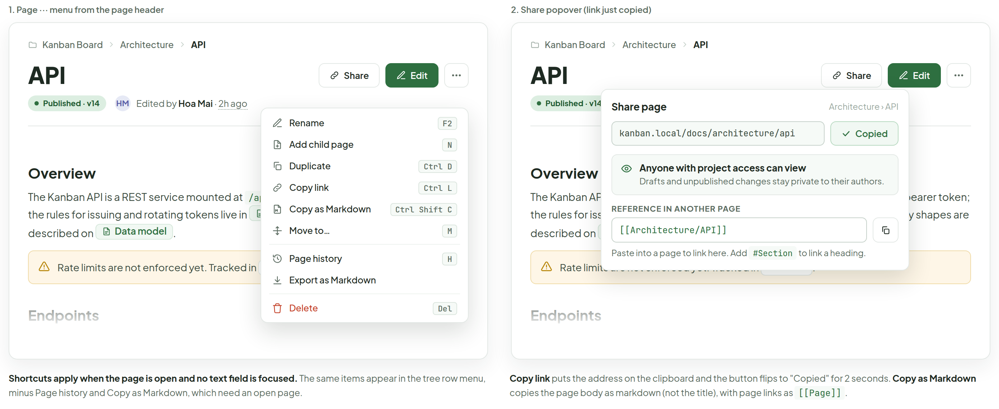
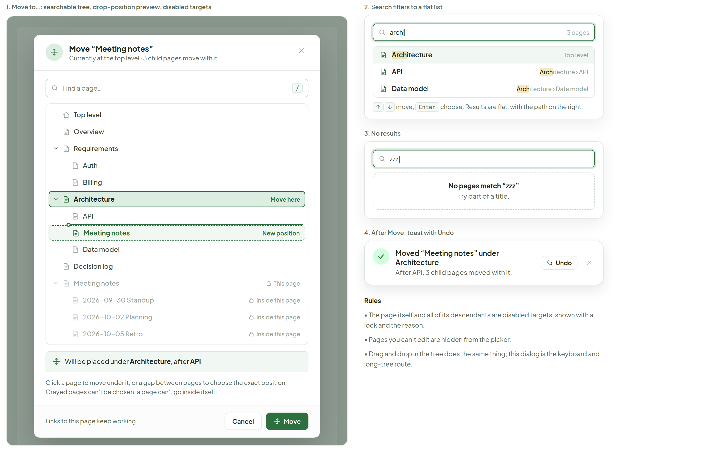
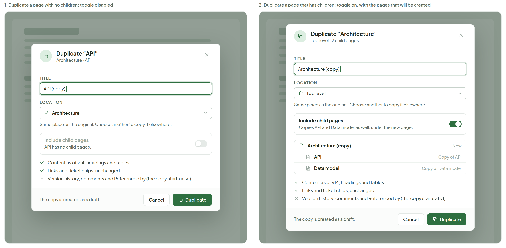
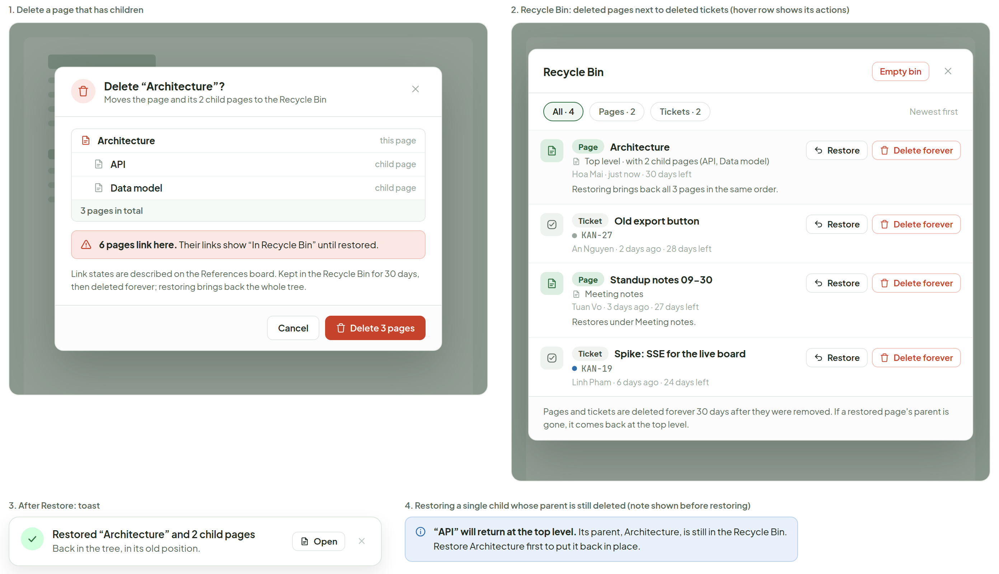
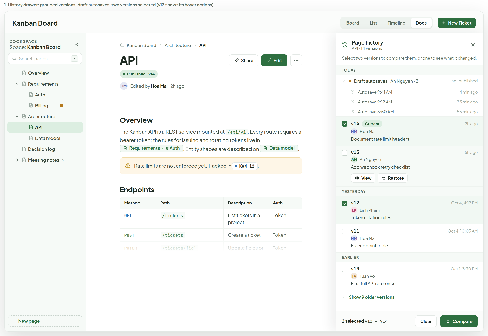
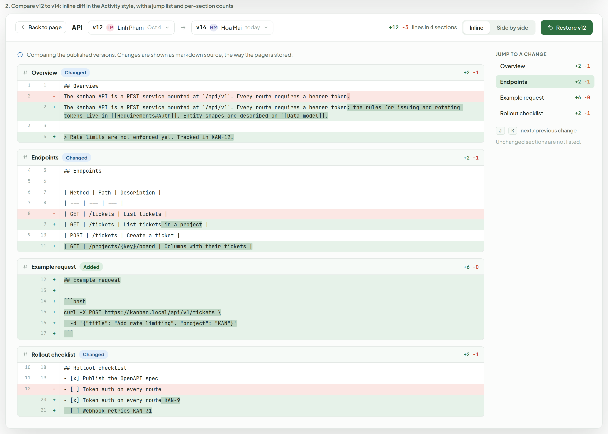
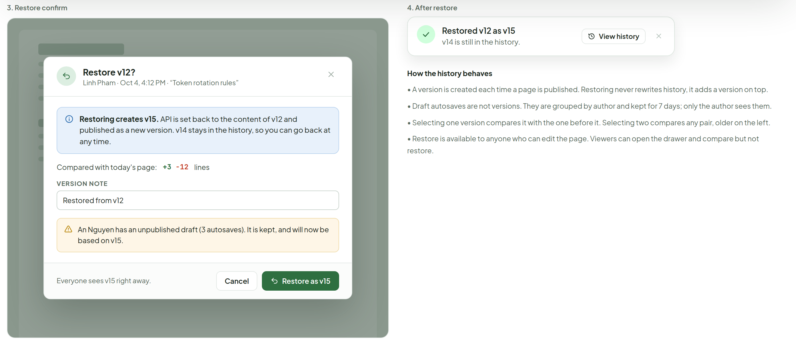
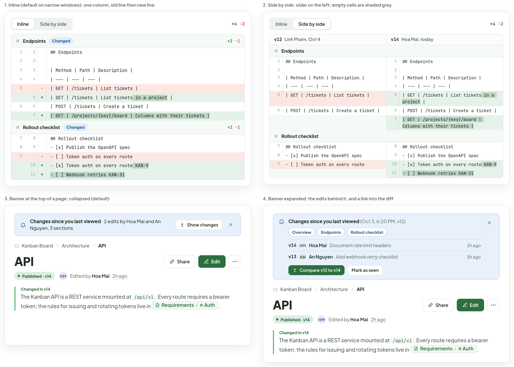
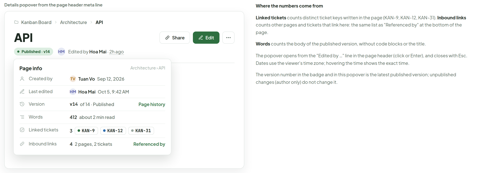

# Docs — page actions and history

> Screen — v1 · source: [`DocsActions.dc.html`](../source/DocsActions.dc.html) · canvas `1791209276-a0aa` · sha256 `e5f6258efa0be3fa9fb954af2f9faec02d31fcdd95e67056368c23473dfebce9`

Everything behind the page menu: the actions list and Share popover, Move to, Duplicate, Delete and the Recycle Bin, version history with diff and restore, the "since you last viewed" banner, and the page info popover. Same shell and visual language as the other Docs boards.

---

## A. Page menu and Share popover

Source: [DocsActions.dc.html](../source/DocsActions.dc.html) › first block "A. Page menu and Share popover" (two 668px-class page-header cards side by side, each with a caption strip below)



Both cards show the same page behind the overlay: breadcrumb "Kanban Board" › "Architecture" › "API"; title "API"; badge "Published · v14"; avatar "HM" "Edited by Hoa Mai · 2h ago"; buttons "Share", "Edit" and the ··· button. Body behind: heading "Overview"; "The Kanban API is a REST service mounted at `/api/v1`. Every route requires a bearer token; the rules for issuing and rotating tokens live in" page chip "Requirements › Auth" ". Entity shapes are described on" page chip "Data model" "."; warning callout "Rate limits are not enforced yet. Tracked in" ticket chip "KAN-12" "."; heading "Endpoints" with table:

| Method | Path | Description | Auth |
|---|---|---|---|
| GET | `/tickets` | List tickets in a project | Token |
| POST | `/tickets` | Create a ticket | Token |
| PATCH | `/tickets/{id}` | Update fields or move column | Token |
| GET | `/projects/{key}/board` | Columns with their tickets | Token |

Then "Example request" with code block (below) and "Rollout checklist": checked "Publish the OpenAPI spec"; checked "Token auth on every route" with chip "KAN-9"; unchecked "Rate limiting on public endpoints" with chip "KAN-12"; unchecked "Webhook retries" with chip "KAN-31". The body fades out below "Endpoints".

```sh
curl -X POST https://kanban.local/api/v1/tickets \
  -H "Authorization: Bearer $TOKEN" \
  -d '{"title": "Add rate limiting", "project": "KAN"}'
```

### 1. Page ··· menu from the page header

- Menu items with shortcut keys: "Rename" "F2"; "Add child page" "N"; "Duplicate" "Ctrl D"; "Copy link" "Ctrl L"; "Copy as Markdown" "Ctrl Shift C"; "Move to…" "M"; divider; "Page history" "H"; "Export as Markdown" (no shortcut); divider; "Delete" (red) "Del".
- Caption: "Shortcuts apply when the page is open and no text field is focused." The same items appear in the tree row menu, minus Page history and Copy as Markdown, which need an open page.

### 2. Share popover (link just copied)

- Popover under the Share button: "Share page" "Architecture › API"; URL field `kanban.local/docs/architecture/api` with green button "Copied"; info box "Anyone with project access can view" "Drafts and unpublished changes stay private to their authors."; label "REFERENCE IN ANOTHER PAGE"; field `[[Architecture/API]]` with copy icon button; hint "Paste into a page to link here. Add" `#Section` "to link a heading."
- Caption: "Copy link" puts the address on the clipboard and the button flips to "Copied" for 2 seconds. "Copy as Markdown" copies the page body as markdown (not the title), with page links as `[[Page]]`.

## B. Move to… dialog

Source: [DocsActions.dc.html](../source/DocsActions.dc.html) › second block "B. Move to… dialog" (a 668px dialog on a dimmed backdrop, and a 468px column of smaller cards)



### 1. Move to…: searchable tree, drop-position preview, disabled targets

- Dialog header: "Move “Meeting notes”" "Currently at the top level · 3 child pages move with it"; close button.
- Search field "Find a page…" with key hint "/".
- Tree: "Top level"; "Overview"; "Requirements" (expanded) with children "Auth", "Billing"; "Architecture" (expanded, highlighted target, badge "Move here") with children "API", then a drop line, then "Meeting notes" (dashed, badge "New position"), then "Data model"; "Decision log"; "Meeting notes" (grayed, badge "This page") with children "2026-09-30 Standup", "2026-10-02 Planning", "2026-10-05 Retro" (each grayed with lock and "Inside this page").
- Preview line: "Will be placed under Architecture, after API."
- Help text: "Click a page to move under it, or a gap between pages to choose the exact position. Grayed pages can't be chosen: a page can't go inside itself."
- Footer: "Links to this page keep working." buttons "Cancel", "Move".

### 2. Search filters to a flat list

- Search field with `arch` and caret, count "3 pages". Results (match highlighted): "Architecture" "Top level" (highlighted row); "API" "Architecture › API"; "Data model" "Architecture › Data model".
- Hint: keys "↑ ↓" "move,", "Enter" "choose. Results are flat, with the path on the right."

### 3. No results

- Search field `zzz` with caret. Empty box: "No pages match “zzz”" "Try part of a title."

### 4. After Move: toast with Undo

- Toast: "Moved “Meeting notes” under Architecture" "After API. 3 child pages moved with it." Buttons "Undo" and close.

### Rules

- The page itself and all of its descendants are disabled targets, shown with a lock and the reason.
- Pages you can't edit are hidden from the picker.
- Drag and drop in the tree does the same thing; this dialog is the keyboard and long-tree route.

## C. Duplicate dialog

Source: [DocsActions.dc.html](../source/DocsActions.dc.html) › third block "C. Duplicate dialog" (two 668px dialogs on dimmed backdrops side by side)



### 1. Duplicate a page with no children: toggle disabled

- Header: "Duplicate “API”" "Architecture › API"; close button.
- "TITLE": field `API (copy)` with caret. "LOCATION": select "Architecture"; hint "Same place as the original. Choose another to copy it elsewhere."
- Disabled toggle row: "Include child pages" "API has no child pages."
- Checklist: check "Content as of v14, headings and tables"; check "Links and ticket chips, unchanged"; cross "Version history, comments and Referenced by (the copy starts at v1)".
- Footer: "The copy is created as a draft." buttons "Cancel", "Duplicate".

### 2. Duplicate a page that has children: toggle on, with the pages that will be created

- Header: "Duplicate “Architecture”" "Top level · 2 child pages"; close button.
- "TITLE": field `Architecture (copy)` with caret. "LOCATION": select "Top level"; hint "Same place as the original. Choose another to copy it elsewhere."
- Toggle row (on): "Include child pages" "Copies API and Data model as well, under the new page."
- Preview list: "Architecture (copy)" "New"; "API" "Copy of API"; "Data model" "Copy of Data model".
- Checklist: check "Content as of v14, headings and tables"; check "Links and ticket chips, unchanged"; cross "Version history, comments and Referenced by (the copy starts at v1)".
- Footer: "The copy is created as a draft." buttons "Cancel", "Duplicate".

## D. Delete with children, and the Recycle Bin

Source: [DocsActions.dc.html](../source/DocsActions.dc.html) › fourth block "D. Delete with children, and the Recycle Bin" (two dialogs on backdrops side by side, then a toast and a note below)



### 1. Delete a page that has children

- Header: "Delete “Architecture”?" "Moves the page and its 2 child pages to the Recycle Bin"; close button.
- List: "Architecture" "this page"; "API" "child page"; "Data model" "child page"; footer row "3 pages in total".
- Red warning: "6 pages link here." "Their links show “In Recycle Bin” until restored."
- Text: "Link states are described on the References board. Kept in the Recycle Bin for 30 days, then deleted forever; restoring brings back the whole tree."
- Buttons: "Cancel", "Delete 3 pages" (red).

### 2. Recycle Bin: deleted pages next to deleted tickets (hover row shows its actions)

- Header: "Recycle Bin"; buttons "Empty bin" (red outline) and close. Filter chips: "All · 4" (selected), "Pages · 2", "Tickets · 2"; right: "Newest first".
- Rows (each with buttons "Restore", "Delete forever"):

| Kind | Title | Detail | Meta | Note |
|---|---|---|---|---|
| Page | Architecture | Top level · with 2 child pages (API, Data model) | Hoa Mai · just now · 30 days left | Restoring brings back all 3 pages in the same order. |
| Ticket | Old export button | KAN-27 | An Nguyen · 2 days ago · 28 days left | |
| Page | Standup notes 09-30 | Meeting notes | Tuan Vo · 3 days ago · 27 days left | Restores under Meeting notes. |
| Ticket | Spike: SSE for the live board | KAN-19 | Linh Pham · 6 days ago · 24 days left | |

- Footer: "Pages and tickets are deleted forever 30 days after they were removed. If a restored page's parent is gone, it comes back at the top level."

### 3. After Restore: toast

- Toast: "Restored “Architecture” and 2 child pages" "Back in the tree, in its old position." Buttons "Open" and close.

### 4. Restoring a single child whose parent is still deleted (note shown before restoring)

- Blue info box: "“API” will return at the top level." Its parent, Architecture, is still in the Recycle Bin. Restore Architecture first to put it back in place.

## E. Page history: drawer, diff and Restore

Source: [DocsActions.dc.html](../source/DocsActions.dc.html) › fifth block "E. Page history: drawer, diff and Restore" (three sub-cards stacked: a 1368×940 app frame, a 1368×975 diff view, and a 585px row with the restore dialog and notes). The block is about 2577px tall, so it is exported as three PNGs, one per sub-card.

### 1. History drawer: grouped versions, draft autosaves, two versions selected (v13 shows its hover actions)



- Project top bar: "Kanban Board"; view switcher "Board", "List", "Timeline", "Docs" (selected); "New Ticket".
- Sidebar: "DOCS SPACE" "Space: Kanban Board"; collapse button; search "Search pages…" with "/"; tree "Overview", "Requirements" (children "Auth", "Billing" with an amber dot), "Architecture" (children "API" selected, "Data model"), "Decision log", "Meeting notes" "3" (collapsed); bottom "New page".
- Page: breadcrumb "Kanban Board" › "Architecture" › "API"; title "API"; badge "Published · v14"; "HM" "Edited by Hoa Mai · 2h ago"; "Share", "Edit". Body as in A (Overview paragraph with chips "Requirements › Auth", "Data model", callout with "KAN-12", "Endpoints" table fading out after the POST row).
- Drawer header: "Page history" "API · 14 versions"; close. Hint: "Select two versions to compare them, or one to see what it changed."
- Group "TODAY": expanded "Draft autosaves" "An Nguyen · 3" "not published"; rows "Autosave 9:41 AM" "4 min ago"; "Autosave 9:12 AM" "33 min ago"; "Autosave 8:50 AM" "55 min ago". Then "v14" badge "Current" "2h ago" "HM" "Hoa Mai" "Document rate limit headers" (checked). Then "v13" "5h ago" "AN" "An Nguyen" "Add webhook retry checklist" with hover actions "View", "Restore".
- Group "YESTERDAY": "v12" "Oct 4, 4:12 PM" "LP" "Linh Pham" "Token rotation rules" (checked); "v11" "Oct 4, 10:03 AM" "HM" "Hoa Mai" "Fix endpoint table".
- Group "EARLIER": "v10" "Oct 1, 3:30 PM" "TV" "Tuan Vo" "First full API reference"; link "Show 9 older versions".
- Footer: "2 selected" "v12 → v14"; buttons "Clear", "Compare".

### 2. Compare v12 to v14: inline diff in the Activity style, with a jump list and per-section counts



- Toolbar: "Back to page"; "API"; selector "v12" "LP" "Linh Pham" "Oct 4"; arrow; selector "v14" "HM" "Hoa Mai" "today"; "+12 −3 lines in 4 sections"; toggle "Inline" (selected), "Side by side"; green button "Restore v12".
- Info line: "Comparing the published versions. Changes are shown as markdown source, the way the page is stored."
- Right rail "JUMP TO A CHANGE": "Overview" "+2 −1"; "Endpoints" "+2 −1" (highlighted); "Example request" "+6 −0"; "Rollout checklist" "+2 −1"; keys "J" "K" "next / previous change"; "Unchanged sections are not listed."
- Each section has a header with name, a chip ("Changed" / "Added") and its counts; every row shows the old line number, the new line number, a "−" or "+" marker, and the markdown source. Line numbers are given as old/new below ("-" for none).

Section "Overview" "Changed" "+2 −1":

```diff
 1/1    ## Overview
-2/-    The Kanban API is a REST service mounted at `/api/v1`. Every route requires a bearer token.
+-/2    The Kanban API is a REST service mounted at `/api/v1`. Every route requires a bearer token; the rules for issuing and rotating tokens live in [[Requirements#Auth]]. Entity shapes are described on [[Data model]].
 3/3
+-/4    > Rate limits are not enforced yet. Tracked in KAN-12.
```

Section "Endpoints" "Changed" "+2 −1":

```diff
 4/5    ## Endpoints
 5/6
 6/7    | Method | Path | Description |
 7/8    | --- | --- | --- |
-8/-    | GET | /tickets | List tickets |
+-/9    | GET | /tickets | List tickets in a project |
 9/10   | POST | /tickets | Create a ticket |
+-/11   | GET | /projects/{key}/board | Columns with their tickets |
```

Section "Example request" "Added" "+6 −0":

```diff
+-/12   ## Example request
+-/13
+-/14   ```bash
+-/15   curl -X POST https://kanban.local/api/v1/tickets \
+-/16     -d '{"title": "Add rate limiting", "project": "KAN"}'
+-/17   ```
```

Section "Rollout checklist" "Changed" "+2 −1":

```diff
 10/18  ## Rollout checklist
 11/19  - [x] Publish the OpenAPI spec
-12/-   - [ ] Token auth on every route
+-/20   - [x] Token auth on every route KAN-9
+-/21   - [ ] Webhook retries KAN-31
```

### 3. Restore confirm



- Header: "Restore v12?" "Linh Pham · Oct 4, 4:12 PM · “Token rotation rules”"; close button.
- Blue info: "Restoring creates v15." API is set back to the content of v12 and published as a new version. v14 stays in the history, so you can go back at any time.
- "Compared with today's page:" "+3" "−12" "lines".
- "VERSION NOTE": field "Restored from v12".
- Amber warning: "An Nguyen has an unpublished draft (3 autosaves). It is kept, and will now be based on v15."
- Footer: "Everyone sees v15 right away." buttons "Cancel", "Restore as v15".

### 4. After restore

- Toast: "Restored v12 as v15" "v14 is still in the history." Buttons "View history" and close.

### How the history behaves

- A version is created each time a page is published. Restoring never rewrites history, it adds a version on top.
- Draft autosaves are not versions. They are grouped by author and kept for 7 days; only the author sees them.
- Selecting one version compares it with the one before it. Selecting two compares any pair, older on the left.
- Restore is available to anyone who can edit the page. Viewers can open the drawer and compare but not restore.

## F. Compare modes and "Changes since you last viewed"

Source: [DocsActions.dc.html](../source/DocsActions.dc.html) › sixth block "F. Compare modes and "Changes since you last viewed"" (2×2 grid of 668px cards)



### 1. Inline (default on narrow windows): one column, old line then new line

- Toggle "Inline" (selected), "Side by side"; "+4 −2".
- Section "Endpoints" "Changed" "+2 −1" (old/new line numbers):

```diff
 1/1    ## Endpoints
 2/2
 3/3    | Method | Path | Description |
 4/4    | --- | --- | --- |
-5/-    | GET | /tickets | List tickets |
+-/5    | GET | /tickets | List tickets in a project |
 6/6    | POST | /tickets | Create a ticket |
+-/7    | GET | /projects/{key}/board | Columns with their tickets |
```

- Section "Rollout checklist" "Changed" "+2 −1":

```diff
 7/8    ## Rollout checklist
 8/9    - [x] Publish the OpenAPI spec
-9/-    - [ ] Token auth on every route
+-/10   - [x] Token auth on every route KAN-9
+-/11   - [ ] Webhook retries KAN-31
```

### 2. Side by side: older on the left; empty cells are shaded grey

- Toggle "Inline", "Side by side" (selected); "+4 −2". Column headers: "v12" "Linh Pham, Oct 4" and "v14" "Hoa Mai, today".
- Section "Endpoints" (left line / right line):

| Left (v12) | Right (v14) |
|---|---|
| 1 `## Endpoints` | 1 `## Endpoints` |
| 2 | 2 |
| 3 `\| Method \| Path \| Description \|` | 3 `\| Method \| Path \| Description \|` |
| 4 `\| --- \| --- \| --- \|` | 4 `\| --- \| --- \| --- \|` |
| 5 `\| GET \| /tickets \| List tickets \|` (removed) | 5 `\| GET \| /tickets \| List tickets in a project \|` (added words highlighted) |
| 6 `\| POST \| /tickets \| Create a ticket \|` | 6 `\| POST \| /tickets \| Create a ticket \|` |
| (empty, shaded) | 7 `\| GET \| /projects/{key}/board \| Columns with their tickets \|` (added) |

- Section "Rollout checklist":

| Left (v12) | Right (v14) |
|---|---|
| 7 `## Rollout checklist` | 8 `## Rollout checklist` |
| 8 `- [x] Publish the OpenAPI spec` | 9 `- [x] Publish the OpenAPI spec` |
| 9 `- [ ] Token auth on every route` (removed) | 10 `- [x] Token auth on every route KAN-9` (added) |
| (empty, shaded) | 11 `- [ ] Webhook retries KAN-31` (added) |

### 3. Banner at the top of a page: collapsed (default)

- Blue banner: bell icon, "Changes since you last viewed" "· 2 edits by Hoa Mai and An Nguyen, 3 sections"; button "Show changes"; close button.
- Page below: breadcrumb "Kanban Board" › "Architecture" › "API"; title "API"; "Share", "Edit"; "Published · v14"; "HM" "Edited by Hoa Mai · 2h ago". Changed paragraph with a green left bar and label "Changed in v14": "The Kanban API is a REST service mounted at `/api/v1`. Every route requires a bearer token; the rules for issuing and rotating tokens live in" chip "Requirements › Auth" ".".

### 4. Banner expanded: the edits behind it, and a link into the diff

- Banner: "Changes since you last viewed" "(Oct 3, 6:20 PM, v12)"; close button. Section chips: "Overview", "Endpoints", "Rollout checklist".
- Rows: "v14" "HM" "Hoa Mai" "Document rate limit headers" "2h ago"; "v13" "AN" "An Nguyen" "Add webhook retry checklist" "5h ago".
- Buttons: "Compare v12 to v14" (green), "Mark as seen".
- Page below as in card 3 ("Changed in v14" paragraph).

## G. Page info

Source: [DocsActions.dc.html](../source/DocsActions.dc.html) › seventh block "G. Page info" (a 668px card and a 600px explanation column)



Caption: "Details popover from the page header meta line"

- Page header behind: breadcrumb "Kanban Board" › "Architecture" › "API"; title "API"; "Share", "Edit", ··· button; "Published · v14"; "HM" "Edited by Hoa Mai · 2h ago".
- Popover: "Page info" "Architecture › API". Rows:

| Label | Value |
|---|---|
| Created by | "TV" "Tuan Vo" "Sep 12, 2026" |
| Last edited | "HM" "Hoa Mai" "Oct 5, 9:42 AM" |
| Version | "v14" "of 14 · Published"; link "Page history" |
| Words | "412" "about 2 min read" |
| Linked tickets | "3" chips "KAN-9", "KAN-12", "KAN-31" |
| Inbound links | "4" "2 pages, 2 tickets"; link "Referenced by" |

- "Where the numbers come from":
  - "Linked tickets" counts distinct ticket keys written in the page (KAN-9, KAN-12, KAN-31). "Inbound links" counts other pages and tickets that link here: the same list as "Referenced by" at the bottom of the page.
  - "Words" counts the body of the published version, without code blocks or the title.
  - The popover opens from the "Edited by …" line in the page header (click or Enter), and closes with Esc. Dates use the viewer's time zone; hovering the time shows the exact time.
  - The version number in the badge and in this popover is the latest published version; unpublished changes (author only) do not change it.

## Note

Source: [DocsActions.dc.html](../source/DocsActions.dc.html) › final "Note" list (heading "Note")

- The page ··· menu lists the actions from the tree row menu plus Page history and Copy as Markdown. Delete is separated and red; the other actions need Edit permission, and Copy link, Copy as Markdown, Page history and Export stay available to viewers.
- Move to… works on the same rules as drag and drop in the tree: no cycles (not into itself or its descendants), a position is a parent plus a gap among its children. The preview sentence updates as the pointer moves over the tree.
- Delete follows tickets: soft delete into the Recycle Bin, with the page and its subtree as one entry that restores as a whole. The Recycle Bin shown here is a first sketch (the main board still says the panel is unchanged), so check the layout against the real panel before building.
- History: a version is created on Publish; Restore adds a new version rather than rewriting history, so "Restoring creates v15" is always true. The diff is computed on markdown source and shown in the Activity diff style (red/green rows, darker word-level highlight).
- "Changes since you last viewed" compares the latest published version with the one this person last opened (stored per user and page). Dismissing hides it until the next edit.
- TODO(backend): POST /docs/pages/:id/duplicate with { title, parentId, includeChildren }; the copy is a draft at v1, with no history, comments or backlinks.
- TODO(backend): POST /docs/pages/:id/move with { parentId, afterId }, rejecting cycles with 409; the response carries the new path for the toast.
- TODO(backend): soft delete for pages (deleted_at, deleted_by, subtree tracked with the root), a combined Recycle Bin listing of pages and tickets, restore and purge endpoints, and a 30-day purge job (the retention value is invented; today's retention setting is for task workspaces only).
- TODO(backend): GET /docs/pages/:id/versions (list with author, note, created_at, draft autosaves grouped per author), GET .../versions/:a/diff/:b (or compute the diff in the client), POST .../versions/:n/restore; keep autosaves 7 days.
- TODO(backend): per-user last-viewed version per page for the "since you last viewed" banner, and page stats (word count, linked ticket count, inbound link count) from the backlink index.
- Invented here (not in the app today): all shortcut keys, the Recycle Bin layout, the 30-day and 7-day retention values, the 9 older versions and their authors, word count and read time.
