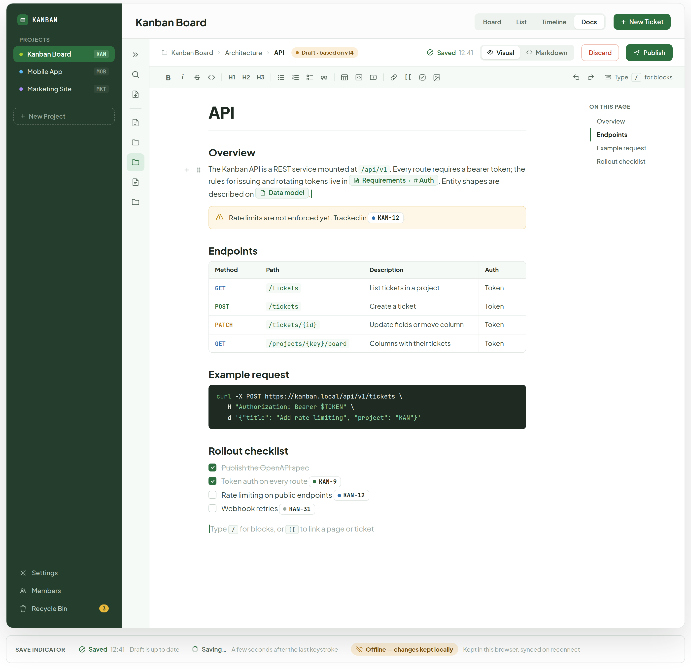
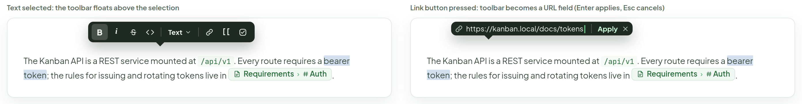
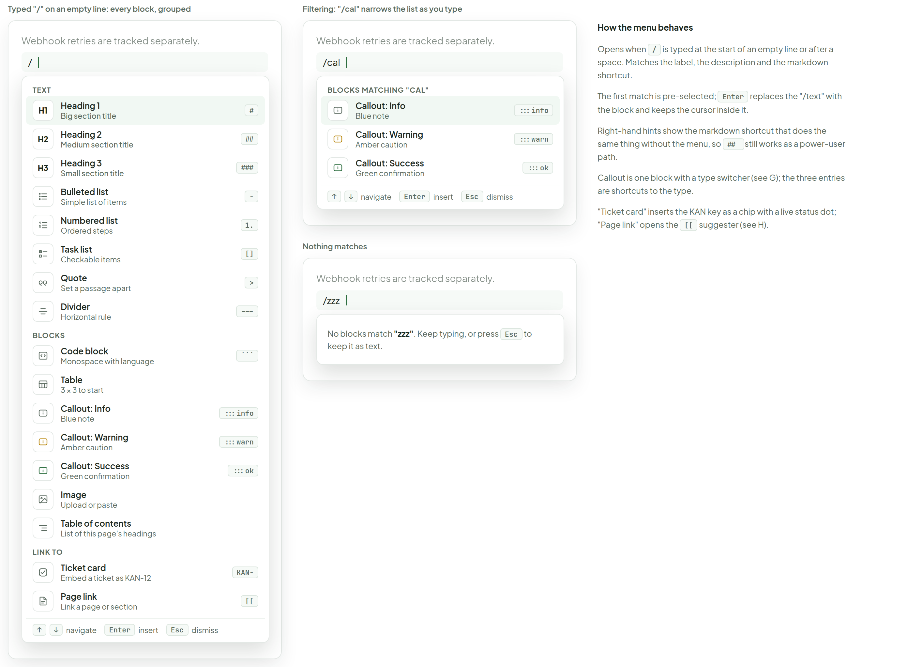
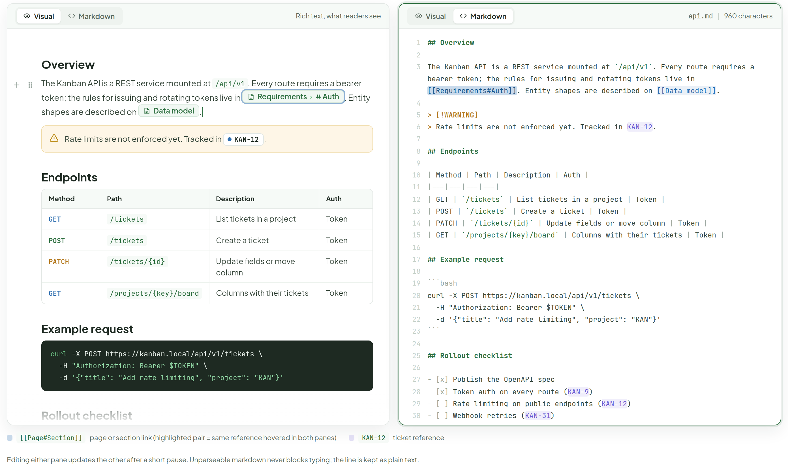
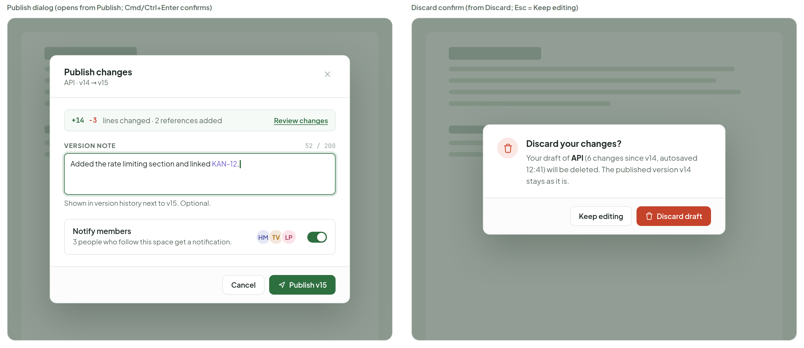
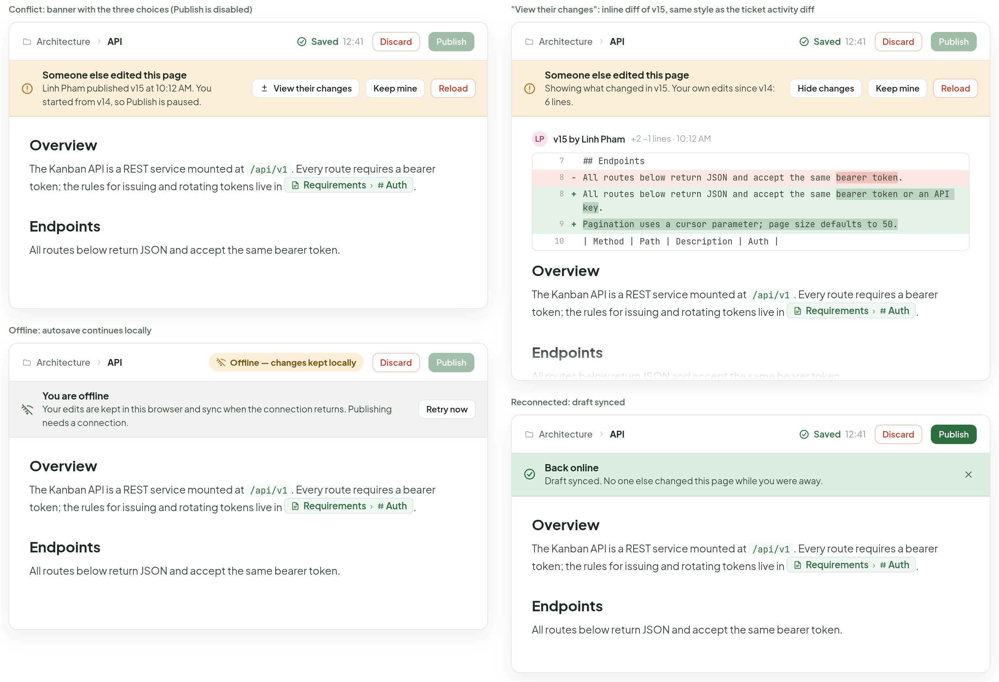
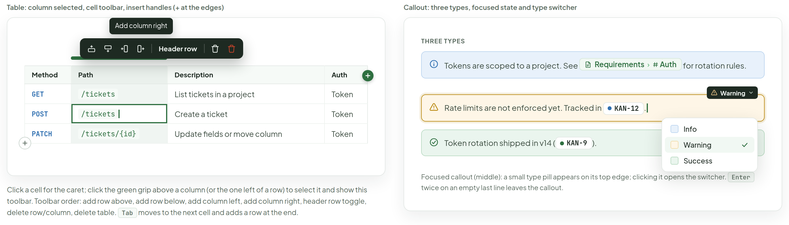
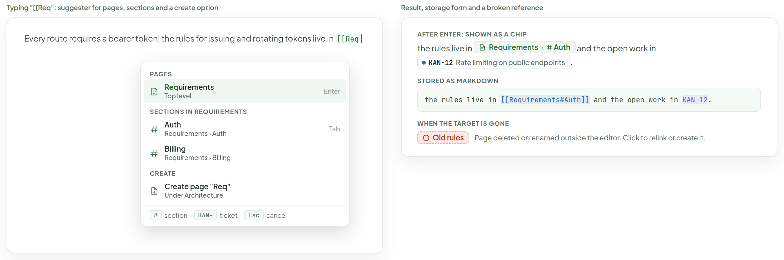

# Docs — editor

> Screen — v1 · source: [`DocsEditor.dc.html`](../source/DocsEditor.dc.html) · canvas `1791209276-a0aa` · sha256 `832567c0b564d2a619acca0ccd1e0221f1e0a5e3e4561bb6aba520e220672552`

Editing a docs page in place: rich text on top of markdown storage. Formatting toolbar, floating selection toolbar, / block menu, [[ suggester, a markdown source view, publish and conflict flows. Desktop and web only.

---

## A. Edit mode: WYSIWYG with save state, draft indicator, Discard and Publish

Source: [DocsEditor.dc.html](../source/DocsEditor.dc.html) › first block "A. Edit mode…" (app frame 1368×1260 plus a save-indicator legend strip); the artboard is a single line per block, so no comment names (L89)



- Project sidebar: "KANBAN"; "PROJECTS"; "Kanban Board" (chip "KAN", selected), "Mobile App" ("MOB"), "Marketing Site" ("MKT"); "New Project"; bottom: "Settings", "Members", "Recycle Bin" (badge "3"). Project top bar: "Kanban Board"; view switcher "Board", "List", "Timeline", "Docs" (selected); "New Ticket". The tree is collapsed to the icon rail.
- Page header: breadcrumb "Kanban Board" › "Architecture" › "API"; badge "Draft · based on v14"; save state "Saved" "12:41"; toggle "Visual" (selected), "Markdown"; buttons "Discard", "Publish".
- Formatting toolbar: bold "B", italic "i", strikethrough, inline code, "H1", "H2", "H3", bulleted list, numbered list, task list, quote, table, code block, callout, link, "[[", ticket, image; right: undo, redo, hint "Type" "/" "for blocks".
- Title field "API". Body: heading "Overview": "The Kanban API is a REST service mounted at `/api/v1`. Every route requires a bearer token; the rules for issuing and rotating tokens live in" page chip "Requirements › Auth". "Entity shapes are described on" page chip "Data model" "." (caret at the end); the hover handles + and drag grip show at the left of the line.
- Warning callout: "Rate limits are not enforced yet. Tracked in" ticket chip "KAN-12" ".".
- Heading "Endpoints". Table:

| Method | Path | Description | Auth |
|---|---|---|---|
| GET | `/tickets` | List tickets in a project | Token |
| POST | `/tickets` | Create a ticket | Token |
| PATCH | `/tickets/{id}` | Update fields or move column | Token |
| GET | `/projects/{key}/board` | Columns with their tickets | Token |

- Heading "Example request", code block (below).
- Heading "Rollout checklist": checked "Publish the OpenAPI spec"; checked "Token auth on every route" with chip "KAN-9"; unchecked "Rate limiting on public endpoints" with chip "KAN-12"; unchecked "Webhook retries" with chip "KAN-31".
- Empty last line placeholder: "Type" "/" "for blocks, or" "[[" "to link a page or ticket".
- Right rail "ON THIS PAGE": "Overview", "Endpoints" (active), "Example request", "Rollout checklist".
- Legend "SAVE INDICATOR": "Saved" "12:41" "Draft is up to date"; "Saving…" "A few seconds after the last keystroke"; "Offline — changes kept locally" "Kept in this browser, synced on reconnect".

Code block shown:

```sh
curl -X POST https://kanban.local/api/v1/tickets \
  -H "Authorization: Bearer $TOKEN" \
  -d '{"title": "Add rate limiting", "project": "KAN"}'
```

## B. Floating selection toolbar

Source: [DocsEditor.dc.html](../source/DocsEditor.dc.html) › second block "B. Floating selection toolbar" (two 668px cards side by side); the artboard is a single line per block, so no comment names (L89)



- "Text selected: the toolbar floats above the selection": dark toolbar with "B" (active), "i", strikethrough, inline code, block-type dropdown "Text", link, "[[", ticket. Paragraph: "The Kanban API is a REST service mounted at `/api/v1`. Every route requires a bearer token; the rules for issuing and rotating tokens live in" page chip "Requirements › Auth" "."; the words "bearer token" are selected.
- "Link button pressed: toolbar becomes a URL field (Enter applies, Esc cancels)": URL field "https://kanban.local/docs/tokens", "Apply", close. Same paragraph with "bearer token" selected.

## C. "/" block menu with filter text and keyboard hints

Source: [DocsEditor.dc.html](../source/DocsEditor.dc.html) › third block "C. "/" block menu…" (three columns: full menu 420px, filtered and empty cards 420px, explanation 380px); the artboard is a single line per block, so no comment names (L89)



- "Typed "/" on an empty line: every block, grouped": line "Webhook retries are tracked separately." then "/" with caret; menu with a first-match highlight:
  - "TEXT": "H1" "Heading 1" "Big section title" "#"; "H2" "Heading 2" "Medium section title" "##"; "H3" "Heading 3" "Small section title" "###"; "Bulleted list" "Simple list of items" "-"; "Numbered list" "Ordered steps" "1."; "Task list" "Checkable items" "[]"; "Quote" "Set a passage apart" ">"; "Divider" "Horizontal rule" "---".
  - "BLOCKS": "Code block" "Monospace with language" "```"; "Table" "3 × 3 to start"; "Callout: Info" "Blue note" ":::info"; "Callout: Warning" "Amber caution" ":::warn"; "Callout: Success" "Green confirmation" ":::ok"; "Image" "Upload or paste"; "Table of contents" "List of this page's headings".
  - "LINK TO": "Ticket card" "Embed a ticket as KAN-12" "KAN-"; "Page link" "Link a page or section" "[[".
  - Footer: "↑" "↓" "navigate", "Enter" "insert", "Esc" "dismiss".
- "Filtering: "/cal" narrows the list as you type": line "Webhook retries are tracked separately." then "/cal"; "BLOCKS MATCHING "CAL"": "Callout: Info" "Blue note" ":::info" (highlighted); "Callout: Warning" "Amber caution" ":::warn"; "Callout: Success" "Green confirmation" ":::ok"; footer "↑" "↓" "navigate", "Enter" "insert", "Esc" "dismiss".
- "Nothing matches": line "Webhook retries are tracked separately." then "/zzz"; "No blocks match "zzz". Keep typing, or press Esc to keep it as text."
- Side panel "How the menu behaves":
  - Opens when / is typed at the start of an empty line or after a space. Matches the label, the description and the markdown shortcut.
  - The first match is pre-selected; Enter replaces the "/text" with the block and keeps the cursor inside it.
  - Right-hand hints show the markdown shortcut that does the same thing without the menu, so ## still works as a power-user path.
  - Callout is one block with a type switcher (see G); the three entries are shortcuts to the type.
  - "Ticket card" inserts the KAN key as a chip with a live status dot; "Page link" opens the [[ suggester (see H).

## D. Markdown source view next to the WYSIWYG: the same content, stored as markdown

Source: [DocsEditor.dc.html](../source/DocsEditor.dc.html) › fourth block "D. Markdown source view…" (Visual pane and Markdown pane side by side, a legend and a footnote); the artboard is a single line per block, so no comment names (L89)



- Left pane: toggle "Visual" (selected), "Markdown"; "Rich text, what readers see". Heading "Overview": "The Kanban API is a REST service mounted at `/api/v1`. Every route requires a bearer token; the rules for issuing and rotating tokens live in" page chip "Requirements › Auth" (outlined, hovered) ". Entity shapes are described on" page chip "Data model" ".". Warning callout "Rate limits are not enforced yet. Tracked in" "KAN-12" ".". Heading "Endpoints" with the same four-row table as A, "Example request" with the same code block as A, and "Rollout checklist" cut off at the pane bottom (the empty-line placeholder "Type" "/" "for blocks, or" "[[" "to link a page or ticket" sits below, out of frame).
- Right pane (outlined green): toggle "Visual", "Markdown" (selected); "api.md" "|" "960 characters"; 30 numbered lines of raw markdown (below).
- Legend: "[[Page#Section]]" "page or section link (highlighted pair = same reference hovered in both panes)"; "KAN-12" "ticket reference".
- Footnote: "Editing either pane updates the other after a short pause. Unparseable markdown never blocks typing; the line is kept as plain text."

Raw markdown pane:

```markdown
## Overview

The Kanban API is a REST service mounted at `/api/v1`. Every route requires a bearer token; the rules for issuing and rotating tokens live in [[Requirements#Auth]]. Entity shapes are described on [[Data model]].

> [!WARNING]
> Rate limits are not enforced yet. Tracked in KAN-12.

## Endpoints

| Method | Path | Description | Auth |
|---|---|---|---|
| GET | `/tickets` | List tickets in a project | Token |
| POST | `/tickets` | Create a ticket | Token |
| PATCH | `/tickets/{id}` | Update fields or move column | Token |
| GET | `/projects/{key}/board` | Columns with their tickets | Token |

## Example request

```bash
curl -X POST https://kanban.local/api/v1/tickets \
  -H "Authorization: Bearer $TOKEN" \
  -d '{"title": "Add rate limiting", "project": "KAN"}'
```

## Rollout checklist

- [x] Publish the OpenAPI spec
- [x] Token auth on every route (KAN-9)
- [ ] Rate limiting on public endpoints (KAN-12)
- [ ] Webhook retries (KAN-31)
```

## E. Publish dialog and Discard confirm

Source: [DocsEditor.dc.html](../source/DocsEditor.dc.html) › fifth block "E. Publish dialog and Discard confirm" (two 668px cards, each a dimmed page behind a modal); the artboard is a single line per block, so no comment names (L89)



- "Publish dialog (opens from Publish; Cmd/Ctrl+Enter confirms)": title "Publish changes", subtitle "API · v14 → v15", close; summary "+14" "−3" "lines changed · 2 references added" with link "Review changes"; "VERSION NOTE" counter "52 / 200"; textarea "Added the rate limiting section and linked KAN-12." (KAN-12 shown as a reference); hint "Shown in version history next to v15. Optional."; "Notify members" "3 people who follow this space get a notification." with avatars "HM", "TV", "LP" and a toggle (on); buttons "Cancel", "Publish v15".
- "Discard confirm (from Discard; Esc = Keep editing)": trash icon; "Discard your changes?"; "Your draft of API (6 changes since v14, autosaved 12:41) will be deleted. The published version v14 stays as it is."; buttons "Keep editing", "Discard draft" (red).

## F. Conflict, offline and reconnect states

Source: [DocsEditor.dc.html](../source/DocsEditor.dc.html) › sixth block "F. Conflict, offline and reconnect states" (two columns: conflict + offline on the left, diff + reconnected on the right); the artboard is a single line per block, so no comment names (L89)



- All four cards show the breadcrumb "Architecture" › "API", buttons "Discard" and "Publish" (disabled except in the last card), and the page body "Overview" with the paragraph "The Kanban API is a REST service mounted at `/api/v1`. Every route requires a bearer token; the rules for issuing and rotating tokens live in" page chip "Requirements › Auth" "."; "Endpoints" with "All routes below return JSON and accept the same bearer token."
- "Conflict: banner with the three choices (Publish is disabled)": "Saved" "12:41"; amber banner "Someone else edited this page", "Linh Pham published v15 at 10:12 AM. You started from v14, so Publish is paused."; buttons "View their changes", "Keep mine", "Reload".
- "Offline: autosave continues locally": badge "Offline — changes kept locally"; grey banner "You are offline", "Your edits are kept in this browser and sync when the connection returns. Publishing needs a connection."; button "Retry now".
- ""View their changes": inline diff of v15, same style as the ticket activity diff": "Saved" "12:41"; amber banner "Someone else edited this page", "Showing what changed in v15. Your own edits since v14: 6 lines."; buttons "Hide changes", "Keep mine", "Reload". Diff header: avatar "LP", "v15 by Linh Pham", "+2 −1 lines · 10:12 AM". Diff:

```diff
7   ## Endpoints
8 - All routes below return JSON and accept the same bearer token.
8 + All routes below return JSON and accept the same bearer token or an API key.
9 + Pagination uses a cursor parameter; page size defaults to 50.
10  | Method | Path | Description | Auth |
```

- "Reconnected: draft synced": "Saved" "12:41"; "Publish" enabled; green banner "Back online", "Draft synced. No one else changed this page while you were away." with a close button.

## G. Table editing and callout block close-ups

Source: [DocsEditor.dc.html](../source/DocsEditor.dc.html) › seventh block "G. Table editing and callout block close-ups" (two 668px cards plus captions); the artboard is a single line per block, so no comment names (L89)



- "Table: column selected, cell toolbar, insert handles (+ at the edges)": tooltip "Add column right"; cell toolbar (add row above, add row below, add column left, add column right) "Header row" toggle, delete, delete table (red); the "Path" column is selected (green grip above it); "+" handles at the right edge of the header and the bottom-left corner. Table (the POST `/tickets` cell has the caret):

| Method | Path | Description | Auth |
|---|---|---|---|
| GET | `/tickets` | List tickets in a project | Token |
| POST | `/tickets` | Create a ticket | Token |
| PATCH | `/tickets/{id}` | Update fields or move column | Token |

  Caption: "Click a cell for the caret; click the green grip above a column (or the one left of a row) to select it and show this toolbar. Toolbar order: add row above, add row below, add column left, add column right, header row toggle, delete row/column, delete table. Tab moves to the next cell and adds a row at the end."
- "Callout: three types, focused state and type switcher": "THREE TYPES". Info: "Tokens are scoped to a project. See" page chip "Requirements › Auth" "for rotation rules." Warning (focused, with type pill "Warning" on its top edge): "Rate limits are not enforced yet. Tracked in" "KAN-12" ".". Success: "Token rotation shipped in v14 (" "KAN-9" ")." Open switcher: "Info", "Warning" (checked), "Success". Caption: "Focused callout (middle): a small type pill appears on its top edge; clicking it opens the switcher. Enter twice on an empty last line leaves the callout."

## H. "[[" reference suggester (extra state)

Source: [DocsEditor.dc.html](../source/DocsEditor.dc.html) › eighth block "H. "[[" reference suggester…" (two 668px cards); the artboard is a single line per block, so no comment names (L89)



- "Typing "[[Req": suggester for pages, sections and a create option": line "Every route requires a bearer token; the rules for issuing and rotating tokens live in [[Req"; menu: "PAGES": "Requirements" "Top level" "Enter" (highlighted); "SECTIONS IN REQUIREMENTS": "Auth" "Requirements › Auth" "Tab"; "Billing" "Requirements › Billing"; "CREATE": "Create page "Req"" "Under Architecture"; footer "#" "section", "KAN-" "ticket", "Esc" "cancel".
- "Result, storage form and a broken reference": "AFTER ENTER: SHOWN AS A CHIP": "the rules live in" page chip "Requirements › Auth" "and the open work in" ticket chip "KAN-12" "Rate limiting on public endpoints" "."; "STORED AS MARKDOWN": `the rules live in [[Requirements#Auth]] and the open work in KAN-12.`; "WHEN THE TARGET IS GONE": broken chip "Old rules" "Page deleted or renamed outside the editor. Click to relink or create it."

## Note

Source: [DocsEditor.dc.html](../source/DocsEditor.dc.html) › final "Note" list (L93)

- The page body is stored as markdown; the WYSIWYG editor is a view over it. The title is a separate field. "Markdown" in the top bar swaps to the raw source (D); edits in either pane are reflected in the other.
- Callouts are stored as blockquote alerts (> [!WARNING] ... [!INFO] style); tables as GFM pipe tables; task lists as - [ ]. Anything markdown cannot express (cell merges, colours) is not offered in the toolbar.
- Headings get slug anchors: lower-case, spaces to dashes, punctuation dropped (Example request becomes #example-request). Duplicates get a numeric suffix: #overview, #overview-2. [[Page#Section]] links resolve to those anchors; renaming a heading keeps old anchors working for the same page via a redirect map (TODO(backend)).
- Autosave: every few seconds after typing stops (about 3s), and on blur, the changes go to a per-user draft; the save indicator shows Saved / Saving… / Offline. While offline, edits stay in local storage and sync on reconnect. Publish creates a new version (v14 → v15) with an optional note; Discard deletes the draft and keeps the published version.
- Conflicts: each draft remembers the version it started from (base version). Publish sends that base number; if it no longer equals the latest version the server answers 409 and the banner in F appears. Keep mine = publish on top of their version (their changes are kept in history), Reload = drop my draft.
- Shortcuts: Cmd/Ctrl+B bold, +I italic, +Shift+X strikethrough, +E inline code, +K link; Cmd/Ctrl+Alt+1/2/3 headings; Cmd/Ctrl+Shift+7 numbered list, +8 bulleted list, +9 task list; Cmd/Ctrl+Shift+B quote; Cmd/Ctrl+Alt+C code block; Cmd/Ctrl+S save draft now; Cmd/Ctrl+Enter publish; Cmd/Ctrl+Shift+M toggle Markdown view; / block menu; [[ reference suggester; Esc leaves a menu or the editor focus.
- Typing the markdown shortcut (## , - , 1. , [] , ---) converts the line as you type, same as the hints in the / menu.
- TODO(backend): draft storage (docs_drafts keyed by page and user, autosaved markdown, base_version) and an endpoint to save/discard a draft.
- TODO(backend): docs_versions with a monotonically increasing version number per page; publish = insert row, bump docs_pages.version; conflict detection compares the draft base_version with the latest version and returns 409 with their version.
- TODO(backend): notifications for "Notify members" (who follows a space) and the diff endpoint behind "Review changes" and "View their changes".
- TODO(backend): MCP tools so agents can read and write docs: list_docs_pages, read_docs_page (markdown + version), update_docs_page (needs base version, same conflict rule), publish_docs_page.
- Invented for this design: the Visual / Markdown toggle placement, the version note field, the follow-members notification, the callout alert syntax and the offline local-storage behaviour.
