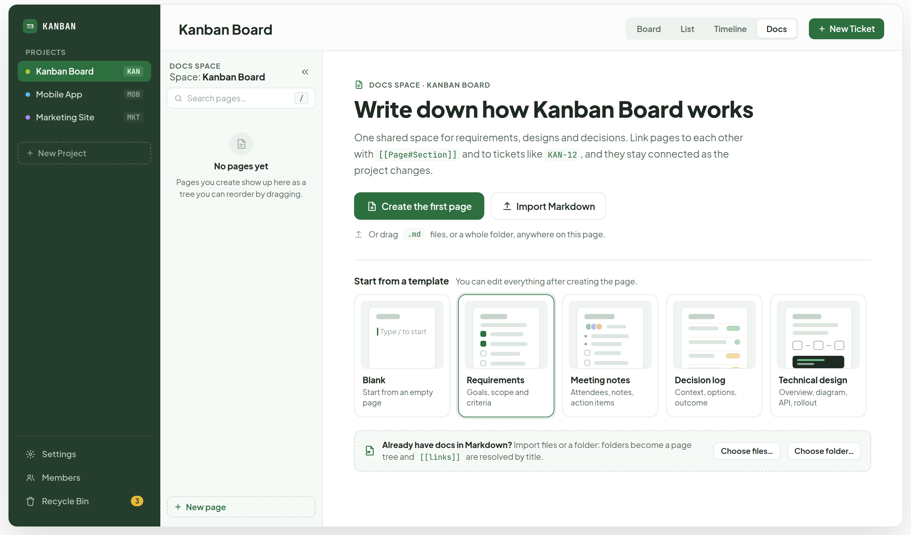
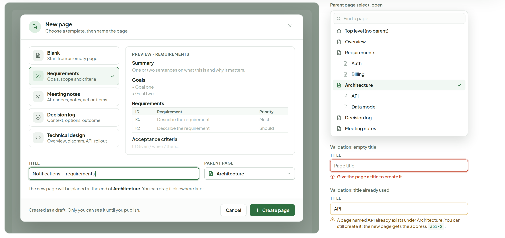
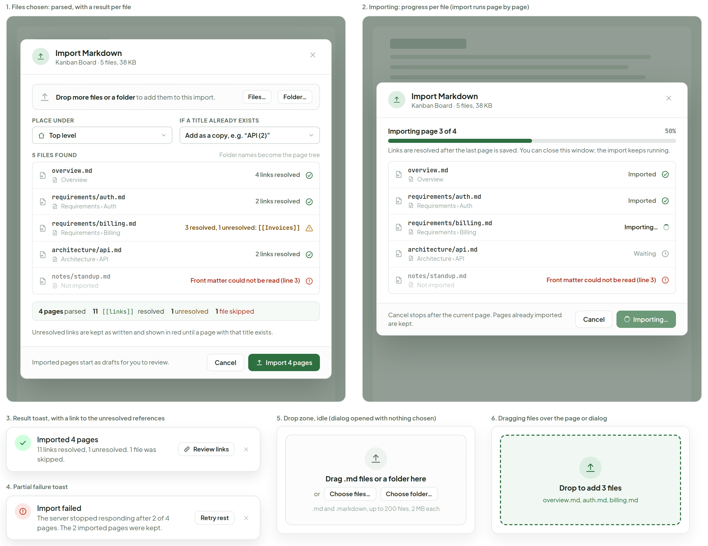
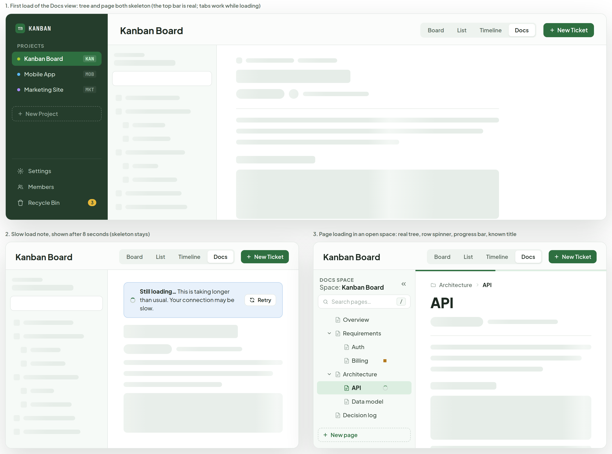
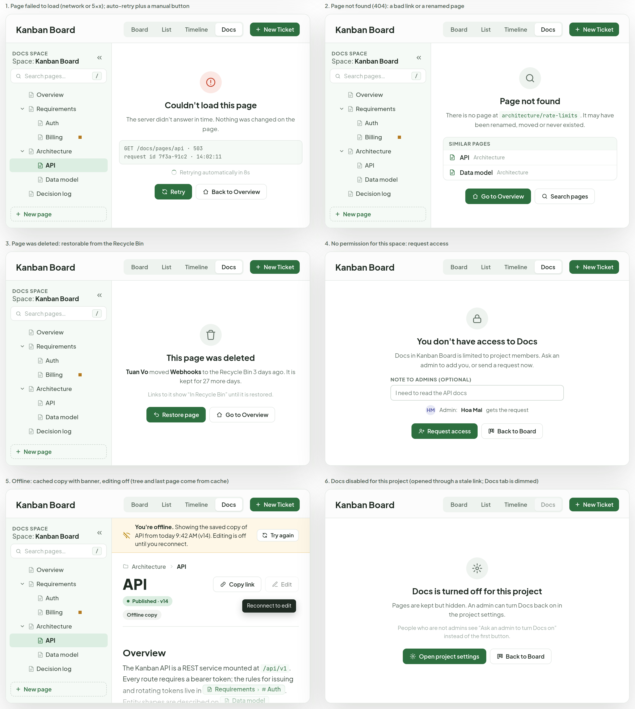
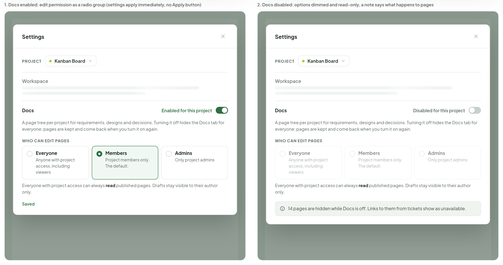

# Docs — empty, loading and errors

> Screen — v1 · source: [`DocsEmpty.dc.html`](../source/DocsEmpty.dc.html) · canvas `1791209276-a0aa` · sha256 `1d3461d86cebeddea3e376ade36368bf697e02cc19c4e98a884ab818633ec13a`

What the Docs view looks like before it has content, while it loads, and when something goes wrong, plus the dialog for creating the first page, Markdown import, and the per-project switch in Settings. Same shell, tree and chips as the Docs page view board.

---

## A. First visit: empty space with hero, template gallery and Import Markdown

Source: [DocsEmpty.dc.html](../source/DocsEmpty.dc.html) › first block "A. First visit: empty space with hero, template gallery and Import Markdown" (app sidebar, empty tree panel and the hero page)



- App sidebar: "KANBAN"; "PROJECTS": "Kanban Board" "KAN" (active), "Mobile App" "MOB", "Marketing Site" "MKT"; "New Project"; bottom: "Settings", "Members", "Recycle Bin" with badge "3".
- Header: "Kanban Board"; tabs "Board", "List", "Timeline", "Docs" (active); button "New Ticket".
- Tree panel: "DOCS SPACE" "Space: Kanban Board"; search field "Search pages…" with "/" key hint; empty state "No pages yet" "Pages you create show up here as a tree you can reorder by dragging."; footer button "New page".
- Hero: eyebrow "DOCS SPACE · KANBAN BOARD"; title "Write down how Kanban Board works"; text "One shared space for requirements, designs and decisions. Link pages to each other with" `[[Page#Section]]` "and to tickets like" `KAN-12` ", and they stay connected as the project changes."
- Buttons: "Create the first page" (primary), "Import Markdown". Hint: "Or drag" `.md` "files, or a whole folder, anywhere on this page."
- "Start from a template" "You can edit everything after creating the page." Five template cards: "Blank" "Start from an empty page" (mini preview "Type / to start"); "Requirements" "Goals, scope and criteria" (highlighted); "Meeting notes" "Attendees, notes, action items"; "Decision log" "Context, options, outcome"; "Technical design" "Overview, diagram, API, rollout".
- Import strip (dashed): "Already have docs in Markdown?" "Import files or a folder: folders become a page tree and" `[[links]]` "are resolved by title." Buttons "Choose files…", "Choose folder…".

## B. New page dialog: template, title and parent

Source: [DocsEmpty.dc.html](../source/DocsEmpty.dc.html) › second block "B. New page dialog: template, title and parent" (dialog 868px on a scrim, plus a 380px column of field states on the right)



- Dialog "New page" "Choose a template, then name the page". Template list: "Blank" "Start from an empty page"; "Requirements" "Goals, scope and criteria" (selected, check mark); "Meeting notes" "Attendees, notes, action items"; "Decision log" "Context, options, outcome"; "Technical design" "Overview, diagram, API, rollout".
- Preview pane "PREVIEW · REQUIREMENTS":

  | Block | Content |
  |---|---|
  | Heading | "Summary" |
  | Text | "One or two sentences on what this is and why it matters." |
  | Heading | "Goals" |
  | Bullets | "• Goal one", "• Goal two" |
  | Heading | "Requirements" |
  | Table header | "ID" "Requirement" "Priority" |
  | Row | "R1" "Describe the requirement" "Must" |
  | Row | "R2" "Describe the requirement" "Should" |
  | Heading | "Acceptance criteria" |
  | Checkbox | "☐ Given / when / then…" |

- Fields: "TITLE" "Notifications — requirements" (focused, caret); "PARENT PAGE" "Architecture". Help: "The new page will be placed at the end of" "Architecture" ". You can drag it elsewhere later."
- Footer: "Created as a draft. Only you can see it until you publish." Buttons "Cancel", "Create page".
- "Parent page select, open": search "Find a page…"; options "Top level (no parent)", "Overview", "Requirements" (children "Auth", "Billing"), "Architecture" (selected; children "API", "Data model"), "Decision log", "Meeting notes".
- "Validation: empty title": "TITLE" placeholder "Page title"; error "Give the page a title to create it."
- "Validation: title already used": "TITLE" "API"; warning "A page named" "API" "already exists under Architecture. You can still create it; the new page gets the address" `api-2` "."

## C. Import Markdown: parse results, progress, result toast and drop zone

Source: [DocsEmpty.dc.html](../source/DocsEmpty.dc.html) › third block "C. Import Markdown: parse results, progress, result toast and drop zone" (two dialogs in a top row; two toasts, the idle drop zone and the drag-over zone below)



### C1. Files chosen: parsed, with a result per file

- Caption: "1. Files chosen: parsed, with a result per file".
- Dialog "Import Markdown" "Kanban Board · 5 files, 38 KB". Drop strip: "Drop more files or a folder" "to add them to this import." Buttons "Files…", "Folder…".
- "PLACE UNDER" "Top level"; "IF A TITLE ALREADY EXISTS" "Add as a copy, e.g. “API (2)”".
- "5 FILES FOUND" "Folder names become the page tree":

  | File | Page | Result |
  |---|---|---|
  | `overview.md` | "Overview" | "4 links resolved" |
  | `requirements/auth.md` | "Requirements › Auth" | "2 links resolved" |
  | `requirements/billing.md` | "Requirements › Billing" | "3 resolved, 1 unresolved: [[Invoices]]" (warning) |
  | `architecture/api.md` | "Architecture › API" | "2 links resolved" |
  | `notes/standup.md` | "Not imported" | "Front matter could not be read (line 3)" (error) |

- Summary strip: "4 pages" "parsed"; "11" `[[links]]` "resolved"; "1" "unresolved"; "1" "file skipped".
- "Unresolved links are kept as written and shown in red until a page with that title exists."
- Footer: "Imported pages start as drafts for you to review." Buttons "Cancel", "Import 4 pages".

### C2. Importing: progress per file

- Caption: "2. Importing: progress per file (import runs page by page)".
- Dialog "Import Markdown" "Kanban Board · 5 files, 38 KB". "Importing page 3 of 4" "50%" with progress bar. "Links are resolved after the last page is saved. You can close this window; the import keeps running."
- Rows: `overview.md` "Overview" "Imported"; `requirements/auth.md` "Requirements › Auth" "Imported"; `requirements/billing.md` "Requirements › Billing" "Importing…"; `architecture/api.md` "Architecture › API" "Waiting"; `notes/standup.md` "Not imported" "Front matter could not be read (line 3)".
- Footer: "Cancel stops after the current page. Pages already imported are kept." Buttons "Cancel", "Importing…" (disabled, spinner).

### C3. Result toast

- Caption: "3. Result toast, with a link to the unresolved references".
- Toast "Imported 4 pages" "11 links resolved, 1 unresolved. 1 file was skipped." Button "Review links".

### C4. Partial failure toast

- Caption: "4. Partial failure toast".
- Toast "Import failed" "The server stopped responding after 2 of 4 pages. The 2 imported pages were kept." Button "Retry rest".

### C5. Drop zone, idle

- Caption: "5. Drop zone, idle (dialog opened with nothing chosen)".
- "Drag .md files or a folder here" "or" buttons "Choose files…", "Choose folder…"; ".md and .markdown, up to 200 files, 2 MB each".

### C6. Dragging files over the page or dialog

- Caption: "6. Dragging files over the page or dialog".
- Dashed highlighted zone: "Drop to add 3 files" "overview.md, auth.md, billing.md".

## D. Loading: skeletons, slow-load note, and a page loading in an open space

Source: [DocsEmpty.dc.html](../source/DocsEmpty.dc.html) › fourth block "D. Loading: skeletons, slow-load note, and a page loading in an open space" (full-width frame, then two half-width frames). The shimmer is frozen at its start position in the image.



### D1. First load of the Docs view

- Caption: "1. First load of the Docs view: tree and page both skeleton (the top bar is real; tabs work while loading)".
- App sidebar: "KANBAN"; "PROJECTS": "Kanban Board" "KAN", "Mobile App" "MOB", "Marketing Site" "MKT"; "New Project"; "Settings", "Members", "Recycle Bin" "3". Header "Kanban Board", tabs "Board", "List", "Timeline", "Docs", button "New Ticket". Tree panel and page area are grey skeleton bars and blocks.

### D2. Slow load note

- Caption: "2. Slow load note, shown after 8 seconds (skeleton stays)".
- Header "Kanban Board", tabs "Board", "List", "Timeline", "Docs", "New Ticket". Info note with spinner: "Still loading…" "This is taking longer than usual. Your connection may be slow." Button "Retry". Skeleton stays below.

### D3. Page loading in an open space

- Caption: "3. Page loading in an open space: real tree, row spinner, progress bar, known title".
- Tree: "DOCS SPACE" "Space: Kanban Board"; "Search pages…" "/"; "Overview", "Requirements" ("Auth", "Billing" with an amber dot), "Architecture" ("API" selected with a row spinner, "Data model"), "Decision log", "Meeting notes" (in the DOM, scrolled out of view), "3"; "New page".
- Page: top progress bar; breadcrumb "Architecture" › "API"; title "API" (known); the rest skeleton.

## E. Errors: failed to load, not found, deleted, no permission, offline, Docs disabled

Source: [DocsEmpty.dc.html](../source/DocsEmpty.dc.html) › fifth block "E. Errors: failed to load, not found, deleted, no permission, offline, Docs disabled" (three rows of two frames; each frame shows the header, with the tree where it loaded)



All frames share the header "Kanban Board", tabs "Board", "List", "Timeline", "Docs", and button "New Ticket". Frames E1, E2, E3 and E5 also show the tree: "DOCS SPACE" "Space: Kanban Board", "Search pages…" "/", "Overview", "Requirements" ("Auth", "Billing" with amber dot), "Architecture" ("API", "Data model"), "Decision log", "Meeting notes" (in the DOM, scrolled out of view), "3", "New page".

### E1. Page failed to load

- Caption: "1. Page failed to load (network or 5xx); auto-retry plus a manual button".
- Title "Couldn't load this page"; text "The server didn't answer in time. Nothing was changed on the page."
- Detail block:

```
GET /docs/pages/api · 503
request id 7f3a-91c2 · 14:02:11
```

- "Retrying automatically in 8s". Buttons "Retry", "Back to Overview".

### E2. Page not found

- Caption: "2. Page not found (404): a bad link or a renamed page".
- Title "Page not found"; text "There is no page at" `architecture/rate-limits` ". It may have been renamed, moved or never existed."
- "SIMILAR PAGES": "API" "Architecture"; "Data model" "Architecture". Buttons "Go to Overview", "Search pages".

### E3. Page was deleted

- Caption: "3. Page was deleted: restorable from the Recycle Bin".
- Title "This page was deleted"; text "Tuan Vo" "moved" "Webhooks" "to the Recycle Bin 3 days ago. It is kept for 27 more days."
- "Links to it show “In Recycle Bin” until it is restored." Buttons "Restore page", "Go to Overview".

### E4. No permission for this space

- Caption: "4. No permission for this space: request access".
- No tree. Title "You don't have access to Docs"; text "Docs in Kanban Board is limited to project members. Ask an admin to add you, or send a request now."
- "NOTE TO ADMINS (OPTIONAL)" field "I need to read the API docs"; "HM" "Admin:" "Hoa Mai" "gets the request". Buttons "Request access", "Back to Board".

### E5. Offline

- Caption: "5. Offline: cached copy with banner, editing off (tree and last page come from cache)".
- Banner: "You're offline." "Showing the saved copy of API from today 9:42 AM (v14). Editing is off until you reconnect." Button "Try again".
- Page: breadcrumb "Architecture" › "API"; title "API"; status "Published · v14"; badge "Offline copy"; buttons "Copy link", "Edit" (disabled, tooltip "Reconnect to edit").
- Cached body (cut off at the bottom of the frame):

```markdown
## Overview

The Kanban API is a REST service mounted at `/api/v1`. Every route requires a bearer token; the rules for issuing and rotating tokens live in [[Requirements#Auth]]. Entity shapes are described on [[Data model]].

> Rate limits are not enforced yet. Tracked in KAN-12.

## Endpoints
```

  | Method | Path | Description | Auth |
  |---|---|---|---|
  | GET | `/tickets` | List tickets in a project | Token |
  | POST | `/tickets` | Create a ticket | Token |
  | PATCH | `/tickets/{id}` | Update fields or move column | Token |
  | GET | `/projects/{key}/board` | Columns with their tickets | Token |

- Body sections: "Overview" (text with chip "Requirements" › "Auth", chip "Data model", warning callout "Rate limits are not enforced yet. Tracked in" chip "KAN-12" "."); "Endpoints" (table above); "Example request":

```
curl -X POST https://kanban.local/api/v1/tickets \
  -H "Authorization: Bearer $TOKEN" \
  -d '{"title": "Add rate limiting", "project": "KAN"}'
```

- "Rollout checklist": "Publish the OpenAPI spec"; "Token auth on every route" chip "KAN-9"; "Rate limiting on public endpoints" chip "KAN-12"; "Webhook retries" chip "KAN-31".
- Tooltip: "Reconnect to edit".

### E6. Docs disabled for this project

- Caption: "6. Docs disabled for this project (opened through a stale link; Docs tab is dimmed)".
- No tree. Title "Docs is turned off for this project"; text "Pages are kept but hidden. An admin can turn Docs back on in the project settings."
- "People who are not admins see “Ask an admin to turn Docs on” instead of the first button." Buttons "Open project settings", "Back to Board".

## F. Docs in Settings: enable toggle and who can edit

Source: [DocsEmpty.dc.html](../source/DocsEmpty.dc.html) › sixth block "F. Docs in Settings: enable toggle and who can edit" (two Settings dialogs, 668px each)



### F1. Docs enabled

- Caption: "1. Docs enabled: edit permission as a radio group (settings apply immediately, no Apply button)".
- Dialog "Settings". "PROJECT" select "Kanban Board". "Workspace" (collapsed, skeleton lines).
- "Docs" toggle "Enabled for this project" (on). Text "A page tree per project for requirements, designs and decisions. Turning it off hides the Docs tab for everyone; pages are kept and come back when you turn it on again."
- "WHO CAN EDIT PAGES": "Everyone" "Anyone with project access, including viewers"; "Members" "Project members only. The default." (selected); "Admins" "Only project admins".
- "Everyone with project access can always" "read" "published pages. Drafts stay visible to their author only." Status "Saved".

### F2. Docs disabled

- Caption: "2. Docs disabled: options dimmed and read-only, a note says what happens to pages".
- Dialog "Settings". "PROJECT" "Kanban Board". "Workspace". "Docs" toggle "Disabled for this project" (off). Same description text; "WHO CAN EDIT PAGES" with "Everyone", "Anyone with project access, including viewers", "Members", "Project members only. The default.", "Admins", "Only project admins" all dimmed.
- "Everyone with project access can always" "read" "published pages. Drafts stay visible to their author only."
- Info note: "14 pages are hidden while Docs is off. Links to them from tickets show as unavailable."

## Note

Source: [DocsEmpty.dc.html](../source/DocsEmpty.dc.html) › final "Note" list

- Empty space: the first page can come from a template, a blank page, or an import. Both big buttons and the template cards open the same New page dialog (B), preselected with the chosen template. The hero shows only while the project has zero pages; after that the Docs view opens on Overview.
- Templates are static markdown snippets shipped with the app (Blank, Requirements, Meeting notes, Decision log, Technical design). The title field defaults to the template name; the dialog also opens from a tree row's + button with the parent preselected.
- Import: .md files and folders only. Folder names become parent pages (a folder with an index.md or README.md uses it as the parent body). A front matter title: wins over the first # heading, then the file name. Imported pages are drafts; [[links]] are matched by title or path after all pages exist, and the rest stay as written.
- Loading: skeletons use the app's existing shimmer. The slow note appears after 8s; failures after 20s turn into error E1. Errors never blank the tree: if the tree loaded, it stays and only the page area shows the message.
- Offline shows the last cached copy read-only (per browser, same cache that keeps the collapsed-tree state). Editing and publishing need a connection; drafts you typed offline are kept locally and sync on reconnect. Not designed here: conflict handling for those drafts.
- Permission copy assumes three roles (admin, member, viewer). The settings in F are per project, not app-wide like today's Data Folder and Theme settings, so the Settings modal gets a project picker at the top.
- TODO(backend): POST /projects/:id/docs/import (multipart, returns per-file result: page count, resolved and unresolved links, skip reason) with a progress stream or polling endpoint; import is atomic per page, not per batch.
- TODO(backend): project-level docs settings (docs_enabled, docs_edit_policy: everyone|members|admins); a disabled space answers 403 with code: "docs_disabled" so the client can show state E6.
- TODO(backend): access requests (POST /projects/:id/access-requests, notify admins), 404 vs "deleted" distinction on GET /docs/pages/:slug (410 with deleted_by, deleted_at), and a request id in error responses for the detail line in E1.
- Invented here (not in the app today): everything on this board; the roles, the "Offline copy" badge, the similar-pages suggestions on 404, the 200-file and 2 MB import limits, the 8s and 20s thresholds.
