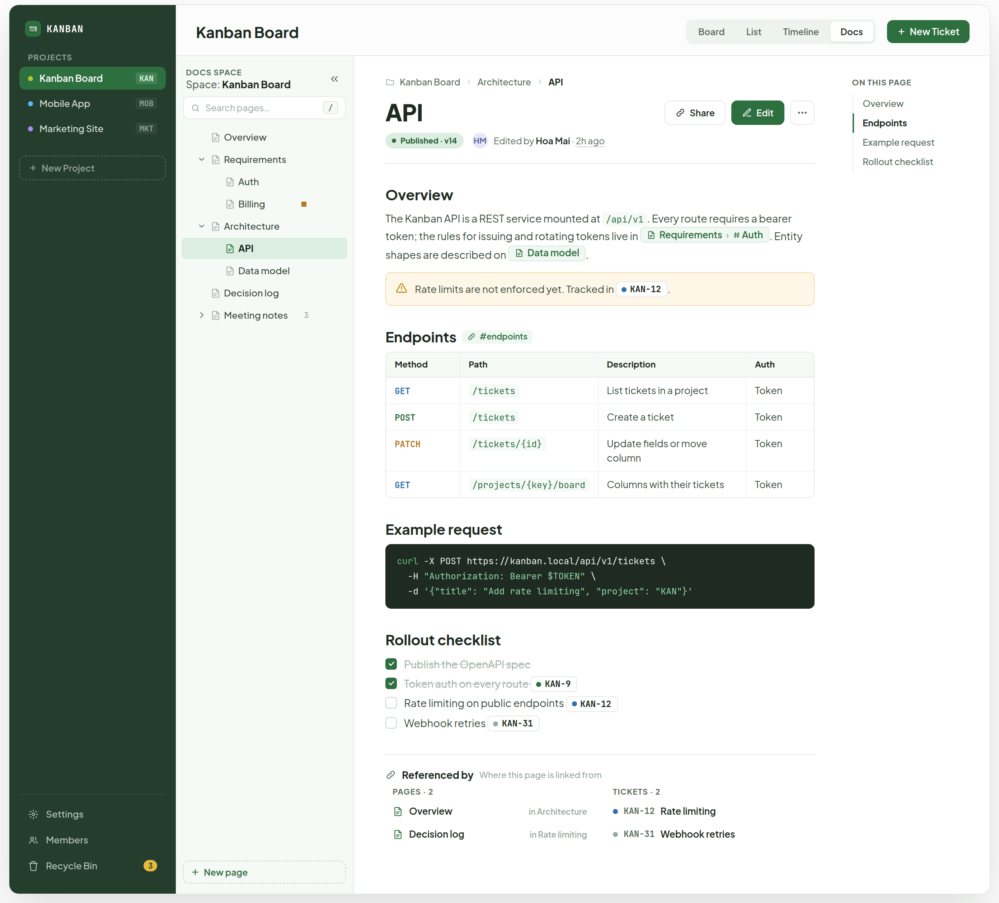
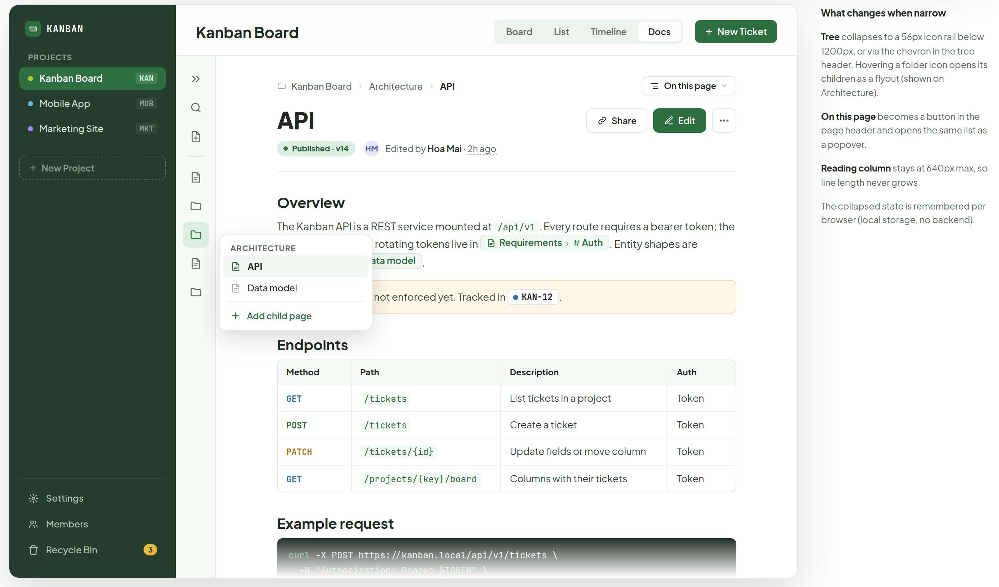
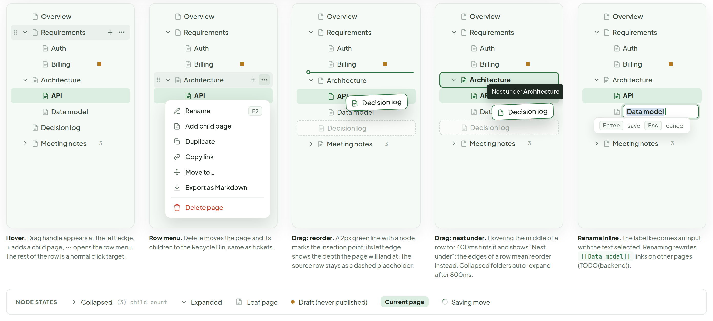
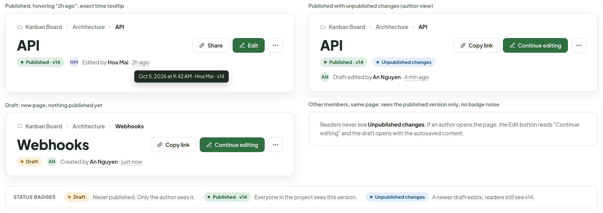

# Docs — page view

> Screen — v1 · source: [`DocsPage.dc.html`](../source/DocsPage.dc.html) · canvas `1791209276-a0aa` · sha256 `588ff4efe352e5a99015213d5c7141606fa0c56247f07571ecfa3d11988ce72f`

A Confluence-style document space, one per project: a page tree on the left, the rendered page in the middle, and an "On this page" list on the right. Pages are edited as rich text but stored as markdown; [[Page#Section]] and ticket keys render as chips. Desktop and web only.

---

## A. Full app frame: Docs view, current page "API" under Architecture

Source: [DocsPage.dc.html](../source/DocsPage.dc.html) › first block "A. Full app frame…" (app frame 1368×1240); the artboard is a single line per block, so no comment names (L89)



- Project sidebar: "KANBAN"; "PROJECTS"; "Kanban Board" (chip "KAN", selected), "Mobile App" ("MOB"), "Marketing Site" ("MKT"); "New Project"; bottom: "Settings", "Members", "Recycle Bin" (badge "3").
- Project top bar: "Kanban Board"; view switcher "Board", "List", "Timeline", "Docs" (selected); "New Ticket".
- Tree header: "DOCS SPACE", "Space: Kanban Board", collapse chevron; search field "Search pages…" with "/" key hint.
- Page tree: "Overview"; "Requirements" (expanded) with children "Auth", "Billing" (draft dot); "Architecture" (expanded) with children "API" (current page, highlighted), "Data model"; "Decision log"; "Meeting notes" (collapsed, child count "3"). Footer button "New page".
- Page header: breadcrumb "Kanban Board" › "Architecture" › "API"; title "API"; buttons "Share", "Edit", "···". Status line: badge "Published · v14", avatar "HM", "Edited by Hoa Mai · 2h ago".
- Heading "Overview": "The Kanban API is a REST service mounted at `/api/v1`. Every route requires a bearer token; the rules for issuing and rotating tokens live in" page chip "Requirements › Auth". "Entity shapes are described on" page chip "Data model" ".".
- Warning callout: "Rate limits are not enforced yet. Tracked in" ticket chip "KAN-12" ".".
- Heading "Endpoints" with anchor chip "#endpoints". Table:

| Method | Path | Description | Auth |
|---|---|---|---|
| GET | `/tickets` | List tickets in a project | Token |
| POST | `/tickets` | Create a ticket | Token |
| PATCH | `/tickets/{id}` | Update fields or move column | Token |
| GET | `/projects/{key}/board` | Columns with their tickets | Token |

- Heading "Example request", code block (below).
- Heading "Rollout checklist": checked "Publish the OpenAPI spec"; checked "Token auth on every route" with chip "KAN-9"; unchecked "Rate limiting on public endpoints" with chip "KAN-12"; unchecked "Webhook retries" with chip "KAN-31".
- "Referenced by" / "Where this page is linked from". "PAGES · 2": "Overview" "in Architecture"; "Decision log" "in Rate limiting". "TICKETS · 2": "KAN-12" "Rate limiting"; "KAN-31" "Webhook retries".
- Right rail "ON THIS PAGE": "Overview", "Endpoints" (active), "Example request", "Rollout checklist".

Code block shown:

```sh
curl -X POST https://kanban.local/api/v1/tickets \
  -H "Authorization: Bearer $TOKEN" \
  -d '{"title": "Add rate limiting", "project": "KAN"}'
```

## B. Narrow window (1100px): tree collapsed to icon rail, "On this page" moved into a button

Source: [DocsPage.dc.html](../source/DocsPage.dc.html) › second block "B. Narrow window…" (1100×800 app frame plus a 236px side panel); the artboard is a single line per block, so no comment names (L91)



- Project sidebar and top bar as in A.
- Icon rail (replaces the tree): expand chevron, search, new page, and folder / page icons; the Architecture folder icon is active.
- Flyout (hover on the Architecture folder icon): "ARCHITECTURE"; "API" (highlighted), "Data model"; "Add child page".
- Page header: breadcrumb "Kanban Board" › "Architecture" › "API"; button "On this page"; title "API"; "Share", "Edit", "···"; "Published · v14", "HM", "Edited by Hoa Mai · 2h ago".
- Page body as in A (Overview, Endpoints table, Example request, cut off by the frame bottom).
- Side panel "What changes when narrow":
  - Tree collapses to a 56px icon rail below 1200px, or via the chevron in the tree header. Hovering a folder icon opens its children as a flyout (shown on Architecture).
  - On this page becomes a button in the page header and opens the same list as a popover.
  - Reading column stays at 640px max, so line length never grows.
  - The collapsed state is remembered per browser (local storage, no backend).

## C. Tree interactions: hover, row menu, drag to reorder, drag to nest, inline rename

Source: [DocsPage.dc.html](../source/DocsPage.dc.html) › third block "C. Tree interactions…" (five 251px tree cards plus a node-states legend); the artboard is a single line per block, so no comment names (L93)



- All five cards show the tree: "Overview"; "Requirements" with "Auth", "Billing"; "Architecture" with "API", "Data model"; "Decision log"; "Meeting notes" ("3").
- Card 1: Hover. Drag handle appears at the left edge, + adds a child page, ··· opens the row menu. The rest of the row is a normal click target.
- Card 2: row menu items "Rename" (F2), "Add child page", "Duplicate", "Copy link", "Move to…", "Export as Markdown", "Delete page". Row menu. Delete moves the page and its children to the Recycle Bin, same as tickets.
- Card 3: dragged chip "Decision log"; green insertion line with a node above "Architecture"; "Decision log" row stays as a dashed placeholder. Drag: reorder. A 2px green line with a node marks the insertion point; its left edge shows the depth the page will land at. The source row stays as a dashed placeholder.
- Card 4: "Architecture" row outlined green with tooltip "Nest under Architecture"; dragged chip "Decision log". Drag: nest under. Hovering the middle of a row for 400ms tints it and shows "Nest under"; the edges of a row mean reorder instead. Collapsed folders auto-expand after 800ms.
- Card 5: input "Data model" with the text selected; hints "Enter" "save", "Esc" "cancel". Rename inline. The label becomes an input with the text selected. Renaming rewrites [[Data model]] links on other pages (TODO(backend)).
- Legend "NODE STATES": "Collapsed" "(3) child count"; "Expanded"; "Leaf page"; "Draft (never published)"; "Current page"; "Saving move".

## D. Page header: status badges and the "last edited" tooltip

Source: [DocsPage.dc.html](../source/DocsPage.dc.html) › fourth block "D. Page header…" (2×2 grid of header close-ups plus a badge legend); the artboard is a single line per block, so no comment names (L93)



- "Published, hovering "2h ago": exact time tooltip": breadcrumb "Kanban Board" › "Architecture" › "API"; title "API"; "Share", "Edit", "···"; "Published · v14", "HM", "Edited by Hoa Mai · 2h ago"; dark tooltip "Oct 5, 2026 at 9:42 AM · Hoa Mai · v14".
- "Draft: new page, nothing published yet": breadcrumb "Kanban Board" › "Architecture" › "Webhooks"; title "Webhooks"; "Copy link", "Continue editing", "···"; badge "Draft", "AN", "Created by An Nguyen · just now".
- "Published with unpublished changes (author view)": breadcrumb "Kanban Board" › "Architecture" › "API"; title "API"; "Copy link", "Continue editing", "···"; badges "Published · v14", "Unpublished changes"; "AN", "Draft edited by An Nguyen · 4 min ago".
- "Other members, same page: sees the published version only, no badge noise": Readers never see Unpublished changes. If an author opens the page, the Edit button reads "Continue editing" and the draft opens with the autosaved content.
- Legend "STATUS BADGES": "Draft" "Never published. Only the author sees it."; "Published · v14" "Everyone in the project sees this version."; "Unpublished changes" "A newer draft exists; readers still see v14."

## Note

Source: [DocsPage.dc.html](../source/DocsPage.dc.html) › final "Note" list (L93)

- Docs is a fourth view next to Board / List / Timeline in the project top bar (the sidebar keeps the project list). The docs space belongs to one project; the tree header reads "Space: <project>".
- Pages are stored as markdown; the title is its own field, body headings start at ##. Each heading gets a slug anchor (Example request becomes #example-request); duplicate slugs get a numeric suffix (#overview, #overview-2). Anchors power the "On this page" list and [[Page#Section]] links.
- References: typing [[ opens a suggester for pages and sections ([[Requirements#Auth]]); a ticket key such as KAN-12 becomes a ticket chip with a live status dot. "Referenced by" is computed from those references (backlinks).
- Drafts: edits autosave every few seconds to a per-user draft; Publish creates a new version (v14 → v15). Readers always see the latest published version.
- Narrow layout: tree collapses to a rail under 1200px, "On this page" becomes a popover. No mobile layout in this round (desktop/web only).
- TODO(backend): docs_pages table (id, project_id, parent_id, position, title, slug, status draft|published) and a reorder/move endpoint for drag and drop.
- TODO(backend): docs_versions (page_id, version number, markdown, author, note, created_at); the "Edited by / 2h ago" line and the tooltip read the latest row.
- TODO(backend): backlink index (page-to-page, page-to-ticket) maintained on save so "Referenced by" and rename-rewrites are cheap.
- TODO(backend): MCP tools to read and write docs (list pages as a tree, read a page as markdown, create/update/publish a page) so agents can use the space.
- Invented for this design (not in the app today): project name shown as "Kanban Board" per the brief (existing boards use "Kanban Redesign"); the 4-item view switcher; all page names and sample ticket titles.
