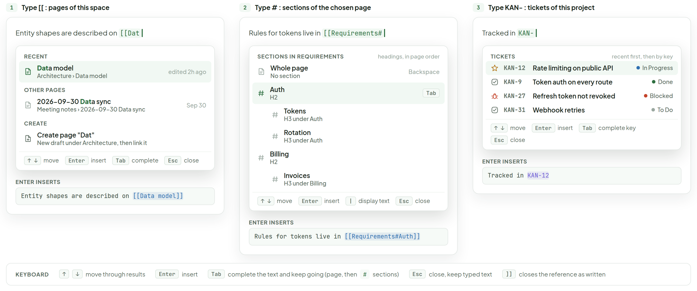
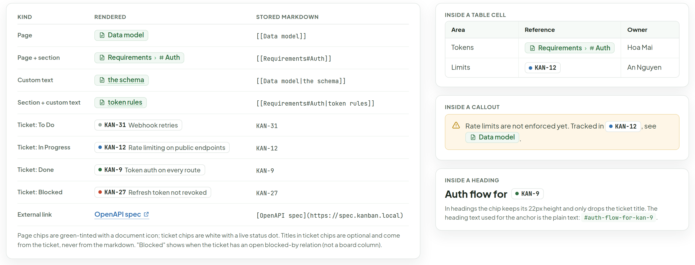
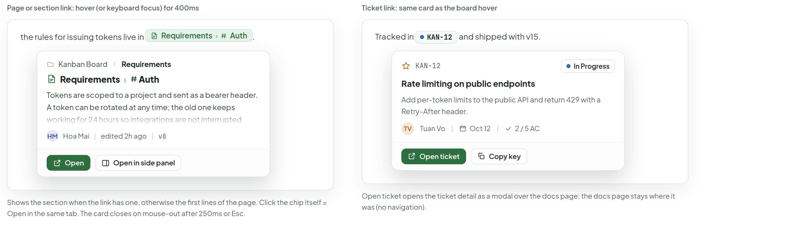
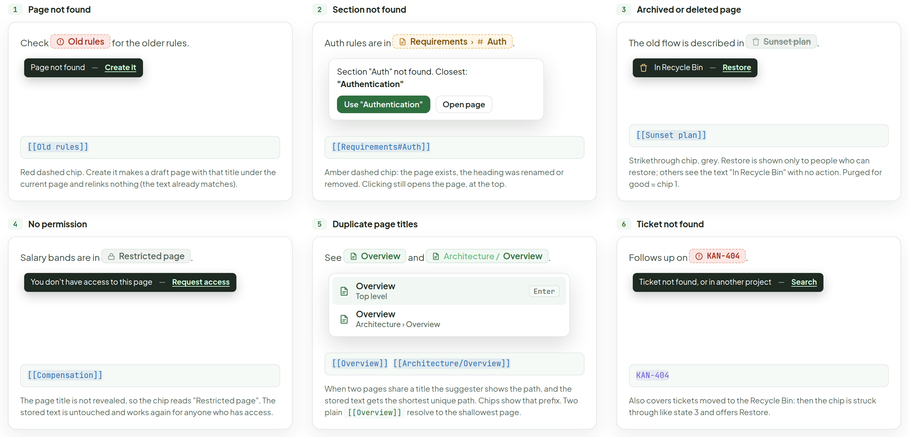
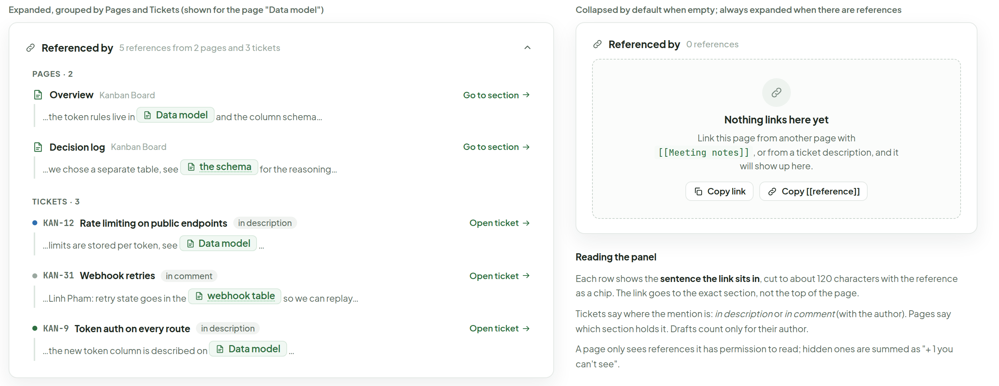
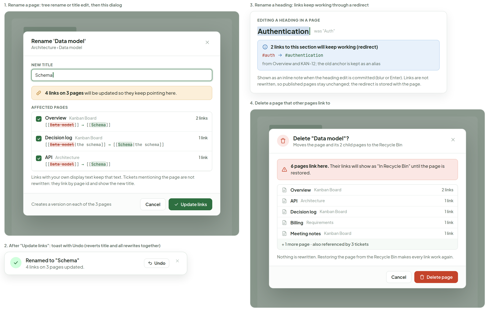
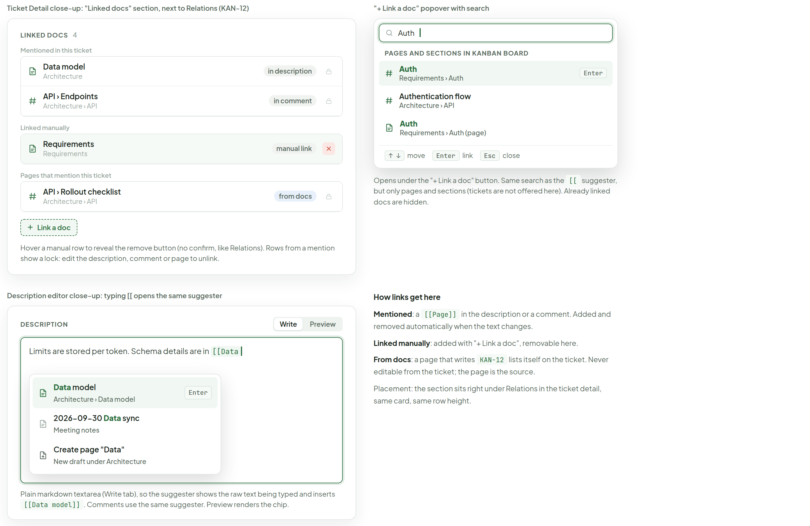
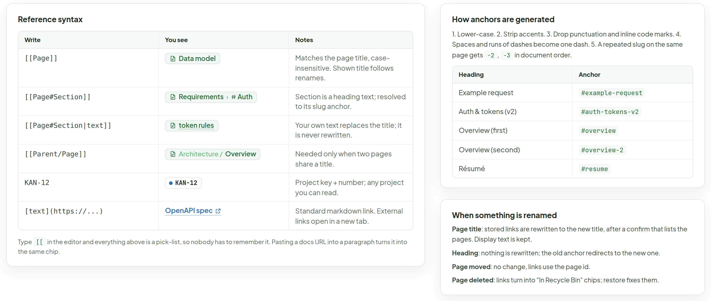

# Docs — references

> Screen — v1 · source: [`DocsRefs.dc.html`](../source/DocsRefs.dc.html) · canvas `1791209276-a0aa` · sha256 `4e397a89b0f0ef14efcf7646cf61e5e00a1b9eec6e284c4bdf2c3a6c01857d5f`

How pages, sections and tickets are referenced across Docs and tickets: the [[ suggester, the chips it produces, previews, broken states, backlinks, what happens on rename or delete, the "Linked docs" section on a ticket and a markdown cheat sheet. Desktop and web only.

---

## A. "[[" suggester in the editor: pages, then sections after #, then tickets after KAN-

Source: [DocsRefs.dc.html](../source/DocsRefs.dc.html) › first block "A. "[[" suggester in the editor…" (three 440px-class cards plus a keyboard legend strip)

- Card "1" "Type [[ : pages of this space": line "Entity shapes are described on" `[[Dat` with caret. Menu: "RECENT": "Data model" "Architecture › Data model" "edited 2h ago" (highlighted); "OTHER PAGES": "2026-09-30 Data sync" "Meeting notes › 2026-09-30 Data sync" "Sep 30"; "CREATE": "Create page "Dat"" "New draft under Architecture, then link it". Footer: "↑ ↓" "move", "Enter" "insert", "Tab" "complete", "Esc" "close". "ENTER INSERTS": `Entity shapes are described on [[Data model]]`.
- Card "2" "Type # : sections of the chosen page": line "Rules for tokens live in" `[[Requirements#` with caret. Menu: "SECTIONS IN REQUIREMENTS" "headings, in page order"; "Whole page" "No section" "Backspace"; "Auth" "H2" "Tab" (highlighted); "Tokens" "H3 under Auth"; "Rotation" "H3 under Auth"; "Billing" "H2"; "Invoices" "H3 under Billing". Footer: "↑ ↓" "move", "Enter" "insert", "|" "display text", "Esc" "close". "ENTER INSERTS": `Rules for tokens live in [[Requirements#Auth]]`.
- Card "3" "Type KAN- : tickets of this project": line "Tracked in" `KAN-` with caret. Menu: "TICKETS" "recent first, then by key"; "KAN-12" "Rate limiting on public API" "In Progress" (highlighted); "KAN-9" "Token auth on every route" "Done"; "KAN-27" "Refresh token not revoked" "Blocked"; "KAN-31" "Webhook retries" "To Do". Footer: "↑ ↓" "move", "Enter" "insert", "Tab" "complete key", "Esc" "close". "ENTER INSERTS": `Tracked in KAN-12`.
- Legend strip "KEYBOARD": "↑" "↓" "move through results"; "Enter" "insert"; "Tab" "complete the text and keep going (page, then" "#" "sections)"; "Esc" "close, keep typed text"; "]]" "closes the reference as written".

## B. Rendered reference chips, plain and inside a table cell, a callout and a heading

Source: [DocsRefs.dc.html](../source/DocsRefs.dc.html) › second block "B. Rendered reference chips…" (kinds table 830px; three cards stacked on the right)

| KIND | RENDERED | STORED MARKDOWN |
|---|---|---|
| Page | page chip "Data model" | `[[Data model]]` |
| Page + section | page chip "Requirements" › "Auth" | `[[Requirements#Auth]]` |
| Custom text | page chip "the schema" | `[[Data model\|the schema]]` |
| Section + custom text | page chip "token rules" | `[[Requirements#Auth\|token rules]]` |
| Ticket: To Do | ticket chip "KAN-31" "Webhook retries" | `KAN-31` |
| Ticket: In Progress | ticket chip "KAN-12" "Rate limiting on public endpoints" | `KAN-12` |
| Ticket: Done | ticket chip "KAN-9" "Token auth on every route" | `KAN-9` |
| Ticket: Blocked | ticket chip "KAN-27" "Refresh token not revoked" | `KAN-27` |
| External link | link "OpenAPI spec" | `[OpenAPI spec](https://spec.kanban.local)` |

- Below the table: "Page chips are green-tinted with a document icon; ticket chips are white with a live status dot. Titles in ticket chips are optional and come from the ticket, never from the markdown. "Blocked" shows when the ticket has an open blocked-by relation (not a board column)."
- Card "INSIDE A TABLE CELL": table "Area", "Reference", "Owner"; row "Tokens" page chip "Requirements" › "Auth" "Hoa Mai"; row "Limits" ticket chip "KAN-12" "An Nguyen".
- Card "INSIDE A CALLOUT": warning callout "Rate limits are not enforced yet. Tracked in" ticket chip "KAN-12" ", see" page chip "Data model" ".".
- Card "INSIDE A HEADING": heading "Auth flow for" ticket chip "KAN-9". "In headings the chip keeps its 22px height and only drops the ticket title. The heading text used for the anchor is the plain text:" `#auth-flow-for-kan-9` ".".

## C. Hover preview card for a page link and for a ticket link

Source: [DocsRefs.dc.html](../source/DocsRefs.dc.html) › third block "C. Hover preview card…" (two cards, 560px each)

- "Page or section link: hover (or keyboard focus) for 400ms": line "the rules for issuing tokens live in" page chip "Requirements" › "Auth" ".". Preview card: breadcrumb "Kanban Board" › "Requirements"; title page icon "Requirements" › "Auth"; excerpt "Tokens are scoped to a project and sent as a bearer header. A token can be rotated at any time; the old one keeps working for 24 hours so integrations are not interrupted." (fades out at the bottom); meta "HM" "Hoa Mai" "|" "edited 2h ago" "|" "v8"; buttons "Open", "Open in side panel". Caption: "Shows the section when the link has one, otherwise the first lines of the page. Click the chip itself = Open in the same tab. The card closes on mouse-out after 250ms or Esc."
- "Ticket link: same card as the board hover": line "Tracked in" ticket chip "KAN-12" "and shipped with v15.". Card: "KAN-12", status "In Progress"; title "Rate limiting on public endpoints"; "Add per-token limits to the public API and return 429 with a Retry-After header."; meta "TV" "Tuan Vo" "|" "Oct 12" "|" "2 / 5 AC"; buttons "Open ticket", "Copy key". Caption: "Open ticket opens the ticket detail as a modal over the docs page; the docs page stays where it was (no navigation)."

## D. Broken and ambiguous references

Source: [DocsRefs.dc.html](../source/DocsRefs.dc.html) › fourth block "D. Broken and ambiguous references" (six cards in two rows of three)

- "1" "Page not found": line "Check" red dashed chip "Old rules" "for the older rules."; tooltip "Page not found" "—" "Create it"; stored `[[Old rules]]`. Caption: "Red dashed chip. Create it makes a draft page with that title under the current page and relinks nothing (the text already matches)."
- "2" "Section not found": line "Auth rules are in" amber dashed chip "Requirements" › "Auth" "."; popover "Section "Auth" not found. Closest: "Authentication"" with buttons "Use "Authentication"", "Open page"; stored `[[Requirements#Auth]]`. Caption: "Amber dashed chip: the page exists, the heading was renamed or removed. Clicking still opens the page, at the top."
- "3" "Archived or deleted page": line "The old flow is described in" struck-through grey chip "Sunset plan" "."; tooltip "In Recycle Bin" "—" "Restore"; stored `[[Sunset plan]]`. Caption: "Strikethrough chip, grey. Restore is shown only to people who can restore; others see the text "In Recycle Bin" with no action. Purged for good = chip 1."
- "4" "No permission": line "Salary bands are in" grey lock chip "Restricted page" "."; tooltip "You don't have access to this page" "—" "Request access"; stored `[[Compensation]]`. Caption: "The page title is not revealed, so the chip reads "Restricted page". The stored text is untouched and works again for anyone who has access."
- "5" "Duplicate page titles": line "See" page chip "Overview" "and" page chip "Architecture /" "Overview" "."; suggester with "Overview" "Top level" "Enter" (highlighted) and "Overview" "Architecture › Overview"; stored `[[Overview]] [[Architecture/Overview]]`. Caption: "When two pages share a title the suggester shows the path, and the stored text gets the shortest unique path. Chips show that prefix. Two plain" `[[Overview]]` "resolve to the shallowest page."
- "6" "Ticket not found": line "Follows up on" red dashed chip "KAN-404" "."; tooltip "Ticket not found, or in another project" "—" "Search"; stored `KAN-404`. Caption: "Also covers tickets moved to the Recycle Bin: then the chip is struck through like state 3 and offers Restore."

## E. Backlinks: the "Referenced by" panel and its empty state

Source: [DocsRefs.dc.html](../source/DocsRefs.dc.html) › fifth block "E. Backlinks: the "Referenced by" panel…" (760px expanded panel; 540px empty state with notes)

- "Expanded, grouped by Pages and Tickets (shown for the page "Data model")": "Referenced by" "5 references from 2 pages and 3 tickets", collapse chevron.
  - "PAGES · 2": "Overview" "Kanban Board" "Go to section" — "…the token rules live in" page chip "Data model" "and the column schema…"; "Decision log" "Kanban Board" "Go to section" — "…we chose a separate table, see" page chip "the schema" "for the reasoning…".
  - "TICKETS · 3": "KAN-12" "Rate limiting on public endpoints" "in description" "Open ticket" — "…limits are stored per token, see" page chip "Data model" "…"; "KAN-31" "Webhook retries" "in comment" "Open ticket" — "…Linh Pham: retry state goes in the" page chip "webhook table" "so we can replay…"; "KAN-9" "Token auth on every route" "in description" "Open ticket" — "…the new token column is described on" page chip "Data model" "…".
- "Collapsed by default when empty; always expanded when there are references": "Referenced by" "0 references"; dashed empty state "Nothing links here yet" "Link this page from another page with" `[[Meeting notes]]` ", or from a ticket description, and it will show up here."; buttons "Copy link", "Copy [[reference]]".
- "Reading the panel":
  - "Each row shows the sentence the link sits in, cut to about 120 characters with the reference as a chip. The link goes to the exact section, not the top of the page."
  - "Tickets say where the mention is: in description or in comment (with the author). Pages say which section holds it. Drafts count only for their author."
  - "A page only sees references it has permission to read; hidden ones are summed as "+ 1 you can't see"."

## F. Rename, move and delete handling

Source: [DocsRefs.dc.html](../source/DocsRefs.dc.html) › sixth block "F. Rename, move and delete handling" (two 668px columns: 1 rename dialog + 2 toast; 3 heading rename + 4 delete dialog)

- "1. Rename a page: tree rename or title edit, then this dialog": dialog "Rename 'Data model'" "Architecture › Data model", close. "NEW TITLE" field "Schema". Amber note "4 links on 3 pages will be updated so they keep pointing here." "AFFECTED PAGES" (all checked):
  - "Overview" "Kanban Board" "2 links": `[[Data model]] → [[Schema]]`
  - "Decision log" "Kanban Board" "1 link": `[[Data model|the schema]] → [[Schema|the schema]]`
  - "API" "Architecture" "1 link": `[[Data model]] → [[Schema]]`
  - "Links with your own display text keep that text. Tickets mentioning the page are not rewritten: they link by page id and show the new title."
  - Footer: "Creates a version on each of the 3 pages"; buttons "Cancel", "Update links".
- "2. After "Update links": toast with Undo (reverts title and all rewrites together)": toast "Renamed to "Schema"" "4 links on 3 pages updated." button "Undo", close.
- "3. Rename a heading: links keep working through a redirect": "EDITING A HEADING IN A PAGE"; heading "Authentication" (selected, caret) "was "Auth""; blue note "2 links to this section will keep working (redirect)" `#auth → #authentication` "from Overview and KAN-12; the old anchor is kept as an alias". Caption: "Shown as an inline note when the heading edit is committed (blur or Enter). Links are not rewritten, so published pages stay unchanged; the redirect is stored with the page."
- "4. Delete a page that other pages link to": dialog "Delete "Data model"?" "Moves the page and its 2 child pages to the Recycle Bin", close. Red note "6 pages link here. Their links will show as "In Recycle Bin" until the page is restored." List: "Overview" "Kanban Board" "2 links"; "API" "Architecture" "1 link"; "Decision log" "Kanban Board" "1 link"; "Billing" "Requirements" "1 link"; "Meeting notes" "Kanban Board" "1 link"; "+ 1 more page · also referenced by 3 tickets". "Nothing is rewritten. Restoring the page from the Recycle Bin makes every link work again." Buttons "Cancel", "Delete page". Dialogs 1 and 4 sit on a dimmed backdrop.

## G. Ticket detail and Docs: "Linked docs" section and [[ in the description

Source: [DocsRefs.dc.html](../source/DocsRefs.dc.html) › seventh block "G. Ticket detail and Docs…" (two rows: Linked docs close-up with the "+ Link a doc" popover; description-editor close-up with the "How links get here" notes)

- "Ticket Detail close-up: "Linked docs" section, next to Relations (KAN-12)": "LINKED DOCS" "4".
  - "Mentioned in this ticket": "Data model" "Architecture" "in description" (lock); "API › Endpoints" "Architecture › API" "in comment" (lock).
  - "Linked manually": "Requirements" "Requirements" "manual link" with red remove button (hovered row).
  - "Pages that mention this ticket": "API › Rollout checklist" "Architecture › API" "from docs" (lock).
  - Dashed button "+ Link a doc".
  - "Hover a manual row to reveal the remove button (no confirm, like Relations). Rows from a mention show a lock: edit the description, comment or page to unlink."
- ""+ Link a doc" popover with search": search field "Auth"; "PAGES AND SECTIONS IN KANBAN BOARD"; "Auth" "Requirements › Auth" "Enter" (highlighted); "Authentication flow" "Architecture › API"; "Auth" "Requirements › Auth (page)". Footer: "↑ ↓" "move", "Enter" "link", "Esc" "close". Caption: "Opens under the "+ Link a doc" button. Same search as the" `[[` "suggester, but only pages and sections (tickets are not offered here). Already linked docs are hidden."
- "Description editor close-up: typing [[ opens the same suggester": "DESCRIPTION" tabs "Write" (selected), "Preview"; text "Limits are stored per token. Schema details are in" `[[Data` with caret. Suggester: "Data model" "Architecture › Data model" "Enter" (highlighted); "2026-09-30 Data sync" "Meeting notes"; "Create page "Data"" "New draft under Architecture". Caption: "Plain markdown textarea (Write tab), so the suggester shows the raw text being typed and inserts" `[[Data model]]` ". Comments use the same suggester. Preview renders the chip."
- "How links get here":
  - "Mentioned: a" `[[Page]]` "in the description or a comment. Added and removed automatically when the text changes."
  - "Linked manually: added with "+ Link a doc", removable here."
  - "From docs: a page that writes" `KAN-12` "lists itself on the ticket. Never editable from the ticket; the page is the source."
  - "Placement: the section sits right under Relations in the ticket detail, same card, same row height."

## H. Markdown reference cheat sheet

Source: [DocsRefs.dc.html](../source/DocsRefs.dc.html) › eighth block "H. Markdown reference cheat sheet" (820px syntax card; 518px column with anchors and rename cards)

"Reference syntax":

| Write | You see | Notes |
|---|---|---|
| `[[Page]]` | page chip "Data model" | Matches the page title, case-insensitive. Shown title follows renames. |
| `[[Page#Section]]` | page chip "Requirements" › "Auth" | Section is a heading text; resolved to its slug anchor. |
| `[[Page#Section\|text]]` | page chip "token rules" | Your own text replaces the title; it is never rewritten. |
| `[[Parent/Page]]` | page chip "Architecture /" "Overview" | Needed only when two pages share a title. |
| `KAN-12` | ticket chip "KAN-12" | Project key + number; any project you can read. |
| `[text](https://...)` | link "OpenAPI spec" | Standard markdown link. External links open in a new tab. |

- Below the table: "Type" `[[` "in the editor and everything above is a pick-list, so nobody has to remember it. Pasting a docs URL into a paragraph turns it into the same chip."
- "How anchors are generated": "1. Lower-case. 2. Strip accents. 3. Drop punctuation and inline code marks. 4. Spaces and runs of dashes become one dash. 5. A repeated slug on the same page gets" `-2` "," `-3` "in document order."

| Heading | Anchor |
|---|---|
| Example request | `#example-request` |
| Auth & tokens (v2) | `#auth-tokens-v2` |
| Overview (first) | `#overview` |
| Overview (second) | `#overview-2` |
| Résumé | `#resume` |

- "When something is renamed":
  - "Page title: stored links are rewritten to the new title, after a confirm that lists the pages. Display text is kept."
  - "Heading: nothing is rewritten; the old anchor redirects to the new one."
  - "Page moved: no change, links use the page id."
  - "Page deleted: links turn into "In Recycle Bin" chips; restore fixes them."

## Note

Source: [DocsRefs.dc.html](../source/DocsRefs.dc.html) › final "Notes" list

- Resolution: a reference is resolved by the page's stable id, not by the text. The markdown still stores the readable title ([[Data model]]), and the shown title always follows the page's current title. Resolution order for [[Title]]: exact title, then unique path (Parent/Title), then shallowest match.
- Stored text is rewritten: on a page rename the links in other pages are changed to the new title (confirm dialog, F1), so exported markdown stays readable outside the app. Display text after | is never touched.
- Slug anchors: headings get lower-case dashed slugs, duplicates get -2; renaming a heading records an alias from the old slug to the new one so [[Page#Old]] keeps working (F3).
- Backlinks: "Referenced by" (E) and "Linked docs" (G) read the same index: page-to-page, page-to-ticket and ticket-to-page. It is updated when a page is published or a ticket description or comment is saved. Drafts are not indexed for other people.
- Permissions: a reference never leaks a title the viewer cannot read (D4). Backlinks are filtered per viewer. Linking to a page you cannot read is allowed in the editor but shows the restricted chip until access exists.
- TODO(backend): link index table docs_links (source_type page|ticket, source_id, source_section, target_page_id, target_anchor, display_text, context_snippet, origin description|comment|page), maintained on publish and on ticket save.
- TODO(backend): resolve endpoint that takes a batch of references from a rendered page and returns title, path, status (ok, missing, section_missing, in_bin, forbidden, ambiguous), closest section and the preview text for the hover card.
- TODO(backend): rename rewrite job: dry run returns the affected pages and counts (F1), commit rewrites each page as a new version in one transaction and supports Undo; heading alias map docs_anchor_aliases per page (F3).
- TODO(backend): manual ticket-to-doc links (G) as rows with origin "manual", plus search for the popover (pages and headings, current space only).
- TODO(backend): MCP tool to resolve links (resolve_docs_links) and one to list backlinks of a page or ticket, so agents can follow references.
- Invented for this design: the "Blocked" ticket chip (derived from blocked-by relations), the hover-card delay values, the "Restricted page" wording, "Request access", the Undo on rename, the ticket-to-doc "manual" links and the "From docs" origin pill.
