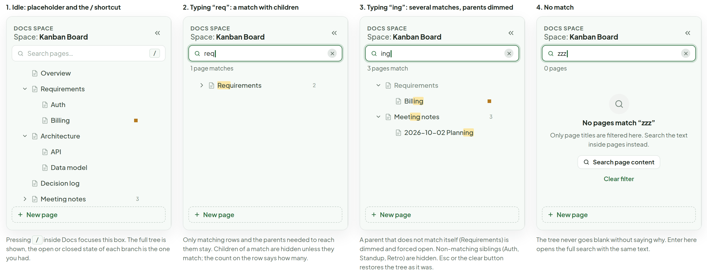
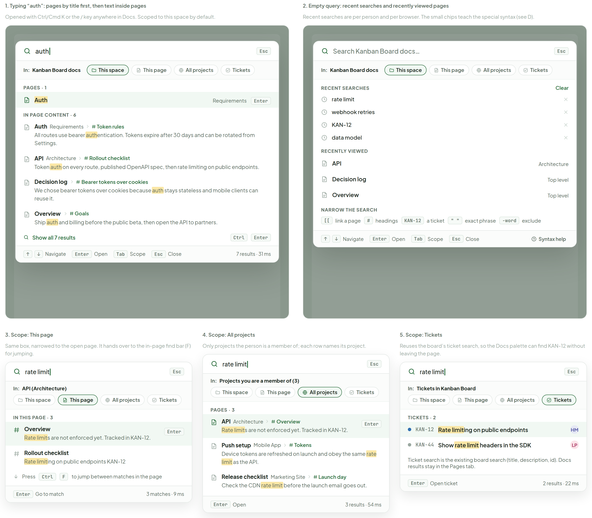
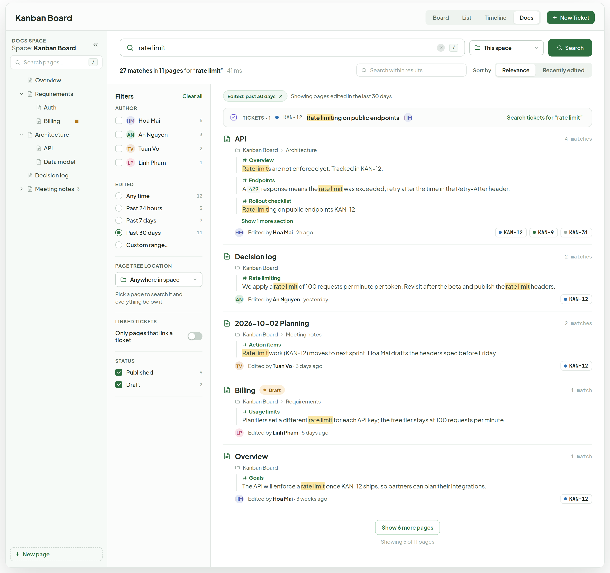
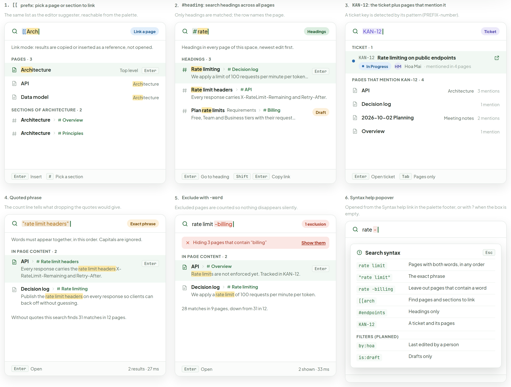
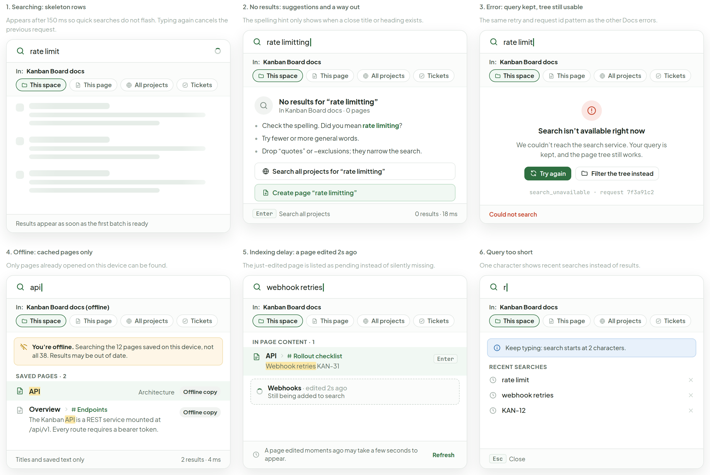
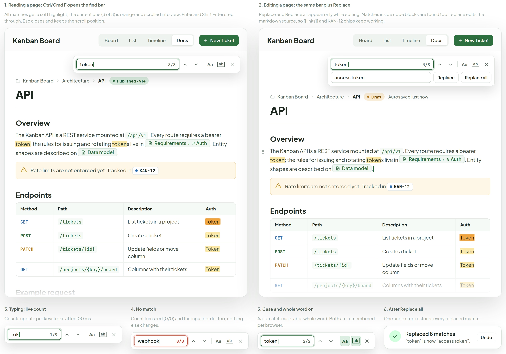

# Docs — search

> Screen — v1 · source: [`DocsSearch.dc.html`](../source/DocsSearch.dc.html) · canvas `1791209276-a0aa` · sha256 `031580304a2f367424c12e297400977de81c1c7b3d80a208ec04cbf6c7098508`

Finding things in the Docs space: the quick filter in the page tree, a Ctrl/Cmd K search palette, a full results page with filters, special queries for links, headings, tickets and phrases, empty and failure states, and find-in-page. Same shell, tree and chips as the other Docs boards.

---

## A. Sidebar quick filter in the page tree

Source: [DocsSearch.dc.html](../source/DocsSearch.dc.html) › first block "A. Sidebar quick filter in the page tree" (four sidebar cards side by side, each with a caption below)



Every card shows the sidebar header "DOCS SPACE" "Space:" "Kanban Board" with a collapse button, the filter box, the tree area and the dashed "New page" button at the bottom.

### 1. Idle: placeholder and the / shortcut

- Search box with placeholder "Search pages…" and key hint "/".
- Full tree: "Overview"; "Requirements" (expanded) with "Auth", "Billing" (small orange square marker); "Architecture" (expanded) with "API", "Data model"; "Decision log"; "Meeting notes" (collapsed) with count "3".
- Caption: "Pressing" key "/" "inside Docs focuses this box. The full tree is shown, the open or closed state of each branch is the one you had."

### 2. Typing “req”: a match with children

- Box contains `req` with a clear button; count line "1 page matches".
- One row: "Requirements" (collapsed, "Req" highlighted in the row, as "Req" + "uirements") with count "2".
- Caption: "Only matching rows and the parents needed to reach them stay. Children of a match are hidden unless they match; the count on the row says how many."

### 3. Typing “ing”: several matches, parents dimmed

- Box contains `ing`; count line "3 pages match".
- Rows: "Requirements" (dimmed, expanded) with child "Billing" ("ing" highlighted, orange square marker); "Meeting notes" ("ing" in "Meeting" highlighted, expanded) with count "3" and child "2026-10-02 Planning" ("ing" in "Planning" highlighted).
- Caption: "A parent that does not match itself (Requirements) is dimmed and forced open. Non-matching siblings (Auth, Standup, Retro) are hidden. Esc or the clear button restores the tree as it was."

### 4. No match

- Box contains `zzz`; count line "0 pages".
- Empty state with search icon: "No pages match “zzz”"; "Only page titles are filtered here. Search the text inside pages instead."; button "Search page content"; link "Clear filter".
- Caption: "The tree never goes blank without saying why. Enter here opens the full search with the same text."

## B. Search palette (Ctrl/Cmd K or /): scoped to this space

Source: [DocsSearch.dc.html](../source/DocsSearch.dc.html) › second block "B. Search palette (Ctrl/Cmd K or /): scoped to this space" (two palettes on a dimmed backdrop, then three palettes in a row below)



All palettes share a search row with a magnifier, the query and an "Esc" key; an "In:" row with scope chips "This space", "This page", "All projects", "Tickets" (the active chip has a green outline); a results area; and a footer with key hints. Search terms inside results are highlighted.

### 1. Typing “auth”: pages by title first, then text inside pages

- Caption: "Opened with Ctrl/Cmd K or the / key anywhere in Docs. Scoped to this space by default."
- Query `auth`; "In:" "Kanban Board docs"; chips "This space" (active), "This page", "All projects", "Tickets".
- Group "PAGES · 1": row "Auth" ("Auth" highlighted) "Requirements" with key "Enter" (selected row).
- Group "IN PAGE CONTENT · 6" (four of the six shown):
  - "Auth" "Requirements" › "# Token rules": "All routes use bearer authentication. Tokens expire after 30 days and can be rotated from Settings." ("auth" in "authentication" highlighted)
  - "API" "Architecture" › "# Rollout checklist": "Token auth on every route, published OpenAPI spec, then rate limiting on public endpoints." ("auth" highlighted)
  - "Decision log" › "# Bearer tokens over cookies": "We chose bearer tokens over cookies because auth stays stateless and mobile clients can reuse it." ("auth" highlighted)
  - "Overview" › "# Goals": "Ship auth and billing before the public beta, then open the API to partners." ("auth" highlighted)
- Link "Show all 7 results" with keys "Ctrl" "Enter".
- Footer: keys "↑" "↓" "Navigate", "Enter" "Open", "Tab" "Scope", "Esc" "Close"; "7 results · 31 ms".

### 2. Empty query: recent searches and recently viewed pages

- Caption: "Recent searches are per person and per browser. The small chips teach the special syntax (see D)."
- Placeholder "Search Kanban Board docs…"; same "In:" row.
- "RECENT SEARCHES" with link "Clear": "rate limit", "webhook retries", "KAN-12", "data model" (each with a remove ×).
- "RECENTLY VIEWED": "API" "Architecture"; "Decision log" "Top level"; "Overview" "Top level".
- "NARROW THE SEARCH" chips: keys "[[" "link a page"; "#" "headings"; "KAN-12" "a ticket"; `" "` "exact phrase"; "-word" "exclude".
- Footer: "↑" "↓" "Navigate", "Enter" "Open", "Tab" "Scope", "Esc" "Close"; link "Syntax help".

### 3. Scope: This page

- Caption: "Same box, narrowed to the open page. It hands over to the in-page find bar (F) for jumping."
- Query `rate limit`; "In:" "API (Architecture)"; chip "This page" active.
- Group "IN THIS PAGE · 3" (two shown):
  - "Overview": "Rate limits are not enforced yet. Tracked in KAN-12." ("Rate limit" highlighted) with key "Enter" (selected).
  - "Rollout checklist": "Rate limiting on public endpoints KAN-12" ("Rate limit" highlighted).
- Hint: "Press" keys "Ctrl" "F" "to jump between matches in the page".
- Footer: "Enter" "Go to match"; "3 matches · 9 ms".

### 4. Scope: All projects

- Caption: "Only projects the person is a member of; each row names its project."
- Query `rate limit`; "In:" "Projects you are a member of (3)"; chip "All projects" active.
- Group "PAGES · 3":
  - "API" "Architecture" › "# Overview": "Rate limits are not enforced yet. Tracked in KAN-12." (selected, key "Enter")
  - "Push setup" "Mobile App" › "# Tokens": "Device tokens are refreshed on launch and obey the same rate limit as the API."
  - "Release checklist" "Marketing Site" › "# Launch day": "Check the CDN rate limit before the launch email goes out."
- Footer: "Enter" "Open"; "3 results · 54 ms".

### 5. Scope: Tickets

- Caption: "Reuses the board’s ticket search, so the Docs palette can find KAN-12 without leaving the page."
- Query `rate limit`; "In:" "Tickets in Kanban Board"; chip "Tickets" active.
- Group "TICKETS · 2": "KAN-12" "Rate limiting on public endpoints" with avatar "HM" (selected); "KAN-44" "Show rate limit headers in the SDK" with avatar "LP".
- Note under the list: "Ticket search is the existing board search (title, description, id). Docs results stay in the Pages tab."
- Footer: "Enter" "Open ticket"; "2 results · 22 ms".

## C. Full-page results for “rate limit”

Source: [DocsSearch.dc.html](../source/DocsSearch.dc.html) › third block "C. Full-page results for “rate limit”" (one 1368px-wide app frame)



- App header: "Kanban Board"; tabs "Board", "List", "Timeline", "Docs" (active); button "New Ticket".
- Sidebar: "DOCS SPACE" "Space:" "Kanban Board"; filter box "Search pages…" with "/"; tree "Overview", "Requirements" (expanded) with "Auth", "Billing"; "Architecture" (expanded) with "API", "Data model"; "Decision log"; "Meeting notes" "3"; button "New page".
- Search bar: query `rate limit` with clear button and key "/"; scope select "This space"; button "Search".
- Summary: "27 matches" "in" "11 pages" "for “" "rate limit" "”" "·" "41 ms"; field "Search within results…"; "Sort by" segmented "Relevance" (active) and "Recently edited".

### Filter column

- "Filters" with link "Clear all".
- "AUTHOR" checkboxes with counts: "Hoa Mai" 5; "An Nguyen" 3; "Tuan Vo" 2; "Linh Pham" 1 (avatars "HM", "AN", "TV", "LP").
- "EDITED" radios: "Any time" 12; "Past 24 hours" 3; "Past 7 days" 7; "Past 30 days" 11 (selected); "Custom range…".
- "PAGE TREE LOCATION" select "Anywhere in space"; hint "Pick a page to search it and everything below it."
- "LINKED TICKETS" toggle (off) "Only pages that link a ticket".
- "STATUS" checkboxes (both checked): "Published" 9; "Draft" 2.

### Results

- Active filter chip "Edited: past 30 days" with ×, and text "Showing pages edited in the last 30 days".
- Ticket strip: "TICKETS · 1" "KAN-12" "Rate limiting on public endpoints" ("Rate limit" highlighted) avatar "HM"; link "Search tickets for “rate limit”".
- Result "API" (right: "4 matches"), path "Kanban Board" › "Architecture". Sections (matches highlighted):
  - "# Overview": "Rate limits are not enforced yet. Tracked in KAN-12."
  - "# Endpoints": "A" `429` "response means the rate limit was exceeded; retry after the time in the Retry-After header."
  - "# Rollout checklist": "Rate limiting on public endpoints KAN-12"
  - link "Show 1 more section"
  - Footer: avatar "HM" "Edited by" "Hoa Mai" "· 2h ago"; ticket chips "KAN-12", "KAN-9", "KAN-31".
- Result "Decision log" ("2 matches"), "Kanban Board". Section "# Rate limiting": "We apply a rate limit of 100 requests per minute per token. Revisit after the beta and publish the rate limit headers." Footer: "AN" "Edited by" "An Nguyen" "· yesterday"; chip "KAN-12".
- Result "2026-10-02 Planning" ("2 matches"), "Kanban Board" › "Meeting notes". Section "# Action items": "Rate limit work (KAN-12) moves to next sprint. Hoa Mai drafts the headers spec before Friday." Footer: "TV" "Edited by" "Tuan Vo" "· 3 days ago"; chip "KAN-12".
- Result "Billing" with badge "Draft" ("1 match"), "Kanban Board" › "Requirements". Section "# Usage limits": "Plan tiers set a different rate limit for each API key; the free tier stays at 100 requests per minute." Footer: "LP" "Edited by" "Linh Pham" "· 5 days ago".
- Result "Overview" ("1 match"), "Kanban Board". Section "# Goals": "The API will enforce a rate limit once KAN-12 ships, so partners can plan their integrations." Footer: "HM" "Edited by" "Hoa Mai" "· 3 weeks ago"; chip "KAN-12".
- Button "Show 6 more pages"; text "Showing 5 of 11 pages".

## D. Special queries and syntax help

Source: [DocsSearch.dc.html](../source/DocsSearch.dc.html) › fourth block "D. Special queries and syntax help" (six palette cards in two rows of three)



### 1. `[[` prefix: pick a page or section to link

- Caption: "The same list as the editor suggester, reachable from the palette."
- Query `[[Arch` (highlighted); mode badge "Link a page".
- Hint: "Link mode: results are copied or inserted as a reference, not opened."
- "PAGES · 3": "Architecture" ("Arch" highlighted) "Top level" key "Enter" (selected); "API" "Architecture" (highlighted); "Data model" "Architecture" (highlighted).
- "SECTIONS OF ARCHITECTURE · 2": "Architecture" › "# Overview"; "Architecture" › "# Principles".
- Footer: "Enter" "Insert"; "#" "Pick a section".

### 2. `#heading`: search headings across all pages

- Caption: "Only headings are matched; the row names the page."
- Query `#rate` (highlighted); mode badge "Headings".
- Hint: "Headings in every page of this space, newest edit first."
- "HEADINGS · 3":
  - "Rate limiting" › "# Decision log" key "Enter": "We apply a limit of 100 requests per minute per token. Revisit after the beta."
  - "Rate limit headers" › "# API": "Every response carries X-RateLimit-Remaining and Retry-After."
  - "Plan rate limits" "Requirements" › "# Billing", badge "Draft": "Free, Team and Business tiers with their request budgets."
- Footer: "Enter" "Go to heading"; "Shift" "Enter" "Copy link".

### 3. `KAN-12`: the ticket plus pages that mention it

- Caption: "A ticket key is detected by its pattern (PREFIX-number)."
- Query `KAN-12` (highlighted); mode badge "Ticket".
- "TICKET · 1": "KAN-12" "Rate limiting on public endpoints"; status "In Progress"; avatar "HM" "Hoa Mai" "· mentioned in 4 pages".
- "PAGES THAT MENTION KAN-12 · 4": "API" "Architecture" "3 mentions"; "Decision log" "1 mention"; "2026-10-02 Planning" "Meeting notes" "2 mentions"; "Overview" "1 mention".
- Footer: "Enter" "Open ticket"; "Tab" "Pages only".

### 4. Quoted phrase

- Caption: "The count line tells what dropping the quotes would give."
- Query `"rate limit headers"`; mode badge "Exact phrase".
- Hint: "Words must appear together, in this order. Capitals are ignored."
- "IN PAGE CONTENT · 2":
  - "API" › "Rate limit headers" key "Enter": "Every response carries the rate limit headers X-RateLimit-Remaining and Retry-After." (phrase highlighted)
  - "Decision log" › "Rate limiting": "Publish the rate limit headers on every response so clients can back off without guessing." (phrase highlighted)
- Line: "Without quotes this search finds 31 matches in 12 pages."
- Footer: "Enter" "Open"; "2 results · 27 ms".

### 5. Exclude with `-word`

- Caption: "Excluded pages are counted so nothing disappears silently."
- Query `rate limit -billing` (the "-billing" part highlighted in red); badge "1 exclusion".
- Red notice: "Hiding 3 pages that contain “billing”" with link "Show them".
- "IN PAGE CONTENT · 2": "API" › "Overview" key "Enter": "Rate limits are not enforced yet. Tracked in KAN-12."; "Decision log" › "Rate limiting": "We apply a rate limit of 100 requests per minute per token."
- Line: "28 matches in 9 pages, down from 31 in 12."
- Footer: "Enter" "Open"; "2 shown · 33 ms".

### 6. Syntax help popover

- Caption: "Opened from the Syntax help link in the palette footer, or with ? when the box is empty."
- Palette query `rate -` with a popover "Search syntax" and key "Esc" over it:

| Syntax | Meaning |
|---|---|
| `rate limit` | Pages with both words, in any order |
| `"rate limit"` | The exact phrase |
| `rate -billing` | Leave out pages that contain a word |
| `[[arch` | Find pages and sections to link |
| `#endpoints` | Headings only |
| `KAN-12` | A ticket and its pages |

- Sub-heading "FILTERS (PLANNED)":

| Syntax | Meaning |
|---|---|
| `by:hoa` | Last edited by a person |
| `is:draft` | Drafts only |

## E. States: searching, nothing found, error, offline, indexing delay

Source: [DocsSearch.dc.html](../source/DocsSearch.dc.html) › fifth block "E. States: searching, nothing found, error, offline, indexing delay" (six palette cards in two rows of three)



### 1. Searching: skeleton rows

- Caption: "Appears after 150 ms so quick searches do not flash. Typing again cancels the previous request."
- Query `rate limit` with a spinner; "In:" "Kanban Board docs"; chips "This space" (active), "This page", "All projects", "Tickets".
- Three grey skeleton rows (shimmer, shown frozen).
- Footer: "Results appear as soon as the first batch is ready".

### 2. No results: suggestions and a way out

- Caption: "The spelling hint only shows when a close title or heading exists."
- Query `rate limitting`; same "In:" row.
- "No results for “rate limitting”"; "In Kanban Board docs · 0 pages".
- Bullets: "Check the spelling. Did you mean" "rate limiting" (green link) "?"; "Try fewer or more general words."; "Drop “quotes” or −exclusions; they narrow the search."
- Buttons: "Search all projects for “rate limitting”"; "Create page “rate limitting”" (green, highlighted).
- Footer: "Enter" "Search all projects"; "0 results · 18 ms".

### 3. Error: query kept, tree still usable

- Caption: "The same retry and request id pattern as the other Docs errors."
- Query `rate limit`; same "In:" row.
- Red icon; "Search isn’t available right now"; "We couldn’t reach the search service. Your query is kept, and the page tree still works."
- Buttons: "Try again" (green), "Filter the tree instead".
- Mono line: `search_unavailable · request 7f3a91c2`.
- Footer (red): "Could not search".

### 4. Offline: cached pages only

- Caption: "Only pages already opened on this device can be found."
- Query `api`; "In:" "Kanban Board docs (offline)"; chips as above.
- Amber banner: "You’re offline." "Searching the 12 pages saved on this device, not all 38. Results may be out of date."
- "SAVED PAGES · 2": "API" ("API" highlighted) "Architecture" badge "Offline copy" (selected); "Overview" › "# Endpoints" badge "Offline copy": "The Kanban API is a REST service mounted at /api/v1. Every route requires a bearer token." ("API" highlighted)
- Footer: "Titles and saved text only"; "2 results · 4 ms".

### 5. Indexing delay: a page edited 2s ago

- Caption: "The just-edited page is listed as pending instead of silently missing."
- Query `webhook retries`; same "In:" row.
- "IN PAGE CONTENT · 1": "API" › "# Rollout checklist" key "Enter": "Webhook retries KAN-31" ("Webhook retries" highlighted).
- Dashed pending row with spinner: "Webhooks" "· edited 2s ago"; "Still being added to search".
- Footer: clock icon "A page edited moments ago may take a few seconds to appear." link "Refresh".

### 6. Query too short

- Caption: "One character shows recent searches instead of results."
- Query `r`; same "In:" row.
- Blue info box: "Keep typing: search starts at 2 characters."
- "RECENT SEARCHES": "rate limit", "webhook retries", "KAN-12" (each with ×).
- Footer: "Esc" "Close".

## F. Find in page (Ctrl/Cmd F), reading and editing

Source: [DocsSearch.dc.html](../source/DocsSearch.dc.html) › sixth block "F. Find in page (Ctrl/Cmd F), reading and editing" (two page frames side by side, then four small find-bar cards)



Both page frames show the app header ("Kanban Board"; tabs "Board", "List", "Timeline", "Docs"; button "New Ticket") and the API page: breadcrumb "Kanban Board" › "Architecture" › "API"; title "API"; heading "Overview"; "The Kanban API is a REST service mounted at" `/api/v1` ". Every route requires a bearer token; the rules for issuing and rotating tokens live in" page chip "Requirements › Auth" ". Entity shapes are described on" page chip "Data model" "."; warning callout "Rate limits are not enforced yet. Tracked in" ticket chip "KAN-12" "."; heading "Endpoints" with table (highlighted "token" in the prose, "Token" in the Auth column; the first "Token" is the current match, orange):

| Method | Path | Description | Auth |
|---|---|---|---|
| GET | `/tickets` | List tickets in a project | Token |
| POST | `/tickets` | Create a ticket | Token |
| PATCH | `/tickets/{id}` | Update fields or move column | Token |
| GET | `/projects/{key}/board` | Columns with their tickets | Token |

Below: "Example request" with code block (below) and "Rollout checklist": "Publish the OpenAPI spec"; "Token auth on every route" chip "KAN-9"; "Rate limiting on public endpoints" chip "KAN-12"; "Webhook retries" chip "KAN-31". The page fades out under the table.

```sh
curl -X POST https://kanban.local/api/v1/tickets \
  -H "Authorization: Bearer $TOKEN" \
  -d '{"title": "Add rate limiting", "project": "KAN"}'
```

### 1. Reading a page: Ctrl/Cmd F opens the find bar

- Caption: "All matches get a soft highlight; the current one (3 of 8) is orange and scrolled into view. Enter and Shift Enter step through, Esc closes and keeps the scroll position."
- Badge next to the breadcrumb: "Published · v14".
- Find bar: input `token`, count "3/8", up and down arrows, toggles "Aa" and "ab", close ×.

### 2. Editing a page: the same bar plus Replace

- Caption: "Replace and Replace all appear only while editing. Matches inside code blocks are found too; replace edits the markdown source, so [[links]] and KAN-12 chips keep working."
- Badges next to the breadcrumb: "Draft" and "Autosaved just now".
- Find bar: input `token`, count "3/8", arrows, "Aa", "ab", close ×; second row with field `access token` and buttons "Replace", "Replace all".
- Below the checklist: "Type" key "/" "for blocks, or" key "[[" "to link a page or ticket".

### 3. Typing: live count

- Caption: "Counts update per keystroke after 100 ms."
- Bar: input `tok`, count "1/9", arrows, "Aa", "ab", close ×.

### 4. No match

- Caption: "Count turns red (0/0) and the input border too; nothing else changes."
- Bar: input `webhook` (red border), count "0/0" (red), arrows, "Aa", "ab", close ×.

### 5. Case and whole word on

- Caption: "Aa is match case, ab is whole word. Both are remembered per browser."
- Bar: input `token`, count "2/2", arrows, "Aa" and "ab" both active (green), close ×.

### 6. After Replace all

- Caption: "One undo step restores every replaced match."
- Toast: green check; "Replaced 8 matches"; "“token” is now “access token”."; button "Undo".

## Note

- Three entry points, one engine: the tree quick filter (A) filters page titles in the browser from the already loaded tree, so it needs no server call. The palette (B) and the results page (C) call the same search endpoint; Ctrl/Cmd Enter in the palette carries the query to C. In-page find (F) is client-side only.
- Shortcuts: `/` focuses the tree filter when focus is not in a field; Ctrl/Cmd K opens the palette (inside Docs it is scoped to this space, elsewhere the board keeps its own ticket search); Ctrl/Cmd F inside a rendered or edited page opens the find bar instead of the browser’s own, and pressing it a second time falls back to the browser so long pages can still be searched natively.
- Ranking, as designed: title match above heading match above body match; exact phrase and prefix beat stemmed words; a recent edit gives a small boost; drafts are included only for their authors. Within a page, up to 3 sections are shown, each with a 2-line snippet centred on the best match.
- Query syntax: words are AND-ed; `"a b"` is a phrase; `-word` excludes; `[[x` and `#x` switch the palette to link and heading modes; a ticket key (`KAN-12`) adds a ticket result and finds pages by their reference index. The by: in: is: has: filters in the help popover are a proposal, they are not required for v1.
- Permissions: results only ever contain pages the person can open. Counts, suggestions and the “did you mean” hint are computed after that filter, so a restricted page title can never leak through them. Other projects appear in All projects only for members.
- Offline (E4) searches only what is in the local cache already used for offline reading; it is a convenience, not a full index, which is why the banner says how many pages it can see.
- TODO(backend): search index over page title, headings and body (markdown rendered to text, code blocks included but down-weighted), updated on publish and on draft autosave; `GET /projects/:id/docs/search?q=&scope=&limit=&offset=` returns pages, sections, snippets with match offsets, total count and took_ms.
- TODO(backend): filter parameters (`author`, `edited_since`, `under_page`, `has_tickets`, `status`) and facet counts for the filter column in C; sort by `relevance` or `edited_at`; offset pagination or a cursor for Show more.
- TODO(backend): ranking (field weights, stemming, prefix match, recency boost), the spelling suggestion for E2, the “did you mean” source, and the 2-character minimum. SQLite FTS5 would cover most of this if the app keeps its current database; an external engine is not assumed.
- TODO(backend): permission filtering at query time (never after pagination, or counts and pages go wrong), indexing latency target (pages visible within about 5 seconds, which drives the note in E5), and an `indexed_at` field so the client can show the pending row.
- TODO(backend): reference index for ticket keys (page id, section, mention count) so KAN-12 can list pages without a text scan; the same table feeds Referenced by on the page view.
- TODO(backend): a docs search tool for the MCP server (for example `search_docs` with query, project, scope and limit, returning page ids, paths and snippets) so agents see the same results as people and respect the same permissions. Name and shape are not decided.
- Invented here (not in the app today): everything on this board, including the shortcuts, the 150 ms and 100 ms delays, the 12 cached pages, KAN-44, the two pages in other projects, the request id, the result counts and timings, the Past 30 days default and the filter list.
