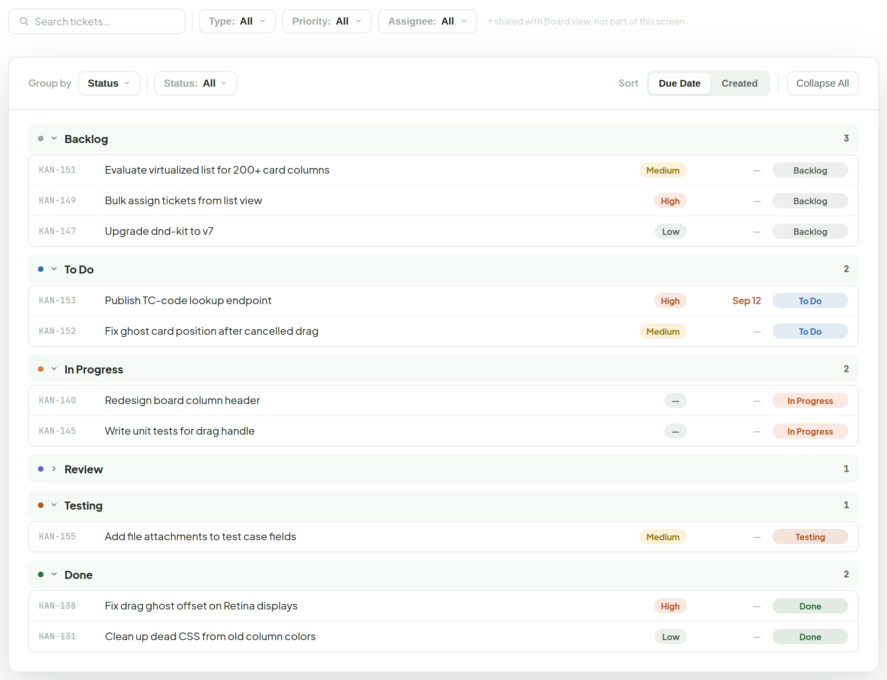
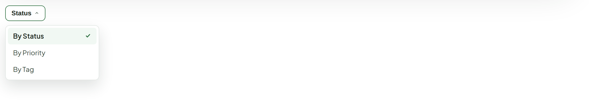
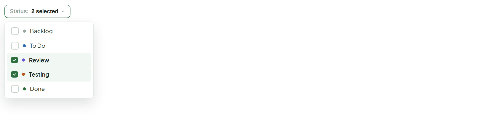

# List View

> Screen — v1 · source: [`ListView.dc.html`](../source/ListView.dc.html) · canvas `1789831198-eb58` · sha256 `279f9b89e4a461aec15a0afdf8664711f94b2ccd9cff91960ec8b39417c4b7a7`

Opens from the "List" segment in Main Board's view switcher — same tickets, same filters, grouped and sorted instead of columned. Maps 1:1 to today's `ListView.tsx`: group by Status / Priority / Tag, sort by Due Date / Created, per-group collapse plus Expand/Collapse All. Rows keep exactly the fields the component renders today — id, title, priority, due date, status — restyled to the rest of the system's chips and spacing. The Search/Type/Priority/Assignee bar from Main Board sits above this panel too, unchanged — `Board.tsx` renders it once, above the Board/List/Timeline switch, so it already narrows what List sees. This screen adds one new control of its own — Status — since grouping by status can't narrow which statuses show.

---

## 1. Full panel — shared filter bar above, grouped list below

Source: [ListView.dc.html](../source/ListView.dc.html) › `<!-- Shared filter bar, same as Main Board -->` / `<!-- Full panel -->` (L37–221)

- Filter bar annotation: "↑ shared with Board view, not part of this screen".
- Group headers have a status dot, collapse chevron, name and count; the Review group is shown collapsed.
- Rows with no due date show "—"; overdue due dates (Sep 12) are red; Done rows are struck through.

## 2. Clicking "Group by"

Source: [ListView.dc.html](../source/ListView.dc.html) › `<!-- Group by dropdown open -->` (L222–244)

## 3. Clicking "Status:" — multi-select, unlike Group by

Source: [ListView.dc.html](../source/ListView.dc.html) › `<!-- Status filter dropdown open -->` (L245–293)

- Checkboxes, not a single-select like Group by — narrowing to "Review + Testing" while grouped by Priority is a real use case (QA sweep across priorities).
- The button label summarizes the selection ("2 selected" past one, "All" with nothing checked).
- Type filtering already happens one row up, in the shared bar — no second Type control needed here.

---

## Note

1. Purely visual pass on `ListView.tsx` — Group by moves from a native `<select>` to the same dropdown-menu pattern as the Filter bar and Status Menu; Sort stays the same segmented toggle, just restyled; Expand/Collapse All keeps its current single-button toggle behavior. Rows and group headers carry the exact fields the component reads today, nothing added.
2. This file's own `STATUS_ORDER`/`STATUS_LABELS`/`STATUS_CHIP_CLASS` need the same Review/Testing additions already noted on Status Menu and Main Board's `COLUMNS` — shown here grouped in that order (Review collapsed, to also show the collapsed-group state).
3. Rows with no due date show "—" rather than an empty cell, matching `formatDate`'s existing fallback; a ticket with no priority set (parent tickets, still true from Ticket Card) shows the same neutral "—" chip used there.
4. One new filter in this toolbar: Status, a checkbox multi-select, new local state in `ListView.tsx` (`activeStatuses: Set<Status>`, filters before grouping) — useful because Group-by-status can't itself narrow which statuses show.
5. Type filtering needed no new control: `Board.tsx` already renders the shared Filter bar once, above the Board/List/Timeline switch, so the Type dropdown proposed there (see Main Board) already narrows what reaches this screen — shown above as the same bar, not duplicated in the panel's own toolbar.
