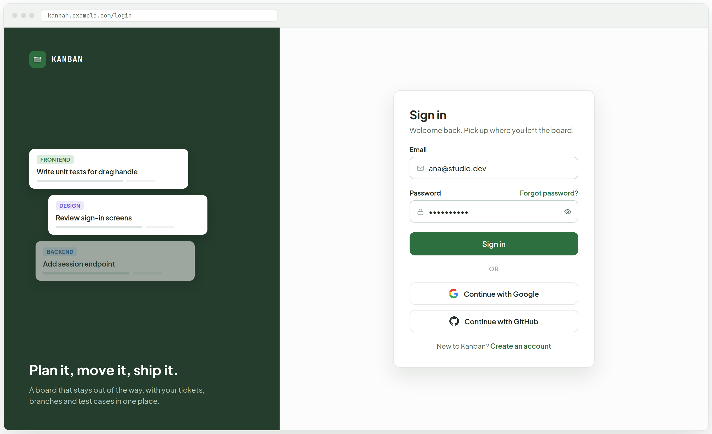
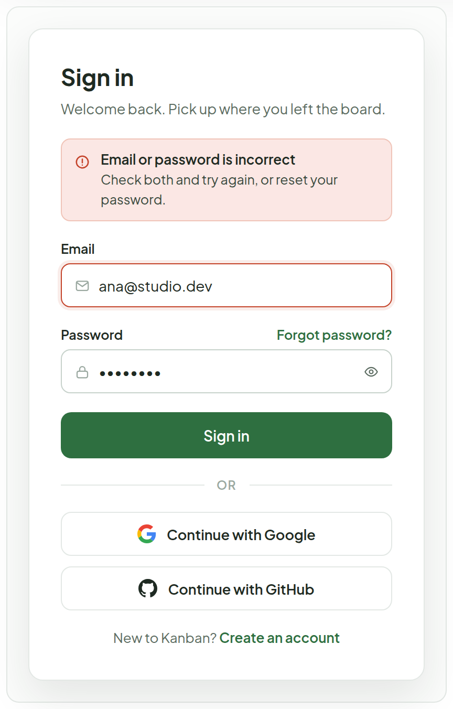
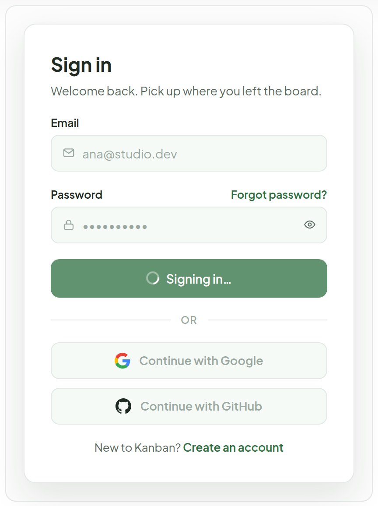
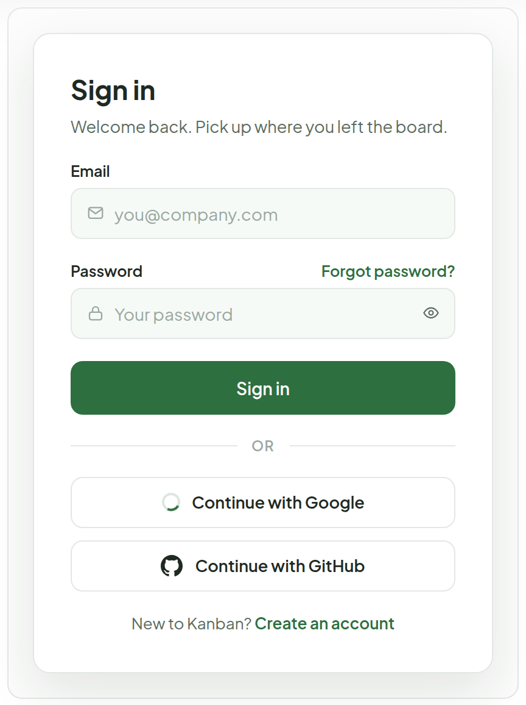
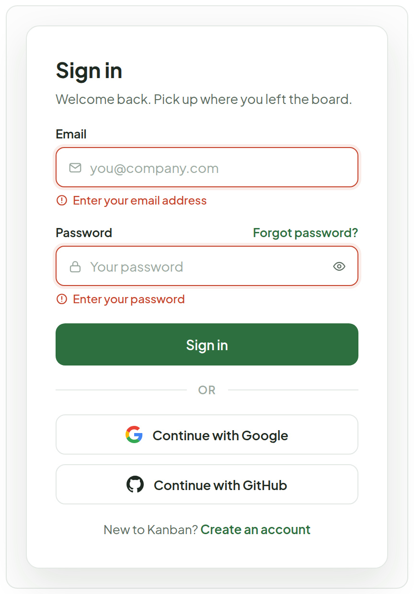
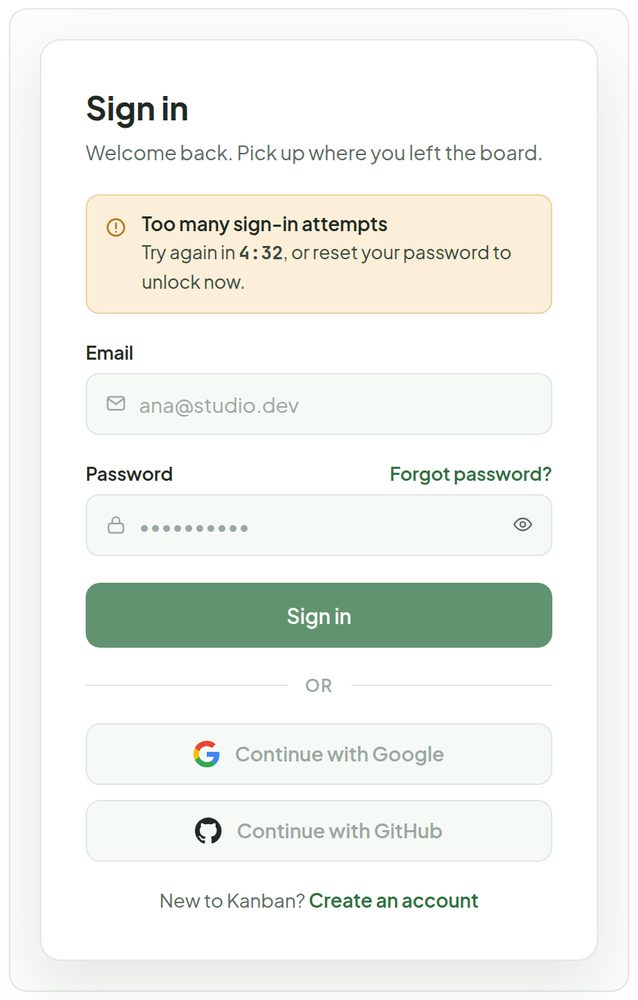
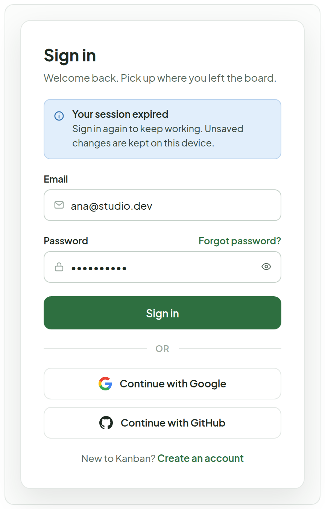

# Login

> Screen — v1 · source: [`Login.dc.html`](../source/Login.dc.html) · canvas `1791083427-1a86` · sha256 `6d6153a58d884bb9e14e56716674d1871e3fce2e20f6de14b0b2b0fc4f5f759a`

Full-page sign-in for the hosted app. Brand panel on the left (the same deep forest as the sidebar), form on the right. Email + password, with Google and GitHub as the other ways in. The brand panel hides below 900px and the form card goes full width.

---

## 1. Full page — default (email filled, password hidden)

Source: [Login.dc.html](../source/Login.dc.html) › `
` 1330×807 — browser frame `kanban.example.com/login` (L58)

- Browser frame with the address `kanban.example.com/login`.
- Brand panel (left): "KANBAN" logo, mini ticket cards tagged "FRONTEND" ("Write unit tests for drag handle"), "DESIGN" ("Review sign-in screens") and "BACKEND" ("Add session endpoint"), headline "Plan it, move it, ship it." and "A board that stays out of the way, with your tickets, branches and test cases in one place."
- Form (right): "Sign in" / "Welcome back. Pick up where you left the board." Email field filled with `ana@studio.dev`; password field shows masked dots (`••••••••••`) with the show/hide eye button; "Forgot password?" link on the label row.
- Below: "Sign in" button, "OR" divider, "Continue with Google", "Continue with GitHub", and "New to Kanban? Create an account".

## 2. Wrong email or password

Source: [Login.dc.html](../source/Login.dc.html) › `
` card 420×567 — error banner variant (L58)

- Banner under the subtitle: "Email or password is incorrect" / "Check both and try again, or reset your password."
- Email is filled with `ana@studio.dev` and password with masked dots; both fields remain editable. No field is singled out (one banner only).

## 3. Signing in — fields locked, button busy

Source: [Login.dc.html](../source/Login.dc.html) › `
` card 420×567 — busy variant (L58)

- Email (`ana@studio.dev`) and password (masked) are disabled.
- Primary button label is "Signing in…" (busy, with a spinner per the Note).
- The "Continue with Google" and "Continue with GitHub" buttons are shown disabled too.

## 4. Continuing with Google — popup open

Source: [Login.dc.html](../source/Login.dc.html) › `
` card 420×567 — OAuth popup variant (L58)

- Email and password fields are empty and disabled; the primary button still reads "Sign in" and is disabled.
- "Continue with Google" and "Continue with GitHub" are disabled; the Google button shows its own spinner while the provider popup is open.

## 5. Empty submit — inline field errors

Source: [Login.dc.html](../source/Login.dc.html) › `
` card 420×609 — empty-submit variant (L58)

- Both fields are empty (placeholders `you@company.com` and `Your password`).
- Under Email: "Enter your email address"; under Password: "Enter your password" (invalid fields get a red border plus a message under them).

## 6. Too many attempts — locked for a few minutes

Source: [Login.dc.html](../source/Login.dc.html) › `
` card 420×665 — lockout variant (L58)

- Amber banner: "Too many sign-in attempts" / "Try again in 4:32, or reset your password to unlock now."
- Email (`ana@studio.dev`) and password (masked) are disabled; the "Sign in" button and the OAuth buttons are dimmed.
- "Forgot password?" stays on the password label row as the way out.

## 7. Session expired — redirected from the board

Source: [Login.dc.html](../source/Login.dc.html) › `
` card 420×664 — session-expired variant (L58)

- Banner: "Your session expired" / "Sign in again to keep working. Unsaved changes are kept on this device."
- Email is pre-filled with `ana@studio.dev`; password is masked; all controls enabled.

## Note

- Labels sit above fields; the focused field gets a 3px forest ring, an invalid one a red border plus a message under it. The password field has a show/hide button and a "Forgot password?" link on the label row.
- Errors never say which field was wrong: a failed sign-in shows one banner ("Email or password is incorrect"). Empty fields are checked on submit and flagged inline.
- While signing in, both fields, OAuth buttons and the primary button are disabled and the primary button shows a spinner. OAuth buttons show their own spinner while the provider popup is open.
- Lockout shows a countdown and offers password reset as the way out. "Session expired" is the landing state after a 401 on the board; the user returns to the page they came from after signing in.
- Sign-in happens on its own route (/login); every other route redirects here when there is no session.
- TODO(backend): the app has no authentication today. Needs email/password sign-in, Google and GitHub OAuth apps, session cookies or tokens, rate limiting and lockout, and a per-user data model.
