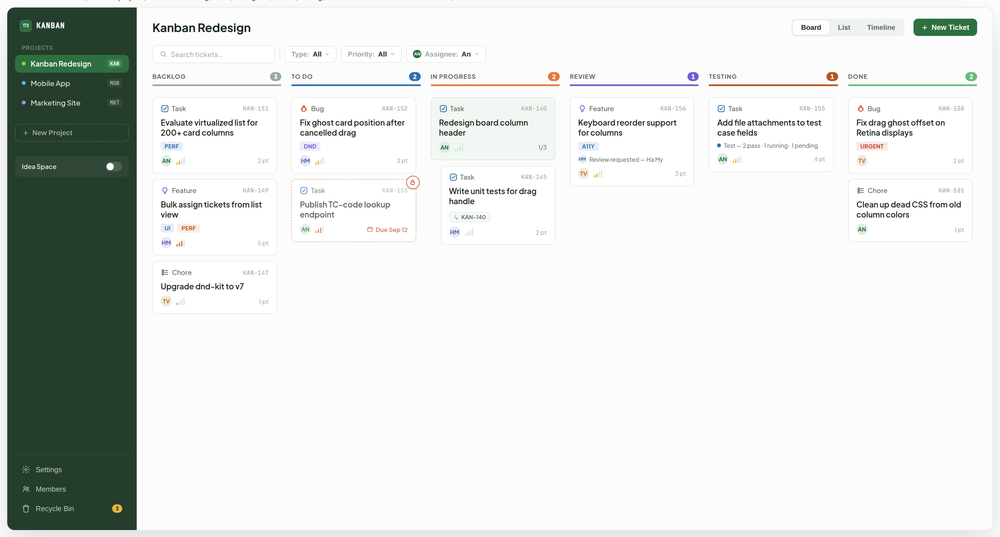
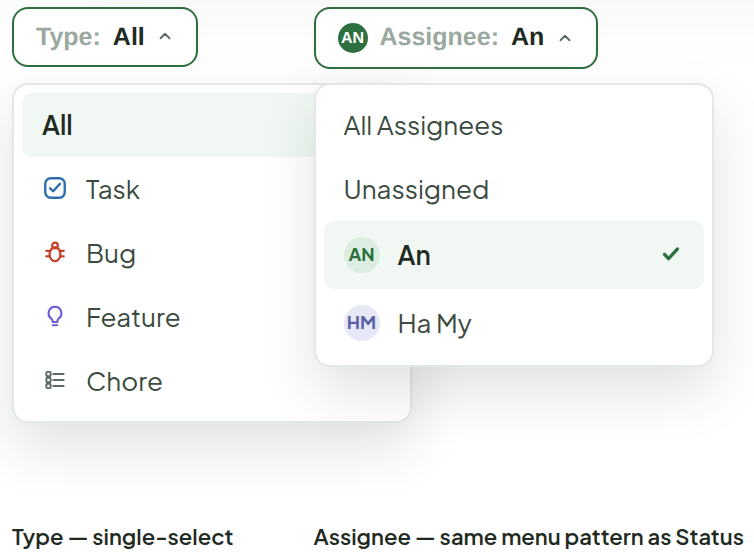
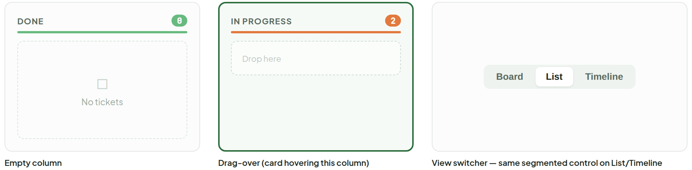
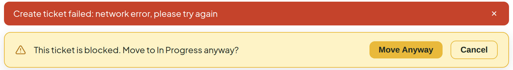

# Main Board

> Screen — v1 · source: [`MainBoard.dc.html`](../source/MainBoard.dc.html) · canvas `1789831198-eb58` · sha256 `c9cfebf2497dd15ff4d691c68f3fc1fdc9737424dc41902e89cf493acc1c73ec`

The whole app shell — sidebar, top bar, filters, columns — pulled together from the pieces already designed (Ticket Card, Tags, Sub-task Grouping, Drag & Drop).

Biggest change from today's `Board.tsx` / `Column.tsx`: columns drop the flat neon fill (`#F5C518` / `#E8441A` / `#AACC2E` / `#F472B6`) for the quiet header-plus-count treatment already established in Sub-task Grouping — a thin color bar carries identity instead of a loud background.

---

## 1. Full screen

Board view, KANBAN project. **6 columns: Backlog, To Do, In Progress, Review, Testing, Done** — matches the Status Menu order.

Source: [MainBoard.dc.html](../source/MainBoard.dc.html) › `<!-- Full screen -->` (L39–509)

## 2. Filter bar

Dropdowns instead of chip rows (too many chips at once was noisy).

Source: [MainBoard.dc.html](../source/MainBoard.dc.html) › `<!-- Filter dropdowns -->` (L511–578)

- Same dropdown-menu pattern as Status Menu: **checkmark on the active row**, not a highlight-only state.
- Priority opens the same way.
- Filter state and behavior are unchanged from the chip version — this only changes how it's exposed, so the bar stays one line instead of three.
- **Type** is single-select (All / Task / Bug / Feature / Chore, icon + label per row).
- **Assignee** uses the same menu pattern as Status (All Assignees / Unassigned / each member with avatar).

## 3. Column states

Source: [MainBoard.dc.html](../source/MainBoard.dc.html) › `<!-- Column states -->` (L580–630)

- **Empty column** — dashed placeholder with "No tickets".
- **Drag-over** — column gets a green outline and a "Drop here" slot while a card hovers over it.
- **View switcher** — the same segmented control is used on List and Timeline (Board / List / Timeline).

## 4. Banners & toasts

Rendered over the board, not in the layout flow.

Source: [MainBoard.dc.html](../source/MainBoard.dc.html) › `<!-- Banners and toasts -->` (L632–648)

- Error banner (red, dismissible): e.g. "Create ticket failed: network error, please try again".
- "Blocked drag" confirmation (amber, actions **Move Anyway** / **Cancel**): keeps its current copy and both actions, restyled to the card/shadow language used for popovers elsewhere.

---

## Spec notes

Assembly, not new data — every piece (sidebar, filter chips, column, ticket card) maps 1:1 to `App.tsx` / `Board.tsx` / `Column.tsx` / `ProjectSidebar.tsx` / `FilterBar.tsx` today, same props and state.

**Visual changes**

1. **Columns** lose their flat neon background — a 3px color bar plus a colored count pill carries the same at-a-glance identity, so every card reads the same way regardless of column (saturated fills wash out card contrast, worst on Backlog yellow and Done pink).
2. **Sidebar** goes from the current light theme to the Ink Deep (`#253D2C`) surface from the system doc. Project prefix badges and the board-toggle switch keep their exact current behavior.
3. **Filters** — search stays a text input, but priority and assignee move from chip rows to the Status-Menu-style dropdown (single list, checkmark on the active row).
4. **Blocked-drag confirmation** — see section 4.
5. **Parent tickets** keep the tinted-background-plus-indent treatment from Sub-task Grouping, now shown inside a real column.

**Functional changes (not just visual)**

6. **New Type filter** — dropdown with All / Task / Bug / Feature / Chore. `FilterBar.tsx` only filters by priority and assignee today, so it needs an `activeType` state plus a `t.type === activeType` clause alongside the existing priority/assignee checks in `App.tsx`'s `filteredTickets`. Priority and assignee keep their exact current filtering logic; only the trigger UI changes.
7. **Two new columns, Review and Testing**, between In Progress and Done:
   - `Board.tsx`'s `COLUMNS` array needs the two new entries in this order — accent colors `#6D5DD3` (Review) and `#B4571F` (Testing), matching Status Menu's dots.
   - `Status` needs the two new values already noted on the Status Menu board.
   - Code review happens first, so the **Review card** shows who review was requested from.
   - The **Testing card** shows its Test Cases roll-up inline (pass / running / pending dot, same wording as the header tooltip).

**Unchanged here:** Recycle Bin, Members and Settings panels, plus List / Timeline views — each gets its own screen.
