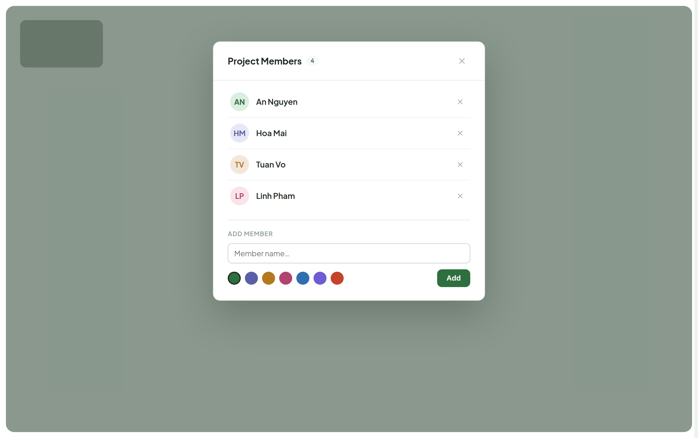
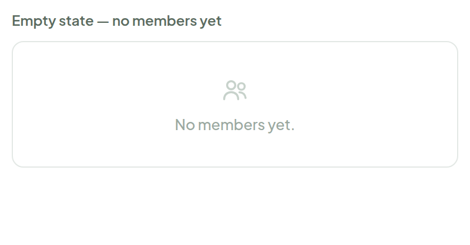
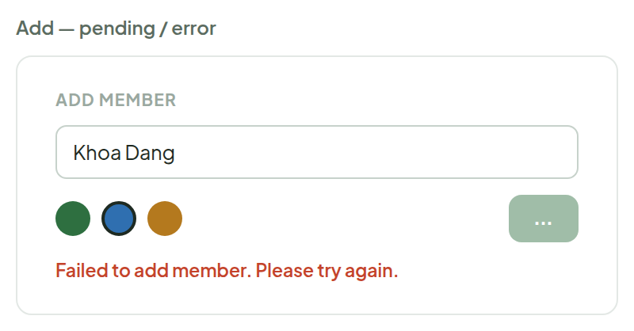
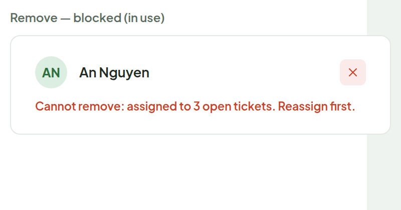

# Members

> Screen — v1 · source: [`MembersView.dc.html`](../source/MembersView.dc.html) · canvas `1789831198-eb58` · sha256 `d1e672e5aa19f54ef5291bacf04604368ae2f57fdd11fcdec1ec08013470c034`

Opens from the sidebar's "Members" button — a centered modal over a dimmed board, same overlay behavior as today's `MembersPanel.tsx`. Same data, same calls (`useMembers`/`useAddMember`/`useRemoveMember`, project-scoped `/projects/:id/members`) — only the visual language and the color picker change.

---

## 1. Full screen — modal open, dimmed board behind it

Source: [MembersView.dc.html](../source/MembersView.dc.html) › `<!-- Full screen -->` (L39–116)

## 2. Empty state — no members yet

Source: [MembersView.dc.html](../source/MembersView.dc.html) › `<!-- Secondary states -->` (L117–161)

## 3. Add — pending / error

Source: [MembersView.dc.html](../source/MembersView.dc.html) › `<!-- Secondary states -->` (L117–161)

## 4. Remove — blocked (in use)

Source: [MembersView.dc.html](../source/MembersView.dc.html) › `<!-- Secondary states -->` (L117–161)

---

## Note

No data model changes — `Member` is still just `{id, name, color}`, same endpoints. Two real UI changes:

1. The native `<input type="color">` swatch becomes a 7-color preset palette pulled from the pastel-avatar pairs already used across the canvas (Ticket Card, Main Board avatars, Filter bar's Assignee dropdown) — keeps every member's avatar visually consistent with the rest of the system instead of an arbitrary picked hex.
2. The "Remove — blocked" state is new: `removeMember` today just calls DELETE and shows whatever `err.response.data.detail` comes back, so if the backend doesn't already reject removing a member with open assigned tickets, that check needs adding server-side for this message to ever appear — otherwise it silently orphans assignee on those tickets.
