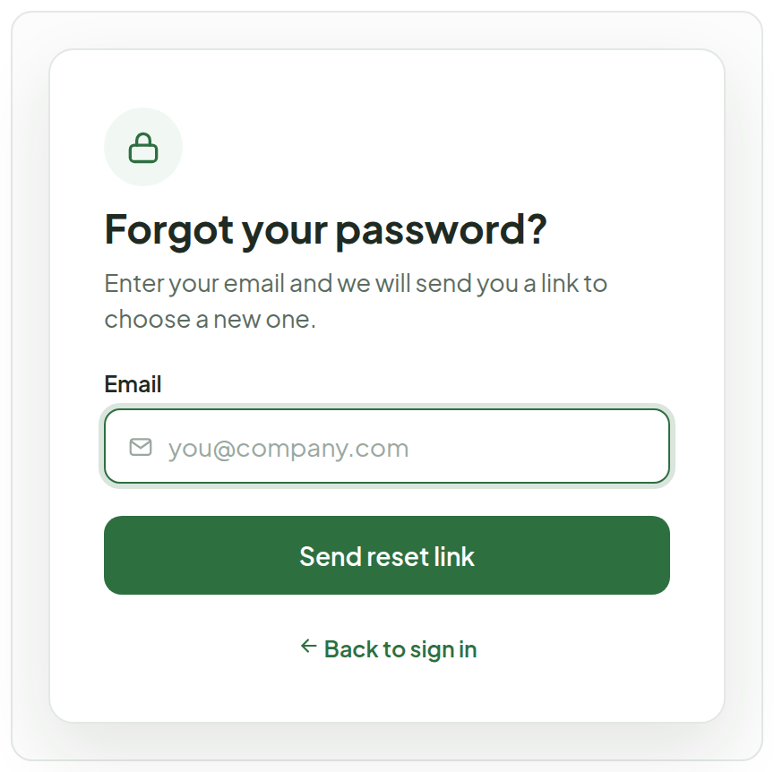
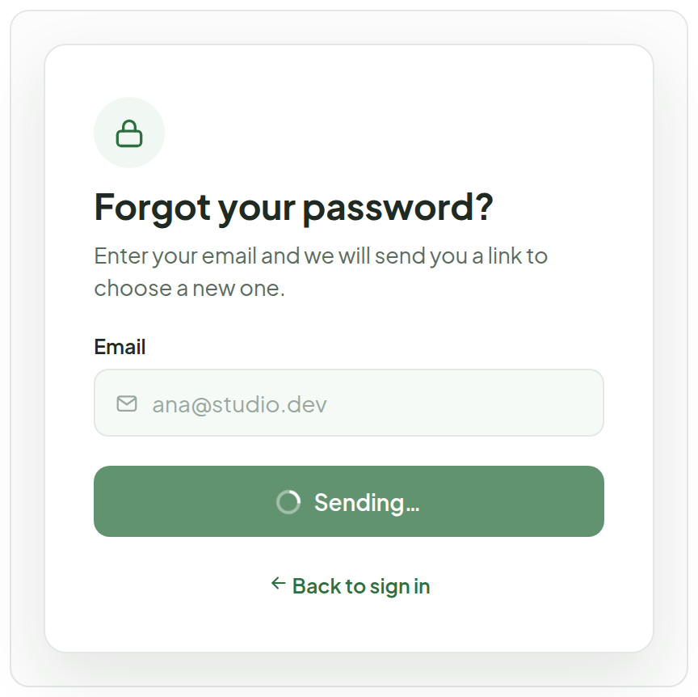
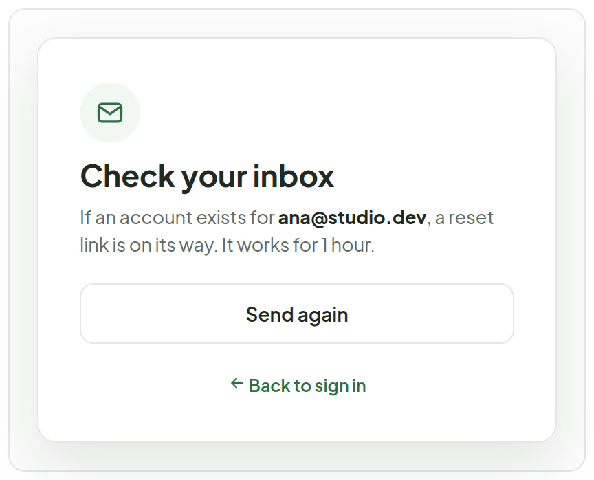
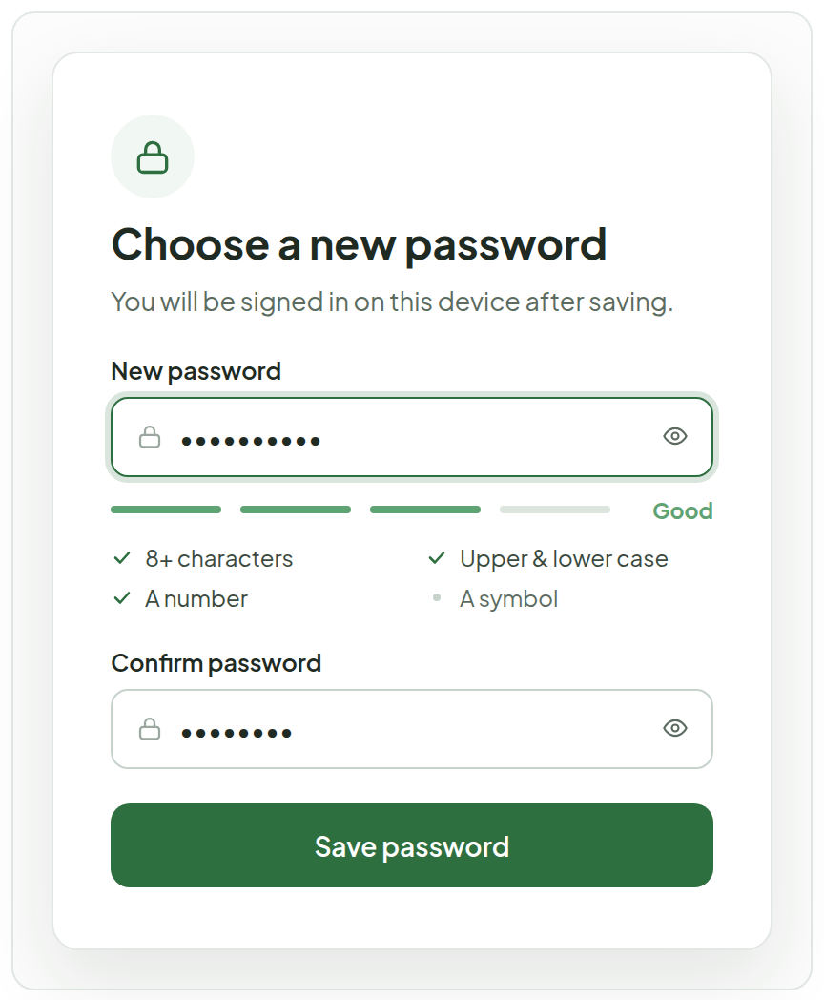
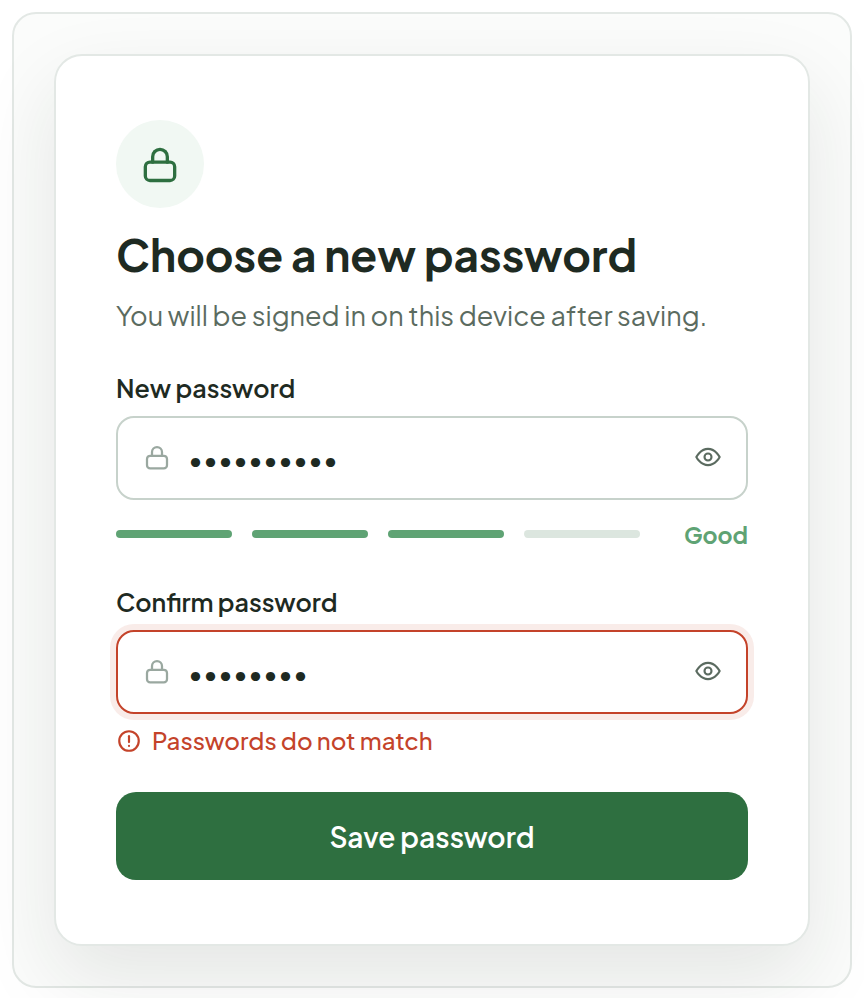
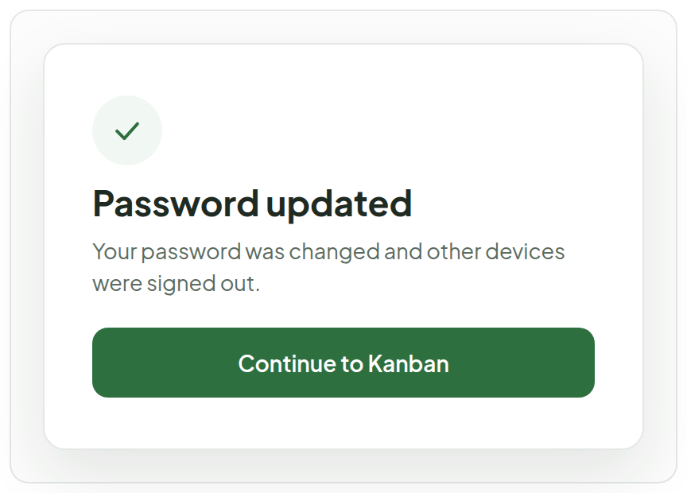
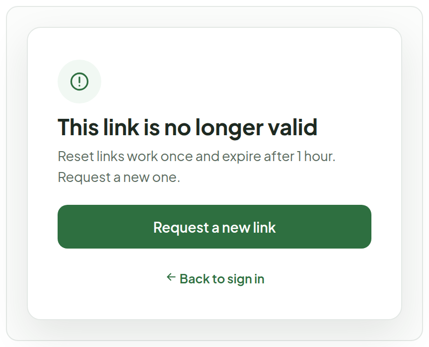

# Forgot / Reset Password

> Screen — v1 · source: [`PasswordReset.dc.html`](../source/PasswordReset.dc.html) · canvas `1791083427-1a86` · sha256 `3a2473e7fa4957839a9be1483a55dcdc7b15ea054687f0cecacda36cc864a0b4`

Two short flows on the same card. Ask for the email, tell the person to check their inbox, then the emailed link opens the reset form. Never reveals whether an email has an account.

---

## 1. 1 · Ask for the email

Source: [PasswordReset.dc.html](../source/PasswordReset.dc.html) › `
` card 420×419 — step 1 (L58)

- "Forgot your password?" / "Enter your email and we will send you a link to choose a new one."
- "Email" field (placeholder `you@company.com`), button "Send reset link", and "Back to sign in".

## 2. 1b · Sending

Source: [PasswordReset.dc.html](../source/PasswordReset.dc.html) › `
` card 420×419 — step 1b (L58)

- Same heading and helper text; the Email field is filled with `ana@studio.dev` and disabled.
- Button label is "Sending…"; "Back to sign in" below.

## 3. 2 · Link sent (same message for any email)

Source: [PasswordReset.dc.html](../source/PasswordReset.dc.html) › `
` card 420×337 — step 2 (L58)

- "Check your inbox" / "If an account exists for ana@studio.dev, a reset link is on its way. It works for 1 hour."
- Buttons: "Send again" and "Back to sign in".
- The message reads the same whether or not an account exists.

## 4. 3 · New password form (from the emailed link)

Source: [PasswordReset.dc.html](../source/PasswordReset.dc.html) › `
` card 420×513 — step 3 (L58)

- "Choose a new password" / "You will be signed in on this device after saving."
- "New password" (masked) with the meter at "Good" and the rules "8+ characters", "Upper & lower case", "A number", "A symbol".
- "Confirm password" (masked) and the "Save password" button.

## 5. 3b · Confirmation does not match

Source: [PasswordReset.dc.html](../source/PasswordReset.dc.html) › `
` card 420×488 — step 3b (L58)

- Same heading and helper text; "New password" with the meter at "Good".
- "Confirm password" has a red border and the message "Passwords do not match"; "Save password" below.

## 6. 4 · Password updated

Source: [PasswordReset.dc.html](../source/PasswordReset.dc.html) › `
` card 420×298 — step 4 (L58)

- "Password updated" / "Your password was changed and other devices were signed out."
- Button: "Continue to Kanban".

## 7. Link expired or already used

Source: [PasswordReset.dc.html](../source/PasswordReset.dc.html) › `
` card 420×337 — invalid link (L58)

- "This link is no longer valid" / "Reset links work once and expire after 1 hour. Request a new one."
- Buttons: "Request a new link" and "Back to sign in".

## Note

- The "Link sent" screen reads the same whether or not an account exists, so the form cannot be used to find out who has an account.
- Reset links are single-use and last one hour. Saving a new password signs out every other device and signs this one in.
- Strength meter and rules match Sign Up. "Save password" stays disabled until both fields match and length is 8+.
- TODO(backend): reset-token issue/verify endpoints, email delivery, session invalidation on password change.
