# Settings — MCP integrations

> Screen — v1 · source: [`SettingsMcp.dc.html`](../source/SettingsMcp.dc.html) · canvas `1791200794-706d` · sha256 `65617a16f2555b732ac0c2d4678839cd844ff9d40524b4acaa71b8dd7de6deb5`

A new Settings section that installs the app's kanban MCP server into Claude Code and Antigravity. Desktop can install, update, remove and test; the hosted web app is copy-only with an API token. Frames are the 620px Settings modal; numbers follow the brief.

---

## 0. Whole Settings modal, desktop - the new section sits after Workspace and before Theme

Source: [SettingsMcp.dc.html](../source/SettingsMcp.dc.html) › `<div>` modal 620×986 (whole Settings modal); the artboard is a single line, so no comment names (L71)

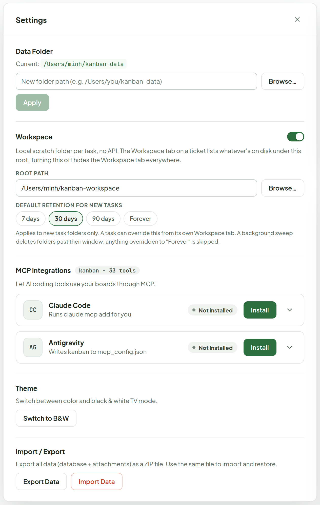

- Header "Settings" with close button. Sections in order: Data Folder, Workspace, MCP integrations, Theme, Import / Export.
- Data Folder: "Current: `/Users/minh/kanban-data`"; input placeholder "New folder path (e.g. /Users/you/kanban-data)"; "Browse…"; "Apply" (disabled).
- Workspace (toggle on): "Local scratch folder per task, no API. The Workspace tab on a ticket lists whatever's on disk under this root. Turning this off hides the Workspace tab everywhere."; "ROOT PATH" `/Users/minh/kanban-workspace` with "Browse…"; "DEFAULT RETENTION FOR NEW TASKS" chips "7 days", "30 days" (selected), "90 days", "Forever"; "Applies to new task folders only. A task can override this from its own Workspace tab. A background sweep deletes folders past their window; anything overridden to "Forever" is skipped."
- MCP integrations with chip `kanban - 33 tools`; "Let AI coding tools use your boards through MCP."
- Row "CC" / "Claude Code" / "Runs claude mcp add for you", chip "Not installed", "Install" button, collapsed chevron.
- Row "AG" / "Antigravity" / "Writes kanban to mcp_config.json", chip "Not installed", "Install" button, collapsed chevron.
- Theme: "Switch between color and black & white TV mode." Button "Switch to B&W".
- Import / Export: "Export all data (database + attachments) as a ZIP file. Use the same file to import and restore." Buttons "Export Data" and "Import Data" (red outline).

## 1. Collapsed list (desktop app) - two clients, status chip, Install, chevron

Source: [SettingsMcp.dc.html](../source/SettingsMcp.dc.html) › `<div>` modal 620×303 (header + MCP section); the artboard is a single line, so no comment names (L71)

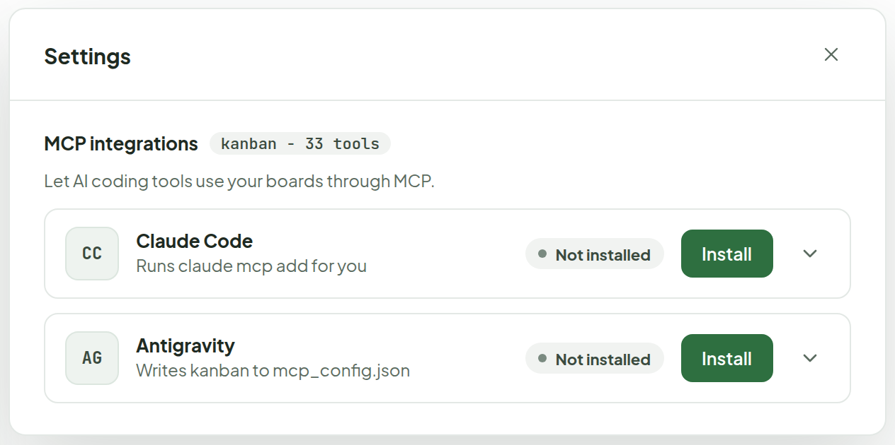

- Modal header: "Settings" with a close (x) button.
- Section header: "MCP integrations" with the mono chip `kanban - 33 tools`; subtitle "Let AI coding tools use your boards through MCP."
- Row "CC" / "Claude Code" / "Runs claude mcp add for you", chip "Not installed", "Install", chevron.
- Row "AG" / "Antigravity" / "Writes kanban to mcp_config.json", chip "Not installed", "Install", chevron.

## 2. Claude Code expanded, not installed - User scope, exact command, Install and Copy command

Source: [SettingsMcp.dc.html](../source/SettingsMcp.dc.html) › `<div>` modal 620×695, Claude Code row expanded; the artboard is a single line, so no comment names (L71)

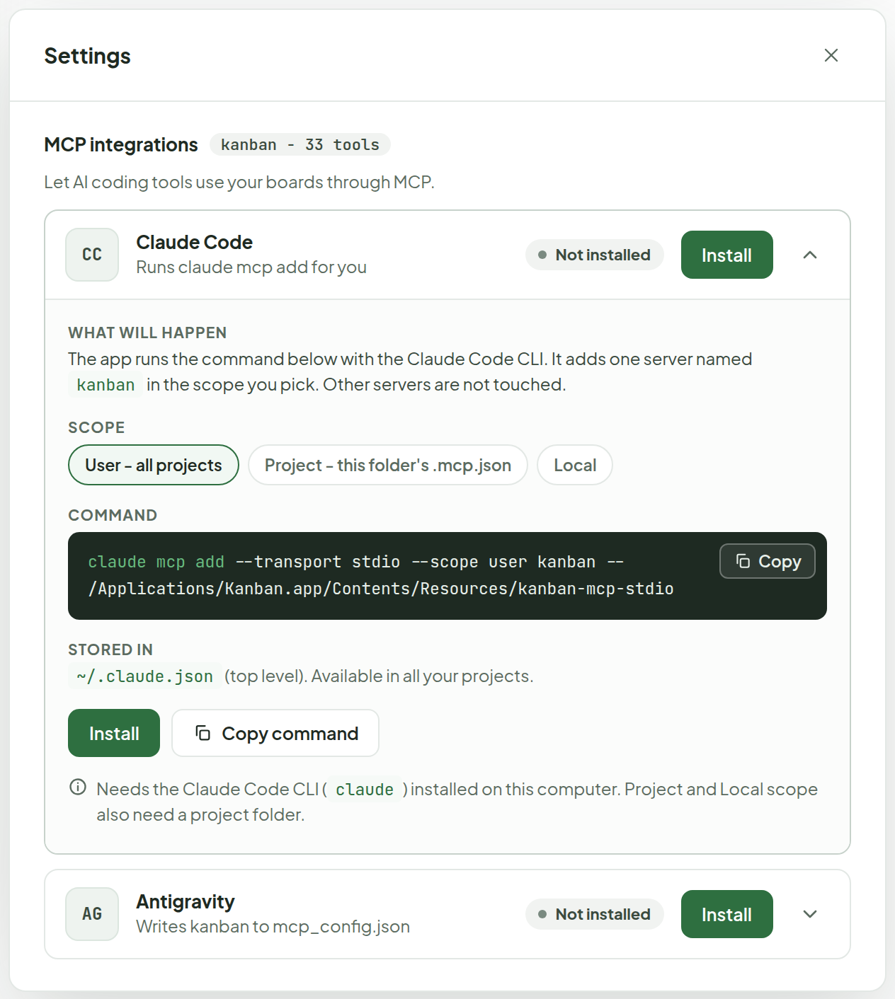

- Modal header: "Settings" with a close (x) button.
- Section header: "MCP integrations" with the mono chip `kanban - 33 tools`; subtitle "Let AI coding tools use your boards through MCP."
- Row "CC" / "Claude Code" / "Runs claude mcp add for you", chip "Not installed", "Install", expanded (chevron up).
- "WHAT WILL HAPPEN": "The app runs the command below with the Claude Code CLI. It adds one server named kanban in the scope you pick. Other servers are not touched."
- "SCOPE" segmented control: "User - all projects" (selected), "Project - this folder's .mcp.json", "Local".
- "COMMAND" dark block with a "Copy" button (command below).
- "STORED IN": `~/.claude.json` (top level). Available in all your projects.
- Buttons: "Install", "Copy command".
- "Needs the Claude Code CLI (claude) installed on this computer. Project and Local scope also need a project folder." (info icon)
- Row "AG" / "Antigravity" / "Writes kanban to mcp_config.json", chip "Not installed", "Install", collapsed.

Command shown:

```sh
claude mcp add --transport stdio --scope user kanban -- /Applications/Kanban.app/Contents/Resources/kanban-mcp-stdio
```

## 2b. Claude Code expanded, Project scope - folder picker, shared .mcp.json

Source: [SettingsMcp.dc.html](../source/SettingsMcp.dc.html) › `<div>` modal 762 high, Claude Code row expanded in Project scope; the artboard is a single line, so no comment names (L71)

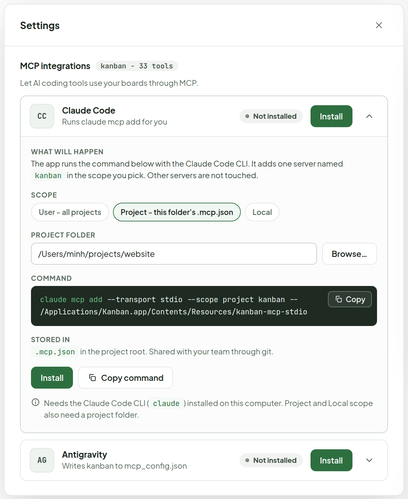

- Modal header: "Settings" with a close (x) button.
- Section header: "MCP integrations" with the mono chip `kanban - 33 tools`; subtitle "Let AI coding tools use your boards through MCP."
- Row "CC" / "Claude Code" / "Runs claude mcp add for you", chip "Not installed", "Install", expanded.
- "WHAT WILL HAPPEN": "The app runs the command below with the Claude Code CLI. It adds one server named kanban in the scope you pick. Other servers are not touched."
- "SCOPE" segmented control: "User - all projects", "Project - this folder's .mcp.json" (selected), "Local".
- "PROJECT FOLDER" field with "Browse…".
- "COMMAND" dark block with a "Copy" button (command below).
- "STORED IN": `.mcp.json` in the project root. Shared with your team through git.
- Buttons: "Install", "Copy command".
- "Needs the Claude Code CLI (claude) installed on this computer. Project and Local scope also need a project folder." (info icon)
- Row "AG" / "Antigravity" / "Writes kanban to mcp_config.json", chip "Not installed", "Install", collapsed.

Command shown:

```sh
claude mcp add --transport stdio --scope project kanban -- /Applications/Kanban.app/Contents/Resources/kanban-mcp-stdio
```

## 3. Installing - spinner in the button, chip "Installing…", controls disabled

Source: [SettingsMcp.dc.html](../source/SettingsMcp.dc.html) › `<div>` modal 645 high, install in progress; the artboard is a single line, so no comment names (L71)

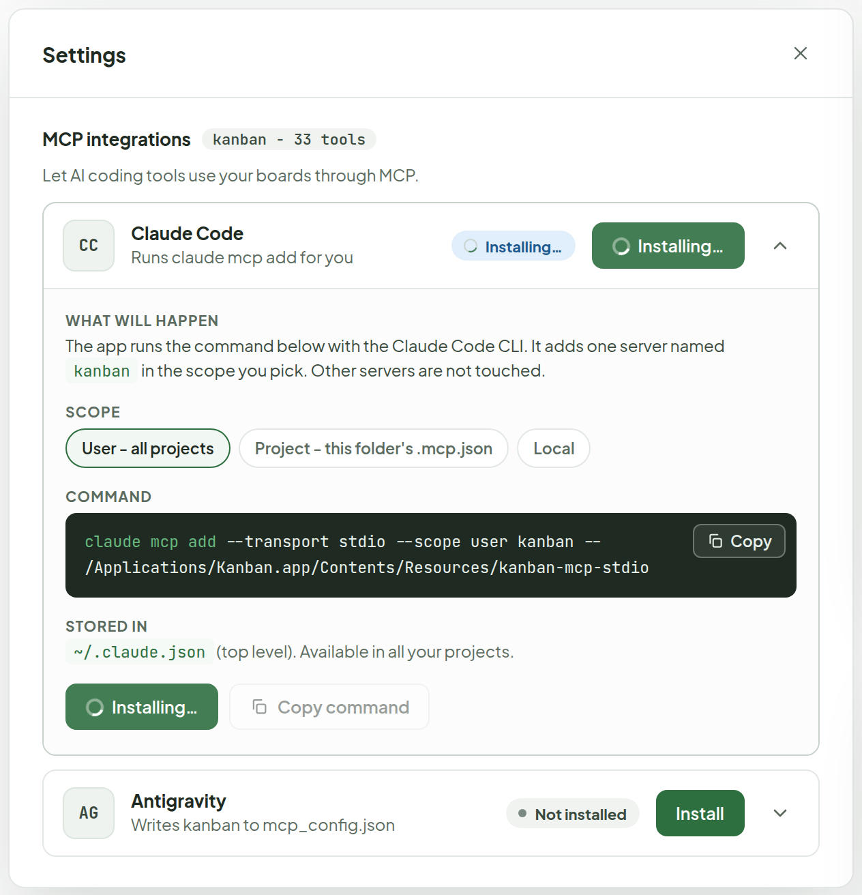

- Modal header: "Settings" with a close (x) button.
- Section header: "MCP integrations" with the mono chip `kanban - 33 tools`; subtitle "Let AI coding tools use your boards through MCP."
- Row "CC" / "Claude Code" / "Runs claude mcp add for you", chip "Installing…" (spinner), header button "Installing…" (spinner), expanded.
- "WHAT WILL HAPPEN": "The app runs the command below with the Claude Code CLI. It adds one server named kanban in the scope you pick. Other servers are not touched."
- "SCOPE" segmented control: "User - all projects" (selected), "Project - this folder's .mcp.json", "Local".
- "COMMAND" block with "Copy" (same user-scope command as frame 2); "STORED IN": `~/.claude.json` (top level). Available in all your projects.
- Buttons: "Installing…" (spinner, disabled) and "Copy command" (disabled).
- Row "AG" / "Antigravity" / "Writes kanban to mcp_config.json", chip "Not installed", "Install".

Command shown:

```sh
claude mcp add --transport stdio --scope user kanban -- /Applications/Kanban.app/Contents/Resources/kanban-mcp-stdio
```

## 4. Installed + Test, with success toast - Reinstall, Remove, Test connection result, restart hint

Source: [SettingsMcp.dc.html](../source/SettingsMcp.dc.html) › `<div>` modal 569 high plus success toast; the artboard is a single line, so no comment names (L71)

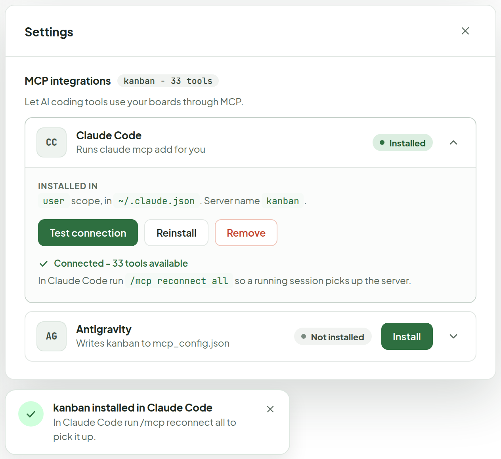

- Modal header: "Settings" with a close (x) button.
- Section header: "MCP integrations" with the mono chip `kanban - 33 tools`; subtitle "Let AI coding tools use your boards through MCP."
- Row "CC" / "Claude Code" / "Runs claude mcp add for you", chip "Installed", expanded.
- "INSTALLED IN": `user` scope, in `~/.claude.json`. Server name `kanban`.
- Buttons: "Test connection", "Reinstall", "Remove" (red outline).
- Test result: "Connected - 33 tools available"; hint "In Claude Code run `/mcp reconnect all` so a running session picks up the server."
- Row "AG" / "Antigravity" / "Writes kanban to mcp_config.json", chip "Not installed", "Install".
- Success toast under the modal (close button): "kanban installed in Claude Code" / "In Claude Code run /mcp reconnect all to pick it up."

## 5. Update available - amber chip, version line, Update button

Source: [SettingsMcp.dc.html](../source/SettingsMcp.dc.html) › `<div>` modal 487 high; the artboard is a single line, so no comment names (L71)

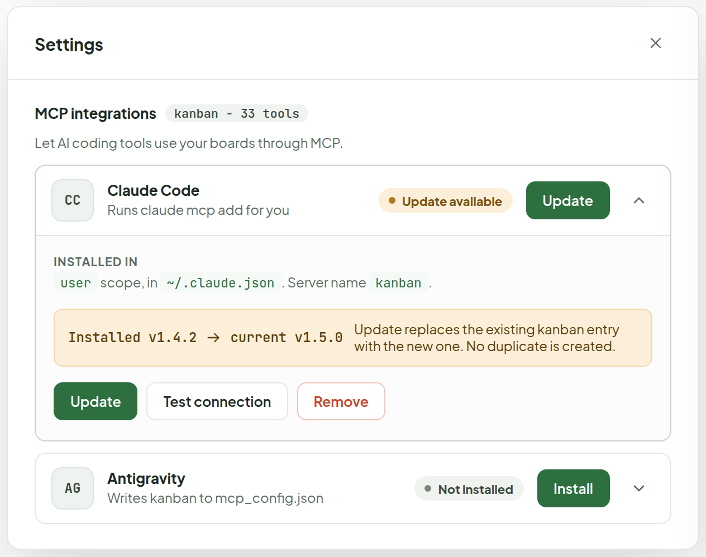

- Modal header: "Settings" with a close (x) button.
- Section header: "MCP integrations" with the mono chip `kanban - 33 tools`; subtitle "Let AI coding tools use your boards through MCP."
- Row "CC" / "Claude Code" / "Runs claude mcp add for you", amber chip "Update available", "Update" button, expanded.
- "INSTALLED IN": `user` scope, in `~/.claude.json`. Server name `kanban`.
- Version line: "Installed v1.4.2" and "current v1.5.0".
- "Update replaces the existing kanban entry with the new one. No duplicate is created."
- Buttons: "Update", "Test connection", "Remove".
- Row "AG" / "Antigravity" / "Writes kanban to mcp_config.json", chip "Not installed", "Install".

## 6a. Error: claude command not found - manual copy block as the fallback

Source: [SettingsMcp.dc.html](../source/SettingsMcp.dc.html) › `<div>` modal 539 high, error state; the artboard is a single line, so no comment names (L71)

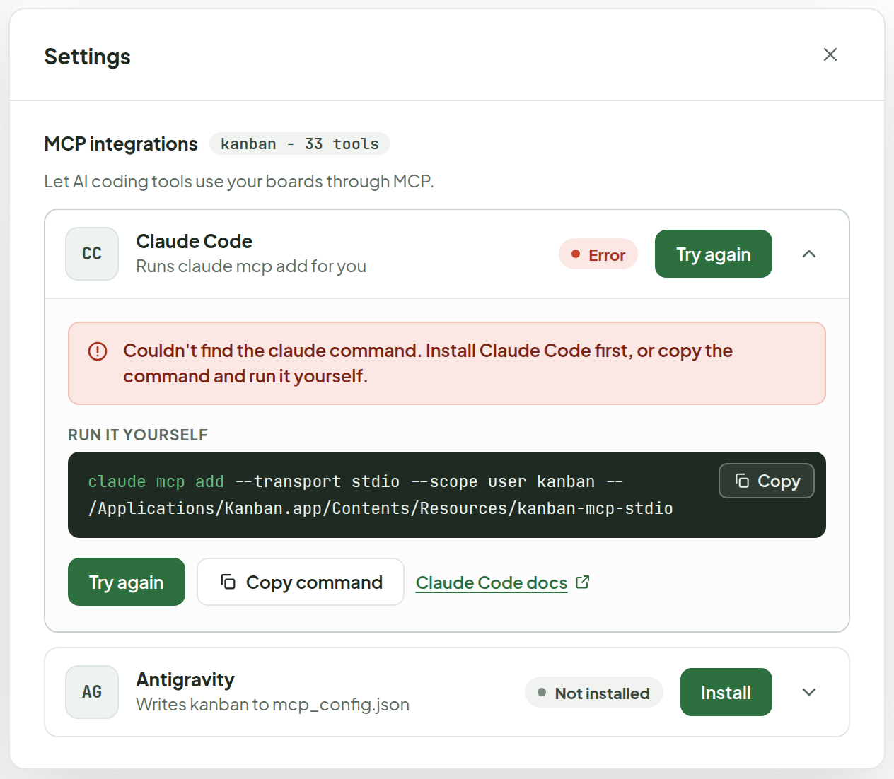

- Modal header: "Settings" with a close (x) button.
- Section header: "MCP integrations" with the mono chip `kanban - 33 tools`; subtitle "Let AI coding tools use your boards through MCP."
- Row "CC" / "Claude Code" / "Runs claude mcp add for you", red chip "Error", "Try again" button, expanded.
- Error banner: "Couldn't find the claude command. Install Claude Code first, or copy the command and run it yourself."
- "RUN IT YOURSELF" dark block with "Copy" (command below).
- Buttons: "Try again", "Copy command", link "Claude Code docs".
- Row "AG" / "Antigravity" / "Writes kanban to mcp_config.json", chip "Not installed", "Install".

Command shown:

```sh
claude mcp add --transport stdio --scope user kanban -- /Applications/Kanban.app/Contents/Resources/kanban-mcp-stdio
```

## 6b. Error: write failed (Antigravity) - manual JSON stays available

Source: [SettingsMcp.dc.html](../source/SettingsMcp.dc.html) › `<div>` modal 706 high, error state; the artboard is a single line, so no comment names (L71)

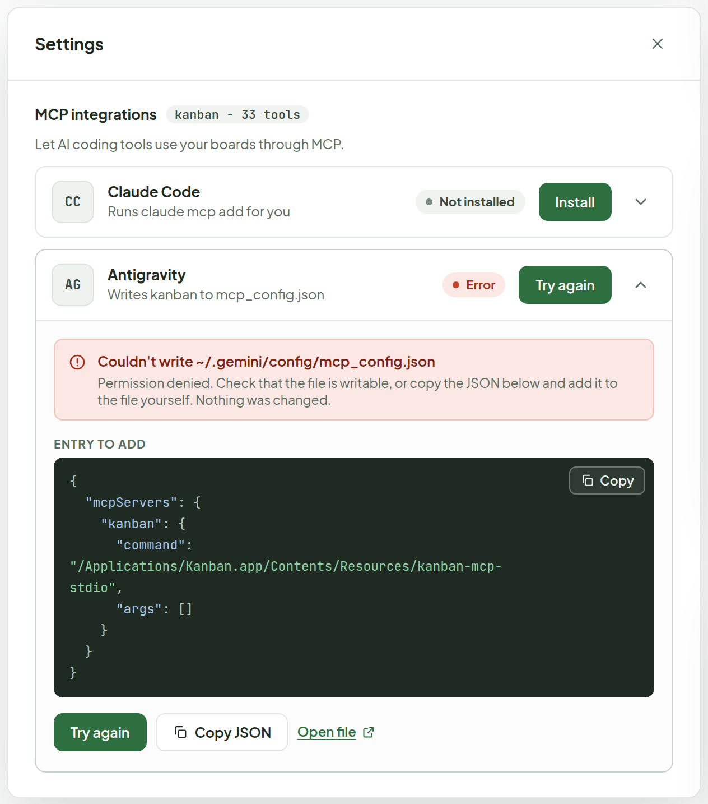

- Modal header: "Settings" with a close (x) button.
- Section header: "MCP integrations" with the mono chip `kanban - 33 tools`; subtitle "Let AI coding tools use your boards through MCP."
- Row "CC" / "Claude Code" / "Runs claude mcp add for you", chip "Not installed", "Install", collapsed.
- Row "AG" / "Antigravity" / "Writes kanban to mcp_config.json", red chip "Error", "Try again" button, expanded.
- Error banner: "Couldn't write `~/.gemini/config/mcp_config.json`" / "Permission denied. Check that the file is writable, or copy the JSON below and add it to the file yourself. Nothing was changed."
- "ENTRY TO ADD" dark block with "Copy" (JSON below).
- Buttons: "Try again", "Copy JSON", link "Open file".

JSON shown:

```json
{
  "mcpServers": {
    "kanban": {
      "command": "/Applications/Kanban.app/Contents/Resources/kanban-mcp-stdio",
      "args": []
    }
  }
}
```

## 7. Antigravity expanded - Global or Workspace file, JSON block, merge-only Install

Source: [SettingsMcp.dc.html](../source/SettingsMcp.dc.html) › `<div>` modal 829 high, Antigravity row expanded; the artboard is a single line, so no comment names (L71)

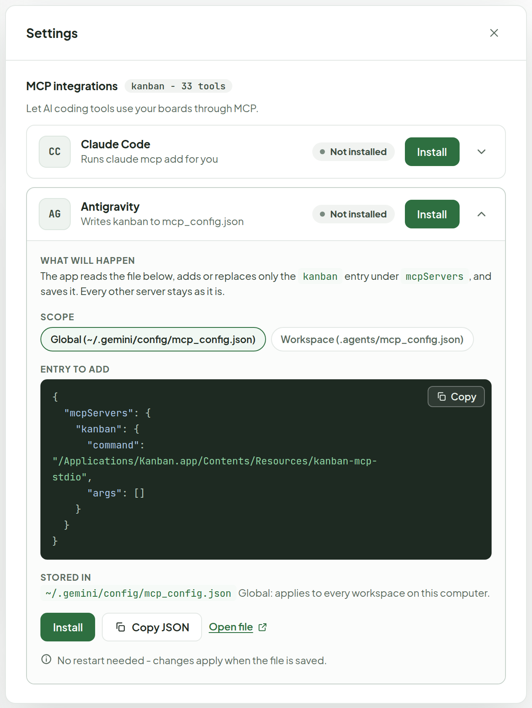

- Modal header: "Settings" with a close (x) button.
- Section header: "MCP integrations" with the mono chip `kanban - 33 tools`; subtitle "Let AI coding tools use your boards through MCP."
- Row "CC" / "Claude Code" / "Runs claude mcp add for you", chip "Not installed", "Install", collapsed.
- Row "AG" / "Antigravity" / "Writes kanban to mcp_config.json", chip "Not installed", "Install", expanded.
- "WHAT WILL HAPPEN": "The app reads the file below, adds or replaces only the kanban entry under mcpServers, and saves it. Every other server stays as it is."
- "SCOPE" segmented control: "Global (~/.gemini/config/mcp_config.json)" (selected), "Workspace (.agents/mcp_config.json)".
- "ENTRY TO ADD" dark block with "Copy" (JSON below).
- "STORED IN": `~/.gemini/config/mcp_config.json` Global: applies to every workspace on this computer.
- Buttons: "Install", "Copy JSON", link "Open file".
- "No restart needed - changes apply when the file is saved." (info icon)

JSON shown:

```json
{
  "mcpServers": {
    "kanban": {
      "command": "/Applications/Kanban.app/Contents/Resources/kanban-mcp-stdio",
      "args": []
    }
  }
}
```

## 8. Remove confirm - inline in the row, names the exact command

Source: [SettingsMcp.dc.html](../source/SettingsMcp.dc.html) › `<div>` modal 536 high; the artboard is a single line, so no comment names (L71)

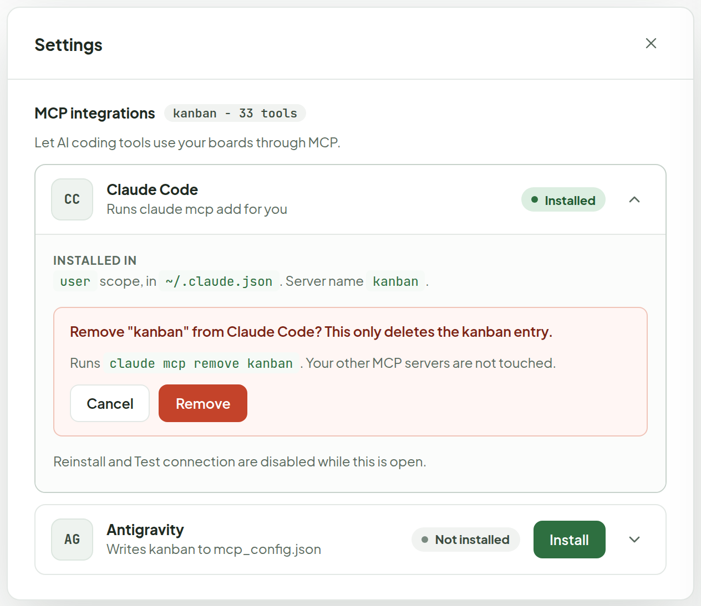

- Modal header: "Settings" with a close (x) button.
- Section header: "MCP integrations" with the mono chip `kanban - 33 tools`; subtitle "Let AI coding tools use your boards through MCP."
- Row "CC" / "Claude Code" / "Runs claude mcp add for you", chip "Installed", expanded.
- "INSTALLED IN": `user` scope, in `~/.claude.json`. Server name `kanban`.
- Confirm panel (red tint): "Remove "kanban" from Claude Code? This only deletes the kanban entry." / "Runs `claude mcp remove kanban`. Your other MCP servers are not touched." Buttons "Cancel", "Remove".
- "Reinstall and Test connection are disabled while this is open."
- Row "AG" / "Antigravity" / "Writes kanban to mcp_config.json", chip "Not installed", "Install".

## 9a. Checking status - skeleton rows while clients are detected

Source: [SettingsMcp.dc.html](../source/SettingsMcp.dc.html) › `<div>` modal 324 high; the artboard is a single line, so no comment names (L71)

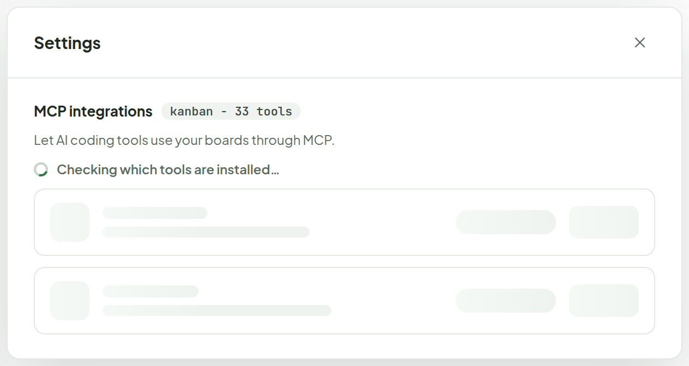

- Modal header: "Settings" with a close (x) button.
- Section header: "MCP integrations" with the mono chip `kanban - 33 tools`; subtitle "Let AI coding tools use your boards through MCP."
- Skeleton rows (shimmer) in place of the client rows, with the line "Checking which tools are installed…"

## 9b. Client not detected - Claude Code missing, link to docs

Source: [SettingsMcp.dc.html](../source/SettingsMcp.dc.html) › `<div>` modal 360 high; the artboard is a single line, so no comment names (L71)

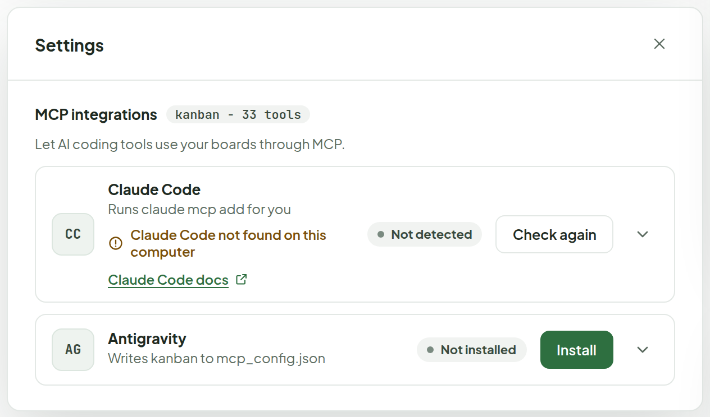

- Modal header: "Settings" with a close (x) button.
- Section header: "MCP integrations" with the mono chip `kanban - 33 tools`; subtitle "Let AI coding tools use your boards through MCP."
- Row "CC" / "Claude Code" / "Runs claude mcp add for you", with the line "Claude Code not found on this computer" and link "Claude Code docs"; chip "Not detected"; button "Check again"; chevron.
- Row "AG" / "Antigravity" / "Writes kanban to mcp_config.json", chip "Not installed", "Install".

## 10a. Web (hosted): copy-only, with token - no Install buttons; token block above the rows

Source: [SettingsMcp.dc.html](../source/SettingsMcp.dc.html) › `<div>` modal 1078 high, web (hosted) variant; the artboard is a single line, so no comment names (L71)

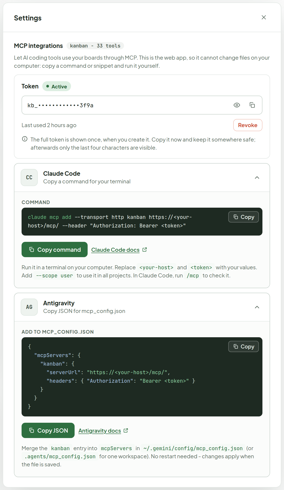

- Modal header: "Settings" with a close (x) button.
- Section header: "MCP integrations" with chip `kanban - 33 tools`; subtitle "Let AI coding tools use your boards through MCP. This is the web app, so it cannot change files on your computer: copy a command or snippet and run it yourself."
- Token block: "Token" with green chip "Active"; masked value `kb_••••••••••••3f9a` with reveal (eye) and copy buttons; "Last used 2 hours ago"; "Revoke" (red outline); "The full token is shown once, when you create it. Copy it now and keep it somewhere safe; afterwards only the last four characters are visible." (info icon)
- Row "CC" / "Claude Code" / "Copy a command for your terminal", expanded. "COMMAND" dark block with "Copy" (command below); buttons "Copy command", link "Claude Code docs"; "Run it in a terminal on your computer. Replace `<your-host>` and `<token>` with your values. Add `--scope user` to use it in all projects. In Claude Code, run `/mcp` to check it."
- Row "AG" / "Antigravity" / "Copy JSON for mcp_config.json", expanded. "ADD TO MCP_CONFIG.JSON" dark block with "Copy" (JSON below); "Copy JSON", link "Antigravity docs"; "Merge the `kanban` entry into `mcpServers` in `~/.gemini/config/mcp_config.json` (or `.agents/mcp_config.json` for one workspace). No restart needed - changes apply when the file is saved."

Command shown:

```sh
claude mcp add --transport http kanban https://<your-host>/mcp/ --header "Authorization: Bearer <token>"
```

JSON shown:

```json
{
  "mcpServers": {
    "kanban": {
      "serverUrl": "https://<your-host>/mcp/",
      "headers": { "Authorization": "Bearer <token>" }
    }
  }
}
```

## 10b. Web (hosted): no token yet - rows collapsed, nothing to copy until a token exists

Source: [SettingsMcp.dc.html](../source/SettingsMcp.dc.html) › `<div>` modal 492 high, web (hosted) variant; the artboard is a single line, so no comment names (L71)

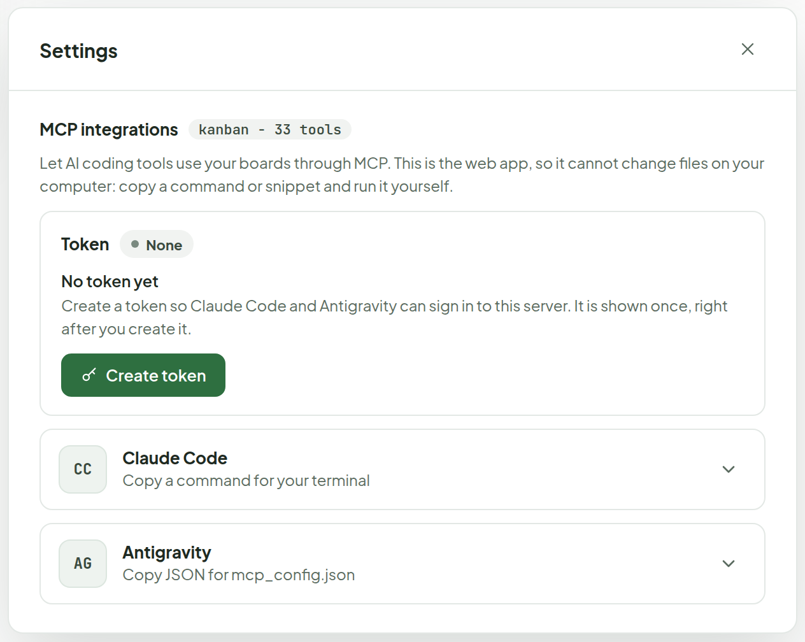

- Modal header: "Settings" with a close (x) button.
- Section header: "MCP integrations" with chip `kanban - 33 tools`; subtitle "Let AI coding tools use your boards through MCP. This is the web app, so it cannot change files on your computer: copy a command or snippet and run it yourself."
- Token block: "Token" with grey chip "None"; "No token yet"; "Create a token so Claude Code and Antigravity can sign in to this server. It is shown once, right after you create it."; button "Create token".
- Row "CC" / "Claude Code" / "Copy a command for your terminal", collapsed.
- Row "AG" / "Antigravity" / "Copy JSON for mcp_config.json", collapsed.

## Note

- Where it sits. New Settings section "MCP integrations" between Workspace and Theme, same modal (620px), same st-* styles. State frames show the modal header and this section only; frame 0 shows the whole modal. Emoji in the reference buttons (Theme, Import/Export) are replaced by plain labels here; the field label colour is #5B6B60 instead of #9AA8A0 (the old one is under 4.5:1).
- Buttons, desktop. Install (Claude Code): runs the command shown, claude mcp add --transport stdio --scope <scope> kanban -- <path>; touches ~/.claude.json (user, local) or .mcp.json in the chosen folder (project), through the CLI only; the app never edits those files itself. Install (Antigravity): reads the chosen file, adds or replaces only mcpServers.kanban, writes it back (creating the file if missing): ~/.gemini/config/mcp_config.json (Global) or <folder>/.agents/mcp_config.json (Workspace). Copy command / Copy JSON: clipboard only, no file touched. Reinstall / Update: same as Install. Remove: claude mcp remove kanban, or deletes only the kanban key in the Antigravity file. Test connection: the app calls the MCP server (initialize, tools/list) and reports the tool count; it does not read client config. Open file: opens the config file in the default editor. Check again: re-runs client detection.
- Idempotence. Re-install updates the existing kanban entry and never creates a second one. Remove deletes only that entry. Other servers in either config are never read for anything but the merge, and never changed. If the Antigravity file is not valid JSON the app stops with an error and does not overwrite it.
- Safety. The exact command or JSON is always visible before Install, and the Remove confirm names the command it will run. The app writes only the config files listed above. Claude Code scope local is the CLI default (used when no --scope is given); the mock preselects User so the server works in every project: confirm that choice. Local and Project scopes need a project folder (picker shown in frame 2b); the "Local" option in the segmented control follows the same layout as 2b.
- Desktop vs web. Desktop detects clients, shows status chips and can Install, Update and Remove. Web cannot write local files, so there are no Install buttons and no status: only copy-only blocks (HTTP command and Antigravity JSON with serverUrl and headers) plus a Token block (Create token, masked value with reveal and copy, "Last used", Revoke, empty state "No token yet"). The stdio path in the mock (/Applications/Kanban.app/Contents/Resources/kanban-mcp-stdio) is a placeholder; in a source checkout it is uv --directory <path-to>/server run mcp_stdio.py. The HTTP endpoint is http://localhost:8000/mcp/ locally; the trailing slash is required.
- Verified from docs. Claude Code (https://code.claude.com/docs/en/mcp): claude mcp add --transport stdio|http [--scope user|project|local] <name> -- <command> or <url> [--header ...]; claude mcp list, get <name>, remove <name>; scopes local (default, in ~/.claude.json under the project path), project (.mcp.json, shared via git), user (~/.claude.json top level); in a session /mcp and /mcp reconnect all. Antigravity (https://antigravity.google/docs/mcp/): global ~/.gemini/config/mcp_config.json, workspace .agents/mcp_config.json; stdio uses command, args, env; remote uses serverUrl and headers; changes apply on save, no restart; in the IDE: agent panel ... > MCP Servers > Manage MCP Servers > View raw config. The CC and AG tiles are neutral initials, not the vendors' logos.
- TODO(backend): IPC (desktop) or endpoint to detect installed clients (CLI on PATH, config files present), run the claude command, and merge or remove the kanban key in the Antigravity JSON with an atomic write.
- TODO(backend): installed-version check for the "Update available" state (e.g. record the app version in the entry or compare the command path) and the "current" version.
- TODO(backend): connection test: call the server and return the tool count (33 today); show the real number, not a hard-coded one.
- TODO(backend): API tokens and auth for hosted mode: create (shown once), list with last 4 chars and last-used time, revoke, and bearer-token checking on /mcp/. Reveal and copy only work right after creation (frame 10 shows that moment).
- TODO(backend): the stdio binary path per OS for packaged builds (macOS .app Resources, Windows install dir, Linux AppImage or package path); the mock path is a macOS placeholder.
- To verify before implementation: whether Claude Code asks the user to approve servers from a project-scope .mcp.json on first use (this is expected, but not confirmed here); if so, add a hint under the Project scope and expect "Test connection" to work regardless.
- Copy and numbers in the mock (33 tools, v1.4.2 to v1.5.0, kb_••••••••••••3f9a, 2 hours ago, paths under /Users/minh) are sample data. Motion: the spinner and skeleton shimmer stop under prefers-reduced-motion.
