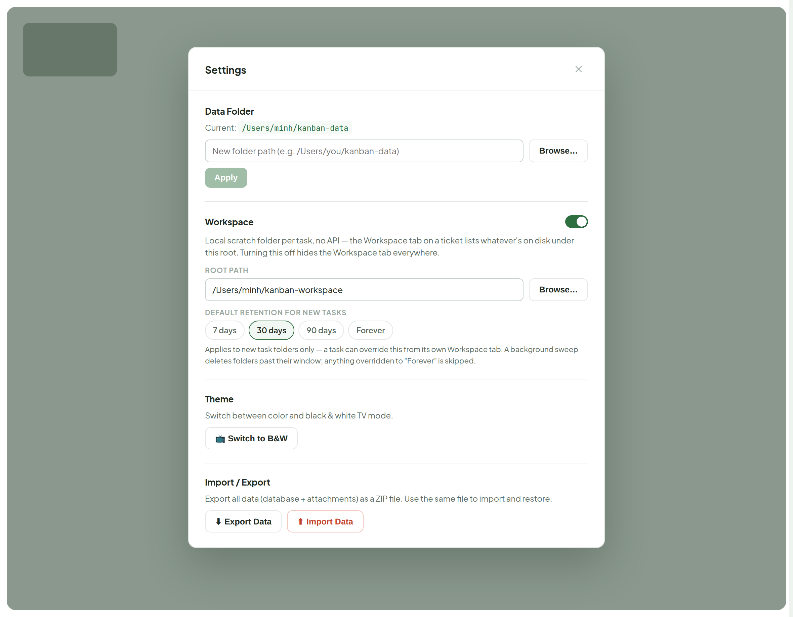
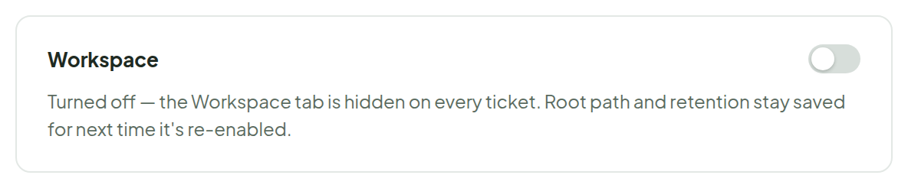
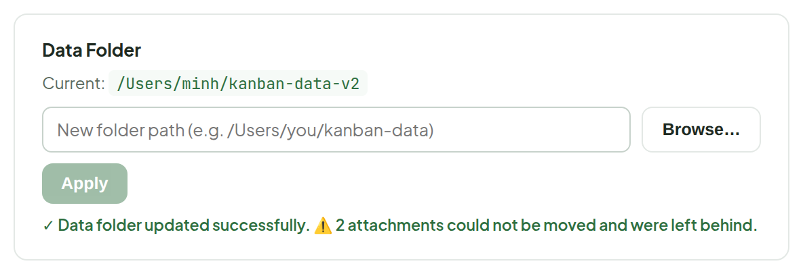
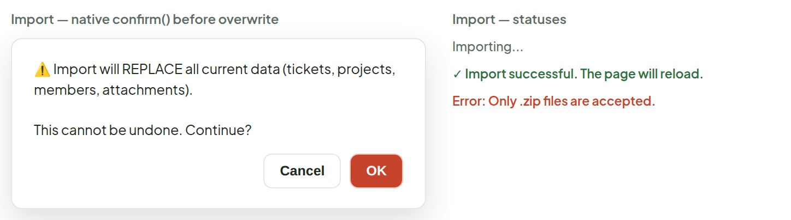

# Settings

> Screen — v1 · source: [`SettingsView.dc.html`](../source/SettingsView.dc.html) · canvas `1789831198-eb58` · sha256 `25e88488360baf42b79bdcfc2497857105124ad6a5da03f36e78ed9b496f89e4`

Opens from the sidebar's "Settings" button — a centered modal over a dimmed board, same overlay behavior as today's `SettingsPanel.tsx`. Data Folder, Theme and Import/Export sections are a direct restyle of what's already there, wired to the same `useSettings`/`useSetDataPath` hooks and `/settings`, `/data/export`, `/data/import` endpoints — no behavior changes. One new section, Workspace: the app-wide config the Workspace tab's note called for (`enabled`, `rootPath`, `defaultRetentionDays`) — this is where it gets set, since Workspace's own panel is per-task and read-only.

---

## 1. Full screen — modal open, dimmed board behind it

Source: [SettingsView.dc.html](../source/SettingsView.dc.html) › `<!-- Full screen -->` (L41–129)

- Workspace section copy: "Local scratch folder per task, no API — the Workspace tab on a ticket lists whatever's on disk under this root. Turning this off hides the Workspace tab everywhere."
- Retention helper: "Applies to new task folders only — a task can override this from its own Workspace tab. A background sweep deletes folders past their window; anything overridden to "Forever" is skipped."

## 2. Workspace section — off state

Source: [SettingsView.dc.html](../source/SettingsView.dc.html) › `<!-- Workspace section detail states -->` (L130–143)

- "Turned off — the Workspace tab is hidden on every ticket. Root path and retention stay saved for next time it's re-enabled."

## 3. Data Folder — after Apply, with warning returned

Source: [SettingsView.dc.html](../source/SettingsView.dc.html) › `<!-- Apply state with warning -->` (L144–158)

## 4. Import — confirm and status states

Source: [SettingsView.dc.html](../source/SettingsView.dc.html) › `<!-- Import confirm + progress -->` (L159–183)

- Import is guarded by a native `confirm()`: "Import will REPLACE all current data (tickets, projects, members, attachments). This cannot be undone. Continue?" with Cancel / OK.
- Statuses: "Importing...", "Import successful. The page will reload.", "Error: Only .zip files are accepted."

---

## Note

Data Folder, Theme and Import/Export are a 1:1 restyle of the current `SettingsPanel.tsx` — same fields, same hooks (`useSettings`, `useSetDataPath`), same endpoints (`/settings`, `/settings/data-path`, `/data/export`, `/data/import`), same copy for the destructive-import confirm.

- The Workspace section is new and needs real wiring: a `WorkspaceSettings` row (`enabled`, `rootPath`, `defaultRetentionDays`) alongside today's settings table, a save endpoint next to `/settings/data-path`, and the toggle needs to actually gate whether the Workspace tab renders on `TicketDetail`/`TicketDetailParent`.
- Retention options shown (7/30/90/Forever) match the chip set already proposed on the Workspace board's own retention dropdown, so a task's per-task override and this default read the same scale.
- Import/Export intentionally doesn't touch Workspace files — those live outside the app's data folder on purpose, so a restore doesn't silently delete someone's local scratch files.
