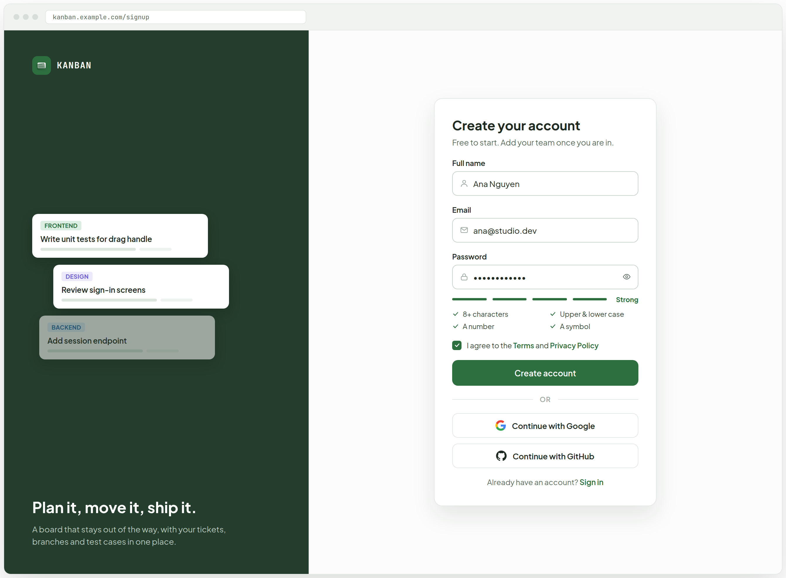
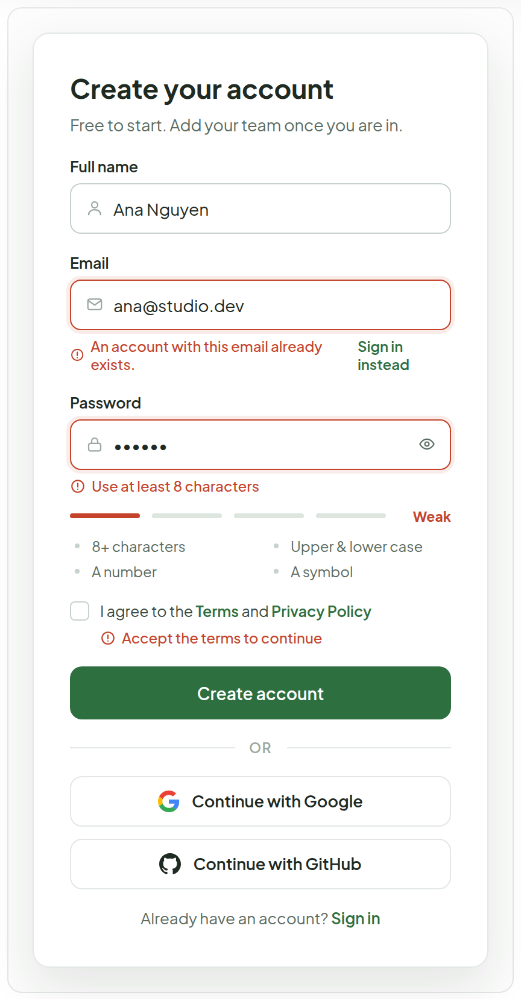
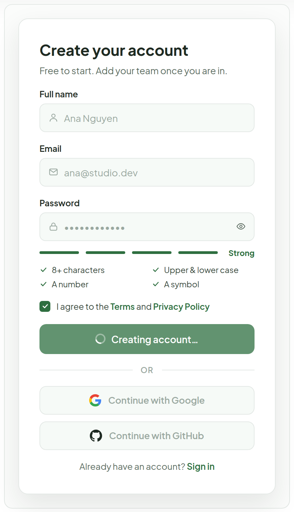
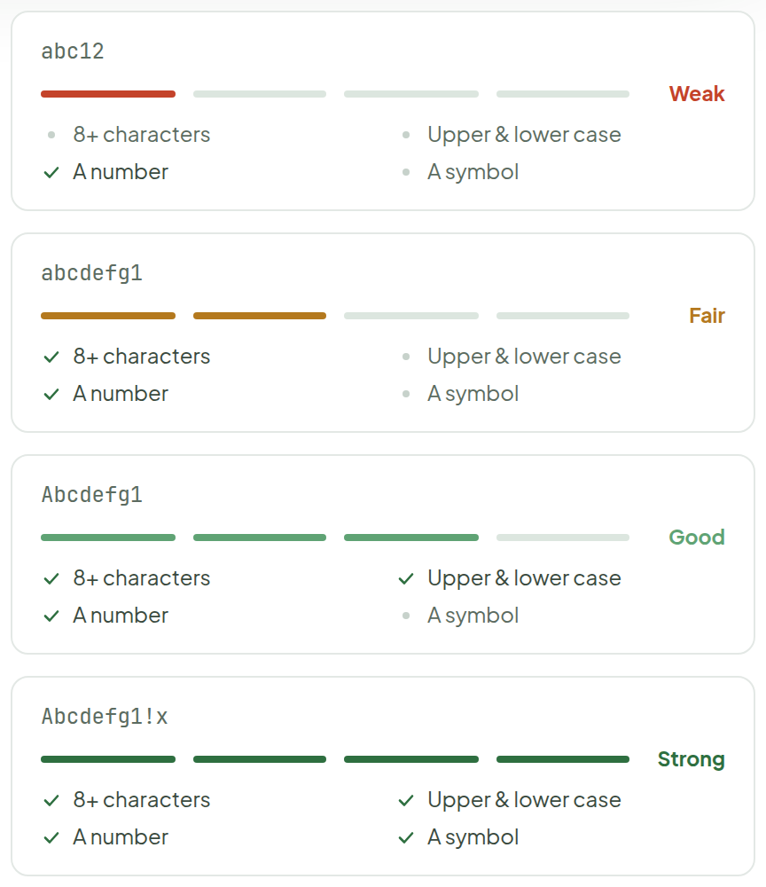
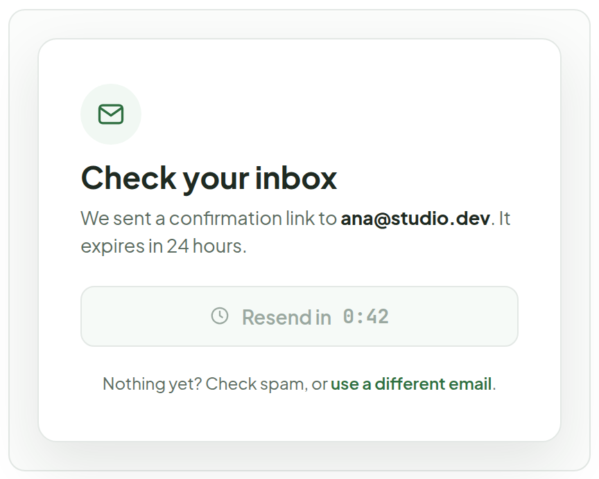
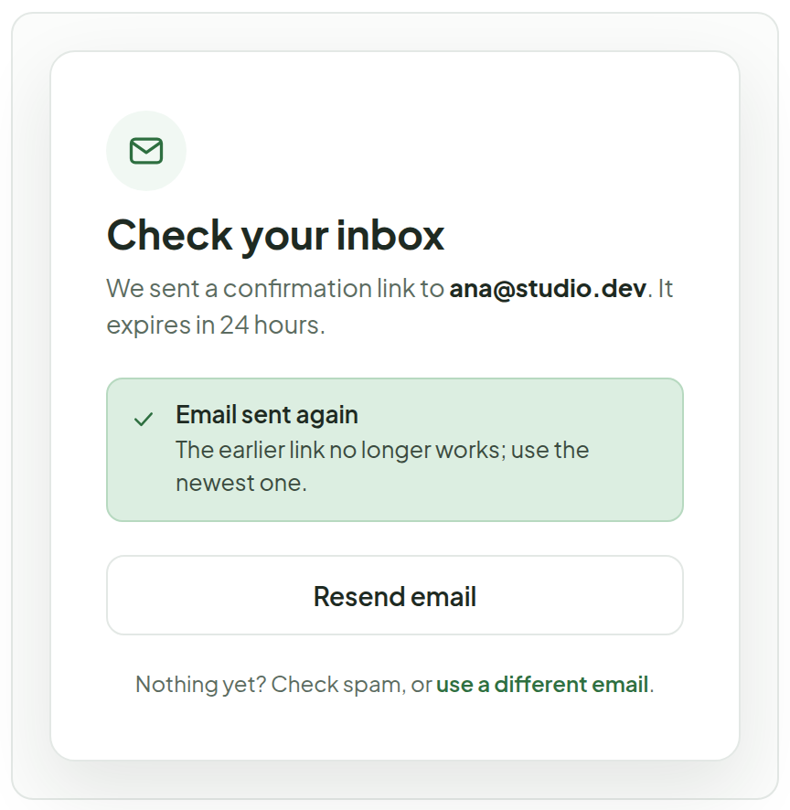
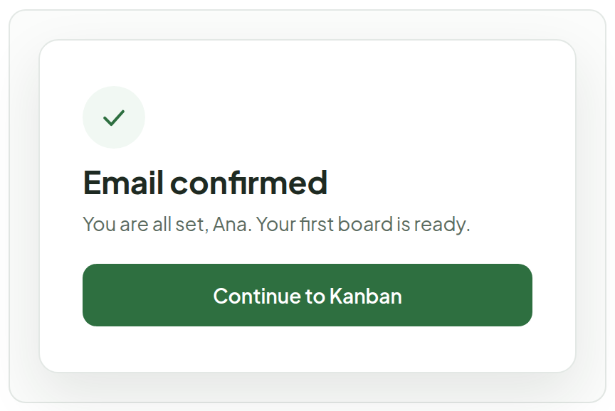
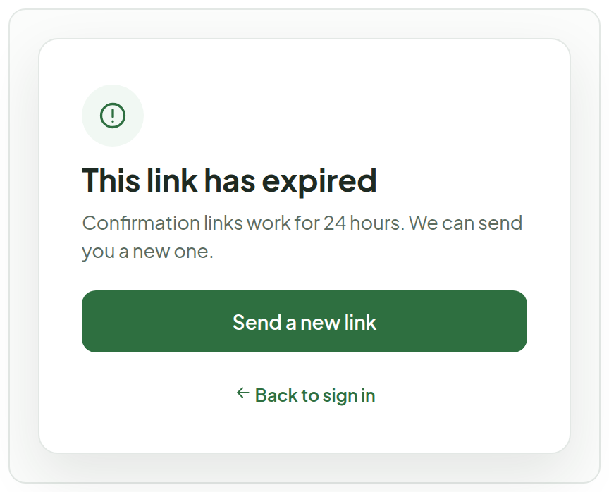

# Sign Up

> Screen — v1 · source: [`SignUp.dc.html`](../source/SignUp.dc.html) · canvas `1791083427-1a86` · sha256 `7dcf4cf7b3504eadbe5f63422a6461096c32c9d62a3827fa188fe90ae132dc61`

Same split layout as Login. Name, email and password, with a live strength meter and the four rules beside it. After submitting, the form is replaced by a "Check your inbox" screen; the account can be used once the email link is opened.

---

## 1. Full page — default (filled, password strong)

Source: [SignUp.dc.html](../source/SignUp.dc.html) › `
` 1330×977 — browser frame `kanban.example.com/signup` (L58)

- Browser frame with the address `kanban.example.com/signup`; brand panel: "KANBAN" logo, mini ticket cards tagged "FRONTEND" ("Write unit tests for drag handle"), "DESIGN" ("Review sign-in screens") and "BACKEND" ("Add session endpoint"), headline "Plan it, move it, ship it." and "A board that stays out of the way, with your tickets, branches and test cases in one place."
- Form: "Create your account" / "Free to start. Add your team once you are in." Fields: "Full name" (`Ana Nguyen`), "Email" (`ana@studio.dev`), "Password" (masked, show/hide button).
- Strength meter with all four steps filled and the label "Strong"; the rules list shows "8+ characters", "Upper & lower case", "A number", "A symbol" all met.
- Terms checkbox is ticked: "I agree to the Terms and Privacy Policy". Then "Create account", "OR", "Continue with Google", "Continue with GitHub", and "Already have an account? Sign in".

## 2. Validation errors — email taken, weak password, terms unchecked

Source: [SignUp.dc.html](../source/SignUp.dc.html) › `
` card 420×741 — validation variant (L58)

- Email error: "An account with this email already exists." with a "Sign in instead" link (inline on the email field, not a banner).
- Password error: "Use at least 8 characters"; meter at "Weak" with the rules "8+ characters", "Upper & lower case", "A number", "A symbol" unmet.
- Terms unchecked ("I agree to the Terms and Privacy Policy") with "Accept the terms to continue".
- The form otherwise matches the default: "Full name" `Ana Nguyen`, "Create account", OAuth buttons, "Already have an account? Sign in".

## 3. Creating account — fields locked

Source: [SignUp.dc.html](../source/SignUp.dc.html) › `
` card 420×488 — busy variant (L58)

- Full name, email and password (strength "Strong") are disabled.
- Primary button label is "Creating account…"; OAuth buttons are shown disabled.

## 4. Password strength — four levels

Source: [SignUp.dc.html](../source/SignUp.dc.html) › `
` 420×488 — four stacked sample cards (L58)

- `abc12` — "Weak" (1 of 4 steps, red).
- `abcdefg1` — "Fair" (2 of 4 steps, amber).
- `Abcdefg1` — "Good" (3 of 4 steps, light forest).
- `Abcdefg1!x` — "Strong" (4 of 4 steps, forest).
- Each sample lists "8+ characters", "Upper & lower case", "A number", "A symbol"; a rule shows a check when met and a dot when not.

## 5. Check your inbox — right after sign-up (resend on cooldown)

Source: [SignUp.dc.html](../source/SignUp.dc.html) › `
` row of three 420-wide cards — confirmation, first card (L58)

- Section label above the row of cards: "Email confirmation — after sign-up".
- "Check your inbox" / "We sent a confirmation link to ana@studio.dev. It expires in 24 hours."
- Disabled resend button: "Resend in 0:42" (60 second cooldown, countdown shown on the button).
- "Nothing yet? Check spam, or use a different email." — "use a different email" is a link that returns to the form with the email field focused.

## 6. Resent — cooldown over, button live again

Source: [SignUp.dc.html](../source/SignUp.dc.html) › `
` row of three 420-wide cards — confirmation, second card (L58)

- "Check your inbox" / "We sent a confirmation link to ana@studio.dev. It expires in 24 hours."
- Notice: "Email sent again" / "The earlier link no longer works; use the newest one."
- Button label "Resend email" (live again); footer "Nothing yet? Check spam, or use a different email."

## 7. Link opened — email confirmed

Source: [SignUp.dc.html](../source/SignUp.dc.html) › `
` row of three 420-wide cards — confirmation, third card (L58)

- "Email confirmed" / "You are all set, Ana. Your first board is ready."
- Button: "Continue to Kanban".

## 8. Link expired

Source: [SignUp.dc.html](../source/SignUp.dc.html) › `
` card 420×337 — expired-link variant (L58)

- "This link has expired" / "Confirmation links work for 24 hours. We can send you a new one."
- Primary button "Send a new link"; secondary "Back to sign in".

## Note

- Strength meter has four steps: Weak (red), Fair (amber), Good (light forest), Strong (forest). It counts length 8+, mixed case, a number and a symbol; the rules list shows which are met. Only length is required to submit.
- Email-taken is shown inline on the email field with a link to sign in, not as a banner, so the person can fix a typo.
- Resend has a 60 second cooldown; the button shows the countdown. "Use a different email" returns to the form with the email field focused.
- People who come in with Google or GitHub skip the confirmation screen: the provider has already verified the address.
- TODO(backend): sign-up endpoint, password hashing, confirmation token + email delivery, resend rate limit, terms/privacy pages.
