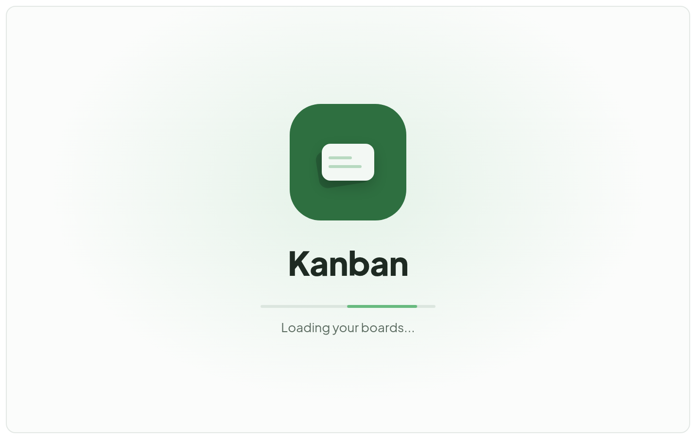
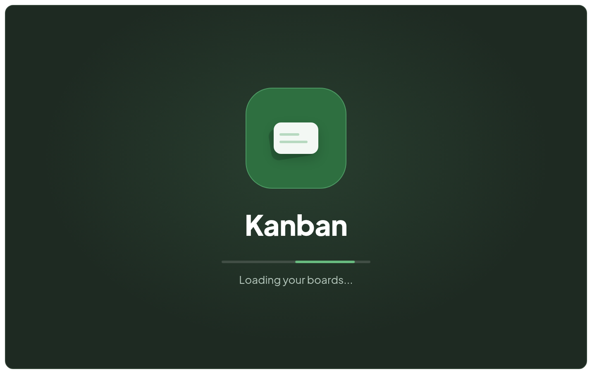
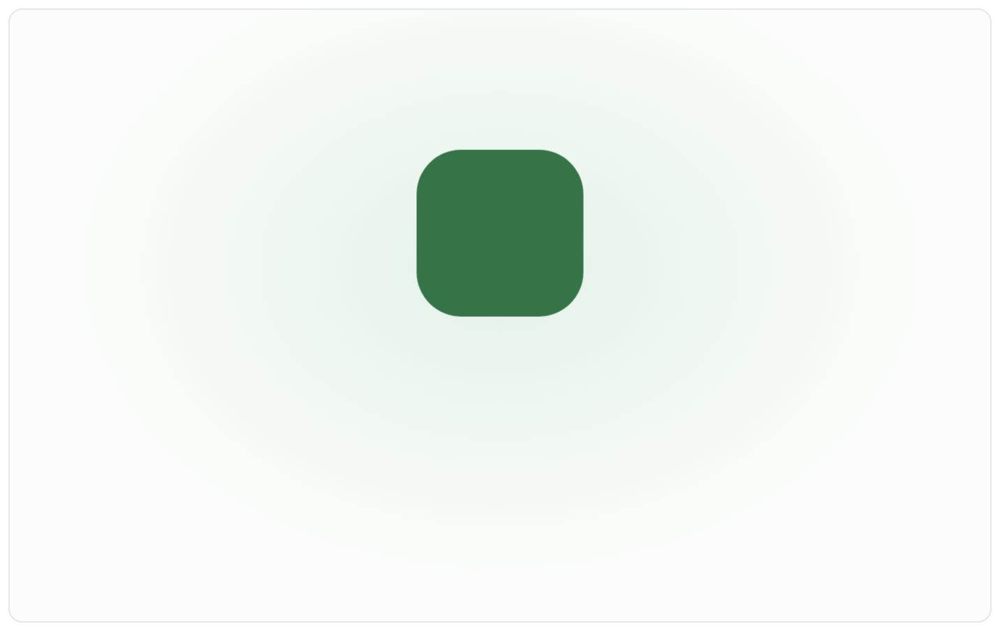
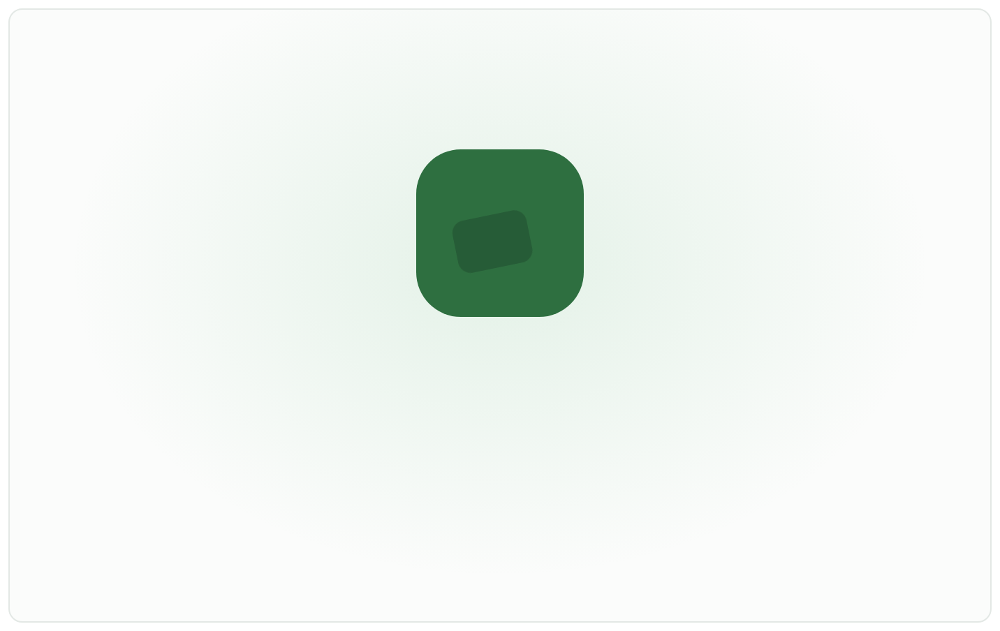
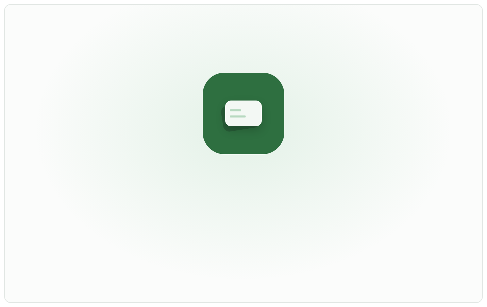
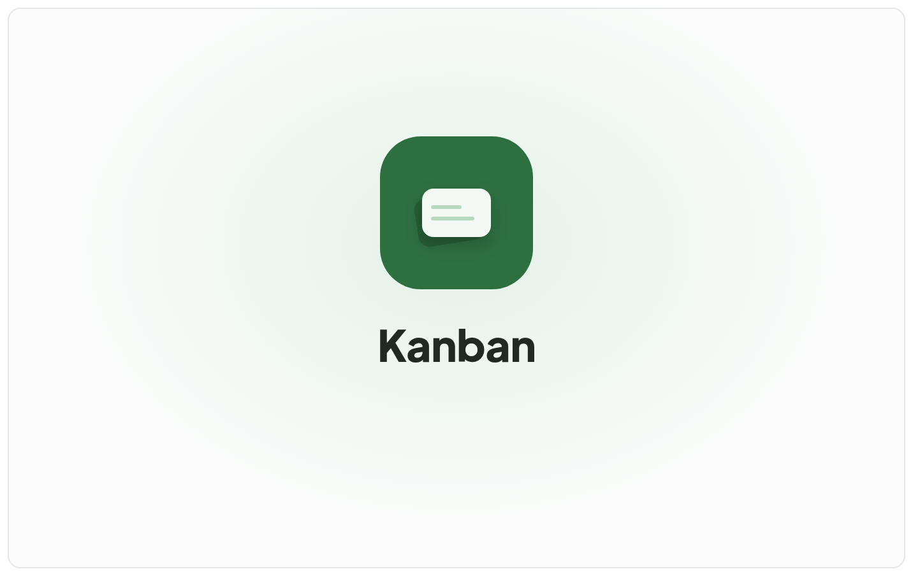
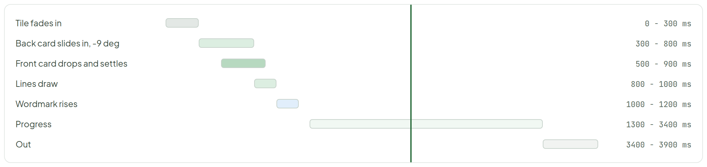

# Splash - Cards animation (live)

> Screen — v1 · source: [`SplashAnimation.dc.html`](../source/SplashAnimation.dc.html) · canvas `1791083427-1a86` · sha256 `987a577ef4a1d6d86555975b51c9bbd18f196dc932f961f093535c6920fc4474`

The animation from style C, running for real (CSS keyframes, 4 second loop: 1.2 s intro, hold, fade out, repeat). Light and dark side by side, with the timing laid out below and a playhead that follows the loop. Reload the page to restart it.

---

Light and dark frames are 704 × 440 live CSS loops (4000 ms). The stills below are captured with all animations paused: the two frames at 2200 ms (resting state), the intro stills at the times given.

## 1. Light

Source: [SplashAnimation.dc.html](../source/SplashAnimation.dc.html) › `
` live animated frame 704×440 (light) — paused at 2200 ms (L58)

- Frame texts: "Kanban", "Loading your boards...".
- Screenshot is paused at about 2.2 s, the resting state. In the real artboard this frame animates: it is a live CSS loop (4 s: 1.2 s intro, hold, fade out, repeat).

## 2. Dark

Source: [SplashAnimation.dc.html](../source/SplashAnimation.dc.html) › `
` live animated frame 704×440 (dark) — paused at 2200 ms (L58)

- Frame texts: "Kanban", "Loading your boards...". Same loop on the dark ground; paused at about 2.2 s. The real artboard animates it.

## 3. Light — intro still at t = 150 ms

Source: [SplashAnimation.dc.html](../source/SplashAnimation.dc.html) › `
` live light frame 704×440 — all CSS animations paused at 150 ms (L58)

- Still of the light frame at t = 150 ms (my caption, taken by pausing every animation at that time): the tile is partway through its fade-in (0 - 300 ms).
- This is a stand-in for the motion; the real artboard plays this live.

## 4. Light — intro still at t = 500 ms

Source: [SplashAnimation.dc.html](../source/SplashAnimation.dc.html) › `
` live light frame 704×440 — all CSS animations paused at 500 ms (L58)

- Still of the light frame at t = 500 ms (my caption, taken by pausing every animation at that time): the back card is sliding in toward -9 deg and the front card has started to drop.
- This is a stand-in for the motion; the real artboard plays this live.

## 5. Light — intro still at t = 900 ms

Source: [SplashAnimation.dc.html](../source/SplashAnimation.dc.html) › `
` live light frame 704×440 — all CSS animations paused at 900 ms (L58)

- Still of the light frame at t = 900 ms (my caption, taken by pausing every animation at that time): the front card has settled and the lines are drawing.
- This is a stand-in for the motion; the real artboard plays this live.

## 6. Light — intro still at t = 1200 ms

Source: [SplashAnimation.dc.html](../source/SplashAnimation.dc.html) › `
` live light frame 704×440 — all CSS animations paused at 1200 ms (L58)

- Still of the light frame at t = 1200 ms (my caption, taken by pausing every animation at that time): the intro is complete: wordmark in place.
- This is a stand-in for the motion; the real artboard plays this live.

## 7. Timing (loop 4000 ms; 1 intro = 0 - 1200 ms)

Source: [SplashAnimation.dc.html](../source/SplashAnimation.dc.html) › `
` timing block 1034×236 (7 bars and a playhead) — playhead paused at 2200 ms (L58)

- Segments (also tabulated below); the green vertical playhead moves across the bars in the real artboard (4 s linear loop) and is paused at 2200 ms here.

Timing table (copied from the artboard):

| Segment | Range |
| --- | --- |
| Tile fades in | 0 - 300 ms |
| Back card slides in, -9 deg | 300 - 800 ms |
| Front card drops and settles | 500 - 900 ms |
| Lines draw | 800 - 1000 ms |
| Wordmark rises | 1000 - 1200 ms |
| Progress | 1300 - 3400 ms |
| Out | 3400 - 3900 ms |

## Note

- Intro (0 - 1200 ms): tile fades and scales in (0 - 300), the back card slides in from the lower left and rotates to -9 degrees with a small overshoot (300 - 800), the front card drops in from above and settles (500 - 900), its two lines draw left to right (800 - 1000), the wordmark rises 6px and fades in (1000 - 1200). Easing: cubic-bezier(0.22, 1, 0.36, 1) for the cards, ease-out for lines and text.
- Then the indeterminate progress bar and "Loading your boards..." appear (from 1300 ms) and hold. In the app the splash stays until the session check returns (min 600 ms, max 8 s before the error state); this loop only exists for the preview. On warm reloads the intro is skipped and only the resting frame shows.
- Reduced motion: no movement at all. The static resting frame shows (tile, back card at -9 degrees, front card, wordmark, text only).
- Accessibility: the loading text has role="status" so a screen reader announces it once; the decorative animation is hidden from assistive tech.
- Handoff: three animated layers (back card, front card, lines) plus the wordmark. Rive or Lottie is not needed; plain CSS or a small transition library reproduces it on web, and the same timings work for the mobile launch animation.
