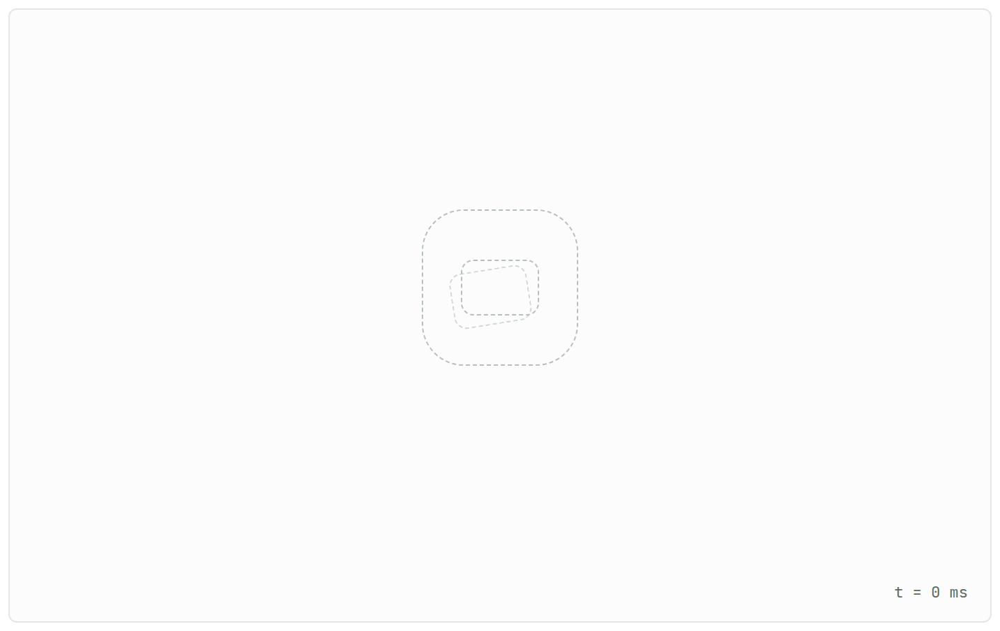
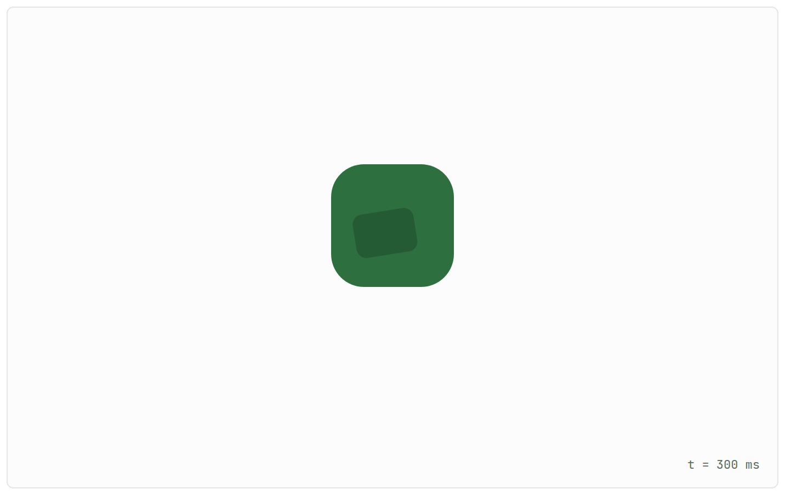
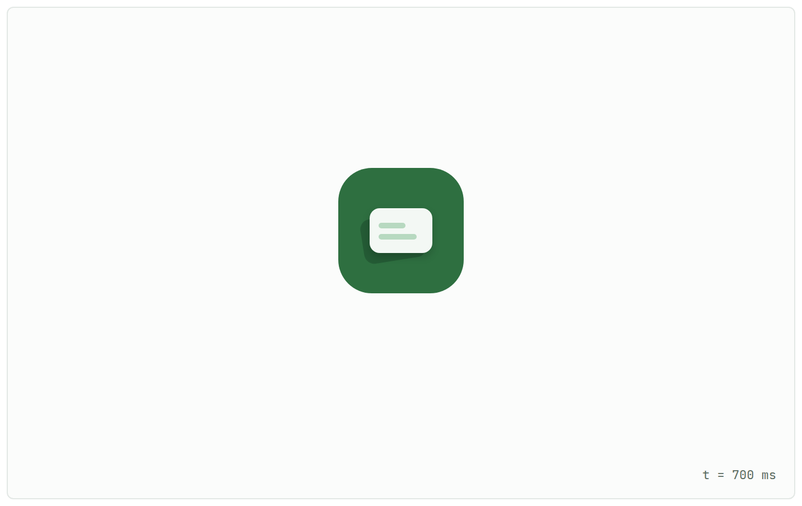
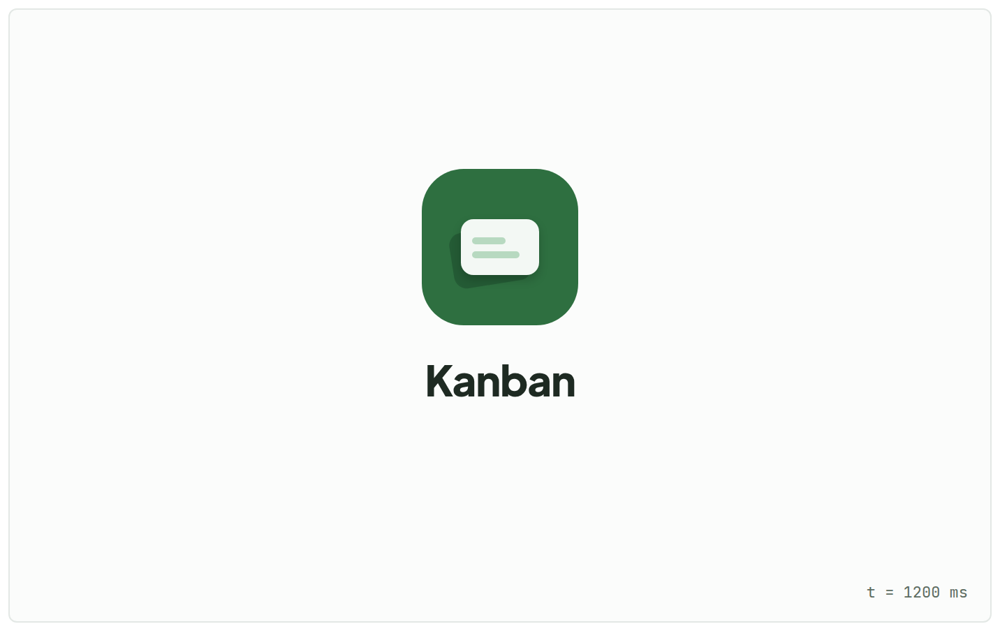
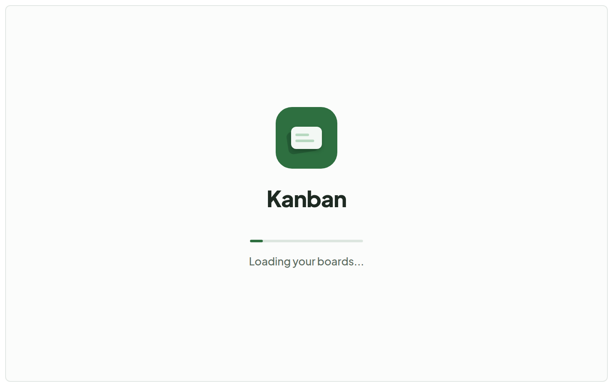
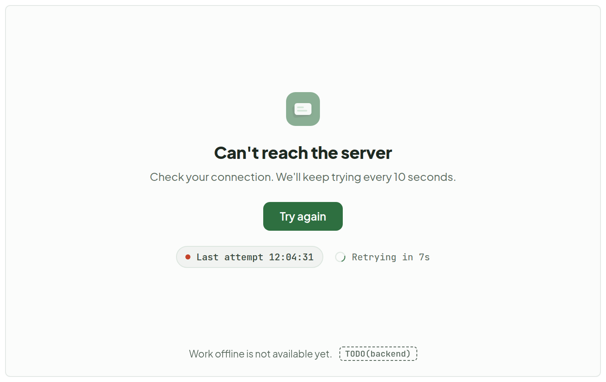
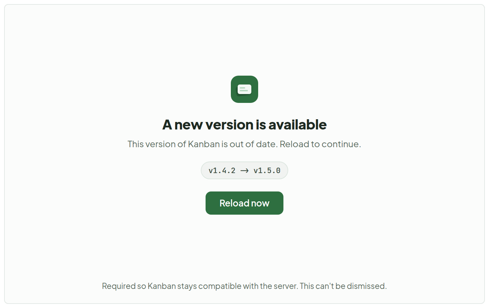
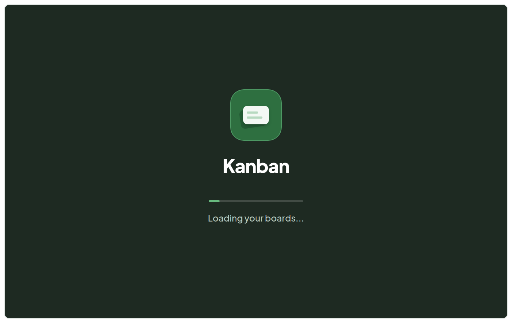
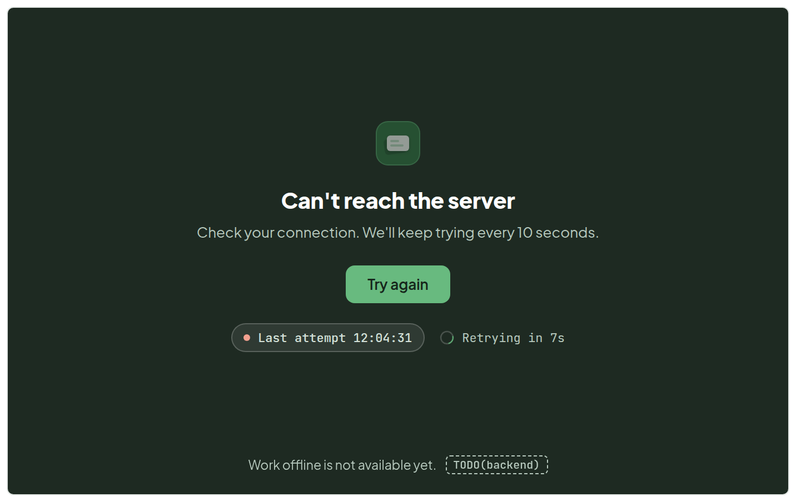
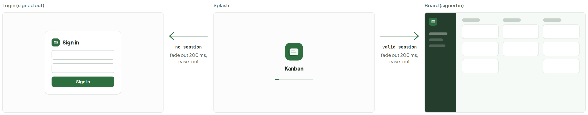

# Splash screen

> Screen — v1 · source: [`Splash.dc.html`](../source/Splash.dc.html) · canvas `1791083427-1a86` · sha256 `c3d02b283ff835b11f52557b82d476fe89c39185b9d6d5efd7bd1d5774d61904`

The web splash: the cards animation. Four stills of the intro, then the resting, error / offline, update-required and dark states. Frames are plain 704 x 440 rectangles (a 1280 x 800 viewport at 0.55), no browser chrome. The live animation is on the Splash - Cards animation board.

---

Section — **Cards animation**: The two cards of the mark are the animation. Four stills of the intro, then the resting loading frame.

## 1. Intro 1. t = 0 ms - ghost outline of the tile and cards, nothing else

Source: [Splash.dc.html](../source/Splash.dc.html) › `
` 704×440 frame — intro still (L46)

- Frame text: "t = 0 ms" (monospace, bottom right). Ghost outline of the tile and cards only; no wordmark, no progress bar.

## 2. Intro 2. t = 300 ms - tile in, back card slid in (-9deg, 55%)

Source: [Splash.dc.html](../source/Splash.dc.html) › `
` 704×440 frame — intro still (L46)

- Frame text: "t = 300 ms". The green tile is in and the back card is slid in, tilted -9deg at 55% opacity; no front card yet.

## 3. Intro 3. t = 700 ms - front card settled on top, two lines

Source: [Splash.dc.html](../source/Splash.dc.html) › `
` 704×440 frame — intro still (L46)

- Frame text: "t = 700 ms". The front card has settled on top of the back card and its two lines are drawn; no wordmark yet.

## 4. Intro 4. t = 1200 ms - wordmark fades in under the mark

Source: [Splash.dc.html](../source/Splash.dc.html) › `
` 704×440 frame — intro still (L46)

- Frame texts: "Kanban", "t = 1200 ms". The wordmark has faded in under the mark.

## 5. 1. Normal start (resting) - loops here until the app is ready

Source: [Splash.dc.html](../source/Splash.dc.html) › `
` 704×440 frame — resting, light ground (L46)

- Frame texts: "Kanban", "Loading your boards...".
- Logo tile with the two cards, wordmark, indeterminate progress bar (shown at a fixed point of its loop) and the status line. This is the state it holds until the app is ready.

## 6. 2. Error / offline - retries every 10 s, manual Try again

Source: [Splash.dc.html](../source/Splash.dc.html) › `
` 704×440 frame — error / offline state (L46)

- Frame texts: "Can't reach the server", "Check your connection. We'll keep trying every 10 seconds.", "Try again".
- Chips: "Last attempt 12:04:31" (red dot) and "Retrying in 7s" (spinner).
- Footer line: "Work offline is not available yet." with a dashed `TODO(backend)` tag.

## 7. 3. Update required - non-dismissible, no close control

Source: [Splash.dc.html](../source/Splash.dc.html) › `
` 704×440 frame — update-required state (L46)

- Frame texts: "A new version is available", "This version of Kanban is out of date. Reload to continue.".
- Version chip: "v1.4.2 -> v1.5.0" (drawn with an arrow), then the "Reload now" button.
- Footer line: "Required so Kanban stays compatible with the server. This can't be dismissed." No close control.

## 8. 4. Dark - Normal start (resting) - ground #1E2A22

Source: [Splash.dc.html](../source/Splash.dc.html) › `
` 704×440 frame — resting, dark ground #1E2A22 (L46)

- Frame texts: "Kanban", "Loading your boards...". Same layout as the light resting frame on ground #1E2A22.

## 9. 5. Dark - Error / offline - ground #1E2A22

Source: [Splash.dc.html](../source/Splash.dc.html) › `
` 704×440 frame — error / offline, dark ground #1E2A22 (L46)

- Frame texts: "Can't reach the server", "Check your connection. We'll keep trying every 10 seconds.", "Try again".
- Chips: "Last attempt 12:04:31" and "Retrying in 7s"; footer "Work offline is not available yet." with the `TODO(backend)` tag. Same layout as the light error frame.

## 10. Transition

Source: [Splash.dc.html](../source/Splash.dc.html) › `
` strip 1448×275 of three schematic frames joined by two arrows (L46)

- Section description: "Splash hands off to Login or Board with a 200 ms cross-fade. Schematic frames; the splash is shown as its resting frame."
- Frames: "Login (signed out)" (a small "Sign in" card), "Splash" (logo, "Kanban", progress bar), "Board (signed in)" (sidebar and lane skeleton).
- Arrows: "no session" / "fade out 200 ms, ease-out" points from Splash to Login; "valid session" / "fade out 200 ms, ease-out" points from Splash to Board.
- Cross-fade: the splash layer fades to 0 over 200 ms (ease-out) while the destination fades in beneath it; the splash is removed from the DOM at the end. With reduced motion the swap is instant. Focus moves to the first heading or field of the destination.

## Note

- Timing. Minimum display 600 ms, so the splash never flashes. Maximum wait 30 s for the session and /health checks; after that the Error / offline state replaces the loading state. Once ready (and 600 ms elapsed) it cross-fades to Login or Board in 200 ms.
- Intro. 1200 ms, played once per cold start. t=0 ghost outline; 0-300 ms the tile fades in and the back card slides in from the lower left (ease-out, cubic-bezier(0.22, 1, 0.36, 1)) to -9deg at 55% opacity; 300-700 ms the front card drops onto it with a slight settle (ease-out, 4 px overshoot) and its two lines draw in; 700-1200 ms the wordmark fades up 6 px (ease-in-out). It then holds on the resting frame; the progress bar loops (1.5 s, linear-ish ease-in-out) until the app is ready. The intro is skipped on warm reloads and the resting frame is shown directly. If loading finishes during the intro, the intro still completes before the hand-off (minimum display is therefore max(600 ms, intro)).
- Reduced motion. With prefers-reduced-motion: reduce there is no animation at all: static logo, wordmark and the status text. The bar becomes a static, half-opacity full-width line, the spinner a static ring, and the intro is skipped: it goes straight to the resting frame.
- Progress is indeterminate. There is no real percentage, so the bar and ring carry no value (role=progressbar without aria-valuenow). Never show a fake number.
- Accessibility. Loading text is a role=status, aria-live=polite region; the error heading is role=alert and moves focus to Try again; the update screen is role=alertdialog, non-dismissible (no close, no Escape), focus on Reload now. The 10 s countdown is not announced each second. All secondary text is #B7C9BE or lighter on dark grounds and #5B6B60 or darker on light (>= 4.5:1). Decorative logo is aria-hidden; the page title carries the app name.
- Native / PWA launch image. The manifest background_color and theme_color must match the ground (#FBFCFB, dark #1E2A22), and the launch image (iOS apple-touch-startup-image, Android splash from icon) is just the centred logo tile on that ground, no text and no bar, so the hand-off to the web splash is seamless. The web splash repeats the same tile at the same position (centre, 14 px above middle).
- Dark. Follows prefers-color-scheme at first paint (inline script in index.html, no flash); the dark ground is #1E2A22. Primary buttons switch to Mint #68BA7F with Ink text on dark grounds.
- Copy. Version numbers and the 12:04:31 timestamp are sample data. The version line should come from the build; the new version from the /version response.
- TODO(backend): GET /health (liveness, no auth) used by the splash check and the retry loop.
- TODO(backend): GET /version returns min_supported_version and latest; the client compares semver and shows Update required when the build is below the minimum.
- TODO(backend): retry/backoff policy: proposed fixed 10 s while on the splash (as drawn), then exponential 10/20/40 s capped at 60 s once past the first minute, with jitter; manual Try again retries immediately and resets the timer.
- TODO(backend): offline mode. "Work offline" is not available yet; it needs a local cache and a sync queue. The splash only mentions it as a line, with no control.
