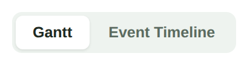
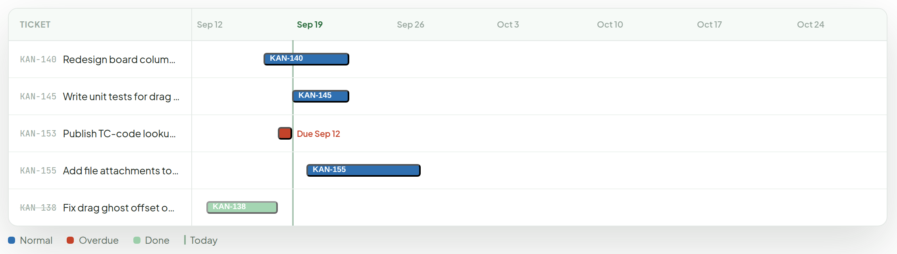
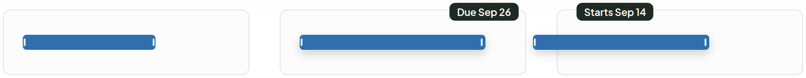
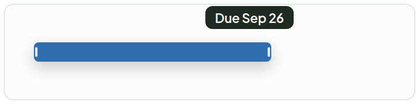
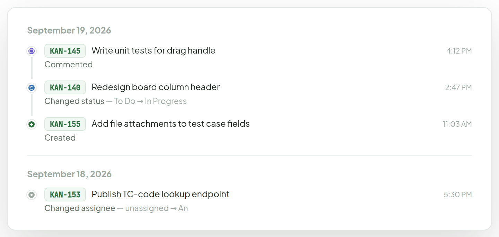

# Timeline View

> Screen — v1 · source: [`TimelineView.dc.html`](../source/TimelineView.dc.html) · canvas `1789831198-eb58` · sha256 `fa00865ec4ed6ed1a9e8968b9c7d45d53e12501477b96306913f6a5e287ec943`

Opens from the "Timeline" segment in Main Board's view switcher. Maps 1:1 to today's `TimelineView.tsx` — two sub-modes, Gantt and Event Timeline, same 60-day window and same activity feed. Visual pass only: the flat neon bar/event colors move to the system palette, and the Event Timeline's rail reuses the exact dot-and-line pattern already built for Debug Space.

---

## 1. Sub-mode switcher

Source: [TimelineView.dc.html](../source/TimelineView.dc.html) › `<!-- Sub-mode switcher -->` (L65–70)

## 2. Gantt — tickets with a start or due date, 60-day window

Source: [TimelineView.dc.html](../source/TimelineView.dc.html) › `<!-- Gantt -->` (L71–138)

- Legend: Normal (blue) · Overdue (red) · Done (dimmed green) · Today (green vertical line).
- A ticket with only a due date renders as a small marker plus "Due <date>" label (KAN-153).

## 3. New — dragging a bar edge changes its date, no need to open the ticket

Source: [TimelineView.dc.html](../source/TimelineView.dc.html) › `<!-- Resize to change dates -->` (L139–201)

1. **Hover — grip marks appear at both ends.** Cursor becomes ↔ over either edge. Nothing else about the bar changes yet.
2. **Dragging the right edge — due date.** Snaps to whole days (18px = 1 day). Dashed outline marks where it started; a tooltip tracks the new date live ("Due Sep 26").
3. **Dragging the left edge — start date.** Same mechanic, mirrored ("Starts Sep 14"). Can't drag past the other edge — bar always keeps at least 1 day.

## 4. Live loop — the same sequence, running

Source: [TimelineView.dc.html](../source/TimelineView.dc.html) › `<!-- Resize to change dates -->` live loop, keyframes `tvResizeWidth` / `tvGhostFade` / `tvTooltipFade` / `tvTooltipMove` (L29–53)

Grab → drag → hold → release → settle, same rhythm as the Drag & Drop card motion. Reload the page to see it from the start. Static frame shown (captured at ~45% of the loop).

Loop spec (4.2s, infinite):

- Bar width (`cubic-bezier(.4,0,.2,1)`): 140px at 0–8%, grows to 196px by 22% (hold 22–68%), eases back to 140px by 92%; shadow rises from none to `0 5px 12px rgba(30,42,34,.22)` while held, then back to none.
- Ghost (dashed start outline) opacity: 0 until 14%, 1 from 20% to 84%, 0 by 92%.
- Tooltip: fades in 16–24% (translateY 4px to 0), visible to 82%, fades out by 90%; its `left` tracks the bar edge from 118px (0–20%) to 178px (26–80%) and back.

## 5. Event Timeline — same rail pattern as Debug Space, one category-colored dot per event type

Source: [TimelineView.dc.html](../source/TimelineView.dc.html) › `<!-- Event Timeline -->` (L202–273)

---

## Note

Visual pass only, all logic in `TimelineView.tsx` is unchanged — same 60-day window, same clamping-to-window rules, same activity feed.

1. `EVENT_COLORS` moves off the flat neon set (`#AACC2E`/`#E8441A`/`#5BB8F5`) to the system palette (created green, status change blue, commented purple, other neutral).
2. `EVENT_ICONS` moves from unicode glyphs (✦⟳◎·) to the same small stroke-SVG icon language as everywhere else.
3. The event rail reuses Debug Space's `.dbg-item`/`.dbg-rail`/`.dbg-dot`/`.dbg-line` pattern outright — same shape, different color key.
4. Gantt bars: normal blue, overdue red (was orange), done bars dimmed instead of just colored, matching the dimmed-but-not-greyed convention used for Done cards elsewhere; today line uses the brand green instead of a plain vertical rule.
5. Ticket titles that are struck through (KAN-138 here) reuse the Done-status convention from Ticket Card and List View.
6. Resize-to-reschedule is a real new interaction, not in `GanttChart` today — bars are plain non-draggable buttons there. Needs pointer handlers on two new edge zones per bar (mousedown → track horizontal delta → snap to `DAY_WIDTH` increments → on release, PATCH the ticket's `startDate` or `dueDate`), plus a min-1-day clamp so the two edges can't cross. Doesn't need `@dnd-kit` — it's a single-axis resize, not a drop target — plain pointer events are enough, same weight as the rest of this component.
