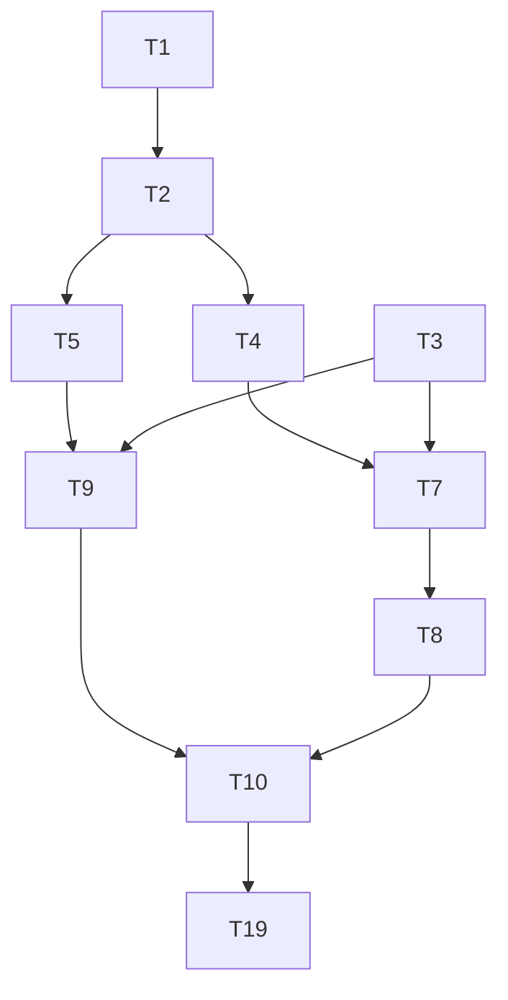

# Backend Architecture & Implementation Plan

## 1. Overview & Goals
- Build a Python backend that serves BOTH a React UI (REST) AND AI agents (MCP).
- Same Python process, same SQLite database, two interfaces.
- The backend makes the frontend stateless (no more in-memory mock data).

## 2. Architecture Decision: MCP-First, Not REST-First
Explain the decision to use **Option B (FastMCP-first)** over `fastapi-mcp` auto-generation:
- MCP tools need hand-crafted intent-aware docstrings for AI agents to use effectively.
- `fastapi-mcp` auto-generates tool names like `post_projects_project_id_tickets` — unusable for natural language agents.
- REST and MCP serve different semantic models (resource-oriented vs action-oriented).
- The service layer is shared DRY code; the two interfaces diverge intentionally to optimize for their respective consumers.

## 3. Tech Stack

| Component | Technology | Version |
|----------|-----------|---------|
| REST API | FastAPI | ≥0.110 |
| MCP Server | mcp SDK (FastMCP) | 1.27.0 |
| ASGI Server | uvicorn | latest |
| Package Manager | uv (pyproject.toml) | latest |
| Database | SQLite (async) | — |
| ORM | SQLModel + aiosqlite | latest |
| Migrations | Alembic | latest |
| Test | pytest-asyncio | latest |

## 4. File Structure
```
server/
  models.py              # SQLModel table definitions + Pydantic schemas
  database.py            # Async engine, get_session(), WAL mode setup
  services/
    projects.py          # Business logic for projects
    tickets.py           # Business logic for tickets (including all sub-entities)
  api/
    projects.py          # FastAPI router for projects
    tickets.py           # FastAPI router for tickets
  mcp/
    tools.py             # @mcp.tool() definitions, thin wrappers over services
  main.py                # Mount FastAPI + FastMCP, CORS, lifespan
  pyproject.toml         # uv-managed dependencies
  alembic/               # DB migrations
  kanban.db              # SQLite database (gitignored)
```

## 5. Database Schema

**projects table:**
| Column | Type | Notes |
|--------|------|-------|
| id | TEXT PK | e.g. "proj-uuid" |
| name | TEXT | Project display name |
| prefix | TEXT UNIQUE | e.g. "IAM", uppercase, max 6 chars |
| color | TEXT | Hex accent color |
| ticket_counter | INT DEFAULT 0 | Auto-increment for ticket IDs |

**tickets table:**
| Column | Type | Notes |
|--------|------|-------|
| id | TEXT PK | e.g. "IAM-1" (prefix + counter) |
| project_id | TEXT FK | → projects.id |
| title | TEXT | |
| description | TEXT | Markdown |
| type | TEXT | bug/feature/task/chore |
| status | TEXT | backlog/todo/in-progress/done |
| priority | TEXT | low/medium/high/critical |
| estimate | REAL nullable | Story points |
| due_date | TEXT nullable | ISO date |
| tags | TEXT | JSON array |
| parent_id | TEXT FK nullable | → tickets.id (self-ref, max 1 level deep) |
| comments | TEXT | JSON array of Comment objects |
| acceptance_criteria | TEXT | JSON array of AcceptanceCriterion |
| activity_log | TEXT | JSON array of ActivityEntry |
| work_log | TEXT | JSON array of WorkLogEntry |
| test_cases | TEXT | JSON array of TestCase |
| created_at | TEXT | ISO datetime |
| updated_at | TEXT | ISO datetime |

Note about JSON columns: SQLAlchemy won't track mutations inside JSON columns — always reassign the whole list (e.g., `ticket.comments = [*ticket.comments, new_comment]`).

## 6. Service Layer Design 
Business rules live ONLY in the service layer (called by both REST and MCP):
- **parentId validation**: when creating a child ticket, `parent.parent_id` must be null (no grandchildren allowed).
- **Ticket ID generation**: atomic `UPDATE projects SET ticket_counter = ticket_counter + 1 RETURNING ticket_counter` to get next N, then form `{PREFIX}-{N}`.
- **Activity log auto-generation**: `update_ticket()` loads old record → computes field diffs → appends activity entries automatically for auditable fields: title, status, priority, type, estimate, due_date.
- **Prefix rules**: max 6 chars, uppercase, unique across projects.

## 7. API Endpoints (REST)

**Projects:**
- `GET /projects` — list all
- `POST /projects` — create
- `GET /projects/{id}` — get one
- `PATCH /projects/{id}` — update
- `DELETE /projects/{id}` — delete (reject if only 1 project remains)

**Tickets:**
- `GET /projects/{project_id}/tickets` — list tickets for project (with optional `?status=`, `?priority=`, `?q=` filters)
- `POST /projects/{project_id}/tickets` — create ticket
- `GET /tickets/{id}` — get one ticket (with all sub-entities)
- `PATCH /tickets/{id}` — update ticket fields
- `DELETE /tickets/{id}` — delete ticket
- `PATCH /tickets/{id}/status` — move ticket status (also appends activity log)

**Ticket sub-entity mutations:**
- `POST /tickets/{id}/comments` — add comment
- `DELETE /tickets/{id}/comments/{comment_id}` — delete comment
- `POST /tickets/{id}/acceptance-criteria` — add AC item
- `PATCH /tickets/{id}/acceptance-criteria/{ac_id}` — toggle AC item
- `DELETE /tickets/{id}/acceptance-criteria/{ac_id}` — delete AC item
- `POST /tickets/{id}/work-log` — add work log entry
- `POST /tickets/{id}/test-cases` — add test case
- `PATCH /tickets/{id}/test-cases/{tc_id}` — update test case (status/proof/note)
- `DELETE /tickets/{id}/test-cases/{tc_id}` — delete test case

## 8. MCP Tools

List all MCP tools with their intent-aware docstrings (brief):
```
list_projects()               → list all projects
create_project(name, prefix, color)  → create a project
list_tickets(project_id, status?, priority?, q?)  → list tickets with optional filters
create_ticket(project_id, title, type, priority, description?, parent_id?, ...)  → create ticket, use when user tracks a new bug/feature/task
get_ticket(id)                → get full ticket details including comments and history
update_ticket(id, **fields)   → update any ticket fields
update_status(id, status)     → move ticket to a new status column
create_child_ticket(parent_id, title, ...)  → create a sub-ticket (max 1 level deep)
add_comment(ticket_id, text)  → add a comment or note to a ticket
add_work_log(ticket_id, author, role, note)  → log work done on a ticket
add_test_case(ticket_id, title, status, proof?, note?)  → add a test case
update_test_case(ticket_id, tc_id, status, proof?, note?)  → update test case result
```

## 9. Frontend Integration Plan

How the React frontend migrates from mock data to real API:

**Step 1 — API layer setup (no component changes):**
- Add `axios` + `@tanstack/react-query`.
- Create `ui/src/api/client.ts` (axios instance with `VITE_API_URL` base URL).
- Create `ui/src/api/projects.ts` and `ui/src/api/tickets.ts`.
- Wrap `App` in `QueryClientProvider`.
- Add `.env.development`: `VITE_API_URL=http://localhost:8000`.

**Step 2 — Migrate project state:**
- Replace `useState(INITIAL_PROJECTS)` in `App.tsx` with `useQuery` from TanStack Query.
- Migrate `ProjectSidebar` mutations (create, delete project).

**Step 3 — Migrate ticket state:**
- Replace all `updateCurrentProjectTickets()` calls with TanStack mutations.
- Migrate drag-and-drop (`handleDragEnd`) to `useUpdateStatus` mutation.
- Migrate `handleCreateTicket`, `handleEditTicket`, `handleDeleteTicket`.

**Step 4 — Migrate TicketModal sub-entities:**
- `CommentsSection`, `AcceptanceCriteriaSection`, `WorkLogSection`, `TestCasesSection`, `SubTicketsSection`.
- Each section gets its own mutation hooks.

**Step 5 — Cleanup:**
- Delete `ui/src/data/mock-tickets.ts`.
- Full regression test.

Schema sync rule: any change to `server/models.py` must be reflected in `ui/src/types/ticket.ts` in the same commit.

## 10. Testing Convention

- **Developer self-tests first**: Every backend task must include unit tests and/or integration tests (pytest-asyncio) before handing off. No exceptions.
- **QC is black-box**: QC tests APIs and UI behavior only — no reading backend source code. QC works from the API contract doc (T6) and frontend behavior, not implementation details.
- **QC scope**: REST endpoints + frontend UI interactions. Not: internal service functions, DB queries, or MCP tool internals.

## 11. Important Gotchas

1. **CORS**: Must be set up in `main.py` before any routes are written: `allow_origins=["http://localhost:5173"]`, expose `Mcp-Session-Id` header.
2. **SQLite WAL mode**: Set in `database.py` via `PRAGMA journal_mode=WAL` on connect event to prevent write lock issues under concurrent MCP + UI access.
3. **JSON column mutation tracking**: Always reassign entire list, not in-place append.
4. **Atomic ticket ID generation**: Use atomic DB increment, not read-then-write to avoid duplicates.
5. **Alembic + SQLModel**: Use `SQLModel.metadata` (not `Base.metadata`), enable `render_as_batch=True` for SQLite.
6. **AsyncSession import**: Use `sqlmodel.ext.asyncio.session.AsyncSession`, not SQLAlchemy's version.
7. **MCP Streamable HTTP transport**: Use this, NOT SSE (deprecated) and NOT stdio (requires subprocess launch, incompatible with shared process).
8. **App.tsx migration**: Migrate projects first, then tickets, then sub-entities; never break partial state.

## 11. Phased Implementation Tasks

**Phase 0 — Foundation**
| ID | Type | Task |
|----|------|------|
| T0 | BACKEND | Scaffold server/: FastAPI + FastMCP mount + CORS + /health + pyproject.toml (uv) |
| T1 | BACKEND | models.py + database.py (SQLModel tables, async engine, WAL mode) |
| T2 | BACKEND | Alembic setup + initial migration + seed script (from current mock data) |
| T3 | FRONTEND | Add axios + TanStack Query, api/client.ts, VITE_API_URL env |

**Phase 1 — Core CRUD**
| ID | Type | Task | Depends on |
|----|------|------|-----------|
| T4 | BACKEND | services/projects.py + api/projects.py (list, create, get, update, delete) | T1, T2 |
| T5 | BACKEND | services/tickets.py + api/tickets.py (list, create, get, update-status, delete) | T1, T2 |
| T6 | BOTH | API contract doc: confirm JSON shapes match TS types | T4, T5 |
| T7 | FRONTEND | ui/src/api/projects.ts + TanStack hooks (useProjects, useCreateProject, useDeleteProject) | T3, T4 |
| T8 | FRONTEND | Migrate ProjectSidebar + App.tsx project state to TanStack Query | T7 |
| T9 | FRONTEND | ui/src/api/tickets.ts + TanStack hooks (useTickets, useCreateTicket, useUpdateStatus...) | T3, T5 |
| T10 | FRONTEND | Migrate Board/drag-and-drop/ticket CRUD in App.tsx to TanStack mutations | T8, T9 |
| T11 | BACKEND | MCP tools (core): list_projects, create_project, list_tickets, create_ticket, get_ticket, update_status | T4, T5 |

**Phase 2 — Advanced Features**
| ID | Type | Task | Depends on |
|----|------|------|-----------|
| T12 | BACKEND | Sub-entity mutations: add/delete comment, add/toggle/delete AC, add work log | T5 |
| T13 | FRONTEND | Migrate TicketModal sub-sections to API (Comments, AC, WorkLog, ActivityLog) | T10, T12 |
| T14 | BACKEND | create_child_ticket service: parentId validation, cycle prevention | T5 |
| T15 | FRONTEND | Migrate SubTicketsSection to API | T13, T14 |
| T16 | BACKEND | Test case mutations: add, update, delete | T5 |
| T17 | FRONTEND | Migrate TestCasesSection to API | T13, T16 |
| T18 | BACKEND | Remaining MCP tools: update_ticket, add_comment, create_child_ticket, add_test_case, update_test_case | T11, T12, T14, T16 |
| T19 | BOTH | Full regression test + delete mock-tickets.ts | ALL |

## 12. Critical Path

Everything else parallelizes around this spine.
