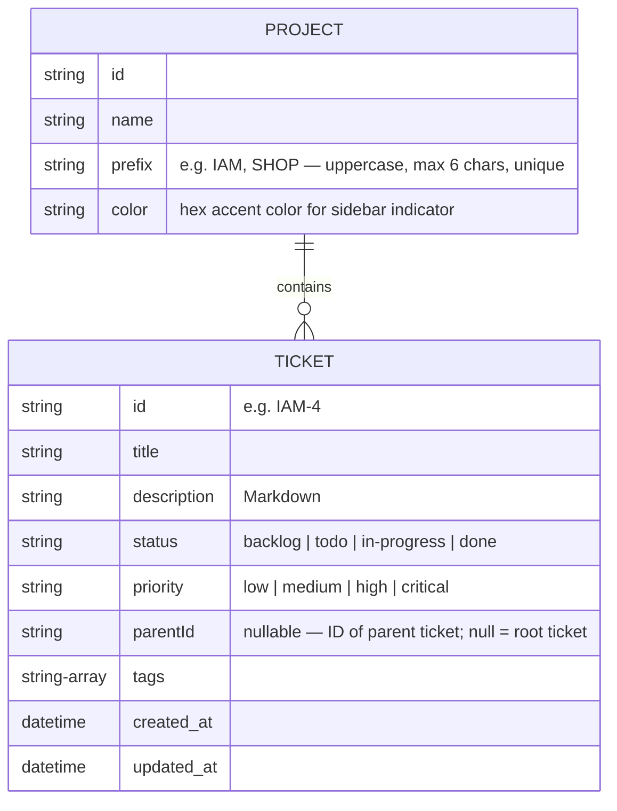

# BA Spec: Kanban UI (Bento Grid Style)

## 1. Product Overview
The Kanban Board MCP is a personal productivity tool designed to manage project tickets visually. It features a React frontend with a modern "Bento Grid" aesthetic and a Python MCP server backend. The board supports multiple projects, each with its own set of tickets, a custom name, prefix, and accent color. In Phase 1, the UI will focus on a polished, interactive experience using mock data, with AI agent integration and real backend connectivity deferred to Phase 2.

## 2. Design System (Bento Grid Theme)
The application uses a playful yet structured Bento Grid layout, where each column or card can have a distinct accent background to create a vibrant, organized feel.

| Property | Value |
|---|---|
| **Background** | `#F5EFE0` (warm beige/cream) |
| **Primary Dark** | `#3D0C11` (burgundy/maroon) |
| **Accent Yellow** | `#F5C518` |
| **Accent Pink** | `#F472B6` |
| **Accent Lime** | `#AACC2E` |
| **Accent Orange** | `#E8441A` |
| **Accent Blue** | `#5BB8F5` |
| **Card Radius** | `16–20px` |
| **Typography** | Bold/heavy weight display font (e.g., DM Sans) |

## 3. Views & Screens
1.  **Project Sidebar**: Collapsible left sidebar (52px collapsed, 220px expanded on hover/focus). Lists all projects with colored dot indicator, project name, and prefix badge. Active project is highlighted. Contains a "+" button to create a new project (inline form: Name, Prefix, Color). Each project has a delete button (hidden when only 1 project exists, requires confirmation).
2.  **Board View**: The main dashboard where 4 fixed columns (`Backlog`, `To Do`, `In Progress`, `Done`) are laid out horizontally as bento tiles. Showing tickets for the active project.
3.  **Ticket Detail Modal**: Triggered by clicking a ticket card. Has two modes:
    - **View mode** (default): Displays full ticket information in a readable layout — title (large, bold), ticket ID, priority badge, status badge, tags, markdown-rendered description, and timestamps (created/updated). Actions: Edit button, Delete button (with inline confirmation).
    - **Edit mode**: Switched into by clicking the Edit button. Shows a form with all editable fields. Cancel returns to view mode.

## 4. User Stories

| ID | Story | Priority | Acceptance Criteria |
|---|---|---|---|
| US-01 | As a user, I want to see 4 distinct columns for my workflow. | High | Columns: Backlog, To Do, In Progress, Done. Each has a unique accent color and ticket count badge. |
| US-02 | As a user, I want to create a new ticket easily. | High | Global "New Ticket" button or "+ Add" button at the top of each column opens a form modal. |
| US-03 | As a user, I want to drag and drop tickets between columns. | High | Smooth drag-and-drop using `dnd-kit`. Status updates automatically on drop. |
| US-04 | As a user, I want to view and edit ticket details. | Medium | Clicking a card opens a modal. Edits can be made inline or via a form. |
| US-05 | As a user, I want to search and filter tickets. | Medium | Filter by priority/tag using top bar chips. Search by title keyword. |
| US-06 | As a user, I want to view full ticket details before editing. | High | Clicking a card opens a view modal with title, description (rendered markdown), priority, status, tags, and timestamps. An Edit button switches to form mode. |
| US-07 | As a user, I want to manage multiple projects on the same board. | High | A left sidebar lists all projects. Clicking a project switches the board to show that project's tickets only. |
| US-08 | As a user, I want to create a new project with a custom name, prefix, and color. | High | "+" button in sidebar opens inline form. Prefix is auto-uppercased, max 6 chars. Duplicate prefix is rejected with an alert. |
| US-09 | As a user, I want to delete a project. | Medium | Delete button per project in sidebar. Requires confirmation. Cannot delete the last remaining project. |
| US-10 | As a user, I want new tickets to use the current project's prefix. | High | Ticket IDs follow the pattern `{PREFIX}-{N}`, where PREFIX belongs to the active project. |
| US-11 | As a user, I want Acceptance Criteria as a checklist on each ticket. | High | Ticket modal shows "Acceptance Criteria" checklist (replaces Sub-tasks). Progress shown as X/Y badge on card. |
| US-12 | As a user, I want to create sub-tickets that are linked to a parent ticket. | High | A ticket can have child tickets. A child ticket shows "↑ Child of PARENT-ID" banner below the modal title. Ticket con cannot have its own children (no grandchildren). |
| US-13 | As a user, I want to link/unlink a ticket to a parent via a dropdown search. | High | TicketModal shows a searchable parent selector. Tickets with children cannot be linked as a child. |
| US-14 | As a user, I want to see parent-child relationships on the board. | Medium | Child cards show "⬆ PARENT-ID" badge. In the same column, child cards are grouped/indented under their parent. |
| US-15 | As a user, I want to see all test cases (own + children's) when viewing a parent ticket. | Medium | Parent ticket test case section aggregates child TCs with source attribution and a filter dropdown per child. Child TCs are read-only in parent view. |

## 5. Data Model (Schema)



## 5b. Enhanced Ticket Fields (v2 Roadmap)

Based on research across Jira, Linear, Asana, GitHub Issues, and Notion, the following fields are recommended for a richer ticket experience. Fields are categorized by priority for a solo personal Kanban board.

### Phase 2 — Essential additions

| Field | Type | Description |
|---|---|---|
| `type` | enum: `bug | feature | task | chore` | Issue type — affects triage logic |
| `due_date` | ISO date string (nullable) | Target completion date |
| `estimate` | number (nullable) | Story point / effort estimate |
| `comments` | Comment[] | Threaded notes to self, decisions, blockers |

### Phase 2 — Nice to have

| Field | Type | Description |
|---|---|---|
| `start_date` | ISO date string (nullable) | When work begins |
| `acceptance_criteria` | AcceptanceCriterion[] | Checklist of conditions that must be true for the ticket to be considered done (replaces sub_tasks) |
| `parent_id` | string (nullable) | ID of the parent ticket. Null = root ticket. A ticket with children cannot become a child (no grandchildren). |
| `linked_issues` | string[] (ticket IDs) | Blocked-by / depends-on relationships |
| `milestone` | string (nullable) | Target version or release group |
| `activity_log` | ActivityEntry[] | Chronological audit trail of all changes |
| `work_log` | WorkLogEntry[] | Manual entries by any role (PM, Dev, BA, Tester) to trace work done on the ticket |

### 5c. Parent-Child Business Rules

- **1-to-many relationship**: One parent can have many children; each child has at most one parent.
- **No grandchildren**: A ticket that already has children cannot be linked as a child of another ticket.
- **Board display**: Child cards show a `⬆ PARENT-ID` badge. If parent and child are in the same column, child cards render indented below parent.
- **Test case roll-up**: Parent ticket's test case section renders own TCs plus all children's TCs. Source is labeled per row. Child TCs are read-only in parent view. A filter dropdown allows scoping by child ticket.
- **Acceptance Criteria**: Each ticket (parent or child) has its own independent acceptance criteria checklist.

### Skipped for solo use

- Assignee, Reporter display (always the solo user)
- Sprint/Cycle (Kanban is flow-based)
- Collaborators, Watchers, Reactions
- Linked PRs / Commits (unless dev integration added)

### Layout recommendation (v2)

Two-region layout following Linear/GitHub pattern:

```
┌────────────────────────────┬──────────────────────┐
│  Title (editable)          │  Status              │
│  Description (markdown)    │  Priority            │
│  Sub-tasks (checklist)     │  Type                │
│  Comments section          │  Due Date            │
│  Activity log              │  Estimate            │
│                            │  Labels / Tags       │
│                            │  Milestone           │
└────────────────────────────┴──────────────────────┘
```

### Work Log Entry Schema

Each `WorkLogEntry` contains:
| Field | Type | Description |
|---|---|---|
| `id` | string | Unique entry ID |
| `author` | string | Name of the person logging work |
| `role` | string | Role: PM, Developer, BA, Tester, Designer, Other |
| `note` | string | What was done and why (free text) |
| `logged_at` | datetime | When the entry was created |

**Behavior:**
- Any role can add an entry at any time
- Entries are append-only (no edit/delete) for traceability
- Displayed in chronological order, most recent last
- Separate from Comments (discussion) and Activity (auto-generated audit trail)

## 6. Business Rules
1.  **Fixed Workflow**: The 4 columns are mandatory and cannot be renamed or deleted in Phase 1.
2.  **Priority Coloring**: Each priority level must have a corresponding semantic color (e.g., Critical = Red, Low = Gray).
3.  **Local-First (Phase 1)**: All data persistence is simulated via hardcoded mock data or local state.
4.  **Prefix Uniqueness**: Project prefixes (e.g., `IAM`, `SHOP`) must be unique across all projects.
5.  **Delete Protection**: A project cannot be deleted if it is the only project remaining in the system.
6.  Rule 7: A child ticket cannot have its own child tickets (max hierarchy depth = 2).
7.  Rule 8: Acceptance Criteria replaces Sub-tasks as the standard checklist field on all tickets.

## 7. Non-Functional Requirements
-   **Performance**: Smooth CSS animations for all state transitions (drags, modal transitions).
-   **Tech Stack**: Vite + React + TypeScript + `dnd-kit`.
-   **Responsiveness**: Optimized for Desktop (1280px+).
-   **Markdown rendering**: Ticket descriptions support Markdown and are rendered using `react-markdown`.

## 8. Out of Scope (Phase 1)
-   User authentication / Multi-user support.
-   Direct Python MCP server integration (Mock data only).
-   Real-time notifications.
- Enhanced ticket fields (type, due date, estimate, comments, sub-tasks, activity log) — deferred to Phase 2 (see Section 5b).

---

## Feature: Test Cases Section (IAM-19)

### Overview
A new "Test Cases" section inside the TicketModal allowing QC engineers (or any user) to write, track, and update test cases directly on a ticket.

### Data Model
```ts
export interface TestCase {
  id: string;
  title: string;
  status: 'todo' | 'pass' | 'fail';
  proof: string;  // markdown text, can contain image URLs
  note: string;
  createdAt: string;
}
```
`Ticket` gains an optional field: `testCases?: TestCase[]`

### Component
**`TestCasesSection`** (`ui/src/components/TestCasesSection.tsx`)

| Element | Behaviour |
|---|---|
| Section header | "Test Cases" with count badge and "Add" button |
| Test case row | Title (inline edit), status dropdown/badge, expand for proof + note |
| Status badge | grey = todo, green = pass, red = fail |
| Proof field | Textarea (markdown-friendly), can reference image URLs |
| Note field | Freetext textarea |
| Delete | Trash icon per test case |

### Acceptance Criteria
- Anyone can add/edit/delete test cases
- Status changes are reflected immediately in badge color
- Data persists via the existing onSave flow (in-memory)

---

## Feature: Inline Markdown Description Editor (IAM-20)

### Overview
Replace the plain-text description in TicketModal with a click-to-edit inline markdown editor featuring a formatting toolbar.

### UX Flow
1. **View mode** — description renders as styled markdown via ReactMarkdown
2. **Edit mode** — triggered by clicking the description area
   - Toolbar appears above a `<textarea>` with buttons: Bold, Italic, H1/H2/H3, Link, Code, Code Block, Unordered List, Ordered List, Blockquote, HR
   - User can type raw markdown or click toolbar buttons (which insert syntax at cursor)
   - Clicking outside or pressing Escape saves and returns to view mode

### Technical Notes
- No new markdown library needed — toolbar inserts markdown syntax into textarea programmatically
- Use `selectionStart` / `selectionEnd` to wrap selected text with formatting
- Continue using existing `ReactMarkdown` + `rehype-sanitize` for rendering

### Acceptance Criteria
- Click-to-edit on description area
- Toolbar with all listed formatting options
- Toolbar buttons work on selected text (wrap) and empty cursor (insert placeholder)
- Escape or click-outside exits edit mode and saves to state
- View mode renders full markdown

---

## Feature: Multi-Project Support (IAM-25)

### Overview
The Kanban Board now supports multiple projects, enabling users to organize tickets by work domains (e.g., Personal, Work, Side Project) within the same interface.

### Sidebar Behavior
- **Collapsed**: 52px wide, showing only the project color indicators (dots).
- **Expanded**: 220px wide, showing project names and prefix badges.
- **Transitions**: CSS-only expansion triggered by `:hover` or `:focus-within` on the sidebar container.
- **Form State**: The sidebar remains expanded (via an `.expanded` class) while the "New Project" inline form is active to prevent accidental collapse during typing.

### Business Rules
- **Prefix Uniqueness**: Project prefixes (e.g., `IAM`, `SHOP`) must be unique across all projects. Duplicate prefixes are rejected during project creation.
- **Delete Protection**: A project cannot be deleted if it is the only project remaining in the system.
- **Context Switching**: Switching to a different project resets the active search query and any column filters to ensure a "clean slate" for the new project view.
- **Ticket ID Generation**: New tickets automatically inherit the prefix of the currently active project (e.g., if "Project A" has prefix `PA`, its first ticket is `PA-1`).

