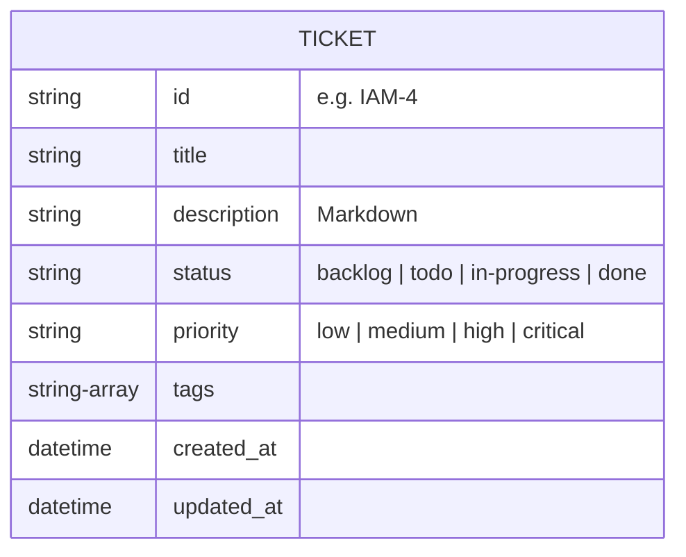

# BA Spec: Kanban UI (Bento Grid Style)

## 1. Product Overview
The Kanban Board MCP is a personal productivity tool designed to manage project tickets visually. It features a React frontend with a modern "Bento Grid" aesthetic and a Python MCP server backend. In Phase 1, the UI will focus on a polished, interactive experience using mock data, with AI agent integration and real backend connectivity deferred to Phase 2.

## 2. Design System (Bento Grid Theme)
The application uses a playful yet structured Bento Grid layout, where each column or card can have a distinct accent background to create a vibrant, organized feel.

| Property | Value |
|---|---|
| **Background** | `#F5EFE0` (warm beige/cream) |
| **Primary Dark** | `#3D0C11` (burgundy/maroon) |
| **Accent Yellow** | `#F5C518` |
| **Accent Pink** | `#F472B6` |
| **Accent Lime** | `#AACC2E` |
| **Accent Orange** | `#E8441A` |
| **Accent Blue** | `#5BB8F5` |
| **Card Radius** | `16–20px` |
| **Typography** | Bold/heavy weight display font (e.g., DM Sans) |

## 3. Views & Screens
1.  **Board View**: The main dashboard where 4 fixed columns (`Backlog`, `To Do`, `In Progress`, `Done`) are laid out horizontally as bento tiles.
2.  **Ticket Detail Modal**: Triggered by clicking a ticket card. Has two modes:
    - **View mode** (default): Displays full ticket information in a readable layout — title (large, bold), ticket ID, priority badge, status badge, tags, markdown-rendered description, and timestamps (created/updated). Actions: Edit button, Delete button (with inline confirmation).
    - **Edit mode**: Switched into by clicking the Edit button. Shows a form with all editable fields. Cancel returns to view mode.

## 4. User Stories

| ID | Story | Priority | Acceptance Criteria |
|---|---|---|---|
| US-01 | As a user, I want to see 4 distinct columns for my workflow. | High | Columns: Backlog, To Do, In Progress, Done. Each has a unique accent color and ticket count badge. |
| US-02 | As a user, I want to create a new ticket easily. | High | Global "New Ticket" button or "+ Add" button at the top of each column opens a form modal. |
| US-03 | As a user, I want to drag and drop tickets between columns. | High | Smooth drag-and-drop using `dnd-kit`. Status updates automatically on drop. |
| US-04 | As a user, I want to view and edit ticket details. | Medium | Clicking a card opens a modal. Edits can be made inline or via a form. |
| US-05 | As a user, I want to search and filter tickets. | Medium | Filter by priority/tag using top bar chips. Search by title keyword. |
| US-06 | As a user, I want to view full ticket details before editing. | High | Clicking a card opens a view modal with title, description (rendered markdown), priority, status, tags, and timestamps. An Edit button switches to form mode. |

## 5. Data Model (Ticket Schema)



## 5b. Enhanced Ticket Fields (v2 Roadmap)

Based on research across Jira, Linear, Asana, GitHub Issues, and Notion, the following fields are recommended for a richer ticket experience. Fields are categorized by priority for a solo personal Kanban board.

### Phase 2 — Essential additions

| Field | Type | Description |
|---|---|---|
| `type` | enum: `bug | feature | task | chore` | Issue type — affects triage logic |
| `due_date` | ISO date string (nullable) | Target completion date |
| `estimate` | number (nullable) | Story point / effort estimate |
| `comments` | Comment[] | Threaded notes to self, decisions, blockers |

### Phase 2 — Nice to have

| Field | Type | Description |
|---|---|---|
| `start_date` | ISO date string (nullable) | When work begins |
| `sub_tasks` | SubTask[] | Checklist of smaller steps |
| `linked_issues` | string[] (ticket IDs) | Blocked-by / depends-on relationships |
| `milestone` | string (nullable) | Target version or release group |
| `activity_log` | ActivityEntry[] | Chronological audit trail of all changes |
| `work_log` | WorkLogEntry[] | Manual entries by any role (PM, Dev, BA, Tester) to trace work done on the ticket |

### Skipped for solo use

- Assignee, Reporter display (always the solo user)
- Sprint/Cycle (Kanban is flow-based)
- Collaborators, Watchers, Reactions
- Linked PRs / Commits (unless dev integration added)

### Layout recommendation (v2)

Two-region layout following Linear/GitHub pattern:

```
┌────────────────────────────┬──────────────────────┐
│  Title (editable)          │  Status              │
│  Description (markdown)    │  Priority            │
│  Sub-tasks (checklist)     │  Type                │
│  Comments section          │  Due Date            │
│  Activity log              │  Estimate            │
│                            │  Labels / Tags       │
│                            │  Milestone           │
└────────────────────────────┴──────────────────────┘
```

### Work Log Entry Schema

Each `WorkLogEntry` contains:
| Field | Type | Description |
|---|---|---|
| `id` | string | Unique entry ID |
| `author` | string | Name of the person logging work |
| `role` | string | Role: PM, Developer, BA, Tester, Designer, Other |
| `note` | string | What was done and why (free text) |
| `logged_at` | datetime | When the entry was created |

**Behavior:**
- Any role can add an entry at any time
- Entries are append-only (no edit/delete) for traceability
- Displayed in chronological order, most recent last
- Separate from Comments (discussion) and Activity (auto-generated audit trail)

## 6. Business Rules
1.  **Fixed Workflow**: The 4 columns are mandatory and cannot be renamed or deleted in Phase 1.
2.  **Priority Coloring**: Each priority level must have a corresponding semantic color (e.g., Critical = Red, Low = Gray).
3.  **Local-First (Phase 1)**: All data persistence is simulated via hardcoded mock data or local state.

## 7. Non-Functional Requirements
-   **Performance**: Smooth CSS animations for all state transitions (drags, modal transitions).
-   **Tech Stack**: Vite + React + TypeScript + `dnd-kit`.
-   **Responsiveness**: Optimized for Desktop (1280px+).
-   **Markdown rendering**: Ticket descriptions support Markdown and are rendered using `react-markdown`.

## 8. Out of Scope (Phase 1)
-   User authentication / Multi-user support.
-   Direct Python MCP server integration (Mock data only).
-   Real-time notifications.
- Enhanced ticket fields (type, due date, estimate, comments, sub-tasks, activity log) — deferred to Phase 2 (see Section 5b).
