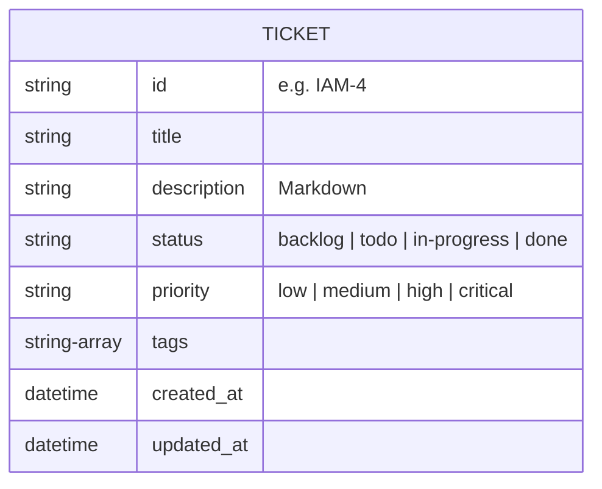

# BA Spec: Kanban UI (Bento Grid Style)

## 1. Product Overview
The Kanban Board MCP is a personal productivity tool designed to manage project tickets visually. It features a React frontend with a modern "Bento Grid" aesthetic and a Python MCP server backend. In Phase 1, the UI will focus on a polished, interactive experience using mock data, with AI agent integration and real backend connectivity deferred to Phase 2.

## 2. Design System (Bento Grid Theme)
The application uses a playful yet structured Bento Grid layout, where each column or card can have a distinct accent background to create a vibrant, organized feel.

| Property | Value |
|---|---|
| **Background** | `#F5EFE0` (warm beige/cream) |
| **Primary Dark** | `#3D0C11` (burgundy/maroon) |
| **Accent Yellow** | `#F5C518` |
| **Accent Pink** | `#F472B6` |
| **Accent Lime** | `#AACC2E` |
| **Accent Orange** | `#E8441A` |
| **Accent Blue** | `#5BB8F5` |
| **Card Radius** | `16–20px` |
| **Typography** | Bold/heavy weight display font (e.g., DM Sans) |

## 3. Views & Screens
1.  **Board View**: The main dashboard where 4 fixed columns (`Backlog`, `To Do`, `In Progress`, `Done`) are laid out horizontally as bento tiles.
2.  **Ticket Detail Modal**: Triggered by clicking a ticket card. Displays full ticket information, markdown description, and provides editing/deletion controls.

## 4. User Stories

| ID | Story | Priority | Acceptance Criteria |
|---|---|---|---|
| US-01 | As a user, I want to see 4 distinct columns for my workflow. | High | Columns: Backlog, To Do, In Progress, Done. Each has a unique accent color and ticket count badge. |
| US-02 | As a user, I want to create a new ticket easily. | High | Global "New Ticket" button or "+ Add" button at the top of each column opens a form modal. |
| US-03 | As a user, I want to drag and drop tickets between columns. | High | Smooth drag-and-drop using `dnd-kit`. Status updates automatically on drop. |
| US-04 | As a user, I want to view and edit ticket details. | Medium | Clicking a card opens a modal. Edits can be made inline or via a form. |
| US-05 | As a user, I want to search and filter tickets. | Medium | Filter by priority/tag using top bar chips. Search by title keyword. |

## 5. Data Model (Ticket Schema)

## 6. Business Rules
1.  **Fixed Workflow**: The 4 columns are mandatory and cannot be renamed or deleted in Phase 1.
2.  **Priority Coloring**: Each priority level must have a corresponding semantic color (e.g., Critical = Red, Low = Gray).
3.  **Local-First (Phase 1)**: All data persistence is simulated via hardcoded mock data or local state.

## 7. Non-Functional Requirements
-   **Performance**: Smooth CSS animations for all state transitions (drags, modal transitions).
-   **Tech Stack**: Vite + React + TypeScript + `dnd-kit`.
-   **Responsiveness**: Optimized for Desktop (1280px+).

## 8. Out of Scope (Phase 1)
-   User authentication / Multi-user support.
-   Direct Python MCP server integration (Mock data only).
-   Real-time notifications.
