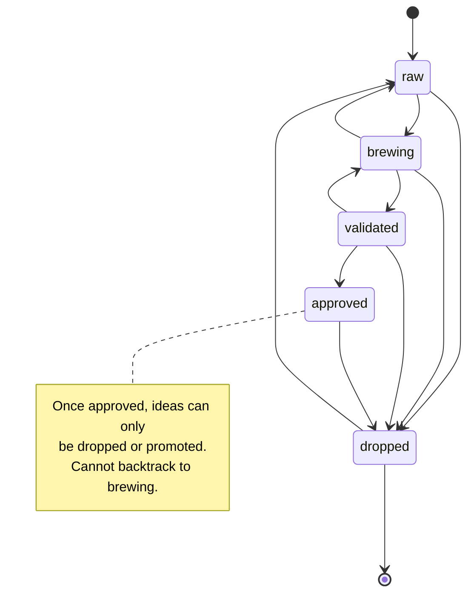

# Idea Board Backend Integration — BA Planning Document

## 1. Overview

This document defines the backend integration required to move the Idea Board UI (React frontend on branch `baseline/IAM-124-idea-board-design`) from mock data to a production-ready Python MCP server backend. The integration adds a new `idea_ticket` table and 18+ MCP tools, enabling the frontend to perform full CRUD operations on ideas while maintaining real-time SSE event synchronization with the existing Kanban board infrastructure.

**Goal:** Provide a robust, separate backend domain for Idea tickets that follows the existing MCP + SQLAlchemy patterns, preserves data integrity through validated status transitions, and enables ideas to graduate into real Kanban tickets via a promotion flow.

---

## 2. Architecture Decision

### IdeaTicket Lives in a Separate Table

**Decision:** Create a dedicated `idea_ticket` table in the database, not a subtype or variant of the existing `Ticket` model.

**Rationale:**

1. **Different lifecycle & status machine:** Idea board uses 4 terminal states (`raw`, `brewing`, `validated`, `approved`, `dropped`) with specific allowed transitions. Main Kanban tickets use a sprint-based flow (backlog, ready, in-progress, done) with priority and estimate semantics. Mixing them pollutes both schemas.

2. **Orthogonal data fields:** Ideas track microthoughts, assumptions, ICE scoring, and revisit dates — none of which belong on a production Kanban ticket. Main board tickets track sprint assignment, story points, and test cases — irrelevant for early-stage ideas.

3. **Conceptual separation:** A Kanban ticket represents committed work. An Idea ticket represents potential work in discovery. Keeping them separate makes both easier to reason about and extend later.

4. **Promotion flow:** When an idea graduates to a real ticket (via `promote_idea_to_ticket`), it creates a *new* Ticket record and sets a reference on the IdeaTicket. This is a one-way pointer (no backlink from Ticket → Idea needed for now). This pattern keeps the main board unaware of ideas, reducing coupling.

**Schema consequence:** No changes to the existing `ticket` table. One new `idea_ticket` table with its own Alembic migration.

---

## 3. Ticket Scopes

### Scope 1 — Core IdeaTicket Model + CRUD

**Objective:** Define the IdeaTicket schema and implement foundational create/read/update/delete operations.

#### Data Model

| Field | Type | Constraints | Default | Notes |
|---|---|---|---|---|
| id | str (PK) | Unique, auto-generated | — | Prefix "IDEA" + global counter, e.g. "IDEA-1", "IDEA-2" |
| project_id | str (FK) | References `project.id` | — | Required; every idea belongs to exactly one project |
| title | str | Not null, max 256 | — | Required on create |
| description | str | Markdown | "" | Default empty; user can add details later |
| idea_status | str (Enum) | raw \| brewing \| validated \| approved \| dropped | "raw" | Lifecycle state; see Scope 2 for transitions |
| idea_color | str (Hex) | Format `#RRGGBB` | "#F5C518" | Hex color; frontend default is mustard yellow |
| idea_emoji | str | Single emoji char | "💡" | Single emoji; no multi-char sequences |
| idea_energy | str (Enum) | low \| medium \| high \| null | null | Optional energy level; can be null |
| tags | str (JSON) | JSON array of strings | "[]" | Default empty list; stored as JSON string in DB |
| problem_statement | str | Markdown, nullable | null | Required to promote to ticket; otherwise optional |
| ice_impact | int | 1–5 clamped | 3 | ICE scoring: Impact dimension |
| ice_effort | int | 1–5 clamped | 3 | ICE scoring: Effort dimension |
| ice_confidence | int | 1–5 clamped | 3 | ICE scoring: Confidence dimension |
| revisit_date | str (ISO 8601) | Nullable | null | Optional future date to revisit idea |
| last_touched_at | str (ISO 8601) | Auto-updated | now() | Timestamp of last mutation (any field change, microthought, assumption, status change, etc.) |
| promoted_to_ticket_id | str (FK) | References `ticket.id`, nullable | null | If populated, points to the Ticket created by promotion flow |
| promoted_at | str (ISO 8601) | Nullable, paired with promoted_to_ticket_id | null | Timestamp when idea was promoted |
| created_at | str (ISO 8601) | Auto, immutable | now() | Idea creation time; never changes |
| updated_at | str (ISO 8601) | Auto-updated | now() | Standard updated timestamp |

#### JSON Columns (Nested Arrays)

Three additional columns store JSON arrays:

- **activity_trail:** `[{id: str (uuid), label: str, at: str (ISO)}, ...]`
- **microthoughts:** `[{id: str (uuid), text: str, at: str (ISO)}, ...]`
- **assumptions:** `[{id: str (uuid), text: str, status: "untested" | "validated" | "invalidated"}, ...]`

(Each managed via separate tools in Scopes 3–5.)

#### MCP Tools

**`create_idea_ticket`**
```
Input:
  project_id: str (required)
  title: str (required)
  description?: str
  idea_color?: str (hex)
  idea_emoji?: str (single emoji)
  idea_energy?: str (low | medium | high)
  tags?: list[str]
  problem_statement?: str

Output: IdeaTicket (full record)

Side effects:
  - Auto-generates ID (e.g. "IDEA-42")
  - Sets idea_status = "raw"
  - Sets all ICE defaults to 3
  - Appends activity: "Idea created"
  - Returns new record
```

**`get_idea_ticket`**
```
Input:
  ticket_id: str

Output: IdeaTicket | None

Behavior:
  - Returns full record including nested JSON arrays
  - Returns None if ticket not found (not an error)
```

**`list_idea_tickets`**
```
Input:
  project_id: str (required)
  idea_status?: str (filter by status)
  q?: str (simple substring search on title + description)

Output: list[IdeaTicket]

Behavior:
  - Returns all ideas for project (filtered by status if provided)
  - Results ordered by last_touched_at DESC
  - Empty list if no matches
```

**`update_idea_ticket`**
```
Input:
  ticket_id: str (required)
  title?: str
  description?: str
  idea_color?: str
  idea_emoji?: str
  idea_energy?: str
  tags?: list[str]
  problem_statement?: str
  ice_impact?: int (1-5, clamped)
  ice_effort?: int (1-5, clamped)
  ice_confidence?: int (1-5, clamped)
  revisit_date?: str (ISO)

Output: IdeaTicket (updated record)

Side effects:
  - Updates all provided fields
  - Auto-clamps ICE values to 1–5
  - Sets last_touched_at = now
  - Appends activity: "Fields updated: <comma-sep list>"
  - Returns updated record
  
Error:
  - ValueError if ticket not found
```

**`delete_idea_ticket`**
```
Input:
  ticket_id: str

Output: bool (True if deleted, False if not found)

Side effects:
  - Deletes entire record (soft-delete not needed for MVP)
  - If the idea was promoted, the linked Ticket is NOT deleted
```

#### Business Rules

- IdeaTicket IDs use a fixed prefix "IDEA" with a **global counter** (shared across all projects, not scoped per project). Example: "IDEA-1", "IDEA-2", ..., "IDEA-999".
- `last_touched_at` is auto-updated on every mutation: field change, new microthought, new assumption, status change, or assumption status update.
- `update_idea_ticket` **always auto-appends to activity_trail** with format: `"Fields updated: title, ice_impact, revisit_date"` (list only the fields that were actually changed).
- ICE values are **clamped to 1–5** — any value < 1 becomes 1, any value > 5 becomes 5.
- `idea_emoji` must be a **single character**; multi-character emoji sequences are rejected with ValueError.

---

### Scope 2 — Status Transitions + Promote to Ticket

**Objective:** Define the state machine for idea lifecycle and the promotion flow that converts approved ideas into Kanban tickets.

#### Allowed Status Transitions



**Rules:**
- `raw` → `brewing`, `dropped`
- `brewing` → `validated`, `raw`, `dropped`
- `validated` → `approved`, `brewing`, `dropped`
- `approved` → `dropped` (only; no backtrack to validated)
- `dropped` → `raw` (ideas can be revived)

#### MCP Tools

**`update_idea_status`**
```
Input:
  ticket_id: str (required)
  new_status: str (required)
  reason?: str (optional user-supplied reason)

Output: IdeaTicket (updated record)

Side effects:
  - Validates transition is allowed (raises ValueError if not)
  - Updates idea_status = new_status
  - Sets last_touched_at = now
  - Appends activity: "Status changed: {old_status} → {new_status}"
  - Returns updated record

Error cases:
  - ValueError: "Invalid status: '{new_status}'" (not a known enum)
  - ValueError: "Invalid transition: {old_status} → {new_status}" (not allowed)
  - ValueError: "Ticket '{ticket_id}' not found"
```

**`promote_idea_to_ticket`**
```
Input:
  idea_ticket_id: str (required)
  project_id: str (required; the target Kanban board project)
  title?: str (override; if not provided, use idea's title)
  type?: str (ticket type, e.g. "story", "bug"; default "story")
  priority?: str (e.g. "low", "medium", "high"; default "medium")

Output: Ticket (newly created Kanban ticket)

Side effects:
  - Validates idea_ticket_id exists
  - Validates idea is in "approved" status (raises ValueError if not)
  - Validates problem_statement is non-empty (raises ValueError if empty or null)
  - Creates new Ticket in target project:
    - title = title param or idea.title
    - description = idea.description + "\n\n**Problem Statement:**\n" + idea.problem_statement
    - type = type param
    - priority = priority param
    - (other ticket fields use defaults)
  - Updates the idea:
    - Sets promoted_to_ticket_id = new_ticket.id
    - Sets promoted_at = now
    - Sets last_touched_at = now
    - Appends activity: "Promoted to ticket {ticket.id}"
  - Returns the new Ticket

Error cases:
  - ValueError: "Ticket '{idea_ticket_id}' not found"
  - ValueError: "Idea must be approved to promote; current status: {idea.idea_status}"
  - ValueError: "Problem statement is required to promote"
  - ValueError: "Project '{project_id}' not found"
```

#### Business Rules

- Promotion is **one-way** — once an idea is promoted, it cannot be un-promoted.
- Promoting an unapproved idea → ValueError (fail safe).
- Promoting without a problem statement → ValueError (enforce that ideas have a "why").
- The new Ticket **does not** have a back-reference to the IdeaTicket. If needed later (e.g., to display "this ticket came from an idea"), store it in the Ticket's description or add a `source_idea_id` field in a future migration.

---

### Scope 3 — Microthoughts

**Objective:** Enable users to quickly jot down evolving thoughts during idea refinement.

#### Data Structure

Microthoughts are stored as a JSON array in `idea_ticket.microthoughts`:

```json
[
  {
    "id": "uuid",
    "text": "string (markdown)",
    "at": "2026-04-25T14:32:00Z"
  }
]
```

#### MCP Tools

**`add_microthought`**
```
Input:
  ticket_id: str (required)
  text: str (required, markdown)

Output: IdeaTicket (updated record)

Side effects:
  - Generates new uuid for microthought
  - Appends {id, text, at: now} to microthoughts array
  - Sets last_touched_at = now
  - Appends activity: "Microthought added"
  - Returns updated record

Error:
  - ValueError: "Ticket not found"
  - ValueError: "Text cannot be empty" (if text is blank)
```

**`delete_microthought`**
```
Input:
  ticket_id: str (required)
  microthought_id: str (required, uuid)

Output: IdeaTicket (updated record)

Side effects:
  - Removes microthought with matching id from array
  - Sets last_touched_at = now
  - Appends activity: "Microthought deleted"
  - Returns updated record

Error:
  - ValueError: "Ticket not found"
  - ValueError: "Microthought not found"
```

---

### Scope 4 — Assumptions

**Objective:** Track assumptions made during idea exploration and validate them as ideas progress.

#### Data Structure

Assumptions are stored as a JSON array in `idea_ticket.assumptions`:

```json
[
  {
    "id": "uuid",
    "text": "string (markdown)",
    "status": "untested" | "validated" | "invalidated"
  }
]
```

#### MCP Tools

**`add_assumption`**
```
Input:
  ticket_id: str (required)
  text: str (required, markdown)

Output: IdeaTicket (updated record)

Side effects:
  - Generates new uuid
  - Appends {id, text, status: "untested"} to assumptions array
  - Sets last_touched_at = now
  - Appends activity: "Assumption added"
  - Returns updated record

Error:
  - ValueError: "Ticket not found"
  - ValueError: "Text cannot be empty"
```

**`update_assumption_status`**
```
Input:
  ticket_id: str (required)
  assumption_id: str (required, uuid)
  status: str (required; one of: "untested", "validated", "invalidated")

Output: IdeaTicket (updated record)

Side effects:
  - Finds assumption by id; updates its status field
  - Sets last_touched_at = now
  - Appends activity: "Assumption marked as {status}"
  - Returns updated record

Error:
  - ValueError: "Ticket not found"
  - ValueError: "Assumption not found"
  - ValueError: "Invalid status: '{status}'"
```

**`delete_assumption`**
```
Input:
  ticket_id: str (required)
  assumption_id: str (required, uuid)

Output: IdeaTicket (updated record)

Side effects:
  - Removes assumption with matching id
  - Sets last_touched_at = now
  - Appends activity: "Assumption deleted"
  - Returns updated record

Error:
  - ValueError: "Ticket not found"
  - ValueError: "Assumption not found"
```

---

### Scope 5 — Activity Trail

**Objective:** Provide a read-only audit log of all changes to an idea.

#### Data Structure

Activity trail is stored as a JSON array in `idea_ticket.activity_trail` and is **never written directly by user-facing tools**. It is auto-managed by the backend.

```json
[
  {
    "id": "uuid",
    "label": "string (human-readable action description)",
    "at": "2026-04-25T14:32:00Z"
  }
]
```

#### Auto-Logged Events

The following events are auto-appended to activity_trail:

| Trigger | Activity Label |
|---|---|
| `create_idea_ticket` | "Idea created" |
| `update_idea_ticket` | "Fields updated: title, description, ..." (list changed fields) |
| `update_idea_status` | "Status changed: raw → brewing" |
| `add_microthought` | "Microthought added" |
| `delete_microthought` | "Microthought deleted" |
| `add_assumption` | "Assumption added" |
| `update_assumption_status` | "Assumption marked as validated" |
| `delete_assumption` | "Assumption deleted" |
| `promote_idea_to_ticket` | "Promoted to ticket IAM-42" |

#### MCP Tools

**No separate tool.** Activity trail is accessed via `get_idea_ticket` (returns the full activity_trail array). It is read-only on the frontend.

---

### Scope 6 — Frontend Integration

**Objective:** Replace mock data in the React UI with real API calls backed by the MCP server.

#### API Endpoint Mapping

The frontend communicates with the MCP server through a thin REST API bridge (following the existing pattern for the main Kanban board). Each MCP tool is exposed as an HTTP endpoint:

| Method | Endpoint | MCP Tool | Frontend caller |
|---|---|---|---|
| GET | `/api/idea-tickets?project_id=X[&idea_status=Y&q=Z]` | `list_idea_tickets` | `useEffect` hook on board load |
| POST | `/api/idea-tickets` | `create_idea_ticket` | New idea modal submit |
| GET | `/api/idea-tickets/:id` | `get_idea_ticket` | Open idea detail panel |
| PATCH | `/api/idea-tickets/:id` | `update_idea_ticket` | Idea detail edit (title, desc, ICE, etc.) |
| PATCH | `/api/idea-tickets/:id/status` | `update_idea_status` | Status column drag/drop or button |
| DELETE | `/api/idea-tickets/:id` | `delete_idea_ticket` | Delete button in detail panel |
| POST | `/api/idea-tickets/:id/microthoughts` | `add_microthought` | Add microthought input |
| DELETE | `/api/idea-tickets/:id/microthoughts/:mid` | `delete_microthought` | Delete microthought button |
| POST | `/api/idea-tickets/:id/assumptions` | `add_assumption` | Add assumption input |
| PATCH | `/api/idea-tickets/:id/assumptions/:aid` | `update_assumption_status` | Assumption status toggle |
| DELETE | `/api/idea-tickets/:id/assumptions/:aid` | `delete_assumption` | Delete assumption button |
| POST | `/api/idea-tickets/:id/promote` | `promote_idea_to_ticket` | "Promote to ticket" button (requires approved status + problem statement) |

#### Real-Time Sync

- The frontend subscribes to the existing `/events` SSE endpoint
- On any mutation to an idea_ticket, the backend emits an `"invalidate"` event
- Frontend re-fetches the idea list and refreshes the UI (same pattern as main board)

#### Frontend Components to Update

1. **IdeaBoard.tsx**
   - Remove `useState` mock data
   - Add `useEffect` to fetch from `/api/idea-tickets?project_id=...`
   - Add SSE subscription listener
   - Replace column `id` with `idea_status`

2. **IdeaTicketModal.tsx**
   - Replace mock `handleSave` with `PATCH /api/idea-tickets/:id`
   - Add error toast on failed save

3. **IdeaCard.tsx**
   - Display `activityTrail` in detail panel (read-only)
   - Call delete endpoint on delete click

4. **Microthoughts panel**
   - `POST /api/idea-tickets/:id/microthoughts` to add
   - `DELETE /api/idea-tickets/:id/microthoughts/:mid` to remove

5. **Assumptions panel**
   - `POST /api/idea-tickets/:id/assumptions` to add
   - `PATCH /api/idea-tickets/:id/assumptions/:aid` to toggle status
   - `DELETE /api/idea-tickets/:id/assumptions/:aid` to remove

6. **Status drag/drop**
   - On drop, call `PATCH /api/idea-tickets/:id/status` with new status
   - Validate transition on frontend (show toast if invalid)

7. **Promote button** (visible only if `idea_status == "approved"` AND `problem_statement` is non-empty)
   - Calls `POST /api/idea-tickets/:id/promote`
   - On success, closes detail panel and shows success toast with link to new ticket

#### Data Model Sync

The TypeScript type `IdeaTicket` in `ui/src/types/index.ts` must match the backend schema:

```typescript
interface IdeaTicket {
  id: string;
  projectId: string;
  title: string;
  description: string;
  ideaStatus: 'raw' | 'brewing' | 'validated' | 'approved' | 'dropped';
  ideaColor: string;
  ideaEmoji: string;
  ideaEnergy?: 'low' | 'medium' | 'high';
  tags: string[];
  problemStatement?: string;
  iceImpact: number;
  iceEffort: number;
  iceConfidence: number;
  revisitDate?: string;
  lastTouchedAt: string;
  promotedToTicketId?: string;
  promotedAt?: string;
  createdAt: string;
  updatedAt: string;
  activityTrail: IdeaActivityEntry[];
  microthoughts: IdeaMicrothought[];
  assumptions: IdeaAssumption[];
}

interface IdeaActivityEntry {
  id: string;
  label: string;
  at: string;
}

interface IdeaMicrothought {
  id: string;
  text: string;
  at: string;
}

interface IdeaAssumption {
  id: string;
  text: string;
  status: 'untested' | 'validated' | 'invalidated';
}
```

---

## 4. Migration Plan

### Single Alembic Migration: `add_idea_ticket_table`

A single migration file (`alembic/versions/{timestamp}_add_idea_ticket_table.py`) will:

1. Create the `idea_ticket` table with all columns from Scope 1:
   - Primary key: `id` (string)
   - Foreign keys: `project_id` → `project.id`
   - JSON columns: `activity_trail`, `microthoughts`, `assumptions` (default to empty arrays)
   - Timestamps: `created_at`, `updated_at` (auto-set to current time)
   - Enum columns: `idea_status` (check constraint for valid values)
   - All other columns with their defaults

2. Create an index on `(project_id, idea_status, last_touched_at)` for efficient querying by project and status

3. Create an index on `(promoted_to_ticket_id)` for tracing back from Ticket to IdeaTicket (optional, low priority)

4. No changes to the existing `ticket` table

5. No data migration (new table; no legacy data to transform)

**Rollback:** Drop `idea_ticket` table and associated indexes.

---

## 5. Out of Scope

The following features are explicitly deferred and will not be implemented in this phase:

- **Idea board drag-and-drop column reordering** (kanban column sequence is always fixed: raw → brewing → validated → approved → dropped)
  - Column order is defined in frontend code, not persisted in the database
  - Each project can later have its own board layout (future scope)

- **Multi-project idea board in one view** (all ideas belong to one project)
  - Sidebar project selector works (standard pattern)
  - Ideas are always scoped to the active project
  - Cross-project idea search is a future capability

- **Bulk idea operations** (e.g., bulk delete, bulk status change)
  - Single-idea operations only
  - Bulk features can be added if frequent workflows justify it

- **Advanced search/filter UI** (status filtering only for MVP)
  - Simple status filter dropdown works
  - Full-text search on title + description works (via `q` parameter)
  - Tag filters, date range filters, ICE score filters are future enhancements

- **Idea templates** (e.g., "New feature idea", "Bug hypothesis")
  - All ideas start with the same schema
  - Template fields can be pre-filled in the UI, but backend is agnostic

---

## 6. Implementation Sequence Recommendation

**Phase 1 — Backend Foundation (Scopes 1–2)**
1. Create SQLModel for IdeaTicket with all fields
2. Write Alembic migration
3. Implement CRUD tools + status transition tools
4. Test with manual MCP calls

**Phase 2 — Extended Features (Scopes 3–5)**
5. Implement microthoughts tools
6. Implement assumptions tools
7. Activity trail auto-logging (hooked into all above)

**Phase 3 — Frontend Integration (Scope 6)**
8. Build REST API bridge (if not already done)
9. Update IdeaBoard.tsx and related components
10. Test end-to-end with real backend data
11. SSE integration for real-time updates

**Phase 4 — Polish**
12. Error handling & validation
13. Edge case tests
14. Performance profiling (index optimization if needed)

---

## 7. Acceptance Criteria

- [ ] `idea_ticket` table exists in SQLite with all fields from Scope 1
- [ ] All 18+ MCP tools (CRUD + status + microthoughts + assumptions) are implemented and callable
- [ ] Status transition validation works (invalid transitions raise ValueError)
- [ ] Promotion flow works: approved idea → new Ticket in target project
- [ ] Activity trail auto-populates on all mutations (no manual logging by user)
- [ ] Frontend IdeaBoard replaces mock data with API calls
- [ ] Drag-and-drop status changes work and call the backend
- [ ] SSE events trigger frontend re-fetch and UI update
- [ ] All TypeScript types in `ui/src/types/index.ts` match backend schema
- [ ] Integration test: create → add microthought → add assumption → update status → promote → verify Ticket exists

