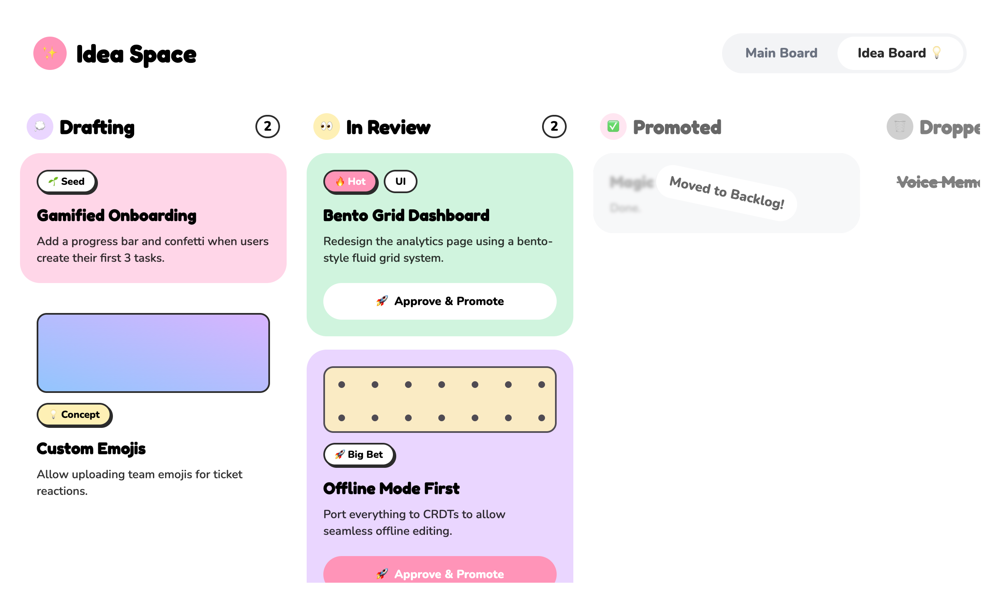
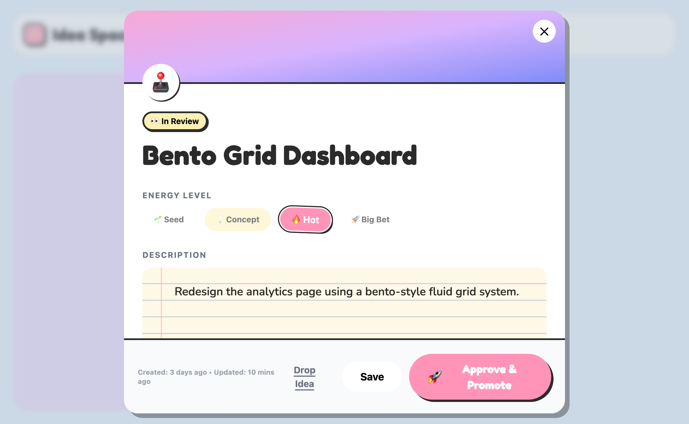
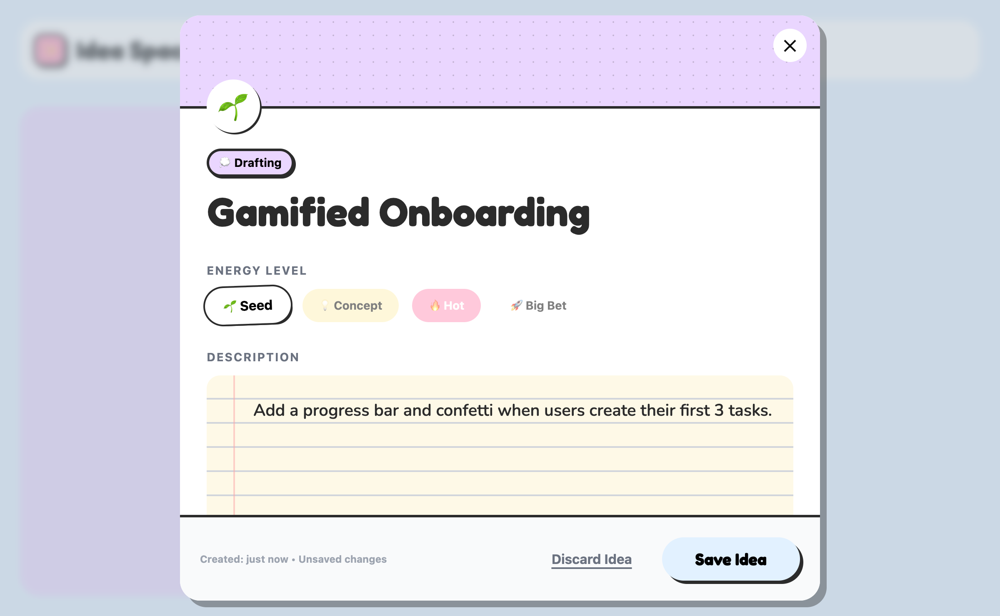
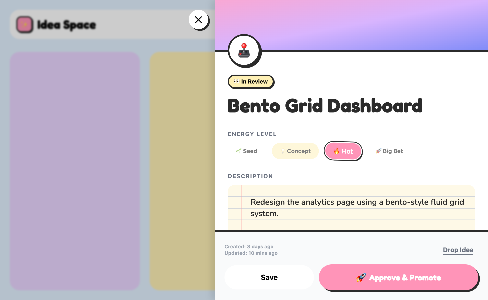
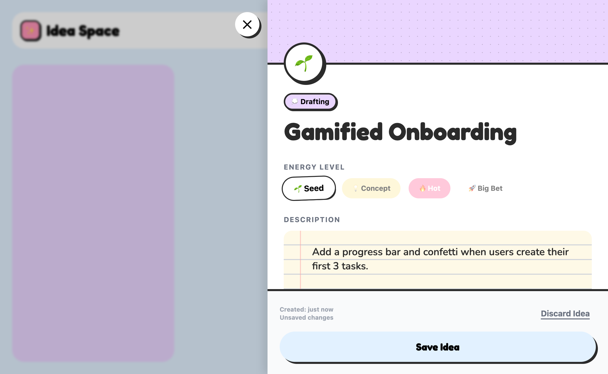
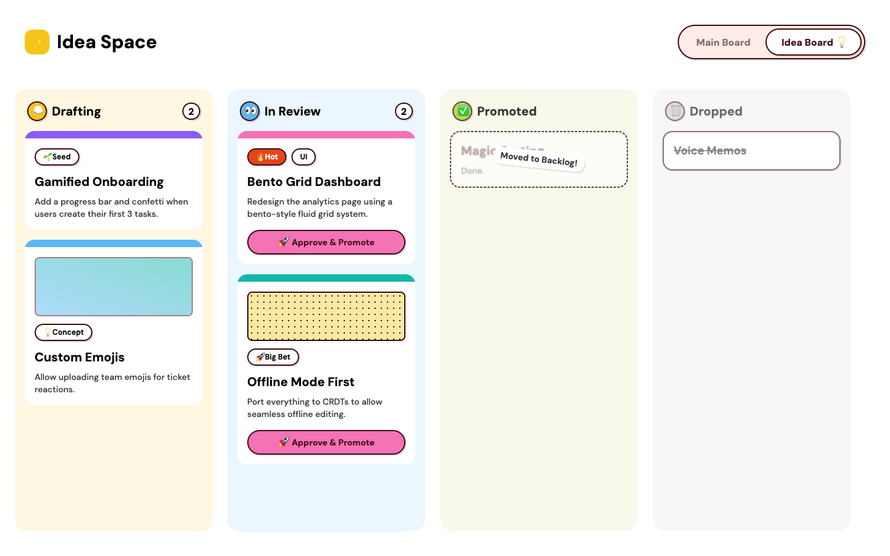
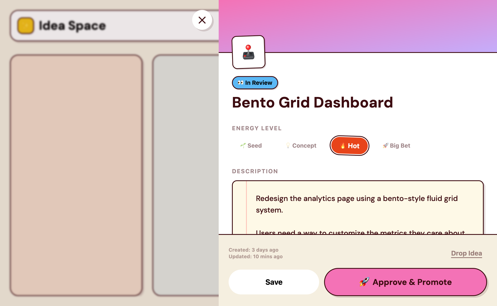
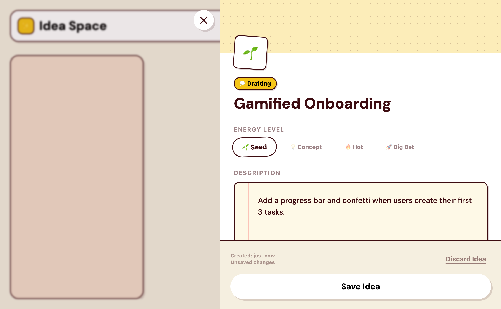

# Idea Board — Concept 2: Playful/Toy-like Visual Design

## Overview

**Concept 2** is a playful, toy-like visual direction for the Idea Board—a dedicated UI for capturing half-baked ideas without judgment. The design uses **Neobrutalist aesthetics** mixed with **Kawaii elements**: thick black borders, hard drop shadows, bubbly typography, and saturated pastel colors. The goal is to make the interface feel *low-stakes and fun*, so users feel comfortable logging rough ideas that might otherwise stay trapped in their heads.

This direction prioritizes **psychological safety** over polish. A playful interface signals: *"This is a sandbox. No idea is too rough. Play here."*

---

## Design Hypothesis

**User Problem:** Many great ideas never get captured because they feel too half-baked, incomplete, or "not good enough" to write down. Users self-censor, afraid of judgment.

**Design Assumption:** A toy-like interface removes that fear. When an app *looks playful*, the user's mental model shifts from *"I'm filing an important idea"* to *"I'm playing with possibilities."*

**Expected Behavior Change:** Users will:
- Capture ideas earlier in the ideation process (before self-editing)
- Spend more time brainstorming and exploring
- Feel less pressure to articulate every idea perfectly
- Tag ideas by energy level (💡 rough concept vs. 🔥 hot priority) rather than waiting for clarity

**Validation:** Track idea capture rate, average idea length/completeness, and user sentiment in follow-up interviews.

---

## Aesthetic Direction

### Fonts
- **Display:** [Fredoka](https://fonts.google.com/specimen/Fredoka) (weights: 400, 600, 700)
  - Used for headers, column labels, card titles
  - Bubbly, friendly, modern
- **Body:** [Nunito](https://fonts.google.com/specimen/Nunito) (weights: 400, 600, 800)
  - Used for descriptions, tags, buttons
  - Warm, open letterforms

### Color Palette

| Name | Hex | Usage |
|---|---|---|
| **Drafting** | `#EAD6FF` (Lavender) | Column background, tag pill |
| **In Review** | `#FEF0B5` (Butter) | Column background, tag pill |
| **Promoted** | `#D0F4DE` (Mint) | Column background, tag pill |
| **Idea Spark** | `#FFD6E8` (Bubblegum) | Card background variant |
| **Board Background** | `#E2F1FF` (Sky Blue) | Page background |
| **CTA Hot Spot** | `#FF94B8` (Hot Pink) | Primary button, "Hot" energy tag |
| **Outline** | `#2B2B2B` (Near Black) | All borders, text |

All pastel backgrounds are saturated enough to feel cheerful, but muted enough to read comfortably.

### Neobrutalist Elements
- **Borders:** 3px solid `#2B2B2B` on cards, columns, header
- **Drop Shadows:** Hard shadows `4px 4px 0px #2B2B2B` (not soft blur)
- **Border Radius:** 1.5rem on major containers (cards, header), 99px on pills and buttons
- **Button Press Effect:**
  - Default: `2px 2px 0px` shadow
  - Pressed (`:active`): `transform: translate(2px, 2px)` + shadow collapses to `0px 0px 0px` (tactile feedback)

---

## Key Design Decisions

### 1. Color-Coded Columns

**Visual Design:**
Each column gets its own pastel background color (Lavender, Butter, Mint) + emoji badge.

```
Drafting 💭 (Lavender)  |  In Review 👀 (Butter)  |  Promoted ✅ (Mint)  |  Dropped 🗑️ (Gray)
```

**Why This Works Psychologically:**
- **Color coding reduces cognitive load.** At a glance, the user sees structure without reading text.
- **Emoji badges add personality** and make the board feel less corporate/intimidating.
- **Distinct colors signal emotional safety:** Each column has its own space; ideas aren't "competing."
- **Muted pastels won't cause visual fatigue** during long brainstorm sessions.

---

### 2. Energy Tags (🌱 Seed / 💡 Concept / 🔥 Hot / 🚀 Big Bet)

**Visual Design:**
Rounded pill buttons with emoji + text, positioned on every card.

```
🌱 Seed       💡 Concept      🔥 Hot          🚀 Big Bet
(White fill)  (Yellow fill)   (Hot Pink fill) (White fill)
```

**Why This Works Psychologically:**
- **Removes the need for "perfect" classification.** Users don't have to decide if an idea is done—they just tag the *energy level.*
- **Emoji + text** creates quick visual parsing and adds warmth.
- **🌱 Seed** feels nurturing, not dismissive—signals ideas are growing, not discarded.
- **🔥 Hot** and **🚀 Big Bet** feel exciting, making promotion *aspirational*.

---

### 3. Cover Gradients on Cards

**Visual Design:**
Some cards include a soft gradient background (e.g., blue-to-purple) in the upper section, suggesting mood/richness.

**Why This Works Psychologically:**
- **Gradients add visual interest** without requiring extra content.
- **They suggest "depth" or "potential"**—like the idea is growing into something bigger.
- **Low cognitive load**—users don't have to describe an idea's mood; the gradient does it for them.

---

### 4. "Approve & Promote" Button Style

**Visual Design:**
Large, rounded button with emoji + text. Primary version uses hot pink (`#FF94B8`); secondary uses white with outline.

```
🚀 Approve & Promote
```

**Neobrutalist Details:**
- 3px border, 2px shadow by default
- On press (`:active`): shadow collapses, button "sinks" via `transform: translate(2px, 2px)`

**Why This Works Psychologically:**
- **Large, friendly CTA** invites action without pressure.
- **Emoji signals celebration**—moving an idea forward feels like a win.
- **Physical press feedback** (shadow collapse) creates a satisfying tactile sensation, reinforcing the "toy-like" feel.
- **Clear color differentiation** (hot pink vs. white) shows which action is "primary."

---

### 5. Board Switcher Design

**Visual Design:**
Header toggle between "Main Board" and "Idea Board 💡".

```
┌─────────────────────────────────────────┐
│ Main Board  |  [Idea Board 💡]         │
└─────────────────────────────────────────┘
```

Active button has `neo-brutal` styling (border + shadow); inactive is subtle gray.

**Why This Works Psychologically:**
- **Emoji in the label** reminds users what this board is for—ideas, lightbulbs, exploration.
- **Pill-shaped toggle** feels like a game interface, not a boring settings panel.
- **Clear active state** (using the neobrutalist style) shows context at a glance.

---

### 6. Card Hover Effect

**Visual Design:**
On hover, cards translate up 4px and rotate slightly (1deg) to create lift.

```css
.neo-card:hover {
  transform: translateY(-4px) rotate(1deg);
  transition: 0.2s ease;
}
```

**Why This Works Psychologically:**
- **Lift effect signals responsiveness**—the interface "listens" to the mouse.
- **Playful rotation** reinforces the toy-like aesthetic.
- **Smooth animation** feels polished without being stiff.
- **Encourages engagement:** users want to hover more to see the effect.

---

### 7. Faded Columns (Promoted / Dropped)

**Visual Design:**
"Promoted" and "Dropped" columns are de-emphasized with `opacity-50` to `opacity-60`.

**Why This Works Psychologically:**
- **Visual hierarchy** keeps focus on active work (Drafting, In Review).
- **Fading signals finality** without deleting content—ideas aren't lost, just "graduated."
- **Reduces visual clutter** and decision paralysis.

---

## Screenshot



---

## Component Breakdown

### React Components to Build

#### 1. **IdeaBoardHeader**
- Logo + "Idea Space" title (display font, bold)
- Board switcher toggle (Main Board / Idea Board 💡)
- Styles: white background, neo-brutal border + shadow, pill-shaped toggle

#### 2. **IdeaColumn**
- Column header: emoji badge + title + count
- Scrollable card container
- Styles: color-coded background (Lavender/Butter/Mint), responsive width

#### 3. **IdeaCard**
- Header: energy tag (🌱/💡/🔥/🚀)
- Optional cover gradient section
- Title (display font, bold)
- Description (body font, semibold)
- Footer: optional "Approve & Promote" button
- Styles: neo-brutal card, hover lift effect, card-specific background color

#### 4. **EnergyTag**
- Emoji + text in a rounded pill
- Color varies: white for Seed/Big Bet, yellow for Concept, hot pink for Hot
- Styles: rounded pill, 2px border, small shadow

#### 5. **PromoteButton**
- Text: "🚀 Approve & Promote"
- States: primary (hot pink) / secondary (white)
- Interaction: active state collapses shadow and translates down
- Styles: neo-brutal button, full-width within card

#### 6. **BoardSwitcher**
- Two button pills: "Main Board" (inactive) / "Idea Board 💡" (active)
- Active state: neo-brutal styling
- Inactive state: gray background, low contrast

---

## Open Questions & Next Steps

### Design Clarity Needed
- [ ] **Column ordering:** Is Drafting → In Review → Promoted → Dropped the permanent flow, or should it be configurable?
- [ ] **Mobile layout:** How do columns stack on mobile? Horizontal scroll is fine for desktop, but should mobile use tabs or a different layout?
- [ ] **Card detail view:** Clicking a card—does it expand inline or open a modal? Should promote/tag happen inline or in a detail view?

### Implementation Decisions
- [ ] **Gradient generation:** Should cover gradients be randomly generated per card, user-selected, or deterministic based on idea content?
- [ ] **Drag-and-drop:** Cards in the HTML are `cursor-grab`, implying drag support. What's the trigger—is it cross-column or within-column reordering?
- [ ] **Add new idea:** Where is the "new idea" button? Should it be in the Drafting column header, or a floating action button?

### Psychology Validation
- [ ] **User testing:** A/B test this against a "professional" design. Measure idea capture rate and sentiment.
- [ ] **Long-term engagement:** Does the playful aesthetic get old, or does it sustain motivation to brainstorm?
- [ ] **Tone of voice:** What copy/messaging would reinforce the "playful" signal without being patronizing?

### Accessibility & Polish
- [ ] **Color contrast:** Ensure all text meets WCAG AA on pastel backgrounds (current colors may need refinement).
- [ ] **Animation preferences:** Respect `prefers-reduced-motion` for hover effects and transitions.
- [ ] **Dark mode:** Should this design have a dark mode variant, or is it intentionally light/cheerful only?
- [ ] **Responsive behavior:** Test on tablet and phone; ensure touch targets are large enough (≥44px).

---

## Implementation Checklist

- [ ] Install Google Fonts (Fredoka, Nunito) in `ui/public/`
- [ ] Add Tailwind color extensions for custom palette
- [ ] Build `IdeaBoardHeader` component
- [ ] Build `IdeaColumn` container
- [ ] Build `IdeaCard` with hover effect
- [ ] Build `EnergyTag` component
- [ ] Build `PromoteButton` with press interaction
- [ ] Connect to MCP server tools: `create_idea`, `update_idea_status`, `promote_idea`
- [ ] Test on desktop (1920×1080), tablet (768×1024), mobile (375×667)
- [ ] User testing session with 3–5 participants
- [ ] Iterate based on feedback

---

## Idea Ticket Detail View

When a user clicks on a card, they see the **detail view** — a deeper look at the idea with full edit capabilities. Two layout variations were designed and evaluated.

### Design Recommendation: Side Panel ✅

**Use the Side Panel over a Modal.**

When a detail view opens as a modal, it dims and blocks the board entirely — it demands 100% attention and feels like an *interruption*. At the idea capture stage, users are in a fluid, browsing mindset — they may want to click through multiple cards or reference the board while editing. The Side Panel leaves the board visible (blurred) in the background, keeping the flow lightweight and non-committal.

> **Modal = "deal with this now."** Side Panel = "I'm just looking."

---

### Variation 1 — Modal Overlay

Centered dialog over the board with backdrop blur. Best for focused editing sessions where the user intends to commit to one idea at a time.

#### In Review state — "Approve & Promote" CTA visible


#### Drafting state — capture mode, no promote action


---

### Variation 2 — Side Panel (Recommended)

Slides in from the right. Board remains visible and browsable in the background. Feels lightweight and reversible.

#### In Review state — "Approve & Promote" CTA visible


#### Drafting state — capture mode, no promote action


---

### Key Design Decisions — Detail View

#### Notebook-Style Description Area
**Hypothesis:** A plain `<textarea>` signals "write a professional document." A lined notebook pad (with red margin line) shifts the mental model — it gives permission to scribble, write fragments, and be messy.

#### Energy Tag as Collectible Badge
The energy tag (🌱/💡/🔥/🚀) is displayed as a large sticky badge, slightly overflowing the header boundary — like a physical game card or trading card. Reduces the work anxiety of a JIRA-style ticket.

#### CTA Contrast by State
- **Drafting:** Only "Save Idea" + "Discard" — pure capture, no pressure
- **In Review:** Massive hot-pink **🚀 Approve & Promote** button dominates the footer — designed to feel like hitting a jackpot, not just changing a status dropdown. Creates a deliberate dopamine hit at the moment of promotion.

### Source Files
| File | Description |
|---|---|
| [idea-card-detail-modal-inreview.html](../ui-audit/designs/idea-card-detail-modal-inreview.html) | Modal — In Review state |
| [idea-card-detail-modal-drafting.html](../ui-audit/designs/idea-card-detail-modal-drafting.html) | Modal — Drafting state |
| [idea-card-detail-sidepanel-inreview.html](../ui-audit/designs/idea-card-detail-sidepanel-inreview.html) | Side Panel — In Review state |
| [idea-card-detail-sidepanel-drafting.html](../ui-audit/designs/idea-card-detail-sidepanel-drafting.html) | Side Panel — Drafting state |

---

## References

- **Neobrutalism:** [Design direction](https://www.ooom.info/en/article/neo-brutalism) balancing raw, bold aesthetics with user-friendly design
- **Kawaii aesthetic:** Japanese design philosophy emphasizing cuteness, approachability, and emotional connection
- **Psychological safety in design:** [Amy Edmondson's research](https://en.wikipedia.org/wiki/Psychological_safety) on how environment affects risk-taking
- **Playful interface design:** [Liz Stinson on playfulness in UX](https://www.fastcompany.com/90260651/these-designers-are-trying-to-make-the-world-a-more-joyful-place)

---

## Concept 2 Adapted — App Theme Version

Following the same playful and low-stakes energy of Concept 2, this adapted version aligns the design with the actual application's theme colors and typography. The Neobrutalist bold elements are preserved, but softened slightly to fit within the app's established aesthetic map.

### Adapted Designs

#### Board View


#### Side Panel — In Review state


#### Side Panel — Drafting state


### Adaptation Rules Applied

- **Background:** Shifted from Neobrutalist Sky Blue to the app's Warm Beige (`#F5EFE0`).
- **Text & Borders:** Shifted from Near Black (`#2B2B2B`) to the app's Deep Maroon (`#3D0C11`), which keeps high contrast but feels richer and visually connected to the beige.
- **Card & Panel Radii:** Standardized to the app's design system scale (`16px` for cards, `20px` for panels).
- **Typography:** Updated to use `DM Sans` for both headings and body text, ensuring cohesion with the rest of the application ecosystem.
- **Shadows:** Retained the hard, non-blurred drop shadows essential for the toy-like feel, but tinted them to a semi-transparent Deep Maroon (`rgba(61, 12, 17, 0.15)`) to avoid harshness.
- **CTAs & Accents:** Used the app's vibrant accent palette (Yellow, Orange, Lime, Pink, Blue, Purple, Teal) for column backgrounds, cover strips, energy tags, and buttons, maintaining the celebratory vibe.

### Comparison: Original vs. Adapted

| Element | Concept 2 Original | Concept 2 Adapted (App Theme) |
|---|---|---|
| **Background Color** | Sky Blue (`#E2F1FF`) | Warm Beige (`#F5EFE0`) |
| **Text/Border Color** | Near Black (`#2B2B2B`) | Deep Maroon (`#3D0C11`) |
| **Borders** | 3px solid | 2px solid |
| **Drop Shadows** | Solid Black | Deep Maroon at 15% opacity |
| **Border Radius** | 1.5rem (generic) | 16px (cards), 20px (panels) |
| **Typography** | Fredoka / Nunito | DM Sans |
| **Primary CTA** | Hot Pink (`#FF94B8`) | App Pink (`#F472B6`) or Orange (`#E8441A`) |
| **Column Tints** | Solid Pastel blocks | 12% opacity tints of app accent colors |
